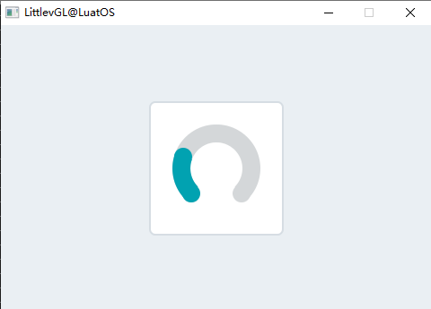
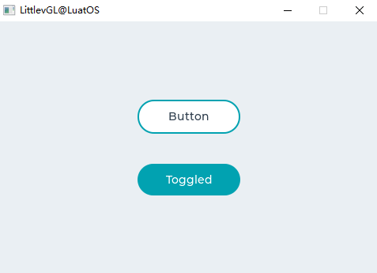
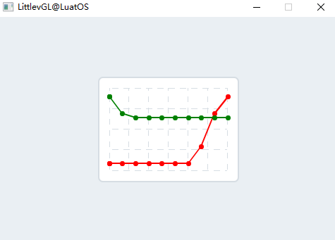
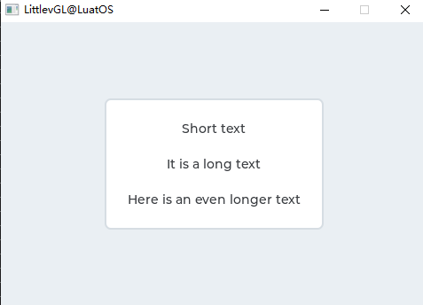
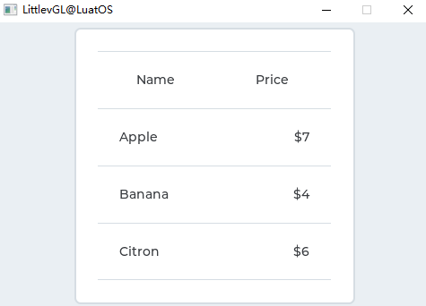
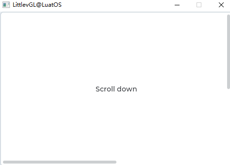

# LVGL for LuatOS Manual

[toc]

# Introduction

## Why is it LVGL

LVGL is an open source graphics library that provides everything you need to create an embedded GUI with easy-to-use graphical elements, beautiful visuals and a low memory footprint.

**LVGL Features：**

- Powerful [building blocks](https://docs.lvgl.io/master/widgets/index.html): buttons, charts, lists, sliders, images, etc.
- Advanced graphics engines: animation, anti-aliasing, opacity, smooth scrolling, blend modes, and more
- Support [various input devices](https://docs.lvgl.io/master/overview/indev.html): touch screen, mouse, keyboard, encoder, button, etc.
- Support [multiple displays](https://docs.lvgl.io/master/overview/display.html)
- Hardware independent, can be used with any microcontroller and display
- Scalable to operate with small memory (64 kB flash，16 kB RAM）
- Multi-language support with UTF-8 processing, CJK, bidirectional and Arabic script support
- Fully customizable graphic elements via [CSS-styled](https://docs.lvgl.io/master/overview/style.html)
- Operating system, external memory, and GPU supported, but not required
- Smooth rendering even with single [framebuffer](https://docs.lvgl.io/master/porting/display.html)
- Written in C, compatible with C
- Development on PC without embedded hardware [simulator](https://docs.lvgl.io/master/get-started/pc-simulator.html)
- 100+ Simple [Example](https://github.com/lvgl/lvgl/tree/master/examples)
- Online and PDF [of the file](http://docs.lvgl.io/) and API reference

LVGL Official support for C language and MicroPython language development, LuatOS-Soc use the 7.11 version of the LVGL source code based on the production of the lua version of LVGL, so that you use the LuatOS-Soc to bring you a rapid development experience of colleagues, but also quickly and efficiently develop a beautiful graphical interface.

## Equipment Requirements

Basically, most controllers (which need to be able to drive the display) are suitable for running LVGL. The minimum requirement is：

|  | Minimum | recommend     |
| :--: | :--------------------------: | :------: |
| Architecture: | 16, 32, or 64-bit microcontroller or processor           ||
| Clock Frequency: | \> 16 MHz                    | > 48 MHz |
| Flash/ROM: | > 64 kB                      | \> 180 kB |
| RAM: | \> 16 kB | \> 48 kB |
| Display buffer: | \> 1 x horizontal resolution pixel | \> 1/10 screen resolution pixel |
| Compiler: | C99 or newer           ||

***Note: Memory usage may vary by architecture, compiler, and build options。***

## Ask for help

If you encounter problems in using LVGL, you can ask questions on [Issues](https://gitee.com/openLuat/LuatOS/issues),[Community](https://doc.openluat.com/home) and [LVGL Official Forum](https://forum.lvgl.io/). You can also give bug feedback or make suggestions to us, and we will reply in time.

# LVGL Foundation

## Write a HelloWorld

The first lesson for programmers to learn the language is HelloWorld. Here, the sample program showing the HelloWorld is also used to make you feel its convenience intuitively.：

```lua
lvgl.init(480,320)--lvgl Initialization
local label = lvgl.label_create(nil, nil)--Create Label label
lvgl.label_set_text(label, "HelloWorld")--Set label content
lvgl.scr_load(label)--Load Label
```

Operation effect：


Isn't it simple? And it's very similar to c, right? Let's talk about the difference between the LuatOS version of the LVGL interface and the C version.

## LuatOS Version of the LVGL interface

lua The version of lvgl has already made most of the interfaces and will continuously improve the subsequent interfaces. Generally speaking, as long as the lv_at the beginning of the original interface is replaced with lvgl. That is, but there are also special cases, such as not supporting init to create components, using create to create, and font settings and lvgl symbols also have some differences.

## Common Concepts


## Layout

lvgl The layout should have the concept of layer, which introduces the concept of parent object, child object and front and back stage.

## Event Model

LVGL can use events to interact.

## Style

*Styles * are used to set the appearance of an object.

# LVGL Components

## Quick View
base object (obj) arc (arc) progress bar (bar) button (btn) button matrix (btnmatrix) calendar (calendar) canvas (canvas) check box (cb) chart (chart) container (cont) color selector (cpicker) drop-down list (dropdown) gauge (gauge) picture (img) picture button (imgbtn) keyboard (keyboard) label (label) LED(led) line (line)) list (list) meter (lmeter) message box (msdbox) object mask (objmask) page (page) roller (slider) number adjustment box (spinbox) spinner (spinner) switch (switch) table (table) tab (tabview) text box (textarea) tile view (tileview) window (win)

## Base Object(obj)

lvgl First of all, there must be the concept of object (obj), also called component (WIDGETS), that is, button, label, image, list, chart or text area, etc. They have unified basic properties:

- Position (Location)
- Size (Dimensions)
- Parent (Parents)
- Drag enable (Drag Enable)
- Click enable (Click Enable)
- position (Location)
- ...

We can set the set_xxx attribute of the object through `lvgl.obj_xxx `and obtain the get_xxx attribute through `lvgl.obj_xxx`

Let`s understand the code intuitively. Taking the HelloWorld just now as an example, we add `lvgl.obj_set_pos` to set the position, `lvgl.obj_set_size` to set the size, `lvgl.obj_set_size` to set the size, `lvgl.obj_set_click` to set whether it can be clicked：

```lua
local label = lvgl.label_create(nil, nil)
lvgl.label_set_text(label, "HelloWorld")
lvgl.obj_set_pos(label, 200, 100);
lvgl.obj_set_size(label, 480, 172);
lvgl.obj_set_click(label, false);
lvgl.scr_load(label)
```

Operation effect：


In object-oriented thinking, inheritance can be done, which can reduce code duplication.


## Arc(arc)

### Overview

The arc consists of a background arc and a foreground arc. Both can have a starting and ending angle and a thickness.

### Parts and Styles

The main part of the arc is called `lvgl. ARC_PART_MAIN `. It draws the background using the typical background style attributes and draws the arc using the linetype attributes. The size and position of the arc will respect the properties of the fill pattern.

`lvgl.ARC_PART_INDIC` is a virtual part that draws another arc using the linetype attributes. Its fill value is interpreted relative to the background arc. The radius of the indicator arc is modified according to the maximum fill value.

`lvgl.ARC_PART_KNOB` is a virtual part, which is drawn at the end of the arc indicator. It uses all background properties and fill values. When using zero padding, the size of the knob is the same as the width of the indicator. A larger fill makes it larger, and a smaller fill makes it smaller.

### Usage

#### Angle

To set the background angle, use the `lvgl.arc_set_bg_angles(arc, start_angle, end_angle)`function or `lvgl.arc_set_bg_start/end_angle(arc, start_angle)`. Zero degrees is located in the right middle of the object (3 o`clock), and the degrees increase in a clockwise direction. The angle shall be within [0; 360].

Similarly, the `lvgl.arc_set_angles(arc, start_angle, end_angle)`function or the `lvgl.arc_set_start/end_angle(arc, start_angle)` function sets the angle of the indicator arc.

#### Swing

You can use `lvgl.arc_set_rotation(arc, deg)`to add an offset to the 0 degree position.

#### Range and Value

In addition to manually setting the angle, the arc can also have a range and a value. To set the range, use `lvgl.arc_set_range(arc, min, max)`, and to set a value, use `lvgl.arc_set_value(arc, value)`. Using the range and value, the angle of the indicator will be mapped between the background angles.

**Note **, setting angle and value are independent. Value and angle settings should be used. Mixing the two can lead to unexpected effects.

#### Type

Arcs can have different "types". They are set with `lvgl.arc_set_type. The following types exist：

- `lvgl.ARC_TYPE_NORMAL` Indicator arc drawn clockwise (minimum current）
- `lvgl.ARC_TYPE_REVERSE` The indicator arc is drawn in a counterclockwise direction (maximum current）
- `lvgl.ARC_TYPE_SYMMETRIC` The indicator arc drawn from the middle point to the current value.

### Event

In addition to [common events](), the arc also sends the following special events：

- `lvgl.EVENT_VALUE_CHANGED` Sent when an arc is pressed/dragged to set a new value.

Learn more about Events ().

### Key

The object type does not handle any input keystrokes.

Learn more about [Keys]() 。

### Example

#### simple arc



Sample code for the above effect：

```lua
    local arc = lvgl.arc_create(lvgl.scr_act(), nil)
    lvgl.arc_set_end_angle(arc, 200)
    lvgl.obj_set_size(arc, 150, 150)
    lvgl.obj_align(arc, nil, lvgl.ALIGN_CENTER, 0, 0)
```

### Related API

#### Function

```lua
lvgl.arc_create( par，copy)
function: creating arc objects
Returns: a pointer to the arc created
formal parameter:
par：A pointer to an object that will be the parent of the new arc
copy：Pointer to arc object from which new object will be copied if not NULL

lvgl.arc_set_start_angle( arc，start)
Function: Set the starting angle of the arc. 0 degrees: right, 90 bottom, etc.
formal parameter:
arc：pointer to arc object
start：Starting angle

lvgl.arc_set_end_angle( arc，end ）
Function: Set the starting angle of the arc. 0 degrees: right, 90 bottom, etc.
formal parameter:
arc：pointer to arc object
end：End Angle

lvgl.arc_set_angles( arc，start，end)
Function: Set start and end angle
formal parameter:
arc：pointer to arc object
start：Starting angle
end：End Angle

lvgl.arc_set_bg_start_angle( arc，start)
Function: Set the starting angle of the arc background. 0 degrees: right, 90 bottom, etc.
formal parameter:
arc：pointer to arc object
start：Starting angle

lvgl.arc_set_bg_end_angle( arc，end)
Function: Set the starting angle of the arc background. 0 degrees: right, 90 bottom, etc.
formal parameter:
arc：pointer to arc object
end：End Angle

lvgl.arc_set_bg_angles( arc，start，end)
Function: Set start and end angle of arc background
formal parameter:
arc：pointer to arc object
start：Starting angle
end：End Angle

lvgl.arc_set_rotation( arc，rotation_angle)
Function: Set the rotation of the entire arc
formal parameter:
arc：pointer to arc object
rotation_angle：Rotation angle

lvgl.arc_set_type( arc，type)
Function: Set the type of arc.
formal parameter:
arc：pointer to arc object
type：arc type

lvgl.arc_set_value( arc，value)
Function: Set a new value on the arc
formal parameter:
arc：pointer to arc object
value：New Value

lvgl.arc_set_range(arc，min，max)
Function: Set the minimum and maximum values of the arc
formal parameter:
arc：pointer to arc object
min：Minimum
max：Maximum

lvgl.arc_set_chg_rate(arc，threshold)
Function: Set the threshold of the incremental position of the arc knob.
formal parameter
arc：pointer to arc object
threshold：Delta Threshold

lvgl.arc_set_adjustable(arc，adjustable)
Function: Set whether the arc is adjustable.
formal parameter:
arc：pointer to arc object
adjustable：Whether the arc has a knob that can be dragged

lvgl.arc_get_angle_start(arc)
Function: Get the starting angle of the arc.
Return: Starting Angle[0..360]
formal parameter:
arc：pointer to arc object

lvgl.arc_get_angle_end(arc)
Function: Get the end angle of the arc.
Return: End Angle[0..360]
formal parameter:
arc：pointer to arc object

lvgl.arc_get_bg_angle_start(arc)
Function: Get the starting angle of the arc background.
Return: Starting Angle[0..360]
formal parameter:
arc：pointer to arc object

lvgl.arc_get_bg_angle_end(arc)
Function: Get the ending angle of the arc background.
Return: End Angle[0..360]
formal parameter:
arc：pointer to arc object

lvgl.arc_type_t lvgl.arc_get_type(arc)
Function: Gets whether the arc is of type.
Return: Arc type
formal parameter:
arc：pointer to arc object

lvgl.arc_get_value(arc)
Function: Get value of arc
Returns: value of arc
formal parameter
arc：pointer to arc object

lvgl.arc_get_min_value(arc)
Function: Get the minimum value of the arc
Returns: minimum value of arc
formal parameter:
arc：pointer to arc object

lvgl.arc_get_max_value(arc)
Function: Get the maximum value of the arc
Return: Maximum value of arc
formal parameter:
arc：pointer to arc object

lvgl.arc_is_dragged(arc)
Function: Gives whether the arc is dragged
Returns: true: drag in progress, false: not dragged
formal parameter:
arc：pointer to arc object

lvgl.arc_get_adjustable(arc)
Function: Obtain whether the arc is adjustable.
Returns whether the arc has a knob that can be dragged
formal parameter:
arc：pointer to arc object
```


## Progress bar(bar)

### Overview

The bar object has a background and an indicator on it. The width of the indicator is set according to the current value of the bar.

If the width of the object is less than its height, you can create a vertical bar.

Not only the end, but also the starting value of the bar can be set, thereby changing the starting position of the indicator.

### Parts and Styles

The main part of the progress bar is called `lvgl. BAR_PART_BG `, which uses typical background style properties.

`lvgl.BAR_PART_INDIC` is a dummy widget and also uses all the typical background properties. By default, the maximum size of the indicator is the same as the size of the background, but a positive fill value is set in `lvgl. BAR_PART_BG `will make the indicator smaller. (A negative value will make it larger) If the value style attribute is used on the indicator, the alignment will be calculated based on the current size of the indicator. For example, a center-aligned value is always displayed in the middle of the indicator, regardless of its current size.

### Usage

#### Value and Range

The new value can be set via `lvgl.bar_set_value(bar, new_value, lvgl.ANIM_ON/OFF). The value is interpreted in a range (minimum and maximum), which can be modified using `lvgl.bar_set_range(bar, min, max). The default scope is 1..100。

`lvgl.bar_set_value` The new value in can be set with or without animation according to the last parameter `(lvgl.ANIM_ON/OFF). The animation time can be adjusted by `lvgl.bar_set_anim_time(bar, 100). The time is in milliseconds.

You can also use `lvgl.bar_set_start_value(bar, new_value, lvgl.ANIM_ON/OFF)`to set the starting value of the progress bar

#### Mode

If it has been enabled by`lvgl. bar_set_type(bar, lvgl.BAR_TYPE_SYMMETRICAL)`, the bar can be drawn symmetrically to zero (starting from zero, drawing from left to right）。

### Event

Only Common Events () are sent by object type.

Learn more about the Event.

### Key

The object type does not handle any input keystrokes.

Learn more about [Keys]() 。

### Example

#### Simple progress bar

*Simple progress bar demo*


Sample code for the above effect：

```lua
    local bar1 = lvgl.bar_create(lvgl.scr_act(), nil);
    lvgl.obj_set_size(bar1, 200, 20);
    lvgl.obj_align(bar1, nil, lvgl.ALIGN_CENTER, 0, 0);
    lvgl.bar_set_anim_time(bar1, 2000);
    lvgl.bar_set_value(bar1, 100, lvgl.ANIM_ON);
```


## Button(btn)

### Overview

Buttons are simple rectangular objects. They are derived from the container, so they can also provide layout and fit. In addition, it can be enabled to automatically enter the inspection state when clicked.

### Parts and Styles

These buttons have only one major style, called `lvgl. BTN_PART_MAIN `, and all properties in the following groups can be used：

- Background(background)
- Boundary(border)
- Border(outline)
- Shadow(shadow)
- Numerical(value)
- Mode(pattern)
- Transition(transitions)

It will also use the padding property when layout or fit is enabled.

### Usage

To simplify the use of the button, the state of the button can be obtained using `lvgl.btn_get_state(btn). It returns one of the following values：

- **lvgl.BTN_STATE_RELEASED** Loosen
- **lvgl.BTN_STATE_PRESSED** be clicked
- **lvgl.BTN_STATE_CHECKED_RELEASED** Click and release
- **lvgl.BTN_STATE_CHECKED_PRESSED** Repeat Click
- **lvgl.BTN_STATE_DISABLED** Disable
- **lvgl.BTN_STATE_CHECKED_DISABLED**

Use the `lvgl.btn_set_state(btn, lvgl.BTN_STATE_...)`to change the button state manually.

If you need a more precise description of the state (for example, focused), you can use the regular `lvgl.obj_get_state(btn)` 。

### Can be checked

The button can be configured as a toggle button using `lvgl.btn_set_checkable(btn, true). In this case, when clicked, the button will automatically go to `lvgl. STATE_CHECKED the `state, or return to the lvgl.STATE_CHECKED state when clicked again.

### Layout and Fit

Like containers, buttons have layout and fit properties.

- `lvgl.btn_set_layout(btn, lvgl.LAYOUT_...)` Set the layout. The default value is `lvgl. LAYOUT_CENTER `. Therefore, if you add a label, the label will be automatically aligned with the middle and cannot be moved by`lvgl. obj_set_pos(). You can disable the layout using the `lvgl.btn_set_layout(btn, lvgl.LAYOUT_OFF).
- `lvgl.btn_set_fit/fit2/fit4(btn, lvgl.FIT_..)` Allows to automatically set the width and/or height of the button according to the child, parent and suitable type.

### Event

In addition to [Common Events](http://lvgl.100ask.net/7.11/documentation/03_overview/03_events.html#id2), the button also sends the following special events：

- **lvgl.EVENT_VALUE_CHANGED**-Sent when the button is toggled.

Learn more about Events (http://lvgl.100ask.net/7.11/documentation/03_overview/03_events.html).

### Key

The following keys are handled by the button：

- **lvgl.KEY_RIGHT/UP**-If switching is enabled, the switching state is entered.
- **lvgl.KEY_LEFT/DOWN**-If switching is enabled, the non-switching state is entered.

Attention, `lvgl. The state of KEY_ENTER `has transitioned to `lvgl. EVENT_PRESSED/PRESSING/RELEASED` etc.

Learn more about [Keys](http://lvgl.100ask.net/7.11/documentation/03_overview/05_indev.html) 。

### Example

#### Simple button

*Create two simple buttons*



Sample code for the above effect：

```lua
    local function event_handler(obj, event)
            if(event == lvgl.EVENT_CLICKED) then
                    print("Clicked\n");
            elseif(event == lvgl.EVENT_VALUE_CHANGED) then
                    print("Toggled\n");
            end
    end
    
    local label
    local btn1 = lvgl.btn_create(lvgl.scr_act(), nil)
    lvgl.obj_set_event_cb(btn1, event_handler)
    lvgl.obj_align(btn1, nil, lvgl.ALIGN_CENTER, 0, -40)

    label = lvgl.label_create(btn1, nil)
    lvgl.label_set_text(label, "Button")

    local btn2 = lvgl.btn_create(lvgl.scr_act(), nil)
    lvgl.obj_set_event_cb(btn2, event_handler)
    lvgl.obj_align(btn2, nil, lvgl.ALIGN_CENTER, 0, 40)
    lvgl.btn_set_checkable(btn2, true)
    lvgl.btn_toggle(btn2)
    lvgl.btn_set_fit2(btn2, lvgl.FIT_NONE, lvgl.FIT_TIGHT)

    label = lvgl.label_create(btn2, nil)
    lvgl.label_set_text(label, "Toggled")
```


## Button Matrix(btnmatrix)

### Overview

Button matrix object can display **multiple buttons in rows and columns**。

The main reason for wanting to use a button matrix instead of a container and a single button object is：

- The button matrix is easier to use for grid-based button layouts.
- The button matrix consumes much less memory per button.

### Parts and Styles

The main part of the button matrix is called `lvgl. BTNMATRIX_PART_BG `. It draws the background using typical background style properties.

`lvgl.BTNMATRIX_PART_BTN`is the virtual part, which refers to the keys on the key matrix. It also uses all the typical background properties.

The top/bottom/left/right fill values from the background are used to reserve some space on both sides. Inner padding is applied between the buttons.

### Usage

#### Text of the button

There is a text on each button. To specify them, you need to use an array of descriptor strings called * map. You can set the map using the `lvgl.btnmatrix_ set_map(btnm, my_map). The declaration of the map should be as follows `local map = {"btn1", "btn2", "btn3", ""}`. Note that the **last element must be an empty string**！

`"\n"`Use to wrap lines in the map * *. For example. The width of each row of buttons is calculated automatically. For example: `{"btn1", "btn2", "\n", "btn3", ""}`, the width of each row of buttons is automatically calculated.

#### Control button

You can use the `lvgl.btnmatrix_ set_btn_width(btnm, btn_id, width)`to set the button width relative to another button in the same row. For example. In a row with two buttons: btnA,width = 1 and btnB,width = 2,btnA will have a width of 33% and btnB will have a width of 66%. This is similar to how the `flex-grow` property works in CSS.

In addition to the width, each button can be customized with the following parameters：

- **lvgl.BTNMATRIX_CTRL_HIDDEN** - Make buttons hidden (hidden buttons still take up space in the layout, they're just not visible or clickable）
- **lvgl.BTNMATRIX_CTRL_NO_REPEAT** - Disable repeat when button is long pressed
- **lvgl.BTNMATRIX_CTRL_DISABLED** - Disable button
- **lvgl.BTNMATRIX_CTRL_CHECKABLE** - Enable button toggle
- **lvgl.BTNMATRIX_CTRL_CHECK_STATE** - Set toggle status
- **lvgl.BTNMATRIX_CTRL_CLICK_TRIG** - If it is 0, the button will react when pressed; if it is 1, it will react when released

Set or clear the control properties of the button, using `lvgl.btnmatrix_ set_btn_ctrl(btnm, btn_id, lvgl.BTNM_CTRL_...)`and `lvgl.btnmatrix_ clear_btn_ctrl(btnm, btn_id, lvgl.BTNM_CTRL_...)`, respectively `. Can be more `lvgl. Sort BTNM_CTRL _...`values

Set/clear the same control properties for all buttons of the button matrix, using the `lvgl.btnmatrix_ set_btn_ctrl_all(btnm, btn_id, lvgl.BTNM_CTRL_...)`and `lvgl.btnmatrix_clear_btn_ctrl_all(btnm, btn_id, lvgl.BTNM_CTRL_...)` 。

To set the control mapping of the button matrix (similar to text mapping), use `lvgl.btnmatrix_ set_ctrl_map(btnm, ctrl_map)`. The elements of the ctrl_map should be similar to ctrl_map[0] = width | lvgl.BTNM_CTRL_NO_REPEAT | lvgl.BTNM_CTRL_TGL_ENABLE `. The number of elements should be equal to the number of buttons (excluding line breaks.）。

#### One check

The "check once" function can be enabled through the`lvgl. btnmatrix_ set_one_check(btnm, true)`to check (switch) one button only at a time.

#### Recolor

You can recolor the text on a label, similar to the recoloring of Label objects. To enable it, use `lvgl.btnmatrix_ set_recolor(btnm, true)`. After that, the button with `#FF0000` red# text will turn red.

#### Align the text of the button

To align text on a button, use `lvgl.btnmatrix_ set_align(roller, lvgl.LABEL_ALIGN_LEFT/CENTER/RIGHT)`. All text items in the button matrix will conform to the set alignment property.

#### Precautions

Button The weight of the matrix object is very light, because the button is not drawn in the virtual flight. This way, a button only uses 8 extra bytes, instead of the ~ 100-150 byte size of the ordinary [Button object](http://lvgl.100ask.net/7.11/documentation/04_widgets/04_btn.html) (plus the size of its container and the label of each button）。

The disadvantage of this setting is that the function of setting the style of each button to be different from other buttons is limited (except for the switching function). If you need this feature, using a single button is likely to be a better way.

### Event

In addition to [Common Events](http://lvgl.100ask.net/7.11/documentation/03_overview/03_events.html#id2), the button matrix also sends the following special events：

- **lvgl.EVENT_VALUE_CHANGED** - Sent when the button is pressed/released or repeated after a long press. The event data is set to the button press/release ID。

Learn more about Events (http://lvgl.100ask.net/7.11/documentation/03_overview/03_events.html).

### Button

The following keys are handled by the button：

- **lvgl.KEY_RIGHT/UP/LEFT/RIGHT** - Navigate between buttons to select a
- **lvgl.KEY_ENTER** - Press/Release the selected button

Learn more about [Keys](http://lvgl.100ask.net/7.11/documentation/03_overview/05_indev.html) 。

### Example

#### Simple Button Matrix


Sample code for the above effect：

```lua
local function event_handler(obj, event)
    if(event == lvgl.EVENT_VALUE_CHANGED) then
            local txt = lvgl.btnmatrix_get_active_btn_text(obj)
            print(string.format("%s was pressed\n", txt))
    end
end

function btnmatrix_demo.demo()
    local btnm_map = {"1", "2", "3", "4", "5", "\n",
                    "6", "7", "8", "9", "0", "\n",
                    "Action1", "Action2",""}

    local btnm1 = lvgl.btnmatrix_create(lvgl.scr_act(), nil)
    lvgl.btnmatrix_set_map(btnm1, btnm_map)
    lvgl.btnmatrix_set_btn_width(btnm1, 10, 2)        --Make "Action1" twice as wide as "Action2"
    lvgl.btnmatrix_set_btn_ctrl(btnm1, 10, lvgl.BTNMATRIX_CTRL_CHECKABLE)
    lvgl.btnmatrix_set_btn_ctrl(btnm1, 11, lvgl.BTNMATRIX_CTRL_CHECK_STATE)
    lvgl.obj_align(btnm1, nil, lvgl.ALIGN_CENTER, 0, 0)
    lvgl.obj_set_event_cb(btnm1, event_handler)
end

```


## Calendar(calendar)

### Overview

Calendar object is a classic calendar that can：

- Highlight the day
- Highlight any user-defined date
- Show Date Name
- Click the button to go to the next/previous month
- Highlight days clicked

### Parts and Styles

The main part of the calendar is called `lvgl. CALENDAR_PART_BG `. It draws the background using typical background style properties.

In addition to the following virtual sections：

- `lvgl.CALENDAR_PART_HEADER` The upper region that displays the current year and month names. It also has buttons for moving next/last month. It uses typical background properties and padding to adjust its size and margins to set the distance from the top of the calendar and the date below the calendar.
- `lvgl.CALENDAR_PART_DAY_NAMES` Displays the date name below the title. It uses text style attribute padding to keep a certain distance from the background (left and right), title (top) and date (bottom).
- `lvgl.CALENDAR_PART_DATES` Display date numbers starting from 1 .. 28 / 29/30/31 (depending on the current month). draw different "states of a state according to the states defined in this section”：
  - Normal date: in `lvgl. STATE_DEFAULT `Style Draw
  - By date range: `lvgl. STATE_PRESSED `Style Draw
  - Today: With `lvgl. STATE_FOCUSED `Style Draw
  - Highlighted date: `lvgl. STATE_CHECKED `Style Draw

### Usage

#### Overview

To set and get dates in the calendar, use the `lvgl.calendar_ date_t `type, which is a structure with `YE`, `Month` and `Day` fields.

#### Current Date

To set the current date (today), use the `lvgl.calendar_ set_today_date(calendar, today_date)`function.

#### Show date

To set the display date, use `lvgl.calendar_set_shown_date(calendar, &shown_date)` ;

#### Highlight Date

The highlighted date list should be stored in the `lvgl.calendar_ date_t `array loaded by the `lvgl.calendar_ set_highlighted_dates(calendar, highlighted_dates).

Only array pointers will be saved, so arrays should be static or global variables.

#### Date Name

You can use `lvgl.calendar_ set_day_names(calendar, day_names)`to adjust the name of the date, where `day_names is similar `local day_names = {"Su", "Mo", ...};`

#### Month Name

Similar to `day_names, `you can use `lvgl.calendar_ set_month_names(calendar, month_names_array)` to set the month name.

### Event

In addition to [General Events](http://lvgl.100ask.net/7.11/documentation/03_overview/03_events.html#id2), the calendar will also send the following special events: When the current month changes, it will also send **lvgl.EVENT_VALUE_CHANGED** 。

In the event related to the input device, `lvgl.calendar_ get_pressed_date(calendar)`indicates the date currently being pressed, if no date is pressed, it returns `nil` 。

### Button

The object type does not handle any buttons.

### Example

#### Simple Calendar Example


Sample code for the above effect：

```lua
local function event_handler(obj, event)
    if(event == lvgl.EVENT_VALUE_CHANGED) then
            local date = lvgl.calendar_get_pressed_date(obj);
    end
end

	local calendar = lvgl.calendar_create(lvgl.scr_act(), nil);
    lvgl.obj_set_size(calendar, 235, 235);
    lvgl.obj_align(calendar, nil, lvgl.ALIGN_CENTER, 0, 0);
    lvgl.obj_set_event_cb(calendar, event_handler);

    --Make the date number smaller to be sure they fit into their area
    lvgl.obj_set_style_local_text_font(calendar, lvgl.CALENDAR_PART_DATE, lvgl.STATE_DEFAULT, lvgl.theme_get_font_small());

    --Set today's date
    local today = lvgl.calendar_date_t()
    today.year = 2018;
    today.month = 10;
    today.day = 23;

    lvgl.calendar_set_today_date(calendar, today);
    lvgl.calendar_set_showed_date(calendar, today);

    local highlighted_days1 = lvgl.calendar_date_t()
    highlighted_days1.year = 2018;
    highlighted_days1.month = 10;
    highlighted_days1.day = 6;

    local highlighted_days2 = lvgl.calendar_date_t()
    highlighted_days2.year = 2018;
    highlighted_days2.month = 10;
    highlighted_days2.day = 11;

    local highlighted_days3 = lvgl.calendar_date_t()
    highlighted_days3.year = 2018;
    highlighted_days3.month = 10;
    highlighted_days3.day = 12;

    local highlighted_days = {highlighted_days1,highlighted_days2,highlighted_days3}
    lvgl.calendar_set_highlighted_dates(calendar, highlighted_days, 3);
```


## Canvas(canvas)

### Overview

### Parts and Styles

### Usage

### Event

### Key handling

### Example


## Check Box(cb)

### Overview

The checkbox (Checkbox) object is built from a Button background, and the [Button](http://lvgl.100ask.net/7.11/documentation/04_widgets/04_btn.html) background also contains Button bullets and [Label](http://lvgl.100ask.net/7.11/documentation/04_widgets/17_label.html) to implement the classic checkbox.

### Parts and Styles

The main part of the checkbox is called `lvgl. CHECKBOX_PART_BG `. It is a container for the bullet and the text next to it. The background uses all the typical background style properties.

Bullets are real [base object (lvgl.obj)](http://lvgl.100ask.net/7.11/documentation/04_widgets/01_obj.html) and can be used as `lvgl. CHECKBOX_PART_BULLET `quote. Bullets automatically inherit the background state. Therefore, when the background is pressed, the bullet will also enter the pressed state. Bullets also use all the typical background style properties.

The label has no dedicated part. Because the text style property is always inherited, you can set its style in the background style.

### Usage

#### Text

The text can be modified by the `lvgl.checkbox_ set_text(cb, "New text")`function. It will dynamically assign text.

To set static text, use `lvgl.checkbox_ set_static_text(cb, txt)`. In this way, only the `txt` pointer will be stored, and the pointer should not be released when the check box is present.

#### Check/Uncheck

Checkboxes can be manually checked/unchecked via `lvgl.checkbox_ set_checked(cb, true/false). Set to `true` to select the check box, and set to `false` to deselect the check box.

#### Disable check box

To disable the check box, call `lvgl.checkbox_set_disabled(cb, true)` .

#### Get/Set Checkbox State

You can use the `lvgl.checkbox_ get_state(cb)`function to get the current state of the Checkbox, which returns the current state. You can use the `lvgl.checkbox_ set_state(cb, state)`to set the current state of the checkbox. The available states defined by the enumeration `lvgl.btn_state_t are：

- **lvgl.BTN_STATE_RELEASED**
- **lvgl.BTN_STATE_PRESSED**
- **lvgl.BTN_STATE_DISABLED**
- **lvgl.BTN_STATE_CHECKED_RELEASED**
- **lvgl.BTN_STATE_CHECKED_PRESSED**
- **lvgl.BTN_STATE_CHECKED_DISABLED**

### Event

In addition to [Common Events](http://lvgl.100ask.net/7.11/documentation/03_overview/03_events.html#id2), the checkbox supports the following [Special Events](http://lvgl.100ask.net/7.11/documentation/03_overview/03_events.html#id7) ：

- **lvgl.EVENT_VALUE_CHANGED** - Sent when the check box is toggled.

Note that events related to generic input devices, such as lvgl.EVENT_PRESSED, are also sent in an inactive state. The status needs to be checked using lvgl.cb_is_inactive(cb) to ignore events in inactive checkboxes.

Learn more about [events](http://lvgl.100ask.net/7.11/documentation/03_overview/03_events.html).

### Key

check box to handle the following keys：

- **lvgl.KEY_RIGHT/UP** - Enter the toggle state if toggle is enabled
- **lvgl.KEY_LEFT/DOWN** - If switching is enabled, enter non-switching state

Note that, as always, the lvgl.KEY_ENTER state transitions to lvgl.EVENT_PRESSED / PRESSING/RELEASED, etc.

Learn more about Key (http://lvgl.100ask.net/7.11/documentation/03_overview/05_indev.html).

### Example

#### Simple check box


Sample code for the above effect：

```lua
local function event_handler(obj, event)
    if(event == lvgl.EVENT_CLICKED) then
        if lvgl.checkbox_is_checked(obj) == true then
            print("State: Checked\n")
        else
            print("State: Unchecked\n")
        end
    end
end

local cb = lvgl.checkbox_create(lvgl.scr_act(), nil)
    lvgl.checkbox_set_text(cb, "I agree to terms and conditions.")
    lvgl.obj_align(cb, nil, lvgl.ALIGN_CENTER, 0, 0)
    lvgl.obj_set_event_cb(cb, event_handler)
```


## Chart(chart)

### Overview

Charts are the basic objects for visualizing data points. They support line charts (connecting points with lines and/or drawing points on them) and column charts.

The chart also supports dividers, 2 y-axis, tick marks and tick text.

### Parts and Styles

The main part of the chart is called `lvgl. CHART_PART_BG `, which uses all the typical background properties. The text style property determines the style of the axis text, and the line property determines the style of the tick marks. The padding value adds some space on the side, thus making the sequence area smaller. Fill can also be used to make room for axis text and tick marks.

The background of the series is called `lvgl. CHART_PART_SERIES_BG `, which sits on the main background. Divider lines and series data are drawn on this section. In addition to the typical background style attributes, split lines use linetype attributes. The fill value indicates the spacing between this part and the axis text.

`lvgl.CHART_PART_SERIES` You can reference the styles of the series. For column types, use the following properties：

- radius: radius of the data point
- padding_inner：Spacing between columns of the same x coordinate

If it is a linetype graph, use the following properties：

- Line attributes to describe a line
- Size radius of point
- bg_opa：Overall opacity of the area below the line
- bg_main_stop：% bg_opa at the top to create an alpha fade (0: transparent at the top, 255:bg_opa at the top）
- bg_grad_stop：The percentage of the bottom bg_opa to create an alpha gradient (0: transparent bottom, 255:bg_opa top）
- bg_drag_dir：Should `lvgl. GRAD_DIR_VER `Allows Alpha Fade Through bg_main_stop and bg_grad_stop

`lvgl.CHART_PART_CURSOR` Reference cursors. You can add any number of cursors, and you can set its appearance through the style properties associated with the row. Sets the color of the cursor when it is created and overrides the line_color style with that value.

### Usage

#### Data Series

You can add any number of series to the chart via `lvgl.chart_add_series(chart, color). It allocates data to the `lvgl.chart_u series_t structure containing the selected color. If an external array is not used, if an external array is allocated, any internal points associated with the series will be released, and the sequence points to the external array.

#### Series Type

The following data display types exist：

- **lvgl.CHART_TYPE_NONE** - No data is displayed. It can be used to hide the series.
- **lvgl.CHART_TYPE_LINE** - Draw a line between two points.
- **lvgl.CHART_TYPE_COLUMN** - Draw the column.

You can specify the display type using the `lvgl.chart_set_type(chart, lvgl.CHART_TYPE_...). You can OR types (e. g. `lvgl.CHART_TYPE_LINE` ）。

#### Modify data

There are several options to set the series data：

1. Manually set the value in the array, for example `ser1->points[3] = 7 `, and then use `lvgl.chart_refresh(chart)` to refresh the chart.
2. Use `lvgl.chart_set_point_id(chart, ser, value, id)`, where id is the index of the point you want to update.
3. Use `lvgl.chart_set_next(chart, ser, value)` 。
4. Use `lvgl.chart_init_points(chart, ser, value)`to initialize all points to a given value.
5. Use `lvgl.chart_set_points(chart, ser, value_array)`to set all points in the array.

Use `lvgl. CHART_POINT_DEF `as a value causes the library to skip drawing the point, column, or line segment.

#### Override the default starting point for the series

If you want the plot to start at a point other than the default point (point [0] of the sequence), you can use the `lvgl.chart_set_x_start_point(chart, ser, id)`function to set the alternate index, where id is the new index position to start from.

#### Set up an external data source

You can use the following function to update a chart series from an external data source: `lvgl.chart_set_ext_array(chart, ser, array, point_cnt )`, where array is an external array of lvgl.coord_t and point_cnt elements. Note: After updating the external data source, you should call `lvgl.chart_refresh(chart)`to update the chart.

#### Get the current chart information

There are four functions to get information about the chart：

- `lvgl.chart_get_type(chart)` Returns the current chart type.
- `lvgl.chart_get_point_count(chart)` Returns the current chart points.
- `lvgl.chart_get_x_start_point(ser)` Returns the current drawing index for the specified series.
- `lvgl.chart_get_point_id(chart, ser, id)` Returns the data value at a specific index of the specified series.

#### Update mode

`lvgl.chart_set_next` Can be run in two ways, depending on the update mode：

- **lvgl.CHART_UPDATE_MODE_SHIFT** - Move the old data to the left and add the new data to the right.
- **lvgl.CHART_UPDATE_MODE_CIRCULAR** - Cycle to add new data (such as ECG chart）。

You can use `lvgl.chart_set_update_mode(chart, lvgl.CHART_UPDATE_MODE_...)`to change the update mode.

#### Number of buoys

The number of points in the series can be modified by `lvgl.chart_set_point_count(chart, point_num). The default value is 10. Note: When an external buffer is allocated to the sequence, this also affects the number of points processed.

#### Vertical range

The minimum and maximum values may be specified in the y-direction using `lvgl.chart_set_range(chart, y_min, y_max). The value of the point is scaled proportionally. The default scope is：0..100。

#### Split line

The number of horizontal and vertical dividing lines can be modified by `lvgl.chart_set_div_line_count(chart, hdiv_num, vdiv. The default setting is 3 horizontal split lines and 5 vertical split lines.

#### Ticks and Labels

Scales and labels can be added to the axis.

`lvgl.chart_set_x_tick_text(chart, list_of_values, num_tick_marks, lvgl.CHART_AXIS_...)` Set the scale and text on the x-axis. `list_of_values` is a string with ``\n`` terminating text (expect the last one), which contains the text used for the scale. `list_of_values` is a string with ``\n`` terminating text (expect the last one), which contains the text used for the scale. For example. `const char * list_of_values = "first\nsec\nthird" `. The `list_of_values can be `NULL `. If list_of_values is set, num_tick_marks tells the number of ticks between the two labels. If `list_of_values is `NULL`, it specifies the total number of ticks.

The primary tick marks are drawn where the text is placed, and the secondary tick marks are drawn elsewhere. [``](http://lvgl.100ask.net/7.11/documentation/04_widgets/09_chart.html#id15)lvgl.chart_set_x_tick_length(chart, major_tick_len, minor_tick_len) ``sets the length of the tick mark on the x-axis.

y The same function exists for the axis: `lvgl.chart_set_y_tick_text `and `lvgl.chart_set_y_tick_length` 。

#### Cursor

You can use `lvgl.chart_cursor_t * c1 = lvgl.chart_add_cursor(chart, color, dir);`to add the cursor. `dir` `lvgl. The possible values of CHART_CURSOR_NONE/RIGHT/UP/LEFT/DOWN` or their OR-ed values are used to indicate in which direction the cursor should be drawn.

`lvgl.chart_set_cursor_point(chart, cursor, &point)` Sets the position of the cursor. `point` is a pointer to the `lvgl. point_t` variable. For example. `lvgl.point_t point = {10,20};`. The point is relative to the series area of the chart.

`lvgl.coord_t p_index = lvgl.chart_get_nearest_index_from_coord(chart, x)` Tells which point index is closest to the X coordinate (relative to the sequence area). For example, it can be used to snap the cursor to a point when you click on a chart.

`lvgl.chart_get_x_from_index(chart, series, id)` and `lvgl.chart_get_y_from_index(chart, series, id)`tell the X and Y coordinates of a given point. It is useful to place the cursor at a given point.

You can use `lvgl.chart_get_series_area(chart, & area)`to retrieve the current series area, where `area` is a pointer to the `lvgl.area_t` variable to store the result. The area has absolute coordinates.

### Event

Only generic events are sent per object type.

Learn more about Events (http://lvgl.100ask.net/7.11/documentation/03_overview/03_events.html).

### Key

The object type does not handle any keys.

Learn more about [Keys](http://lvgl.100ask.net/7.11/documentation/03_overview/05_indev.html) 。

### Example

#### Line Chart



Sample code for the above effect：

```lua
    --Create a chart
    local chart;
    chart = lvgl.chart_create(lvgl.scr_act(), nil);
    lvgl.obj_set_size(chart, 200, 150);
    lvgl.obj_align(chart, nil, lvgl.ALIGN_CENTER, 0, 0);
    lvgl.chart_set_type(chart, lvgl.CHART_TYPE_LINE);   --Show lines and points too*/

    --Add two data series
    local ser1 = lvgl.chart_add_series(chart, lvgl.color_make(0xFF, 0x00, 0x00));
    local ser2 = lvgl.chart_add_series(chart, lvgl.color_make(0x00, 0x80, 0x00));

    --Set the next points on 'ser1'
    lvgl.chart_set_next(chart, ser1, 10);
    lvgl.chart_set_next(chart, ser1, 10);
    lvgl.chart_set_next(chart, ser1, 10);
    lvgl.chart_set_next(chart, ser1, 10);
    lvgl.chart_set_next(chart, ser1, 10);
    lvgl.chart_set_next(chart, ser1, 10);
    lvgl.chart_set_next(chart, ser1, 10);
    lvgl.chart_set_next(chart, ser1, 30);
    lvgl.chart_set_next(chart, ser1, 70);
    lvgl.chart_set_next(chart, ser1, 90);

    lvgl.chart_set_next(chart, ser2, 90);
    lvgl.chart_set_next(chart, ser2, 70);
    lvgl.chart_set_next(chart, ser2, 65);
    lvgl.chart_set_next(chart, ser2, 65);
    lvgl.chart_set_next(chart, ser2, 65);
    lvgl.chart_set_next(chart, ser2, 65);
    lvgl.chart_set_next(chart, ser2, 65);
    lvgl.chart_set_next(chart, ser2, 65);
    lvgl.chart_set_next(chart, ser2, 65);
    lvgl.chart_set_next(chart, ser2, 65);

    lvgl.chart_refresh(chart); --Required after direct set
```


## Container(cont)

### Overview

Containers are essentially basic objects with layout and auto-sizing capabilities.** 。

### Parts and Styles

The container has only one major style called `lvgl. CONT_PART_MAIN `, it can use all the usual bacground properties and fills to automatically resize the layout.

### Usage

#### Layout

You can apply a layout on a container to order its children automatically. The layout spacing comes from the `pad` property of the style. Possible layout options：

- **lvgl.LAYOUT_OFF** - Do not align children.
- **lvgl.LAYOUT_CENTER** - Align the children with the center in the column and `padd_inner to maintain spacing between them.
- **lvgl.LAYOUT_COLUMN_LEFT** - Aligns children in left-aligned columns. Please padd_left the space on the left, space between the top of the pad_top space and the child of the pad_inner.
- **lvgl.LAYOUT_COLUMN_MID** - Align the children in the center column. The padd_top keeps space between the top and the pad_inner children.
- **lvgl.LAYOUT_COLUMN_RIGHT** - Aligns children in right-aligned columns. Keep the pad_top space on the right of the padd_right, and the space between the pad_inner space and the child at the top [``](http://lvgl.100ask.net/7.11/documentation/04_widgets/10_cont.html#id5).
- **lvgl.LAYOUT_ROW_TOP** - Aligns children in top-aligned rows. Please pad_left the space on the left, the space pad_top the top of the space and the pad_inner between the children.
- **lvgl.LAYOUT_ROW_MID** - Aligns the children in the centered row. The pad_left keeps space between the child on the left and the child on the pad_inner.
- **lvgl.LAYOUT_ROW_BOTTOM** - Aligns children in bottom-aligned rows. Please `pad_left` on the left, space `pad_bottom` space at the bottom and `pad_inner` space between children.
- **lvgl.LAYOUT_PRETTY_TOP** - There will be as many consecutive objects as possible (at least `pad_inner space and `pad_left/right` space on both sides). Distribute the space equally in each row between the children. If this is a child of different heights in a row, align its upper edge.
- **lvgl.LAYOUT_PRETTY_MID** - with `lvgl. The LAYOUT_PRETTY_MID is the same, but if the children here are lined up at different heights in a row, align their midline.
- **lvgl.LAYOUT_PRETTY_BOTTOM** - with · · lvgl. The LAYOUT_PRETTY_BOTTOM is the same, but if this is a series of children with different heights, please align its bottom line.
- **lvgl.LAYOUT_GRID** - Similar to `lvgl. LAYOUT_PRETTY `but can`t divide the horizontal space equally, just let the `pad_left/right` edge and the `pad_inner space separate between them.

#### Automatic adjustment

The container has an automatic fit function, which can automatically change the size of the container according to its children and/or parents. The following options exist：

- **lvgl.FIT_NONE** - Do not change the size automatically.
- **lvgl.FIT_TIGHT** - The container is shrink-wrapped around all of its child containers while `pad_top/bottom/left/right` leaves space at the edges.
- **lvgl.FIT_PARENT** - Set the size to the size of the parent minus the `pad_top/bottom/left/right` (style from parent) space.
- **lvgl.FIT_MAX** - Use `lvgl. FIT_PARENT `instead of parent` small, `lvgl. FIT_TIGHT `when big. It will ensure that the container is at least the size of its parent container.

To set the auto-fit mode for all directions, use. To use different autofits in the horizontal and vertical directions, use. To use different autofits in all four directions, use。lvgl.cont_set_fit(cont, [lvgl.FIT_](http://lvgl.100ask.net/7.11/documentation/04_widgets/10_cont.html#id16)…)lvgl.cont_set_fit2(cont, hor_fit_type, ver_fit_type)lvgl.cont_set_fit4(cont, left_fit_type, right_fit_type, top_fit_type, bottom_fit_type)

### Event

Only Common Events (http://lvgl.100ask.net/7.11/documentation/03_overview/03_events.html#id2) are sent by object type.

Learn more about Events (http://lvgl.100ask.net/7.11/documentation/03_overview/03_events.html).

### Key

The object type does not handle any keys.

Learn more about [Keys](http://lvgl.100ask.net/7.11/documentation/03_overview/05_indev.html) 。

### Example

#### Container Example



Sample code for the above effect：

```lua
    local cont;
    cont = lvgl.cont_create(lvgl.scr_act(), nil);
    lvgl.obj_set_auto_realign(cont, true);                    --Auto realign when the size changes*/
    lvgl.obj_align_origo(cont, nil, lvgl.ALIGN_CENTER, 0, 0);  --This parametrs will be sued when realigned*/
    lvgl.cont_set_fit(cont, lvgl.FIT_TIGHT);
    lvgl.cont_set_layout(cont, lvgl.LAYOUT_COLUMN_MID);

    local label;
    label = lvgl.label_create(cont, nil);
    lvgl.label_set_text(label, "Short text");

    sys.wait(500)

    label = lvgl.label_create(cont, nil);
    lvgl.label_set_text(label, "It is a long text");

    sys.wait(500)

    label = lvgl.label_create(cont, nil);
    lvgl.label_set_text(label, "Here is an even longer text");
```


## Color Chooser(cpicker)

### Overview

As the name suggests, the color picker allows for the selection of colors. The hue, saturation, and value of the color can be selected in turn.

Widgets are available in two forms: circular (disc) and rectangular.

In both forms, long press on the object and the color picker will change to the next parameter of the color (hue, saturation or value). In addition, double-clicking will reset the current parameters.

### Parts and Styles

The main part of the color picker is called `lvgl. CPICKER_PART_BG `. In the form of a circle, it uses scale_width to set the width of the circle, and uses pad_inner to fill between the circle and the inner preview circle. In Rectangle mode, the radius can be used to apply a radius on a rectangle.

The object has a virtual part called `lvgl. CPICKER_PART_KNOB `, which is a rectangle (or circle) drawn on the current value. It uses all rectangles (such as style attributes and padding) to make it larger than the width of a circular or rectangular background.

### Usage

#### Type

The type of color picker can be changed using the `lvgl.cpicker_ set_type(cpicker, lvgl.CPICKER_ TYPE_RECT/DISC)`

#### Set Color

Colro can be set manually using `lvgl.cpicker_ set_hue/saturation/value(cpicker, x)`or all at once using `lvgl.cpicker_ set_hsv(cpicker, hsv)` or `lvgl.cpicker_ set_color(cpicker, rgb)`

#### Color mode

The current color can be manually selected using the `lvgl.cpicker_ set_color_mode(cpicker, lvgl.CPICKER_ COLOR_MODE_HUE/SATURATION/VALUE).

Use `lvgl.cpicker_ set_color_mode_fixed(cpicker, true)`to fix color (don`t long press to change）

#### Knob color

`lvgl.cpicker_set_knob_colored(cpicker, true)` Makes the knob automatically display the selected color as the background color.

### Event

Only Common Events (http://lvgl.100ask.net/7.11/documentation/03_overview/03_events.html#id2) are sent by object type.

Learn more about Events (http://lvgl.100ask.net/7.11/documentation/03_overview/03_events.html).

### Key

- **lvgl.KEY_UP, lvgl.KEY_RIGHT** Increases the value of the current parameter 1
- **lvgl.KEY_DOWN, lvgl.KEY_LEFT** Subtract the current parameter 1
- **lvgl.KEY_ENTER** Long press will display the next mode. Double-clicking will reset the current parameters.

Learn more about [Keys](http://lvgl.100ask.net/7.11/documentation/03_overview/05_indev.html) 。

### Example

#### Disc color selector


Sample code for the above effect：

```lua
    local cpicker
    cpicker = lvgl.cpicker_create(lvgl.scr_act(), nil)
    lvgl.obj_set_size(cpicker, 200, 200)
    lvgl.obj_align(cpicker, nil, lvgl.ALIGN_CENTER, 0, 0)
```


## Drop-down list(dropdown)

### Overview

The drop-down list allows the user to select a value from the list.

The drop-down list is turned off by default and displays a single value or predefined text. When activated (by clicking the drop-down list), a list is created from which the user can select an option. When the user selects a new value, the list is deleted.

### Widgets and Styles

Call the main part of the drop-down list, `lvgl. DROPDOWN_PART_MAIN `is a simple [lvgl.obj](http://lvgl.100ask.net/7.11/documentation/04_widgets/01_obj.html) object. It uses all the typical background properties. The press, focus, edit and other ladders also apply as usual.

The list created when you click the main object is Page. Its background part can be quoted, `lvgl. DROPDOWN_PART_LIST `and use all the typical background properties for the rectangle itself, and text properties for the options. To adjust the spacing between options, use the text_line_space style attribute. The padding value can be used to leave some space on the edge.

The scrollable part of the page is hidden, and its style is always empty (transparent, no padding）。

Scroll bars can be referenced `lvgl. DROPDOWN_PART_SCRLBAR `and use all the typical background properties.

Can `lvgl. DROPDOWN_PART_SELECTED `uses all typical background attribute references and uses the selected options. It will draw a rectangle on the selected option in its default state, and draw a rectangle on the pressed option in the pressed state.

### Usage

#### Set Options

Options are passed to the drop-down list as a string with `lvgl.dropdown_ set_options(dropdown, options). Option applies `\n` separation. For example: `"First\nSecond\nThird"`. The string will be saved in the drop-down list, so it can also be saved in a local variable.

`lvgl.dropdown_add_option(dropdown, "New option", pos)` The function inserts a new option into the `pos` index.

To save memory, you can also use `lvgl.dropdown_ set_static_options(dropdown, options)`to set options from static (constant) strings. In this case, when there is a drop-down list and the`lvgl. dropdown_ add_option cannot be used, the options string should be active

You can use the `lvgl.dropdown_ set_selected(dropdown, id)`to manually select an option, where id is the index of the option.

#### Get Selected Options

Get the currently selected option using `lvgl.dropdown_ get_selected(dropdown)`. It will return the index of the selected option. `lvgl.dropdown_ get_selected_str(dropdown, buf, buf_size)`copies the name of the selected option `buf` 。

#### Direction

The list can be created on either side. Default value `lvgl. DROPDOWN_DOWN `can be modified by function。 `lvgl.dropdown_set_dir(dropdown, lvgl.DROPDOWN_DIR_LEFT/RIGHT/UP/DOWN)`

If the list is perpendicular to the outside of the screen, it will be aligned to the edge.

#### Symbol

Symbols (usually arrows) can be added to the drop-down list using the `lvgl.dropdown_ set_symbol(dropdown, lvgl.SYMBOL_...)`

If the direction of the drop-down list is `lvgl. DROPDOWN_DIR_LEFT `, the symbol will be displayed on the left, otherwise it will be displayed on the right.

#### Maximum height

You can set the maximum height of the drop-down list through the `lvgl.dropdown_ set_max_height(dropdown, height). By default, it is set to 3/4 vertical resolution.

#### Show Selected

The main section can display selected options or static text. This can be controlled using the `lvgl.dropdown_ set_show_selected(dropdown, true/false).

Static text can be set using the `lvgl.dropdown_ set_text(dropdown, "Text"). Only text pointers are saved.

If you also don't want to highlight the selected option, you can use a custom transparency style `lvgl.DROPDOWN_PART_SELECTED` 。

#### Animation time

The opening/closing animation time of the drop-down list is adjusted by `lvgl.dropdown_ set_anim_time(ddlist, anim_time). An animation time of zero indicates no animation.

#### Manual opening/closing

To manually open or close the drop-down list, you can use the `lvgl.dropdown_open/close(dropdown, lvgl.ANIM_ON/OFF)`function.

### Event

In addition to [Common Events](http://lvgl.100ask.net/7.11/documentation/03_overview/03_events.html#id2), the drop-down list also sends the following [Special Events](http://lvgl.100ask.net/7.11/documentation/03_overview/03_events.html#id7) ：

- **lvgl.EVENT_VALUE_CHANGED** - Sent when a new option is selected.

Learn more about Events (http://lvgl.100ask.net/7.11/documentation/03_overview/03_events.html).

### Key

The following keys are handled by the button：

- **lvgl.KEY_RIGHT/DOWN** - Select the next option.
- **lvgl.KEY_LEFT/UP** - Select the previous option.
- **LY_KEY_ENTER** - Apply the selected option (send lvgl.EVENT_VALUE_CHANGED event and close the drop-down list）。

Learn more about [Keys](http://lvgl.100ask.net/7.11/documentation/03_overview/05_indev.html) 。

### Example

#### Simple drop-down list


Sample code for the above effect：

```lua
    
--demo1
local function event_handler(obj, event)
    if(event == lvgl.EVENT_VALUE_CHANGED) then
        local buf = lvgl.dropdown_get_selected_str(obj, 20);
        print(string.format("Option: %s\n", buf))
    end
end

--Create a normal drop down list
    local ddlist = lvgl.dropdown_create(lvgl.scr_act(), nil);
    lvgl.dropdown_set_options(ddlist, 
[[Apple
Banana
Orange
Melon
Grape
Raspberry]]);

    lvgl.obj_align(ddlist, nil, lvgl.ALIGN_IN_TOP_MID, 0, 20);
    lvgl.obj_set_event_cb(ddlist, event_handler);
```

#### Delete the Up list


Sample code for the above effect：

```lua
    --Create a normal drop down list
    local ddlist = lvgl.dropdown_create(lvgl.scr_act(), nil);
    lvgl.dropdown_set_options(ddlist, 
[[Apple
Banana
Orange
Melon
Grape
Raspberry]]);

    lvgl.dropdown_set_dir(ddlist, lvgl.DROPDOWN_DIR_LEFT);
    lvgl.dropdown_set_symbol(ddlist, nil);
    lvgl.dropdown_set_show_selected(ddlist, false);
    lvgl.dropdown_set_text(ddlist, "Fruits");

    --It will be called automatically when the size changes
    lvgl.obj_align(ddlist, nil, lvgl.ALIGN_IN_TOP_RIGHT, 0, 20);

    --Copy the drop LEFT list
    ddlist = lvgl.dropdown_create(lvgl.scr_act(), ddlist);
    lvgl.obj_align(ddlist, nil, lvgl.ALIGN_IN_TOP_RIGHT, 0, 100);
```


## Instrument(gauge)

### Overview

A gauge is a gauge with a scale label and one or more pointers.

### Parts and Styles

The main part of the meter is called `lvgl. GAUGE_PART_MAIN `. It draws the background using the typical background style attributes and draws "small" scale lines using the * Line * and * Scale * style attributes. It also uses the * text * attribute to style the scale label. * pad_inner * Used to set the space between the tick mark and the tick label.

`lvgl.GAUGE_PART_MAJOR`It is a virtual part that uses the * line * and * scale * style attributes to describe the main scale line (where the label is added).

`lvgl.GAUGE_PART_NEEDLE`It is also a virtual part, which describes the needle through the * line type * attribute. The * size * and typical background attributes are used to describe the rectangle (or circle) at the pivot point of the needle (s). * pad_inner * Used to make the needle smaller than the outer radius of the scale line.

### Usage

#### Set value and pin

The meter can display more than one needle. Use this function to set the number of needles and an array of colors for each needle. Arrays must be static or global variables because only their pointers are stored。`lvgl.gauge_set_needle_count(gauge, needle_num, color_array)`

You can use to set the value of the needle。`lvgl.gauge_set_value(gauge, needle_id, value)`

#### Scale

You can use this function to adjust the scale angle and the number of tick marks and labels. Default settings are 220 degrees, 6 scale labels, and 21 lines。`lvgl.gauge_set_scale(gauge, angle, line_num, label_cnt)`

Gauge The scale of can have an offset. Can be adjusted。`lvgl.gauge_set_angle_offset(gauge, angle)`

#### Scope

The range of the gauge can be specified. The default scope is 0..100。`lvgl.gauge_set_range(gauge, min, max)`

#### needle image

The image can also be used as a needle. The image should point to the right (e. g. `==>`). To set the image, use. and offset from the rotation center of the upper left corner. The image will be recolored to the color of the needle, and the intensity comes from the style in。`lvgl.gauge_set_needle_img(gauge1, &img, pivot_x, pivot_y)``pivot_x``pivot_y``image_recolor_opa``lvgl.GAUGE_PART_NEEDLE`

#### Critical Value

To set the threshold, use. After this value, the scale color changes to * scale_end_color *. The default threshold is 80。`lvgl.gauge_set_critical_value(gauge, value)`

### Event

Only Common Events (http://lvgl.100ask.net/7.11/documentation/03_overview/03_events.html#id2) are sent by object type.

Learn more about [events](http://lvgl.100ask.net/7.11/documentation/03_overview/03_events.html).

### Key

The object type does not handle any keys.

Learn more about Key (http://lvgl.100ask.net/7.11/documentation/03_overview/05_indev.html).

### Example

#### Simple meter


Sample code for the above effect：

```lua
    --Describe the color for the needles
    local needle_colors = {lvgl.COLOR_BLUE,lvgl.COLOR_ORANGE,lvgl.COLOR_PURPLE}
    --Create a gauge*/
    local gauge1 = lvgl.gauge_create(lvgl.scr_act(), nil);
    lvgl.gauge_set_needle_count(gauge1, 3, needle_colors);
    lvgl.obj_set_size(gauge1, 200, 200);
    lvgl.obj_align(gauge1, nil, lvgl.ALIGN_CENTER, 0, 0);

    --Set the values*/
    lvgl.gauge_set_value(gauge1, 0, 10);
    lvgl.gauge_set_value(gauge1, 1, 20);
    lvgl.gauge_set_value(gauge1, 2, 30);
```


## Picture(img)

### Overview

An image is a basic object that is displayed as a file from the outside. Images can also display symbols（ `lvgl.SYMBOL_...` ）。

Custom image formats can also be supported using the [Image Decoder](http://lvgl.100ask.net/7.11/documentation/03_overview/08_image.html#id9) interface.

### Parts and Styles

There is only one image called `lvgl. The main part of IMG_PART_MAIN `, which draws the background rectangle and image properties using the typical background style properties. The fill value is used to make the background actually larger. (It does not change the actual size of the image, but only applies the size modification during drawing）

### Usage

#### Image source

To provide maximum flexibility, the source of the image can be：

- Files stored externally (e. g. files on SD card）。
- [symbol](http://lvgl.100ask.net/7.11/documentation/03_overview/07_font.html) text.

To use **external files**, you also need to use the online converter tool to convert the image files, but now you should choose the binary output format. You also need to use the file system module of LVGL, and register drivers with certain functions for basic file operations. Go to the file system to learn more. To set an image from a file, use `lvgl.img_set_src(img, "S:folder1/my_img.bin")` 。

Symbols can be set similar to [`tag`_](http://lvgl.100ask.net/7.11/documentation/04_widgets/14_img.html#id27). In this case, the image is rendered as text according to the font specified in the style. It can use lightweight monochrome "letters" instead of actual images. Symbols can be set, such `lvgl.img_set_src(img1, lvgl.SYMBOL_OK)` 。

#### Label as picture

Images and labels are sometimes used to convey the same content. For example, describe the function of a button. Thus, the image and the label may be interchanged. To process these images, you can even use `lvgl. SYMBOL_DUMMY `as a prefix to the text to display the text. For example， `lvgl.img_set_src(img, lvgl.SYMBOL_DUMMY "Some text")` .

#### Transparency

Internal (variable) and external images support 2 transparency processing methods：

- **Chrome keying** - with `lvgl. Pixels COLOR_TRANSP `(lvgl.conf.h) color will be transparent.
- **Alpha byte** - An alpha byte is added to each pixel.

#### Palette and Alpha Index

In addition to the natural (RGB) color format, the following formats are supported：

- **Indexed** - index, the image has a palette.
- **Alpha indexed** - Alpha index, which stores only alpha values.

You can select these options in the font changer. To learn more about color formats, read the `images` section.

#### Recolor

Depending on the brightness of the pixel, the image can be recolored to any color at runtime. It is very useful to display different states of the image (selected, inactive, pressed, etc.) without storing more versions of the same image. Can be passed in `lvgl. OPA_TRANSP `(no recoloring, value: 0) and `lvgl. Set `img.intense` between OPA_COVER `(full recoloring, value: 255) to enable the style. The default value is `lvgl. OPA_TRANSP `, so this feature is disabled.

#### Automatically resize

Call the `lvgl.img_set_auto_size(image, true)`function to automatically set the size of the image object to the width and height of the image source. If automatic resizing is enabled, the object size will change automatically when you set up a new file. Later, you can manually modify the size. If the image is not a screen, auto-resize is enabled by default.

#### Inlay

Using `lvgl.img_set_offset_x(img, x_ofs) `and `lvgl.img_set_offset_y(img, y_ofs)`, you can add some offset to the displayed image. This is useful if the object size is smaller than the image source size. With the offset parameter, you can create a Texture Atlas (https://en.wikipedia.org/wiki/Texture_atlas) or Image on the Run effect by animating (http://lvgl.100ask.net/7.11/documentation/03_overview/10_animation.html) the x or y offset.

#### Conversion

Using `lvgl.img_set_zoom(img, factor)`the image will be scaled. Set `factor` to `256` or `lvgl. IMG_ZOOM_NONE `to disable scaling. A larger value will enlarge the image (e. g., 512 times), and a smaller value will reduce the image (e. g., `128` times). Fractional scales also apply. For example: `281` is 10% amplification.

To rotate the image, use `lvgl.img_set_angle(img, angle)`. The angular accuracy is 0.1 degrees, so for the 45.8 ° setting 458。

By default, the pivot point of the rotation is the center of the image. Changes can be made using `lvgl.img_set_pivot(img, pivot_x, pivot_y). 0;0 is the upper left corner.

You can use `lvgl.img_set_antialias(img, true/false)`to adjust the quality of the conversion. When anti-aliasing is enabled, the quality of the conversion is higher, but the speed is slower.

Conversion requires the entire image to be available. Therefore, you can convert an index image (`lvgl.IMG_CF_INDEXED_...` ), an alpha-only image (`lvgl.IMG_CF_ALPHA_...` ), or an image in a file. In other words, the conversion only applies to true color images stored as C arrays, or the custom [Image Decoder](http://lvgl.100ask.net/7.11/documentation/03_overview/08_image.html#id9) returns the entire image.

Note that the real coordinates of the image object do not change during the transformation. That is, `lvgl.obj_get_width/height/x/y()`will return the original non-scaled coordinates.

#### Rotate

Image can be rotated

### Event

By default, clicks on image objects are disabled and only regular events related to non-input devices are sent. If you want to capture all the general events of an image object, you should use the following command to enable its click： lvgl.obj_set_click(img, true)

Learn more about [events](http://lvgl.100ask.net/7.11/documentation/03_overview/03_events.html).

### Key

The object type does not handle any keys.

Learn more about Key (http://lvgl.100ask.net/7.11/documentation/03_overview/05_indev.html).

### Example

#### Image from array


Sample code for the above effect：

```lua
    local img1 = lvgl.img_create(lvgl.scr_act(), nil);
    lvgl.img_set_src(img1, "/img/img_cogwheel_argb.png");
    lvgl.obj_align(img1, nil, lvgl.ALIGN_CENTER, 0, -20);

    local img2 = lvgl.img_create(lvgl.scr_act(), nil);
    lvgl.img_set_src(img2, lvgl.SYMBOL_OK.."Accept");
    lvgl.obj_align(img2, img1, lvgl.ALIGN_OUT_BOTTOM_MID, 0, 20);
```


## Picture button(imgbtn)

### Overview

Image buttons are very similar to simple "button" objects. The only difference is that it displays a user-defined image in each state instead of drawing a rectangle. Before reading this section, read the [Buttons](http://lvgl.100ask.net/7.11/documentation/04_widgets/04_btn.html) section to better understand this section.

### Parts and Styles

The image button object has only one main part, called `lvgl. IMG_BTN_PART_MAIN `, where all image style properties are used. You can use the image_recolor and image_recolor_opa attributes to recolor the image in each state. For example, if the button is pressed, the image may be dimmed.

### Usage

#### Image source

Call the `lvgl.imgbtn_ set_src(imgbtn, lvgl.BTN_STATE_..., & img_src) to set the image to a state. The working principle of the image source is the same as described in [Image Object](http://lvgl.100ask.net/7.11/documentation/04_widgets/14_img.html), except that the "Image" button does not support "Symbol.

If `lvgl. IMGBTN_TILED `, then `lvgl.imgbtn_ set_src_tiled(imgbtn, lvgl.BTN_STATE_..., & img_src_left, & img_src_mid, & img_src_right)` is available. Using the tiling function, the intermediate image is repeated to fill the width of the object. Thus, for `lvgl. IMGBTN_TILED `, you can use `lvgl.obj_set_width()` to set the width of the image button. However, without this option, the width will always be the same as the width of the image source.

#### Button function

Similar to the normal buttons `lvgl.imgbtn_ set_checkable(imgbtn, true/false)` ,`lvgl.imgbtn_toggle(imgbtn)` and `lvgl.imgbtn_ set_state(imgbtn, lvgl.BTN_STATE_...)`can also be used.

### Event

In addition to [General Event](http://lvgl.100ask.net/7.11/documentation/03_overview/03_events.html#id2), the following [Special Event](http://lvgl.100ask.net/7.11/documentation/03_overview/03_events.html#id7) is also sent via the button：

- **lvgl.EVENT_VALUE_CHANGED** - Sent when the button is toggled.

Note that events related to generic input devices, such as lvgl.EVENT_PRESSED, are also sent in an inactive state. You need to check the status with lvgl.btn_get_state(btn) to ignore events in inactive buttons.

Learn more about [events](http://lvgl.100ask.net/7.11/documentation/03_overview/03_events.html).

### Key

The following key types are handled by the button：

- **lvgl.KEY_RIGHT/UP** - If switching is enabled, the switching state is entered.
- **lvgl.KEY_LEFT/DOWN** - If switching is enabled, the non-switching state is entered.

Note that, as always, the lvgl.KEY_ENTER state transitions to lvgl.EVENT_PRESSED / PRESSING/RELEASED, etc.

Learn more about Key (http://lvgl.100ask.net/7.11/documentation/03_overview/05_indev.html).

### Example

#### Simple image button


Sample code for the above effect：

```lua
    --Darken the button when pressed
    -- local lvgl.style_t style;
    local style = lvgl.style_t()
    lvgl.style_init(style);
    lvgl.style_set_image_recolor_opa(style, lvgl.STATE_PRESSED, lvgl.OPA_30);
    lvgl.style_set_image_recolor(style, lvgl.STATE_PRESSED, lvgl.color_make(0x00, 0x00, 0x00));
    lvgl.style_set_text_color(style, lvgl.STATE_DEFAULT, lvgl.color_make(0xFF, 0xFF, 0xFF));

    --Create an Image button
    local imgbtn1 = lvgl.imgbtn_create(lvgl.scr_act(), nil);
    lvgl.imgbtn_set_src(imgbtn1, lvgl.BTN_STATE_RELEASED, "/img/imgbtn_green.png");
    lvgl.imgbtn_set_src(imgbtn1, lvgl.BTN_STATE_PRESSED, "/img/imgbtn_green.png");
    lvgl.imgbtn_set_src(imgbtn1, lvgl.BTN_STATE_CHECKED_RELEASED, "/img/imgbtn_blue.png");
    lvgl.imgbtn_set_src(imgbtn1, lvgl.BTN_STATE_CHECKED_PRESSED, "/img/imgbtn_blue.png");
    lvgl.imgbtn_set_checkable(imgbtn1, true);
    lvgl.obj_add_style(imgbtn1, lvgl.IMGBTN_PART_MAIN, style);
    lvgl.obj_align(imgbtn1, nil, lvgl.ALIGN_CENTER, 0, -40);

    --Create a label on the Image button
    local label = lvgl.label_create(imgbtn1, nil);
    lvgl.label_set_text(label, "Button");
```

## Keyboard(keyboard)

### Overview

Keyboard The object is a special [button matrix (lvgl.imgbtn)](http://lvgl.100ask.net/7.11/documentation/04_widgets/05_btnmatrix.html) with predefined key mapping and other functions to implement a virtual keyboard to write text.

### Parts and Styles

Similar to Button matices, the keyboard consists of 2 parts：

- `lvgl.KEYBOARD_PART_BG` This is the main part and uses all the typical background properties
- `lvgl.KEYBOARD_PART_BTN` This is the virtual part of the button. It also uses all the typical background properties and text properties.

### Usage

#### Mode

The keyboard has the following modes：

- **lvgl.KEYBOARD_MODE_TEXT_LOWER** - Show lowercase letters
- **lvgl.KEYBOARD_MODE_TEXT_UPPER** - Show uppercase letters
- **lvgl.KEYBOARD_MODE_TEXT_SPECIAL** - Show Special Characters
- **lvgl.KEYBOARD_MODE_NUM** - Displays numbers, /-signs and decimal points.

The layout of the text mode (`TEXT`) contains buttons to change the mode.

To set the mode manually, use `lvgl.keyboard_ set_mode(kb, mode)`. The default is more `lvgl.KEYBOARD_MODE_TEXT_UPPER` 。

#### Assign Text Area

The keyboard can be assigned a Text area (http://lvgl.100ask.net/7.11/documentation/04_widgets/documentation/04_widgets/32_textarea.html) to automatically place the clicked character there. To assign a text area, use `lvgl.keyboard_set_textarea(kb, ta)` 。

The cursor of the assigned text area can be managed by the keyboard: after the keyboard is assigned, the cursor of the previous text area will be hidden and the new text area will be displayed. When the keyboard is closed via the OK or Close button, the cursor will also be hidden. The cursor manager functionality is enabled by ``lvgl. keyboard_ set_cursor_manage(kb, true). The default is Do Not Manage.

#### New Keyboard Layout

You can use `lvgl.keyboard_ set_map(kb, map)`and `lvgl.keyboard_ set_ctrl_map(kb, ctrl_map)` to specify a new map (layout) for the keyboard. Learn more about Button Matrix (lvgl.imgbtn) (http://lvgl.100ask.net/7.11/documentation/04_widgets/05_btnmatrix.html). Remember, using the following keywords will have the same effect as the original map：

- **lvgl.SYMBOL_OK** - Application.
- [**](http://lvgl.100ask.net/7.11/documentation/04_widgets/16_keyboard.html#id7)lvgl.SYMBOL_CLOSE - Close.
- [**](http://lvgl.100ask.net/7.11/documentation/04_widgets/16_keyboard.html#id9)lvgl.SYMBOL_BACKSPACE - Delete from the left.
- [**](http://lvgl.100ask.net/7.11/documentation/04_widgets/16_keyboard.html#id11)lvgl.SYMBOL_LEFT - Move the cursor to the left.
- [**](http://lvgl.100ask.net/7.11/documentation/04_widgets/16_keyboard.html#id13)lvgl.SYMBOL_RIGHT - Move the cursor to the right.
- **“ABC”** - Load capital map.
- **“abc”** - Load a lowercase map.
- **“Enter”** - Line feed.

### Event

In addition to [Common Events](http://lvgl.100ask.net/7.11/documentation/03_overview/03_events.html#id2), the keyboard supports the following [Special Events](http://lvgl.100ask.net/7.11/documentation/03_overview/03_events.html#id7) ：

- **lvgl.EVENT_VALUE_CHANGED** - Send when the button is pressed/released, or repeat after long press. The event data is set to the button press/release ID。
- **lvgl.EVENT_APPLY** - OK Button is clicked
- **lvgl.EVENT_CANCEL** - Close button is clicked

The keyboard has a default event handler callback called the lvgl.keyboard_ def_event_cb. It handles button presses, map changes, assigned text areas, etc. It can be completely replaced with a custom event handler, but the lvgl.keyboard_ def_event_cb can be called at the beginning of the event handler to handle the same operations as before.

Learn more about [events](http://lvgl.100ask.net/7.11/documentation/03_overview/03_events.html).

### Key

The keyboard can handle the following keys：

- **lvgl.KEY_RIGHT/UP/LEFT/RIGHT** - To navigate between the buttons and select one.
- **lvgl.KEY_ENTER** - Press/release the selected button.

Learn more about Key (http://lvgl.100ask.net/7.11/documentation/03_overview/05_indev.html).

### Example

#### Keyboard with text area


Sample code for the above effect：

```lua
local keyboard = {}

local  kb
local  ta

local function kb_event_cb(keyboard, e)
    if e == lvgl.EVENT_DELETE then return end
    lvgl.keyboard_def_event_cb(kb, e);
    if(e == lvgl.EVENT_CANCEL) then
        lvgl.keyboard_set_textarea(kb, nil);
        lvgl.obj_del(kb);
        kb = nil
    end
end

local function kb_create()
    kb = lvgl.keyboard_create(lvgl.scr_act(), nil);
    lvgl.keyboard_set_cursor_manage(kb, true);
    lvgl.obj_set_event_cb(kb, kb_event_cb);
    lvgl.keyboard_set_textarea(kb, ta);
end

local function ta_event_cb(ta_local, e)
    if(e == lvgl.EVENT_CLICKED and kb == nil) then
        kb_create()
    end
end

function keyboard.demo()
    --Create a text area. The keyboard will write here
    ta  = lvgl.textarea_create(lvgl.scr_act(), nil);
    lvgl.obj_align(ta, nil, lvgl.ALIGN_IN_TOP_MID, 0, lvgl.DPI / 16);
    lvgl.obj_set_event_cb(ta, ta_event_cb);
    lvgl.textarea_set_text(ta, "");
    local lvgl.VER_RES = lvgl.disp_get_ver_res(lvgl.disp_get_default())
    local max_h = lvgl.VER_RES / 2 - lvgl.DPI / 8;
    if(lvgl.obj_get_height(ta) > max_h) then lvgl.obj_set_height(ta, max_h)end;

    kb_create();
end

return keyboard

```


## Label(label)

### Overview

Labels are the basic object type used to display text.

### Parts and Styles

The label has only one main part, called `lvgl. LABEL_PART_MAIN `. It uses all the typical background properties and text properties. The padding value can be used to make the area of the text smaller in the relevant direction.

### Usage

#### Set Text

You can use `lvgl.label_set_text(label, "New text")`to set the text on the label at run time. It will dynamically allocate a buffer and copy the supplied string into that buffer. Therefore, there is no need to keep the text passed to `lvgl.label_set_text in the scope after the function returns.

Use `lvgl.label_set_text_fmt(label, "Value: %d", 15)`to format the text with printf.

The label is able to display text from a 0 terminated static character buffer. To do this, use `lvgl.label_set_static_text(label, "Text")`. In this case, the text is not stored in dynamic memory, but directly uses the given buffer. This means that the array cannot be a local variable that goes out of scope when the function exits. The constant string can be safely used with `lvgl.label_set_static_text (unless with `lvgl. LABEL_LONG_DOT are used together because it can modify the buffer in place), because they are stored in ROM memory, which is always accessible.

You can also use the original array as the label text. Arrays do not have to be terminated with `\0. In this case, the text will be saved to dynamic memory like `lvgl. set_text_label. To set the original character array, use the `lvgl.label_set_array_text(label, char_array, size)`function.

#### Cross the line

Line breaks are handled automatically by the label object. You can use `\n` to wrap the line. For example： `"line1\nline2\n\nline4"`

#### Long mode

By default, the width of the label object automatically expands to the text size. Otherwise, the text can be manipulated according to several long pattern strategies：

- **lvgl.LABEL_LONG_EXPAND** - Expands object size to text size (default）
- **lvgl.LABEL_LONG_BREAK** - Maintain object width, break (wrap) overly long lines, and expand object height
- **lvgl.LABEL_LONG_DOT** - Keep the object size, break the text and write the dot on the last line (not supported when using `lvgl.label_set_static_text`）
- **lvgl.LABEL_LONG_SROLL** - Keep size and scroll labels back and forth
- **lvgl.LABEL_LONG_SROLL_CIRC** - Keep size and cycle through labels
- **lvgl.LABEL_LONG_CROP** - Keep size and crop text

Long mode can be specified using `lvgl.label_set_long_mode(label, lvgl.LABEL_LONG_...)`

It is important to note that when you create a label and set its text, the size of the label is expanded to the text size. In addition to the default `lvgl. LABEL_LONG_EXPAND `, the long pattern `lvgl.obj_set_width/height/size()` is invalid.

Therefore, you need to change the long mode, first set the new long mode, and then use `lvgl. obj_l/height/size()`to set_width the size.

Another important note is `lvgl. LABEL_LONG_DOT `manipulate the text buffer in place to add/remove points. When using `lvgl.label_set_text or `lvgl.label_set_array_text `, a separate buffer will be allocated, and the implementation details will not be noticed. `lvgl.label_set_static_text `Not so! If you plan to use `lvgl. LABEL_LONG_DOT `, the buffer passed to `lvgl.label_set_static_text` must be writable.

#### Text Alignment

Lines of text can be aligned left and right using `lvgl.label_set_align(label, lvgl.LABEL_ALIGN_LEFT/RIGHT/CENTER). Note that it will align only the lines, not the label object itself.

The label itself does not support vertical alignment; you should place the label in a larger container and then align the entire label object.

#### Text Recolor

In text, you can use the command to recolor portions of text. For example: `"Write a #ff0000 red# word"`. This feature can be enabled separately for each set_recolor via the `lvgl.label_label ()`function.

Note that recoloring can only be done on one line. Therefore, `\n` should not be used in recolored text, or with `lvgl. LABEL_LONG_BREAK `newline, otherwise, the text in the new line will not be recolored.

#### a very long text

Lvgl Very long characters (> 40k characters) can be handled efficiently by saving some extra data (~ 12 bytes) to speed up the drawing. To enable this feature, set `lvgl.LABEL_LONG_TXT_HINT  1`

#### Symbol

Labels can display symbols next to letters (or separately). Read the [font](http://lvgl.100ask.net/7.11/documentation/03_overview/07_font.html#id1) section to learn more about symbols.

### Event

Only Common Events (http://lvgl.100ask.net/7.11/documentation/03_overview/03_events.html#id2) are sent by object type.

Learn more about [events](http://lvgl.100ask.net/7.11/documentation/03_overview/03_events.html).

### Key

The object type does not handle any keys.

Learn more about Key (http://lvgl.100ask.net/7.11/documentation/03_overview/05_indev.html).

### Example

#### Recolor and scroll labels


Sample code for the above effect：

```lua
local label_demo = {}

function label_demo.demo()
    local label1 = lvgl.label_create(lvgl.scr_act(), nil);
    lvgl.label_set_long_mode(label1, lvgl.LABEL_LONG_BREAK);     --Break the long lines
    lvgl.label_set_recolor(label1, true);                      --Enable re-coloring by commands in the text
    lvgl.label_set_align(label1, lvgl.LABEL_ALIGN_CENTER);       --Center aligned lines
    lvgl.label_set_text(label1, "#0000ff Re-color# #ff00ff words# #ff0000 of a# label and  wrap long text automatically.");
    lvgl.obj_set_width(label1, 150);
    lvgl.obj_align(label1, nil, lvgl.ALIGN_CENTER, 0, -30);

    local label2 = lvgl.label_create(lvgl.scr_act(), nil);
    lvgl.label_set_long_mode(label2, lvgl.LABEL_LONG_SROLL_CIRC);     --Circular scroll
    lvgl.obj_set_width(label2, 150);
    lvgl.label_set_text(label2, "It is a circularly scrolling text. ");
    lvgl.obj_align(label2, nil, lvgl.ALIGN_CENTER, 0, 30);
end

return label_demo

```


## LED(led)

### Overview

LED is a rectangular (or circular) object. Its brightness can be adjusted. When the brightness decreases, the color of the LED becomes darker.

### Parts and Styles

LED There is only one main part, called `lvgl. LED_PART_MAIN `, which uses all the typical background style properties.

### Usage

#### Brightness

You can use `lvgl.led_set_bright(led, bright)`to set their brightness. The brightness should be between 0 (darkest) and 255 (brightest).

#### Switch

Use `lvgl.led_on(led)`and `lvgl.led_off(led)` to set the brightness to a predefined ON or OFF value. `lvgl.led_toggle(led)`toggles between ON and OFF states.

### Event

Only [common events are supported](http://lvgl.100ask.net/7.11/documentation/03_overview/03_events.html#id2)

Learn more about [events](http://lvgl.100ask.net/7.11/documentation/03_overview/03_events.html).

### Key handling

The object type does not handle any keys.

Learn more about Key (http://lvgl.100ask.net/7.11/documentation/03_overview/05_indev.html).

### Example

#### Custom style LED


Sample code for the above effect：

```lua
local led_demo = {}

function led_demo.demo()
    --Create a LED and switch it OFF
    local led1  = lvgl.led_create(lvgl.scr_act(), nil);
    lvgl.obj_align(led1, nil, lvgl.ALIGN_CENTER, -80, 0);
    lvgl.led_off(led1);

    --Copy the previous LED and set a brightness
    local led2  = lvgl.led_create(lvgl.scr_act(), led1);
    lvgl.obj_align(led2, nil, lvgl.ALIGN_CENTER, 0, 0);
    lvgl.led_set_bright(led2, 190);

    --Copy the previous LED and switch it ON
    local led3  = lvgl.led_create(lvgl.scr_act(), led1);
    lvgl.obj_align(led3, nil, lvgl.ALIGN_CENTER, 80, 0);
    lvgl.led_on(led3);
end

return led_demo

```


## Line(line)

### Overview

Line An object can draw a line between a set of points.

### Parts and Styles

The line has only one main section, called `lvgl. LABEL_PART_MAIN `. It uses all linetype attributes.

### Usage

#### Set Point

These points must be stored in the `lvgl.point_t` array and passed to the object through the `lvgl.line_set_points(lines, point_array, point_cnt)`function.

#### Auto Size

You can automatically set the size of a line object based on its points. It can be enabled using the `lvgl.line_set_auto_size(line, true)`function. If on, after setting points, changes the width and height of the object based on the maximum x and y coordinates between the points. By default, automatic sizing is enabled.

#### Inverted y

By default, the y = = 0 point is at the top of the object. In some cases it may be intuitive, so you can use `lvgl.line_set_y_invert(line, true)`to reverse the y coordinate. In this case, y = = 0 will be the bottom of the object. By default, y inversion is disabled.

### Event

Only [common events are supported](http://lvgl.100ask.net/7.11/documentation/03_overview/03_events.html#id2) 。

Learn more about [events](http://lvgl.100ask.net/7.11/documentation/03_overview/03_events.html).

### Key handling

The object type does not handle any keys.

Learn more about Key (http://lvgl.100ask.net/7.11/documentation/03_overview/05_indev.html).

### Example

#### Simple Line


Sample code for the above effect：

```lua
local line_demo = {}

function line_demo.demo()
    --Create an array for the points of the line
    local line_points = { {5, 5}, {70, 70}, {120, 10}, {180, 60}, {240, 10} };

    --Create style
    local style_line = lvgl.style_t();
    lvgl.style_init(style_line);
    lvgl.style_set_line_width(style_line, lvgl.STATE_DEFAULT, 8);
    lvgl.style_set_line_color(style_line, lvgl.STATE_DEFAULT, lvgl.color_make(0x00, 0x00, 0xFF));
    lvgl.style_set_line_rounded(style_line, lvgl.STATE_DEFAULT, true);

    --Create a line and apply the new style
    local line1;
    line1 = lvgl.line_create(lvgl.scr_act(), nil);
    lvgl.line_set_points(line1, line_points, 5);     --Set the points
    lvgl.obj_add_style(line1, lvgl.LINE_PART_MAIN, style_line);     --Set the points
    lvgl.obj_align(line1, nil, lvgl.ALIGN_CENTER, 0, 0);
end

return line_demo

```


## List(list)

### Overview

The list is constructed from the background [Page](http://lvgl.100ask.net/7.11/documentation/04_widgets/24_page.html) and the [Buttons](http://lvgl.100ask.net/7.11/documentation/04_widgets/04_btn.html) on it. The button contains an optional icon-like [`Image`](http://lvgl.100ask.net/7.11/documentation/04_widgets/20_list.html#id24) (can also be a symbol) and [`](http://lvgl.100ask.net/7.11/documentation/04_widgets/20_list.html#id2) Label [`](http://lvgl.100ask.net/7.11/documentation/04_widgets/20_list.html#id4)_. When the list is long enough, you can scroll it.

### Parts and Styles

List has the same section as [Page](http://lvgl.100ask.net/7.11/documentation/04_widgets/24_page.html)

- `lvgl.LIST_PART_BG`
- `lvgl.LIST_PART_SCRL`
- `lvgl.LIST_PART_SCRLBAR`
- `lvgl.LIST_PART_EDGE_FLASH`

See the [Page](http://lvgl.100ask.net/7.11/documentation/04_widgets/24_page.html) section for more information.

Buttons on the list are treated as normal buttons, they have only one main part, called `lvgl.BTN_PART_MAIN` 。

### Usage

#### Add button

You can add new list elements (buttons) using the `lvgl.list_add_btn(list, & icon_img, "Text")`or the symbol `lvgl.list_add_btn(list, SYMBOL_EDIT, "Edit text"). If you do not want to add an image, use `NULL` as the image source. The function returns a pointer to the created button to allow further configuration.

The width of the button is set to the maximum based on the width of the object. The height of the button automatically adjusts according to the content. (content height+ padding_top + padding_bottom）。

Tagged with `lvgl. LABEL_LONG_SROLL_CIRC `long mode creation to automatically cycle through long labels.

`lvgl.list_get_btn_label(list_btn)` and `lvgl.list_get_btn_img(list_btn)`can be used to get images of labels and list buttons. You can directly use `lvgl.list_get_btn_text(list_btn)`to enter text.

#### Delete Button

To remove a list element, use `lvgl.list_remove(list, btn_index)`. The btn_index can be obtained by `lvgl.list_get_btn_index(list, btn)`, where btn is the return value of `lvgl.list_add_btn().

To clear the list (delete all buttons), use `lvgl.list_clean(list)`

#### Manual Navigation

You can use `lvgl.list_up(list)`and `lvgl.list_down(list)` to manually navigate through the list.

You can use `lvgl.list_focus(btn, lvgl.ANIM_ON/OFF)`to focus directly on the button.

The animation time of up/down/focus movement can be set by the following command: `lvgl.list_set_anim_time(list, anim_time)`. An animation time of zero indicates that it is not an animation.

#### Layout

By default, the list is vertical. To get a list of levels, use `lvgl.list_set_layout(list, lvgl.LAYOUT_ROW_MID)` 。

#### Edge flicker

When the list reaches the highest or lowest position, a circle-like effect can be displayed. `lvgl.list_set_edge_flash(list, true)`enables this feature.

#### Rolling Propagation

If the list is created on another scrollable element, such as a [Page](http://lvgl.100ask.net/7.11/documentation/04_widgets/24_page.html), and the list cannot be scrolled further, scrolling can be propagated to the parent. This way, scrolling will continue on the parent. It can be enabled via lvgl.list_set_scroll_propagation(list,true)

### Event

Only [common events are supported](http://lvgl.100ask.net/7.11/documentation/03_overview/03_events.html#id2) 。

Learn more about [events](http://lvgl.100ask.net/7.11/documentation/03_overview/03_events.html).

### Key handling

List handles the following keys：

- **lvgl.KEY_RIGHT/DOWN** Select Next Button
- **lvgl.KEY_LEFT/UP** Select previous button

Please note that, as always, `lvgl. The state of KEY_ENTER `will change to `lvgl. EVENT_PRESSED/PRESSING/RELEASED` etc.

The selected button is in `lvgl. BTN_STATE_PR/TG_PR `status.

To manually select a button, use `lvgl.list_set_btn_selected(list, btn)`. When the list is defocused and focused again, it will restore the last selected button.

Learn more about Key (http://lvgl.100ask.net/7.11/documentation/03_overview/05_indev.html).

### Example

#### Simple List


Sample code for the above effect：

```lua
local list_demo = {}

local function event_handler(obj, event)
    if(event == lvgl.EVENT_CLICKED) then
        print(string.format("Clicked: %s\n", lvgl.list_get_btn_text(obj)));
    end
end

function list_demo.demo()
    --Create a list
    local list1 = lvgl.list_create(lvgl.scr_act(), nil);
    lvgl.obj_set_size(list1, 160, 200);
    lvgl.obj_align(list1, nil, lvgl.ALIGN_CENTER, 0, 0);

    --Add buttons to the list
    local list_btn;

    list_btn = lvgl.list_add_btn(list1, lvgl.SYMBOL_FILE, "New");
    lvgl.obj_set_event_cb(list_btn, event_handler);

    list_btn = lvgl.list_add_btn(list1, lvgl.SYMBOL_DIRECTORY, "Open");
    lvgl.obj_set_event_cb(list_btn, event_handler);

    list_btn = lvgl.list_add_btn(list1, lvgl.SYMBOL_CLOSE, "Delete");
    lvgl.obj_set_event_cb(list_btn, event_handler);

    list_btn = lvgl.list_add_btn(list1, lvgl.SYMBOL_EDIT, "Edit");
    lvgl.obj_set_event_cb(list_btn, event_handler);

    list_btn = lvgl.list_add_btn(list1, lvgl.SYMBOL_SAVE, "Save");
    lvgl.obj_set_event_cb(list_btn, event_handler);

    list_btn = lvgl.list_add_btn(list1, lvgl.SYMBOL_BELL, "Notify");
    lvgl.obj_set_event_cb(list_btn, event_handler);

    list_btn = lvgl.list_add_btn(list1, lvgl.SYMBOL_BATTERY_FULL, "Battery");
    lvgl.obj_set_event_cb(list_btn, event_handler);
end

return list_demo

```


## Gauge (arc scale)(lmeter)

### Overview

A line table object consists of radial lines drawn to scale. Setting the value of the line table changes the color of the tick marks proportionally.

### Parts and Styles

The line table has only one main part, called `lvgl. LINEMETER_PART_MAIN `. It draws a rectangular or circular background using all the typical background properties, and draws proportional lines using the line and scale properties. The color of the active row (associated with the smaller value, the current value) ranges from line_color to scale_grad_color. The last (after the current value) row is set scale_end_color color。

### Usage

#### Set Value

When you set a new value with `lvgl.linemeter_ set_value(linemeter, new_value)`, the scale part of the scale will be recolored.

#### Range and Angle

`lvgl.linemeter_set_range(linemeter, min, max)` The function sets the range of the line table.

The angle and number of lines of the scale can be set through the `lvgl.linemeter_ set_scale(linemeter, angle, line_num). The default angle is 240 and the default line number is 31。

#### Angle Offset

By default, the scale angle is interpreted symmetrically with respect to the y-axis. This results in a "standing" line table. Use the `lvgl.linemeter_ set_angle_offset to add an offset to the zoom angle. It can be used, for example, to put a 1/4 line table to the corner or a half line table to the right or left.

#### Mirror

By default, the lines of the line table are activated clockwise. This can be changed using the `lvgl.linemeter_ set_mirror(linemeter, true/false).

### Event

Only [common events are supported](http://lvgl.100ask.net/7.11/documentation/03_overview/03_events.html#id2) 。

Learn more about [events](http://lvgl.100ask.net/7.11/documentation/03_overview/03_events.html).

### Key handling

The object type does not handle any keys.

Learn more about Key (http://lvgl.100ask.net/7.11/documentation/03_overview/05_indev.html).

### Example

#### Simple meter


Sample code for the above effect：

```lua
local lmeter_demo = {}

function lmeter_demo.demo()
    --Create a line meter
    local lmeter;
    lmeter = lvgl.linemeter_create(lvgl.scr_act(), nil);
    lvgl.linemeter_set_range(lmeter, 0, 100);                   --Set the range
    lvgl.linemeter_set_value(lmeter, 80);                       --Set the current value
    lvgl.linemeter_set_scale(lmeter, 240, 21);                  --Set the angle and number of lines
    lvgl.obj_set_size(lmeter, 150, 150);
    lvgl.obj_align(lmeter, nil, lvgl.ALIGN_CENTER, 0, 0);
end

return lmeter_demo

```


## Message Box(msdbox)

### Overview

The message box acts as a pop-up window. They are built from background containers, labels, and [button matrix (lvgl.imgbtn)](http://lvgl.100ask.net/7.11/documentation/04_widgets/05_btnmatrix.html) of buttons.

The text will be automatically divided into multiple lines (with `lvgl. LABEL_LONG_MODE_BREAK `), the height will be automatically set to contain text and buttons (`lvgl. FIT_TIGHT `Place vertically）-

### Parts and Styles

The main part of the message box is called `lvgl. MSGBOX_PART_MAIN `, which uses all the typical background style properties. Using a fill increases the space on the side. pad_inner will add a space between the text and the button. Label style properties affect the text style.

The button part is the same as the case of [Button Matrix (lvgl.imgbtn)](http://lvgl.100ask.net/7.11/documentation/04_widgets/05_btnmatrix.html)：

- `lvgl.MSGBOX_PART_BTN_BG` Background of the button
- `lvgl.MSGBOX_PART_BTN` Button

### Usage

#### Set Text

To set the text, use the `lvgl.msgbox_ set_text(msgbox, "My text")`function. Not only will the text pointer be saved, but the text can also be in a local variable.

#### Add button

To add a button, use the `lvgl.msgbox_ add_btns(msgbox, btn_str)`function. The text of the button needs to be specified, for example `const char * btn_str[] = {"Apply", "Close", ""}`. For more information, visit the Button Matrix documentation.

The [button matrix is created only when the `lvgl.msgbox_ add_btns()`is called for the first time(lvgl.imgbtn)](http://lvgl.100ask.net/7.11/documentation/04_widgets/05_btnmatrix.html)。

#### Auto Close

Use the `lvgl.msgbox_ start_auto_close(mbox, delay)`to automatically close the message box after the animation `delay` for a few milliseconds. The `lvgl.mbox_stop_auto_close(mbox)`function stops the automatic shutdown of the start.

The duration of the closing animation can be set via `lvgl.mbox_set_anim_time(mbox, anim_time).

### Event

In addition to [Common Events](http://lvgl.100ask.net/7.11/documentation/03_overview/03_events.html#id2), the checkbox supports the following [Special Events](http://lvgl.100ask.net/7.11/documentation/03_overview/03_events.html#id7) ：

- **lvgl.EVENT_VALUE_CHANGED** Sent when the button is clicked. The event data is set to the button clicked ID。

The message box has a default event callback that closes itself when the button is clicked.

Learn more about [events](http://lvgl.100ask.net/7.11/documentation/03_overview/03_events.html).

### Key handling

The message box can handle the following keys：

- **lvgl.KEY_RIGHT/DOWN** Select Next Button
- **lvgl.KEY_LEFT/TOP** Select previous button
- **lvgl.KEY_ENTER** Click the selected button

Learn more about Key (http://lvgl.100ask.net/7.11/documentation/03_overview/05_indev.html).

### Example

#### Simple Message Box


Sample code for the above effect：

```lua
local msdbox_demo = {}

local function event_handler(obj, event)
    if(event == lvgl.EVENT_VALUE_CHANGED) then
        print(string.format("Button: %s\n", lvgl.msgbox_get_active_btn_text(obj)));
    end
end

function msdbox_demo.demo()
    local  btns ={"Apply", "Close", ""};

    local mbox1 = lvgl.msgbox_create(lvgl.scr_act(), NULL);
    lvgl.msgbox_set_text(mbox1, "A message box with two buttons.");
    lvgl.msgbox_add_btns(mbox1, btns);----
    lvgl.obj_set_width(mbox1, 200);
    lvgl.obj_set_event_cb(mbox1, event_handler);
    lvgl.obj_align(mbox1, nil, lvgl.ALIGN_CENTER, 0, 0); --Align to the corner
end

return msdbox_demo

```


## Object Mask(objmask)

### Overview

Object Mask You can add some masks to drawing objects.

### Parts and Styles

The object mask has only one main part `lvgl. OBJMASK_PART_BG `, which uses typical background style properties.

### Usage

#### Add Mask

The mask should be initialized before adding a mask to the * object mask *：

```
    lvgl.draw_mask_<type>_param_t mask_param;
    lvgl.draw_mask_<type>_init(&mask_param, ...);
    lvgl.objmask_mask_t * mask_p = lvgl.objmask_add_mask(objmask, &mask_param);
```

Lvgl The following mask types are supported：

- **line**Clip **Lines** Top/Bottom Left/Right Pixels. can be initialized from two points or a point and an angle：
- **Angle **only keeps pixels between the given start and end angles
- **Radius **keeps pixels only inside a rectangle that can have a radius (can also be used for circles). It can be reversed to keep the pixels outside the rectangle.
- Vertical **fade in** fade out (change pixel opacity based on their y position）
- **map**Use an alpha mask (an array of bytes) to describe the opacity of a pixel.

The coordinates in the mask are relative to the object. That is, if the object moves, the mask moves with it.

For more information about the mask * init * function, see the [API](https://docs.lvgl.io/latest/en/html/widgets/objmask.html#api) documentation below.

#### Update Mask

You can use to update the existing mask, where the return value is。`lvgl.objmask_update_mask(objmask, mask_p, new_param)``mask_p``lvgl.objmask_add_mask`

#### Removing the mask

The mask can be removed using the following methods `lvgl.objmask_remove_mask(objmask, mask_p)`

### Event

Object type sends only [common events](https://docs.lvgl.io/latest/en/html/overview/event.html#generic-events)。

Learn more about [event's](https://docs.lvgl.io/latest/en/html/overview/event.html).

### Key handling

Object type does not handle any * key information*。

Learn more about Key (https://docs.lvgl.io/latest/en/html/overview/indev.html).

### Example

#### several object masks


Sample code：

```lua
local objmask_demo = {}

function objmask_demo.demo()
    --Set a very visible color for the screen to clearly see what happens*/
    lvgl.obj_set_style_local_bg_color(lvgl.scr_act(), lvgl.OBJ_PART_MAIN, lvgl.STATE_DEFAULT, lvgl.color_hex3(0xf33));

    local om = lvgl.objmask_create(lvgl.scr_act(), nil);
    lvgl.obj_set_size(om, 200, 200);
    lvgl.obj_align(om, nil, lvgl.ALIGN_CENTER, 0, 0);
    local label = lvgl.label_create(om, nil);
    lvgl.label_set_long_mode(label, lvgl.LABEL_LONG_BREAK);
    lvgl.label_set_align(label, lvgl.LABEL_ALIGN_CENTER);
    lvgl.obj_set_width(label, 180);
    lvgl.label_set_text(label, "This label will be masked out. See how it works.");
    lvgl.obj_align(label, nil, lvgl.ALIGN_IN_TOP_MID, 0, 20);

    local cont = lvgl.cont_create(om, nil);
    lvgl.obj_set_size(cont, 180, 100);
    lvgl.obj_set_drag(cont, true);
    lvgl.obj_align(cont, nil, lvgl.ALIGN_IN_BOTTOM_MID, 0, -10);

    local btn = lvgl.btn_create(cont, nil);
    lvgl.obj_align(btn, nil, lvgl.ALIGN_CENTER, 0, 0);
    lvgl.obj_set_style_local_value_str(btn, lvgl.BTN_PART_MAIN, lvgl.STATE_DEFAULT, "Button");

    lvgl.refr_now(nil);
    sys.wait(1000)
    
    local a = lvgl.area_t()
    local r1 = lvgl.draw_mask_radius_param_t()
    a.x1 = 10;
    a.y1 = 10;
    a.x2 = 190;
    a.y2 = 190;
    -- lvgl.draw_mask_radius_init(r1, a, lvgl.RADIUS_CIRCLE, false);
    lvgl.draw_mask_radius_init(r1, a, 0x7FFF, false);
    lvgl.objmask_add_mask(om, r1);
    
    lvgl.refr_now(nil);
    sys.wait(1000)

    a.x1 = 100;
    a.y1 = 100;
    a.x2 = 150;
    a.y2 = 150;
    -- lvgl.draw_mask_radius_init(r1, a, lvgl.RADIUS_CIRCLE, true);
    lvgl.draw_mask_radius_init(r1, a, 0x7FFF, false);
    lvgl.objmask_add_mask(om, r1);

    lvgl.refr_now(nil);
    sys.wait(1000)

    local l1 = lvgl.draw_mask_line_param_t()
    lvgl.draw_mask_line_points_init(l1, 0, 0, 100, 200, lvgl.DRAW_MASK_LINE_SIDE_TOP);
    lvgl.objmask_add_mask(om, l1);

    lvgl.refr_now(nil);
    sys.wait(1000)

    local f1 = lvgl.draw_mask_fade_param_t()
    a.x1 = 100;
    a.y1 = 0;
    a.x2 = 200;
    a.y2 = 200;
    -- lvgl.draw_mask_fade_init(f1, a, lvgl.OPA_TRANSP, 0, lvgl.OPA_COVER, 150);
    lvgl.draw_mask_fade_init(f1, a, 0, 0, 255, 150);
    lvgl.objmask_add_mask(om, f1);
end

return objmask_demo

```


## Page(page)

### Overview

The page consists of two interconnected [containers](https://docs.lvgl.io/latest/en/html/widgets/cont.html)：

- A **background**
- **Scrollable **at the top.

### Parts and Styles

The main part of the page is called the `lvgl of the page. PAGE_PART_BG `background. It uses all the typical background style attributes. Using a fill increases the space on both sides.

You can pass `lvgl. PAGE_PART_SCRL `part references a scrollable object. It also uses all the typical background style attributes and padding to increase the space on both sides.

`lvgl.LIST_PART_SCROLLBAR`is the virtual part of the background that is used to draw the scroll bar. Use all the typical background style properties, * size * to set the width of the scroll bar, and * pad_right * and * pad_bottom * to set the spacing.

`lvgl.LIST_PART_EDGE_FLASH`Also the virtual part of the background, when the list cannot be scrolled further in that direction, draw a semicircle on the side. Use all the typical background properties.

### Usage

Background objects can be referenced just like the page itself. For example to set the width of the page：.`lvgl.obj_set_width(page, 100)`

If a child is created on the page, it is automatically moved to the scrollable container. If the scrollable container becomes larger, you can scroll the background by dragging (such as the list on a smartphone）。

By default, scrollable `lvgl. FIT_MAX `fits in all directions. This means that when the children are in the background, the scrollable size will be the same as the size of the background (minus padding). But when an object is outside the background, the scrollable size will increase to relate to it.

#### Scroll bar

Scroll bars can be displayed according to four strategies：

- `lvgl.SCRLBAR_MODE_OFF` Never show scroll bars
- `lvgl.SCRLBAR_MODE_ON` Always show scroll bar
- `lvgl.SCRLBAR_MODE_DRAG` Show scroll bars when dragging a page
- `lvgl.SCRLBAR_MODE_AUTO` Show scrollbars when scrollable container is large enough to scroll
- `lvgl.SCRLBAR_MODE_HIDE` Temporarily hide scroll bars
- `lvgl.SCRLBAR_MODE_UNHIDE` Unhides previously hidden scroll bars. also restore the original model

The scroll bar display policy can be changed in the following ways:. The default value is。`lvgl.page_set_scrlbar_mode(page, SB_MODE)``lvgl.SCRLBAR_MODE_AUTO`

#### Glue Object

A child can be "glued" to the page. In this case, if you can scroll the page by dragging the object. It can pass.`lvgl.page_glue_obj(child, true)`

#### Focus Object

Objects on the page can be focused. It moves the scrollable container to display the children. The time of the animation can be set in milliseconds. It does not have to be a direct child of the page. This method is valid if the scrollable object is also the grandparent of that object。`lvgl.page_focus(page, child, lvgl.ANIM_ONO/FF)``lvgl.page_set_anim_time(page, anim_time)``child`

#### Manual Navigation

You can manually move scrollable objects using and`lvgl.page_scroll_hor(page, dist)``lvgl.page_scroll_ver(page, dist)`

#### Edge Flash

If the list reaches the most top/bottom/left/right position, a circular-like effect can be displayed. Enable this feature。`lvgl.page_set_edge_flash(list, en)`

#### Rolling Propagation

If the list is created on other scrollable elements (such as other pages), and the page cannot be scrolled further, scrolling can be propagated to the parent to continue scrolling on the parent. It can enable`lvgl.page_set_scroll_propagation(list, true)`

#### Clean up the page

All objects created on the page can use `lvgl.page_clean(page)`. Please note that `lvgl.obj_clean(page)` does not work here because it will also delete scrollable objects.

#### Scrollable API

There are functions that directly set/get scrollable properties：

- `lvgl.page_get_scrl()`
- `lvgl.page_set_scrl_fit/fint2/fit4()`
- `lvgl.page_set_scrl_width()`
- `lvgl.page_set_scrl_height()`
- `lvgl.page_set_scrl_fit_width()`
- `lvgl.page_set_scrl_fit_height()`
- `lvgl.page_set_scrl_layout()`

### Event

Object type sends only [common events](https://docs.lvgl.io/latest/en/html/overview/event.html#generic-events)。

Scrollable objects have a default event callback that propagates the following events to the background object： `lvgl.EVENT_PRESSED`, `lvgl.EVENT_PRESSING`, `lvgl.EVENT_PRESS_LOST`, `lvgl.EVENT_RELEASED`, `lvgl.EVENT_SHORT_CLICKED`, `lvgl.EVENT_CLICKED`, `lvgl.EVENT_LONG_PRESSED`,`lvgl.EVENT_LONG_PRESSED_REPEAT`

Learn more about [event's](https://docs.lvgl.io/latest/en/html/overview/event.html).

### Key handling

The following * Keys * are handled by Page：

- **lvgl.KEY_RIGHT/LEFT/UP/DOWN**Scroll Page

Learn more about [Key's](https://docs.lvgl.io/latest/en/html/overview/indev.html).

### Example

#### Page with Scroll Bar


Sample code for the above effect：

```lua
local page_demo = {}

function page_demo.demo()
    --Create a page
    local page = lvgl.page_create(lvgl.scr_act(), nil);
    lvgl.obj_set_size(page, 150, 200);
    lvgl.obj_align(page, nil, lvgl.ALIGN_CENTER, 0, 0);

    --Create a label on the page
    local label = lvgl.label_create(page, nil);
    lvgl.label_set_long_mode(label, lvgl.LABEL_LONG_BREAK);            --Automatically break long lines
    lvgl.obj_set_width(label, lvgl.page_get_width_fit(page));          --Set the label width to max value to not show hor. scroll bars
    lvgl.label_set_text(label, 
[[Lorem ipsum dolor sit amet, consectetur adipiscing elit,sed do eiusmod tempor incididunt ut labore et dolore magna aliqua.
Ut enim ad minim veniam, quis nostrud exercitation ullamco
laboris nisi ut aliquip ex ea commodo consequat. Duis aute irure
dolor in reprehenderit in voluptate velit esse cillum dolore
eu fugiat nulla pariatur.
Excepteur sint occaecat cupidatat non proident, sunt in culpa
qui officia deserunt mollit anim id est laborum.]]);
end

return page_demo

```


## Roller(roller)

### Overview

The roller allows one option to be selected from a plurality of options simply by scrolling.

### Parts and Styles

The main part of the drum is called `lvgl. ROLLER_PART_BG `. It is a rectangle and uses all the typical background properties. The style of the Roller tag is inherited from the text style property of the background. To adjust the spacing between options, use the text_line_space style attribute. The fill style property sets the space on the side.

The selected option in the middle can be used `lvgl. ROLLER_PART_SELECTED `virtual part reference. In addition to the typical background properties, it also uses the text properties to change the appearance of the text in the selected area.

### Usage

#### Set Options

These options are passed to Roller as a string with the `lvgl.roller_ set_options(roller, options, lvgl.ROLLER_ MODE_NORMAL/INFINITE). Option applies `\n` separation. For example： `"First\nSecond\nThird"` 。

`lvgl.ROLLER_MODE_INFINITE` Make the roller round.

Options can be selected manually using the `lvgl.roller_ set_selected(roller, id, lvgl.ANIM_ON/OFF)`, where id is the index of the option.

#### Get Selected Options

Use `lvgl.roller_ get_selected(roller)`to get the currently selected option, which will return the index of the selected option.

`lvgl.roller_get_selected_str(roller, buf, buf_size)` Copy the name of the selected option `buf` 。

#### Option Alignment

To align labels horizontally, use `lvgl.roller_ set_align(roller, lvgl.LABEL_ALIGN_LEFT/CENTER/RIGHT)`to align labels horizontally.

#### Visible Rows

The number of visible rows can be adjusted by `lvgl.roller_ set_visible_row_count(roller, num)`

#### Animation time

When the roller scrolls and does not stop completely on an option, it will automatically scroll to the nearest valid option. The timing of this scroll animation can be changed via `lvgl.roller_ set_anim_time(roller, anim_time). An animation time of zero indicates no animation.

### Event

In addition to [common events](http://lvgl.100ask.net/7.11/documentation/03_overview/03_events.html#id2), the drum also supports the following [special events](http://lvgl.100ask.net/7.11/documentation/03_overview/03_events.html#id7) ：

- **lvgl.EVENT_VALUE_CHANGED** Sent when a new option is selected

Learn more about [events](http://lvgl.100ask.net/7.11/documentation/03_overview/03_events.html).

### Key handling

The following keys are handled by the button：

- **lvgl.KEY_RIGHT/DOWN** Select Next Option
- **lvgl.KEY_LEFT/UP** Select previous option
- **LY_KEY_ENTER** Apply selected option (send lvgl.EVENT_VALUE_CHANGED event）

Learn more about Key (http://lvgl.100ask.net/7.11/documentation/03_overview/05_indev.html).

### Example

#### Simple roller


Sample code for the above effect：

```lua
local roller_demo = {}

local function event_handler(obj, event)
    if(event == lvgl.EVENT_VALUE_CHANGED) then
        local buf = lvgl.roller_get_selected_str(obj, 20);
        print(string.format("Selected month: %s\n", buf))
    end
end

function roller_demo.demo()
    local roller1 = lvgl.roller_create(lvgl.scr_act(), nil);
    lvgl.roller_set_options(roller1,
[[January
February
March
April
May
June
July
August
September
October
November
December]],
lvgl.ROLLER_MODE_INFINITE);

    lvgl.roller_set_visible_row_count(roller1, 4);
    lvgl.obj_align(roller1, nil, lvgl.ALIGN_CENTER, 0, 0);
    lvgl.obj_set_event_cb(roller1, event_handler);
end

return roller_demo

```


## Slider(slider)

### Overview

The slider object looks like a `progress bar (lvgl.bar)`with a knob`. You can drag the knob to set a value. The sliders can also be vertical or horizontal.

### Parts and Styles

The main part of the slider is called `lvgl. SLIDER_PART_BG `, which uses typical background style properties.

`lvgl.SLIDER_PART_INDIC` is a dummy widget that also uses all the typical background properties. By default, the maximum size of the indicator is the same as the size of the background, but in `lvgl. Setting a positive fill value in the SLIDER_PART_BG `will make the indicator smaller. (A negative value will make it larger) If the value style attribute is used on the indicator, the alignment will be calculated based on the current size of the indicator. For example, the center alignment value is always displayed in the middle of the indicator, regardless of its current size.

`lvgl.SLIDER_PART_KNOB` is a virtual widget that uses all the typical background properties to describe the knob. Similar to the indicator, the value text is aligned with the current position and size of the knob. By default, the knob is square (with a radius) with sides equal to the smaller side of the slider. You can use the fill value to make the knob larger. The padding values can also be asymmetric.

### Usage

### Value and Range

To set the initial value, use the `lvgl.slider_ set_value(slider, new_value, lvgl.ANIM_ON/OFF)`. `lvgl.slider_ set_anim_time(slider, anim_time)`Set the animation time (in milliseconds）。

To specify a range (minimum, maximum), you can use `lvgl.slider_set_range(slider, min , max)` 。

### Symmetry range

In addition to the normal type, the slider can also be configured as two other types：

- **lvgl.SLIDER_TYPE_NORMAL** Ordinary type
- **lvgl.SLIDER_TYPE_SYMMETRICAL** Plot the indicator symmetrically to zero (from zero, from left to right）
- **lvgl.SLIDER_TYPE_RANGE** Allows additional knobs for left (start) values. (Can be used with `lvgl.slider_set/get_left_value()`）

Type can be changed using `lvgl.slider_ set_type(slider, lvgl.SLIDER_TYPE_...)`

### Knob only mode

Usually, you can adjust the slider by dragging the knob or clicking the slider. In the latter case, the knob moves to the point you clicked, and the slider value changes accordingly. In some cases, you want to set the slider to react only when you drag the knob.

Enable this feature by calling `lvgl.obj_set_adv_hittest(slider, true).

### Event

In addition to [common events](http://lvgl.100ask.net/7.11/documentation/03_overview/03_events.html#id2), the slider also supports the following [special events](http://lvgl.100ask.net/7.11/documentation/03_overview/03_events.html#id7) ：

- **lvgl.EVENT_VALUE_CHANGED** Sent when the slider is dragged or changed using the key. The event is sent continuously when the slider is dragged (only when released). Use the lvgl.slider_ is_dragged to determine if the slider is being dragged or just released.

Learn more about [events](http://lvgl.100ask.net/7.11/documentation/03_overview/03_events.html).

### Key handling

The slider can handle the following keys：

- **lvgl.KEY_UP, lvgl.KEY_RIGHT** Increase the value of the slider 1
- **lvgl.KEY_DOWN, lvgl.KEY_LEFT** Subtract the value of the slider 1

Learn more about Key (http://lvgl.100ask.net/7.11/documentation/03_overview/05_indev.html).

### Example

#### Slider for custom styles


Sample code for the above effect：

```lua
local slider_demo = {}

local function event_handler(obj, event)
    if(event == lvgl.EVENT_VALUE_CHANGED) then
        print(string.format("Value: %d\n", lvgl.slider_get_value(obj)));
    end
end

function slider_demo.demo()
    --Create a slider
    local slider = lvgl.slider_create(lvgl.scr_act(), nil);
    lvgl.obj_align(slider, nil, lvgl.ALIGN_CENTER, 0, 0);
    lvgl.obj_set_event_cb(slider, event_handler);
end

return slider_demo

```


## Trimmer(spinbox)

### Overview

The numeric adjustment box contains a numeric text that can be increased or decreased by keystrokes or API functions. Below the number adjustment box is the modified [text box(lvgl.textarea)](http://lvgl.100ask.net/7.11/documentation/04_widgets/32_textarea.html) 。

### Parts and Styles

The main part of the digital adjustment box is called `lvgl. SPINBOX_PART_BG `, which is a rectangular background using all typical background style properties. It also uses its text style attribute to describe the style of the label.

`lvgl.SPINBOX_PART_CURSOR` is the virtual part that describes the cursor. Read the text area document for detailed instructions.

### Usage

### Set Format

`lvgl.spinbox_set_digit_format(spinbox, digit_count, separator_position)` Sets the format of the number. digit_count sets the number of bits. Leading zeros are added to fill the space on the left. spacer_position sets the number of digits before the decimal point. 0 means no decimal point.

`lvgl.spinbox_set_padding_left(spinbox, cnt)` Add the `cnt` "space" character between the leftmost digits between the symbols.

### Value and Range

`lvgl.spinbox_set_range(spinbox, min, max)` Sets the scope of the Spinbox.

`lvgl.spinbox_set_value(spinbox, num)` Set the value of the Spinbox manually.

`lvgl.spinbox_increment(spinbox)` and `lvgl.spinbox_decrement(spinbox)`increment/decrement the value of the Spinbox.

`lvgl.spinbox_set_step(spinbox, step)` Set the increment decrement.

### Event

In addition to [common events](http://lvgl.100ask.net/7.11/documentation/03_overview/03_events.html#id2), the digital adjustment box also supports the following [special events](http://lvgl.100ask.net/7.11/documentation/03_overview/03_events.html#id7) ：

- **lvgl.EVENT_VALUE_CHANGED** Sent when the value changes. (Set the value to int32_t as event data）
- **lvgl.EVENT_INSERT** Sent by the parent Text area, but should not be used.

Learn more about [events](http://lvgl.100ask.net/7.11/documentation/03_overview/03_events.html).

### Key handling

Digital adjustment box supports one button：

- **lvgl.KEY_LEFT/RIGHT** Use the keyboard to move the cursor left/right. Use the encoder to decrement/increment the selected number.
- **LY_KEY_ENTER** Apply the selected option (send lvgl.EVENT_VALUE_CHANGED event and close the drop-down list）
- **lvgl.KEY_ENTER** With the encoder get the net number. Jump to the first one after the last one.

Learn more about Key (http://lvgl.100ask.net/7.11/documentation/03_overview/05_indev.html).

### Example

#### Simple digital adjustment box


Sample code for the above effect：

```lua
local spinbox_demo = {}

local spinbox

local function lvgl.spinbox_increment_event_cb(btn, e)
    if(e == lvgl.EVENT_SHORT_CLICKED or e == lvgl.EVENT_LONG_PRESSED_REPEAT) then
        lvgl.spinbox_increment(spinbox);
    end
end

local function lvgl.spinbox_decrement_event_cb(btn, e)
    if(e == lvgl.EVENT_SHORT_CLICKED or e == lvgl.EVENT_LONG_PRESSED_REPEAT) then
        lvgl.spinbox_decrement(spinbox);
    end
end

function spinbox_demo.demo()
    spinbox = lvgl.spinbox_create(lvgl.scr_act(), nil);
    lvgl.spinbox_set_range(spinbox, -1000, 90000);
    lvgl.spinbox_set_digit_format(spinbox, 5, 2);
    lvgl.spinbox_step_prev(spinbox);
    lvgl.obj_set_width(spinbox, 100);
    lvgl.obj_align(spinbox, nil, lvgl.ALIGN_CENTER, 0, 0);

    local h = lvgl.obj_get_height(spinbox);
    local btn = lvgl.btn_create(lvgl.scr_act(), nil);
    lvgl.obj_set_size(btn, h, h);
    lvgl.obj_align(btn, spinbox, lvgl.ALIGN_OUT_RIGHT_MID, 5, 0);
    lvgl.theme_apply(btn, lvgl.THEME_SPINBOX_BTN);
    lvgl.obj_set_style_local_value_str(btn, lvgl.BTN_PART_MAIN, lvgl.STATE_DEFAULT, lvgl.SYMBOL_PLUS);
    lvgl.obj_set_event_cb(btn, lvgl.spinbox_increment_event_cb);

    btn = lvgl.btn_create(lvgl.scr_act(), btn);
    lvgl.obj_align(btn, spinbox, lvgl.ALIGN_OUT_LEFT_MID, -5, 0);
    lvgl.obj_set_event_cb(btn, lvgl.spinbox_decrement_event_cb);
    lvgl.obj_set_style_local_value_str(btn, lvgl.BTN_PART_MAIN, lvgl.STATE_DEFAULT, lvgl.SYMBOL_MINUS);
end

return spinbox_demo

```


## Rotator(spinner)

### Overview

The rotator object is a rotating arc on the boundary, which implements the rotating loading effect.

### Parts and Styles

The spinner includes the following part：

- `lvgl.SPINNER_PART_BG`: Main part
- `lvgl.SPINNER_PART_INDIC`: Rotating Arc (Dummy Section）

Parts and styles act the same as in the [Arc (lvgl.arc)](http://lvgl.100ask.net/7.11/documentation/04_widgets/02_arc.html) case.

### Usage

#### arc length

The length of the arc can be adjusted by `lvgl.spinner_ set_arc_length(spinner, deg).

#### Rotation speed

The rotation speed can be adjusted by the `lvgl.spinner_ set_spin_time(preload, time_ms).

#### Rotation type

The following rotation types are supported

- **lvgl.SPINNER_TYPE_SPINNING_ARC** Rotate the arc, slow down at the top
- **lvgl.SPINNER_TYPE_FILLSPIN_ARC** Rotate the arc, slowing down at the top, but also stretching the arc
- **lvgl.SPINNER_TYPE_CONSTANT_ARC** Rotate at a constant speed

Set with `lvgl.spinner_ set_type(preload, lvgl.SPINNER_TYPE_...)`

#### Rotation direction

The direction of rotation can be changed via the `lvgl.spinner_ set_dir(preload, lvgl.SPINNER_ DIR_FORWARD/BACKWARD).

### Event

Only [common events are supported](http://lvgl.100ask.net/7.11/documentation/03_overview/03_events.html#id2)

Learn more about [events](http://lvgl.100ask.net/7.11/documentation/03_overview/03_events.html).

### Key handling

The object type does not handle any keys.

Learn more about Key (http://lvgl.100ask.net/7.11/documentation/03_overview/05_indev.html).

### Example

#### Simple Rotation Effect


Sample code for the above effect：

```lua
local spinner_demo = {}

function spinner_demo.demo()
    --Create a Preloader object
    local preload = lvgl.spinner_create(lvgl.scr_act(), nil);
    lvgl.obj_set_size(preload, 100, 100);
    lvgl.obj_align(preload, nil, lvgl.ALIGN_CENTER, 0, 0);
end

return spinner_demo

```


## Switch(switch)

### Overview

A switch can be used to turn something on/off. It looks like a small slider.

### Parts and Styles

switch using the following sections

- `lvgl.SWITCH_PART_BG` : Main part
- `lvgl.SWITCH_PART_INDIC` : indicators (dummy part）
- `lvgl.SWITCH_PART_KNOB` : Knob (virtual part）

The parts and styles are the same as in the case of [http://lvgl.100ask.net/7.11/documentation/04_widgets/26_slider.html (lvgl.slider)]. Read its documentation for detailed instructions.

### Usage

#### Change Status

You can change the state of the switch by clicking or by the following function：

- `lvgl.switch_on(switch, lvgl.ANIM_ON/OFF)` On
- `lvgl.switch_off(switch, lvgl.ANIM_ON/OFF)` Off
- `lvgl.switch_toggle(switch, lvgl.ANOM_ON/OFF)` Position of toggle switch

#### Animation time

The animation time when switching the switch state can be adjusted using the `lvgl.switch_ set_anim_time(switch, anim_time).

### Event

In addition to [common events](http://lvgl.100ask.net/7.11/documentation/03_overview/03_events.html#id2), the switch also supports the following [special events](http://lvgl.100ask.net/7.11/documentation/03_overview/03_events.html#id7) ：

- **lvgl.EVENT_VALUE_CHANGED** Sent when the switch changes state.

Learn more about [events](http://lvgl.100ask.net/7.11/documentation/03_overview/03_events.html).

### Key handling

The switch can handle the following keys：

- **lvgl.KEY_UP, lvgl.KEY_RIGHT** Open Slider
- **lvgl.KEY_DOWN, lvgl.KEY_LEFT** Close Slider

Learn more about Key (http://lvgl.100ask.net/7.11/documentation/03_overview/05_indev.html).

### Example

#### Simple switch


Sample code for the above effect：

```lua
local switch_demo = {}

local function event_handler(obj, event)
    if(event == lvgl.EVENT_VALUE_CHANGED) then
        if lvgl.switch_get_state(obj) == true then
            print("State: On\n")
        else
            print("State: Off\n")
        end
    end
end

function switch_demo.demo()
    --Create a switch and apply the styles
    local sw1 = lvgl.switch_create(lvgl.scr_act(), nil);
    lvgl.obj_align(sw1, nil, lvgl.ALIGN_CENTER, 0, -50);
    lvgl.obj_set_event_cb(sw1, event_handler);

    --Copy the first switch and turn it ON
    local sw2 = lvgl.switch_create(lvgl.scr_act(), sw1);
    lvgl.switch_on(sw2, lvgl.ANIM_ON);
    lvgl.obj_align(sw2, nil, lvgl.ALIGN_CENTER, 0, 50);
end

return switch_demo

```


## Table(table)

### Overview

As usual, tables are built from rows, columns, and cells that contain text.

Table objects are very light weighted because only text is stored. No actual objects are created for the cells, but they are drawn dynamically.

### Parts and Styles

The main part of the form is called `lvgl. TABLE_PART_BG `. It is a rectangle that resembles a background and uses all the typical background style properties.

For the cell, there are 4 dummy parts. Each cell has a type (1, 2,... 16), which indicates which part of the style is applied to it. The cell part can be composed of `lvgl. TABLE_PART_CELL1 x` reference, where `x` is between `0 .. 15.

You can pass `lvgl. conf.h in lvgl.conf.h. TABLE_CELL_STYLE_CNT `Adjust the number of cell types. 4 by default. The default 4 cell types section is also referenced with private names：

- `lvgl.TABLE_PART_CELL1`
- `lvgl.TABLE_PART_CELL2`
- `lvgl.TABLE_PART_CELL3`
- `lvgl.TABLE_PART_CELL4`

The cell also uses all the typical background style properties. If there is a line break (`\n`) in the cell content, a horizontal separator is drawn after the line break using the line style attribute.

The text style in a cell is inherited from the cell section or the background section.

### Usage

#### Rows and Columns(column)

To set the number of rows and columns, use `lvgl.table_set_row_cnt(table, row_cnt)`and `lvgl.table_set_col_cnt(table, col_cnt)`

#### Width and Height(height)

The width of the column can be set using `lvgl.table_set_col_width(table, col_id, width). The total width of the Table object is set to the sum of the column widths.

The height is automatically calculated based on the cell style (font, padding, etc.) and the number of rows.

#### Set cell value type

Cells can only store text, so numbers need to be converted to text before they can be displayed in a table.

`lvgl.table_set_cell_value(table, row, col, "Content")` 。The text is held by the table, so it can even be a local variable.

You can use line breaks in text such as `"Value\n60.3.

#### Align

You can use `lvgl.table_set_cell_align(table, row, col, lvgl.LABEL_ALIGN_LEFT/CENTER/RIGHT)`to adjust the alignment of text in cells.

#### Cell Type(cell_type)

You can use 4 different cell types. Each has its own style.

The cell type can be used to add different styles, such：

- Header
- First column
- Highlight a cell
- Wait.

`lvgl. table_type (table, row, col, set_cell_type) `can be used to select the type, and the `type (type)` can be 1, 2, 3 or 4, corresponding to the above four types.

#### Merge Cells

Cells can be merged horizontally with `lvgl. set_cell_merge_right_table (table, col, row, true). To merge more adjacent cells, please apply this function to each cell.

#### Crop Text

By default, text will wrap to fit the width of the cell, and the height of the cell will be set automatically. To disable this feature and keep the text as it is, enable `lvgl.table_set_cell_crop(table, row, col, true)` 。

#### Scroll

Make table scrollable on [page (lvgl.page)](http://lvgl.100ask.net/7.11/documentation/04_widgets/24_page.html)

### Event

Only [common events are supported](http://lvgl.100ask.net/7.11/documentation/03_overview/03_events.html#id2)

Learn more about [events](http://lvgl.100ask.net/7.11/documentation/03_overview/03_events.html).

### Key handling

The object type does not handle any keys.

Learn more about Key (http://lvgl.100ask.net/7.11/documentation/03_overview/05_indev.html).

### Example

#### Simple form



Sample code for the above effect：

```lua
local table_demo = {}

function table_demo.demo()
    local table = lvgl.table_create(lvgl.scr_act(), nil);
    lvgl.table_set_col_cnt(table, 2);
    lvgl.table_set_row_cnt(table, 4);
    lvgl.obj_align(table, nil, lvgl.ALIGN_CENTER, 0, 0);

    --Make the cells of the first row center aligned 
    lvgl.table_set_cell_align(table, 0, 0, lvgl.LABEL_ALIGN_CENTER);
    lvgl.table_set_cell_align(table, 0, 1, lvgl.LABEL_ALIGN_CENTER);

    --Align the price values to the right in the 2nd column
    lvgl.table_set_cell_align(table, 1, 1, lvgl.LABEL_ALIGN_RIGHT);
    lvgl.table_set_cell_align(table, 2, 1, lvgl.LABEL_ALIGN_RIGHT);
    lvgl.table_set_cell_align(table, 3, 1, lvgl.LABEL_ALIGN_RIGHT);

    lvgl.table_set_cell_type(table, 0, 0, 2);
    lvgl.table_set_cell_type(table, 0, 1, 2);


    --Fill the first column
    lvgl.table_set_cell_value(table, 0, 0, "Name");
    lvgl.table_set_cell_value(table, 1, 0, "Apple");
    lvgl.table_set_cell_value(table, 2, 0, "Banana");
    lvgl.table_set_cell_value(table, 3, 0, "Citron");

    --Fill the second column
    lvgl.table_set_cell_value(table, 0, 1, "Price");
    lvgl.table_set_cell_value(table, 1, 1, "$7");
    lvgl.table_set_cell_value(table, 2, 1, "$4");
    lvgl.table_set_cell_value(table, 3, 1, "$6");

end

return table_demo

```


## Label View(tabview)

### Overview

Tab objects can be used to organize the content in tabs.

### Parts and Styles

Tab The view object contains several parts. Mostly `lvgl. TABVIEW_PART_BG `. It is a rectangular container that holds the rest of the tab view.

2 important practical parts created on the background：

- `lvgl.TABVIEW_PART_BG_SCRL` This is the scrollable portion of the [page (lvgl.page)](http://lvgl.100ask.net/7.11/documentation/04_widgets/24_page.html). It makes the contents of the tabs adjacent to each other. The background of the page is always transparent and not accessible from the outside.
- `lvgl.TABVIEW_PART_TAB_BG` The tab button is a [Button Matrix (lvgl.btnmatrix)](http://lvgl.100ask.net/7.11/documentation/04_widgets/05_btnmatrix.html). Click the button to `lvgl. TABVIEW_PART_BG_SCRL `Scroll to the contents of the relevant tab. You can pass `lvgl. TABVIEW_PART_TAB_BTN the `Access Tabs` button. When you select a tab, the button is selected and you can use `lvgl. STATE_CHECKED `sets the style. The height of the tab`s button matrix is calculated from the font height plus the background and button-style padding.

All of the sections listed support typical background style properties and fills.

`lvgl.TABVIEW_PART_TAB_BG` There is also an actual part, an indicator, called `lvgl. TABVIEW_PART_INDIC `. It is a thin rectangle-like object under the currently selected tab. When a tab view is animated to other tabs the indicator will also be animated. It can be a style that uses typical background style properties. The size style property sets its thickness.

After the new tab is added, the `lvgl. TABVIEW_PART_BG_SCRL `to create a page for it and add the new button to `lvgl. TABVIEW_PART_TAB_BG `button matrix. The created pages can be used as normal pages, they have the usual page parts.

### Usage

#### Add Tags

New tags can be added using the `lvgl.tabview_ add_tab(tabview, "Tab name"). It returns a pointer to a Page (lvgl.page) (http://lvgl.100ask.net/7.11/documentation/04_widgets/24_page.html) object where the contents of the tab can be created.

#### Select Label

Select a tag by the following method：

- Click it on the button matrix section
- Slide
- Using the `lvgl.tabview_ set_tab_act(tabview, id, lvgl.ANIM_ON/OFF)`function

#### Change the name of a label

To change the name of the tab ID (the display text of the underlying button matrix) at runtime, you can use the function `lvgl.tabview_set_tab_name(tabview, id, name)` 。

#### Tab Position of the button

By default, the tab selector button is located at the top of the Tab view. Changes can be made using the `lvgl.tabview_ set_btns_pos(tabview, lvgl.TABVIEW_ TAB_POS_TOP/BOTTOM/LEFT/RIGHT/NONE)`

`lvgl.TABVIEW_TAB_POS_NONE` Tabs will be hidden.

Please note that after adding a label, you cannot change the position of the label from the top or bottom to the left or right.

#### Animation time

The animation time is adjusted by `lvgl.tabview_ set_anim_time(tabview, anim_time_ms). Used when loading a new tab.

#### Rolling Propagation

Because the content object of a tab is a Page, it can receive scroll propagation from other Page-like objects. For example, if a text area is created on the content of a tab, and the text area is scrolled, but the end is reached, the scroll can propagate to the content page. It can be enabled using [``](http://lvgl.100ask.net/7.11/documentation/04_widgets/31_tabview.html#id10)lvgl.page/textarea_set_scroll_propagation(obj, true).

By default, the tab`s content page has scroll propagation enabled, so when they scroll horizontally, the scrolling content will propagate to `lvgl. TABVIEW_PART_BG_SCRL `so that the page will be scrolled.

Manual sliding can be disabled using `lvgl.page_set_scroll_propagation(tab_page, false).

### Event

In addition to [Common Events](http://lvgl.100ask.net/7.11/documentation/03_overview/03_events.html#id2), the tab also supports the following [Special Events](http://lvgl.100ask.net/7.11/documentation/03_overview/03_events.html#id7) ：

- **lvgl.EVENT_VALUE_CHANGED** Sent when a new tab is selected by sliding or clicking the tab button

Learn more about [events](http://lvgl.100ask.net/7.11/documentation/03_overview/03_events.html).

### Key handling

check box to handle the following keys：

- **lvgl.KEY_RIGHT/LEFT** Select a tag
- **lvgl.KEY_ENTER Change** Change to Selected Label

Learn more about Key (http://lvgl.100ask.net/7.11/documentation/03_overview/05_indev.html).

### Example

#### Simple Tab


Sample code for the above effect：

```lua
local tabview_demo = {}

function tabview_demo.demo()
    --Create a Tab view object
    local tabview;
    tabview = lvgl.tabview_create(lvgl.scr_act(), nil);

    --Add 3 tabs (the tabs are page (lvgl.page) and can be scrolled
    local tab1 = lvgl.tabview_add_tab(tabview, "Tab 1");
    local tab2 = lvgl.tabview_add_tab(tabview, "Tab 2");
    local tab3 = lvgl.tabview_add_tab(tabview, "Tab 3");


    --Add content to the tabs
    local label = lvgl.label_create(tab1, nil);
    lvgl.label_set_text(label, 
[[This the first tab
If the content
of a tab
become too long
the it 
automatically
become
scrollable.]]);

    label = lvgl.label_create(tab2, nil);
    lvgl.label_set_text(label, "Second tab");

    label = lvgl.label_create(tab3, nil);
    lvgl.label_set_text(label, "Third tab");
end

return tabview_demo

```


## Text Box(textarea)

### Overview

The text box is a [page (lvgl.page)](http://lvgl.100ask.net/7.11/documentation/04_widgets/24_page.html) with a label and cursor. You can add text or characters to it. Long lines are line-wrapping, and when the text becomes long enough, the text area can be scrolled.

### Parts and Styles

The text box has the same portion as the [page (lvgl.page)](http://lvgl.100ask.net/7.11/documentation/04_widgets/24_page.html). Expect `lvgl. PAGE_PART_SCRL `because it cannot be quoted and is always transparent. Please refer to the detailed documentation on that page.

In addition to the Page part, there is also a virtual ``lvgl. TEXTAREA_PART_CURSOR the `section to draw the cursor. The area of the cursor is always the bounding box of the current character. Can be passed in `lvgl. Add the background color and background color to the TEXTAREA_PART_CURSOR style to create a block cursor. Create a row cursor to make the cursor transparent and set border_side properties.

### Usage

#### Add Text

You can use the following commands to insert text or characters at the current cursor position：

- `lvgl.textarea_add_char(textarea, 'c')`
- `lvgl.textarea_add_text(textarea, "insert this text")`

To add wide characters, such as ''á '', ''ß'', or CJK characters (Chinese-Japanese-Korean unified ideograph), use `lvgl.textarea_add_text(ta, "á")` 。

`lvgl.textarea_set_text(ta, "New text")` Change the entire text.

#### Placeholder

You can use the `lvgl.textarea_ set_placeholder_text(ta, "Placeholder text")`to specify a placeholder text-to display when the Text area is empty.

#### Delete Characters

To remove a character from the left of the current cursor position, use `lvgl.textarea_del_char(textarea)`

To delete from the right, use `lvgl.textarea_del_char(textarea)`

#### Move cursor

You can use the `lvgl.textarea_ set_cursor_pos(textarea, 10)`to modify the cursor position directly. The `0` position means "before the first character", `lvgl. TA_CURSOR_LAST `means "after the last character”

can be used

- `lvgl.textarea_cursor_right(textarea)`
- `lvgl.textarea_cursor_left(textarea)`
- `lvgl.textarea_cursor_up(textarea)`
- `lvgl.textarea_cursor_down(textarea)`

If you call the `lvgl.textarea_ set_cursor_click_pos(textarea, true)`, the cursor jumps to where you clicked the Text area.

#### Hide Cursor

You can use `lvgl.textarea_ set_cursor_hidden(textarea, true)`to hide the cursor.

#### Cursor blink time

The blinking time of the cursor can be adjusted by `lvgl.textarea_ set_cursor_blink_time(textarea, time_ms).

#### Single-line mode

The Text area can be configured with `lvgl.textarea_ set_one_line(ta, true)`on one line. In this mode, the height is automatically set to display only one line, line breaks are ignored, and automatic line breaks are disabled.

#### Password mode

The text area supports password modes that can be enabled with the `lvgl.textarea_ set_pwd_mode(textarea, true).

If there is a `•` ( [Bullet,U 2022](http://www.fileformat.info/info/unicode/char/2022/index.htm)) character in the font, the entered character will be converted to that character after a period of time or after entering a new character. If `•` does not exist, will use `*` 。

In password mode `lvgl.textarea_ get_text(textarea)`gives real text, not bullet characters.

The visibility time can be adjusted using the lvgl.textarea_ set_pwd_show_time(textarea,time_ms).

#### Text Alignment

You can use the `lvgl.textarea_ set_text_align(textarea, lvgl.LABEL_ALIGN_LET/CENTER/RIGHT)`to align text to the left, center, or right.

In single-line mode, text can be scrolled horizontally only when the text remains aligned.

#### Character filtering

The list of acceptable characters can be set using the `lvgl.textarae_ set_accepted_chars(ta, "0123456789. -"). Other characters are ignored.

#### Maximum Text Length

The maximum number of characters can be limited by `lvgl.textarea_ set_max_length(textarea, max_char_num)`

#### Long text

If the text in the Text area is long (for example,> 20k characters), it may be slow to scroll and draw. However, by enabling `lvgl. conf.h. LABEL_LONG_TXT_HINT 1 `can greatly improve it. It will save some information about the label to speed up its drawing. Use `lvgl. LABEL_LONG_TXT_HINT `, scrolling and drawing will be as fast as using "normal" short text.

#### Select Text

If enabled by the `lvgl.textarea_ set_text_sel(textarea, true)`, you can select a portion of the text. Just like when selecting text on a PC with the mouse.

#### Scroll bar

Scroll bars can be displayed according to different policies set by the `lvgl.textarea_ set_scrollbar_mode(textarea, lvgl.SCRLBAR_MODE_...). Learn more in the Page object.

#### Rolling Propagation

When the Text area is scrolled over another scrollable object (such as a Page) and the scrolling has reached the edge of the Text area, the scrolling can propagate to the parent object. That is, when the Text area can be scrolled further, the parent will be scrolled.

It can be enabled using `lvgl.ta_set_scroll_propagation(ta, true).

Learn more in the [Page (lvgl.page)](http://lvgl.100ask.net/7.11/documentation/04_widgets/24_page.html) object.

#### Edge flicker

When the "text" area is scrolled to the edge, if enabled by `lvgl.ta_set_edge_flash(ta, true)`, a circle similar to Flash animation can be displayed

### Event

In addition to [common events](http://lvgl.100ask.net/7.11/documentation/03_overview/03_events.html#id2), the text box also supports the following [special events](http://lvgl.100ask.net/7.11/documentation/03_overview/03_events.html#id7) ：

- **lvgl.EVENT_INSERT** Send before inserting characters or text. The event data is the text that is scheduled to be inserted. lvgl.ta_set_insert_replace(ta, "new text") replaces the text to be inserted. The new text cannot be in a local variable, which is destroyed when the event callback exists. "" means do not insert anything.
- **lvgl.EVENT_VALUE_CHANGED** When the content of the text area has changed.
- **lvgl.EVENT_APPLY** When lvgl.KEY_ENTER is sent to a text area in single-line mode.

Learn more about [events](http://lvgl.100ask.net/7.11/documentation/03_overview/03_events.html).

### Key handling

The text box can handle the following keys：

- **lvgl.KEY_UP/DOWN/LEFT/RIGHT** Move cursor
- **Any character** Adds a character to the current cursor position

Learn more about Key (http://lvgl.100ask.net/7.11/documentation/03_overview/05_indev.html).

### Example

#### Simple Text Box


Sample code for the above effect：

```lua
local textarea = {}

local ta1;
local i = 1;
local function event_handler(obj, event)
    if(event == lvgl.EVENT_VALUE_CHANGED) then
        print(string.format("Value: %s\n", lvgl.textarea_get_text(obj)));
    elseif (event == lvgl.EVENT_LONG_PRESSED_REPEAT) then
        --For simple test: Long press the Text are to add the text below
        local txt = "\n\nYou can scroll it if the text is long enough.\n";
        if(i <= #txt) then
            lvgl.textarea_add_char(ta1, txt:byte(i));
            i=i+1;
        end
    end
end

function textarea.demo()
    ta1 = lvgl.textarea_create(lvgl.scr_act(), nil);
    lvgl.obj_set_size(ta1, 200, 100);
    lvgl.obj_align(ta1, nil, lvgl.ALIGN_CENTER, 0, 0);
    lvgl.textarea_set_text(ta1, "A text in a Text Area");    --Set an initial text
    lvgl.obj_set_event_cb(ta1, event_handler);
end

return textarea

```


## Tile View(tileview)

### Overview

A tile view (Tileview) is a container object whose elements, called tiles, can be arranged in a grid. By swiping, the user can navigate between the tiles.

If the Tileview is screen-sized, it will provide the user interface you might already see on a smartwatch.

### Parts and Styles

Tileview has the same portion as [page (lvgl.page)](http://lvgl.100ask.net/7.11/documentation/04_widgets/24_page.html). Expect `lvgl. PAGE_PART_SCRL `because it cannot be quoted and is always transparent. Please refer to the detailed documentation on that page.

### Usage

#### effective area

The tiles do not have to form a complete grid where every element is present. There can be holes in the grid, but they must be continuous, that is, there can be no empty rows or columns.

Valid locations can be set using the `lvgl.tileview_ set_valid_positions(tileview, valid_pos_array, array_len). You can only scroll to this position. The `0,0 `index represents the upper left tile. For example. The `lvgl.point_t valid_pos_array[] = {{0,0}, {0,1}, {1,1}, {{lvgl.COORD_MIN, lvgl.COORD_MIN}}`gives an "L"-shaped view of the tile. It indicates that there are no tiles in `{1,1}`, so users cannot scroll here.

In other words, the valid_pos_array tells where the tile is. It can be changed on the fly to disable certain locations on specific tiles. For example, there may be a 2x 2 grid where all tiles are added, but the first row (y = 0) serves as the "main row" and the second row (y = 1) contains options for the tiles above it. Suppose that horizontal scrolling can only be done in the main line, but not between options in the second line. In this case, the `valid_pos_array needs to be changed when selecting a new main tile：

- For the first primary tile: `{0,0},{0,1},{1,0}` to disable the `{1,1}` option tile
- For the second primary tile: `{0,0},{1,0},{1,1}` to disable the `{0,1}` option tile

#### Set Tiles

Sets the currently visible block to use： `lvgl.tileview_set_tile_act(tileview, x_id, y_id, lvgl.ANIM_ON/OFF)`

#### Add Element

To add an element, simply create an object on the Tileview and manually position it to the desired location.

`lvgl.tileview_add_element(tielview, element)` should be used to make the Tileview scroll (drag) one of its elements. For example, if there is a button on the tile, you need to explicitly add the button to the Tileview so that the user can also use the button to scroll Tileview。

#### Rolling Propagation

The scroll propagation function of page-like objects such as `lvgl. list` can be used well here. For example, you can have a complete `list (lvgl.list)`, and when the list reaches the top or bottom, the user will scroll the tile view instead.

#### Animation time

The animation time of the tiled view can be adjusted using the `lvgl.tileview_ set_anim_time(tileview, anim_time).

Apply animation when

- Select a new tile with `lvgl.tileview_ set_tile_act
- The current tile scrolls slightly and then releases (restores the original title）
- The current tile scrolls more than half the size, then releases (moves to the next tile）

#### Edge Flash

An "edge flash" effect can be added when the scroll reached tile view hits an invalid position or the end of the tile view.

Use the `lvgl.tileview_ set_edge_flash(tileview, true)`to enable this feature.

### Event

In addition to [Common Events](http://lvgl.100ask.net/7.11/documentation/03_overview/03_events.html#id2), the tile view supports the following [Special Events](http://lvgl.100ask.net/7.11/documentation/03_overview/03_events.html#id7) ：

- [**](http://lvgl.100ask.net/7.11/documentation/04_widgets/33_tileview.html#id11)lvgl.EVENT_VALUE_CHANGED ** Sent when a new tile with a scroll or `lvgl.tileview_ set_act is loaded. Set the event data to the index of the new tile in valid_pos_array (its type is `uint32_t *` ）

Learn more about [events](http://lvgl.100ask.net/7.11/documentation/03_overview/03_events.html).

### Key handling

Tile view can handle the following keys：

- **lvgl.KEY_UP, lvgl.KEY_RIGHT** Increase the value of the slider 1
- **lvgl.KEY_DOWN, lvgl.KEY_LEFT** Subtract the value of the slider 1

Learn more about Key (http://lvgl.100ask.net/7.11/documentation/03_overview/05_indev.html).

### Example

#### Tile view with content



Sample code for the above effect：

```lua
local tileview_demo = {}

function tileview_demo.demo()

    local lvgl.VER_RES = lvgl.disp_get_ver_res(lvgl.disp_get_default())
    local lvgl.HOR_RES = lvgl.disp_get_hor_res(lvgl.disp_get_default())

    local valid_pos = {{0,0}, {0, 1}, {1,1}};
    local tileview;
    tileview = lvgl.tileview_create(lvgl.scr_act(), nil);
    lvgl.tileview_set_valid_positions(tileview, valid_pos, 3);
    lvgl.tileview_set_edge_flash(tileview, true);

    local tile1 = lvgl.obj_create(tileview, nil);
    lvgl.obj_set_size(tile1, lvgl.HOR_RES, lvgl.VER_RES);
    lvgl.tileview_add_element(tileview, tile1);

    --Tile1: just a label
    local label = lvgl.label_create(tile1, nil);
    lvgl.label_set_text(label, "Scroll down");
    lvgl.obj_align(label, nil, lvgl.ALIGN_CENTER, 0, 0);

    --Tile2: a list
    local list = lvgl.list_create(tileview, nil);
    lvgl.obj_set_size(list, lvgl.HOR_RES, lvgl.VER_RES);
    lvgl.obj_set_pos(list, 0, lvgl.VER_RES);
    lvgl.list_set_scroll_propagation(list, true);
    lvgl.list_set_scrollbar_mode(list, lvgl.SCROLLBAR_MODE_OFF);

    lvgl.list_add_btn(list, nil, "One");
    lvgl.list_add_btn(list, nil, "Two");
    lvgl.list_add_btn(list, nil, "Three");
    lvgl.list_add_btn(list, nil, "Four");
    lvgl.list_add_btn(list, nil, "Five");
    lvgl.list_add_btn(list, nil, "Six");
    lvgl.list_add_btn(list, nil, "Seven");
    lvgl.list_add_btn(list, nil, "Eight");

    --Tile3: a button
    local tile3 = lvgl.obj_create(tileview, tile1);
    lvgl.obj_set_pos(tile3, lvgl.HOR_RES, lvgl.VER_RES);
    lvgl.tileview_add_element(tileview, tile3);

    local btn = lvgl.btn_create(tile3, nil);
    lvgl.obj_align(btn, nil, lvgl.ALIGN_CENTER, 0, 0);
    lvgl.tileview_add_element(tileview, btn);
    label = lvgl.label_create(btn, nil);
    lvgl.label_set_text(label, "No scroll up");
end

return tileview_demo

```


## Window (win)

### Overview

A window is an object like a [container (lvgl.cont)](http://lvgl.100ask.net/7.11/documentation/04_widgets/10_cont.html), built from a title with a title and buttons, and a content area.

### Parts and Styles

The main part is `lvgl. WIN_PART_BG `, which contains two other actual parts：

- `lvgl.WIN_PART_HEADER` Title container at the top with title and control buttons
- `lvgl.WIN_PART_CONTENT_SCRL` The scrollable portion of the page for content below the header.

Besides, `lvgl. WIN_PART_CONTENT_SCRL `also has a scroll bar called `lvgl. WIN_PART_CONTENT_SCRL `. Read the documentation for [Page (lvgl.page)](http://lvgl.100ask.net/7.11/documentation/04_widgets/24_page.html) for more details about the scroll bars.

All sections support typical background properties. The title uses the Text property of the title section.

The height of the control button is: Header height-Header padding_top-Header padding_bottom。

### Usage

#### Window Title

There is a title on the window, which can be modified `lvgl.win_set_title(win, "New title")`

#### Control button

You can add a control button to the right of the window title with the following command: `lvgl.win_add_btn_right(win, lvgl.SYMBOL_CLOSE)`To add a button to the left of the window title, use lvgl.win_add_btn_left(win, lvgl.SYMBOL_CLOSE). The second parameter is the image source, so it can be a symbol, a pointer to the lvgl.img_dsc_t variable, or the path to the file.

You can use `lvgl.win_add_btn_left(win, lvgl.SYMBOL_CLOSE)`to set the width of the button. If `w = = 0 `, the button will be square.

`lvgl.win_close_event_cb` Can be used as an event callback to close a window.

#### Scroll bar

Scroll bar behavior can be set via `lvgl.win_set_scrlbar_mode(win, lvgl.SCRLBAR_MODE_...). For more information, see the [page(lvgl.page)](http://lvgl.100ask.net/7.11/documentation/04_widgets/24_page.html) 。

#### Manual scrolling and focusing

To scroll the window directly, you can use `lvgl.win_scroll_hor(win, dist_px)`or `lvgl.win_scroll_ver(win, dist_px)` 。

To have a window display an object on it, use `lvgl.win_focus(win, child, lvgl.ANIM_ON/OFF)` 。

The time of scrolling and focus animation can be adjusted using `lvgl.win_set_anim_time(win, anim_time_ms)`

#### Layout

To set the layout of the content, use `lvgl.win_set_layout(win, lvgl.LAYOUT_...)`. For more information, see the [container(lvgl.cont)](http://lvgl.100ask.net/7.11/documentation/04_widgets/10_cont.html) 。

### Event

Only [common events are supported](http://lvgl.100ask.net/7.11/documentation/03_overview/03_events.html#id2)

Learn more about [events](http://lvgl.100ask.net/7.11/documentation/03_overview/03_events.html).

### Key handling

window can handle the following keys：

- **lvgl.KEY_RIGHT/LEFT/UP/DOWN** Scroll Page

Learn more about Key (http://lvgl.100ask.net/7.11/documentation/03_overview/05_indev.html).

### Example

#### Simple window


Sample code for the above effect：

```lua
local win_demo = {}

function win_demo.demo()
    --Create a window
    local win = lvgl.win_create(lvgl.scr_act(), nil);
    lvgl.win_set_title(win, "Window title");                        --Set the title


    --Add control button to the header
    local close_btn = lvgl.win_add_btn(win, lvgl.SYMBOL_CLOSE);           --Add close button and use built-in close action
    lvgl.obj_set_event_cb(close_btn, lvgl.win_close_event_cb);
    lvgl.win_add_btn(win, lvgl.SYMBOL_SETTINGS);        --Add a setup button

    --Add some dummy content
    local txt = lvgl.label_create(win, nil);
    lvgl.label_set_text(txt,
[[This is the content of the window
You can add control buttons to
the window header
The content area becomes
automatically scrollable is it's 
large enough.
You can scroll the content
See the scroll bar on the right!]]);
end

return win_demo

```


# LVGL Advanced

## Animation

## Theme

## File System

## Input Devices

## Font

LVGL Font support is very complete, support * * UTF-8 * * encoded Unicode characters, divided into internal fonts and external fonts, font production tools are also many:[LVGL official font production tools](https://lvgl.io/tools/fontconverter), third-party [LvglFontTool](http://www.lfly.xyz/forum.php?mod=viewthread&tid=24&extra=page=1) and [MCU_Font](https://gitee.com/WuBinCPP/MCU_Font_Release), etc. This article will introduce different font production methods using different tools to make everyone understand it.

### Internal Font

LVGL The internal fonts are divided into LVGL own fonts and self-made custom internal fonts.

#### Internal self-supporting fonts

LVGL The internal of the already supports a variety of font sizes, which can be enabled in `lv_conf.h` through * LV_FONT_...* definition

```c
/* Montserrat fonts with bpp = 4
 * https://fonts.google.com/specimen/Montserrat  */
#define LV_FONT_MONTSERRAT_8     0
#define LV_FONT_MONTSERRAT_10    0
#define LV_FONT_MONTSERRAT_12    0
#define LV_FONT_MONTSERRAT_14    1
#define LV_FONT_MONTSERRAT_16    0
#define LV_FONT_MONTSERRAT_18    0
#define LV_FONT_MONTSERRAT_20    0
#define LV_FONT_MONTSERRAT_22    0
#define LV_FONT_MONTSERRAT_24    0
#define LV_FONT_MONTSERRAT_26    0
#define LV_FONT_MONTSERRAT_28    0
#define LV_FONT_MONTSERRAT_30    0
#define LV_FONT_MONTSERRAT_32    0
#define LV_FONT_MONTSERRAT_34    0
#define LV_FONT_MONTSERRAT_36    0
#define LV_FONT_MONTSERRAT_38    0
#define LV_FONT_MONTSERRAT_40    0
#define LV_FONT_MONTSERRAT_42    0
#define LV_FONT_MONTSERRAT_44    0
#define LV_FONT_MONTSERRAT_46    0
#define LV_FONT_MONTSERRAT_48    0

/* Demonstrate special features */
#define LV_FONT_MONTSERRAT_12_SUBPX      0
#define LV_FONT_MONTSERRAT_28_COMPRESSED 0  /*bpp = 3*/
#define LV_FONT_DEJAVU_16_PERSIAN_HEBREW 0  /*Hebrew, Arabic, PErisan letters and all their forms*/
#define LV_FONT_SIMSUN_16_CJK            0  /*1000 most common CJK radicals*/

/*Pixel perfect monospace font
 * http://pelulamu.net/unscii/ */
#define LV_FONT_UNSCII_8     0
#define LV_FONT_UNSCII_16     0

```

At the same time, it supports multiple languages: Hebrew, Arabic, Persian letters and all their forms, and supports Chinese, but in fact, the support for Chinese is composed of more than 1000 most common radicals. The actual test will find that many Chinese characters are not~

#### Internal Custom Font

What should you do when you want to use some nice fonts, or Chinese fonts that are not integrated with LVGL? Of course, you can make your own font. The first thing to introduce is to use LvglFontTool to make internal fonts. Open LvglFontTool


Anti-aliasing is selected by default. Our lvgl is the 7.11 version, so the version here is selected for 6.0 version or above. English and numbers are checked according to their own needs. The type is selected as internal fonts. The rest is checked. The font name is set by itself. The lvgl.h header file is included. Then we click to select fonts.


Font We select our ttf font, select the font size, click OK
After that, write the required Chinese characters or click to add common Chinese characters, all Chinese characters and icons according to your needs.


After that click save to start the conversion

Wait a little.

Then place the generated. c file in the LuatOS\components\lvgl\font directory and declare your font in luat_lvgl_fonts.h

```c
#ifndef LUAT_LIB_FONTS_H
#define LUAT_LIB_FONTS_H

#include "luat_base.h"

#ifdef __cplusplus
extern "C" {
#endif
#include "../src/lv_font/lv_font.h"

LV_FONT_DECLARE(lv_font_opposans_m_8)
LV_FONT_DECLARE(lv_font_opposans_m_10)
LV_FONT_DECLARE(lv_font_opposans_m_12)
LV_FONT_DECLARE(lv_font_opposans_m_14)
LV_FONT_DECLARE(lv_font_opposans_m_16)
LV_FONT_DECLARE(lv_font_opposans_m_18)
LV_FONT_DECLARE(lv_font_opposans_m_20)
LV_FONT_DECLARE(lv_font_opposans_m_22)
LV_FONT_DECLARE(lv_font_simsun_48)

#ifdef __cplusplus
}
#endif
#endif

```

After that, you can expose your font library to lua in the following way.

```c
/*
Get Built-in Font
@api lvgl.font_get(name)
@string Font name font size, for example opposans_m_10 simsun_48
@return userdata Font Pointer
@usage

local font = lvgl.font_get("simsun_48")
*/
int luat_lv_font_get(lua_State *L) {
    lv_font_t* font = NULL;
    const char* fontname = luaL_checkstring(L, 1);
    if (!strcmp("", fontname)) {
    }
#ifdef LV_FONT_MONTSERRAT_14
    else if (!strcmp("montserrat_14", fontname)) { font = &lv_font_montserrat_14;}
#endif
#ifdef LV_FONT_OPPOSANS_M_8
    else if (!strcmp("opposans_m_8", fontname)) { font = &lv_font_opposans_m_8;}
#endif
#ifdef LV_FONT_OPPOSANS_M_10
    else if (!strcmp("opposans_m_10", fontname)) { font = &lv_font_opposans_m_10;}
#endif
#ifdef LV_FONT_OPPOSANS_M_12
    else if (!strcmp("opposans_m_12", fontname)) { font = &lv_font_opposans_m_12;}
#endif
#ifdef LV_FONT_OPPOSANS_M_14
    else if (!strcmp("opposans_m_14", fontname)) { font = &lv_font_opposans_m_14;}
#endif
#ifdef LV_FONT_OPPOSANS_M_16
    else if (!strcmp("opposans_m_16", fontname)) { font = &lv_font_opposans_m_16;}
#endif
#ifdef LV_FONT_OPPOSANS_M_18
    else if (!strcmp("opposans_m_18", fontname)) { font = &lv_font_opposans_m_18;}
#endif
#ifdef LV_FONT_OPPOSANS_M_20
    else if (!strcmp("opposans_m_20", fontname)) { font = &lv_font_opposans_m_20;}
#endif
#ifdef LV_FONT_OPPOSANS_M_22
    else if (!strcmp("opposans_m_22", fontname)) { font = &lv_font_opposans_m_22;}
#endif
#ifdef USE_LVGL_SIMSUN_48
    else if (!strcmp("simsun_48", fontname)) { font = &lv_font_simsun_48;}
#endif

    if (font) {
        lua_pushlightuserdata(L, font);
        return 1;
    }
    return 0;
}
```

**Note: Don't forget to enable lvgl and word library in luat_conf_bsp.h when compiling**~

### External Font

LVGL At the same time, it supports external fonts. You can put. bin format fonts in flash or sd and load fonts during program operation. This method does not need to modify firmware.

Here we use [offline LVGL official tool](https://github.com/lvgl/lv_font_conv) to generate external fonts

First install [nodejs](https://nodejs.org/en/download/) here do not introduce, download and install

Open cmd to run

```shell
npm i lv_font_conv -g
```

can be installed lv_font_conv

We cmd run the lv_font_conv test


Prove that the lv_font_conv is functioning properly

Let's take a look at the lv_font_conv command.：

Common Commands：

- `--bpp` - bits per pixel (anti-aliasing）
- `--size` - Output font size (pixels）
- `-o`, `--output`- Output path (file or directory, depending on the format）
- `--format` - Output Format
  - `--format dump` - Dump glyph images and font information for debugging
  - `--format bin`- Dump fonts in binary form (as described in [specification](https://github.com/lvgl/lv_font_conv/blob/master/doc/font_spec.md)）
  - `--format lvgl`- Dump fonts in [LittlevGL](https://github.com/lvgl/lvgl) format
- `--force-fast-kern-format`- Always use the faster kering storage format, but at a cost. If there is a size difference, it will be displayed
- `--lcd` - Generate bitmaps with 3x horizontal resolution for sub-pixel smoothing
- `--lcd-v` - Generate bitmaps with 3x vertical resolution for sub-pixel smoothing
- `--use-color-info`- Try using the glyph color information in the font to create a grayscale icon. Since the gray tone is simulated by transparency, it will work well only on a contrasting background
- `--lv-include`- Only with `-- format lvgl`, set alternate path`lvgl.h`

Font command：

- `--font`- The path to the font file (ttf/woff/woff2/otf). Can be used multiple times for consolidation
- `-r`, `--range`- A single glyph or range optional mapping, belonging to a previously declared `-- font`. Can be used multiple times. Examples：
  - `-r 0x1F450` - Single value, decimal, or hexadecimal format
  - `-r 0x1F450-0x1F470` - Scope
  - `-r '0x1F450=>0xF005'` - Single glyph with mapping
  - `-r '0x1F450-0x1F470=>0xF005'` - Range with Mapping
  - `-r 0x1F450 -r 0x1F451-0x1F470` - 2 Range
  - `-r 0x1F450,0x1F451-0x1F470`- Ibid., but defined single `-r`
- `--symbols`- The list of characters to copy (not the number format in`-r`）
  - `--symbols 0123456789.,` - Extract characters to display numbers
- `--autohint-off` - Do not force automatic prompts (the "light" is on by default）
- `--autohint-strong` - Use a more powerful automatic prompt (will destroy the kerning.）

Other debugging options：

- `--no-compress` - Disable built-in RLE compression
- `--no-prefilter` - Disable Bitmap Line Filter (XOR) for improved compression
- `--no-kerning` - Remove kerning information to reduce size (not recommend）
- `--full-info` - Do not shorten "font_info.json" (including pixel data）

We can generate the. bin external font library we want by entering the following command

```shell
lv_font_conv --no-compress --format bin --font H:\OPPOSans-M.ttf -o H:\myfontd\opposans_m_8.bin --bpp 4 --size 8 -r 0x30-0x39 -r 0x41-0x5A -r 0x61-0x7A -r 0x4E00-0x9FFF
```

Don't want to do it yourself? Okay, I 've already made some and put them in the LuatOS\docs\markdown\exts\lvgl\fonts directory~


### Font Usage

Font use is very simple, use lvgl.obj_set_style_local_text_font to set the font, external font files need to be loaded using lvgl.font_load function, let's take a look at the example below.：

**Note: Remember to release the font after use**

Internal Font：

```lua
	local screen_label = lvgl.label_create(nil, nil)
	lvgl.label_set_text(screen_label, "Chinese test abcdABCD1234")
	local style_screen_label_main = lvgl.style_create()
	lvgl.style_set_text_font(style_screen_label_main, lvgl.STATE_DEFAULT, lvgl.font_get("opposans_m_12"))
	lvgl.obj_add_style(screen_label, lvgl.LABEL_PART_MAIN, style_screen_label4_main)
    lvgl.scr_load(screen_label)
```

Effect：


External Font：

```lua
	local screen_label = lvgl.label_create(nil, nil)
	lvgl.label_set_text(screen_label, "This is a Chinese font test program abcdABCD1234")
    local font = lvgl.font_load("/OPPOSans.bin")
    lvgl.obj_set_style_local_text_font(screen_label, lvgl.LABEL_PART_MAIN, lvgl.STATE_DEFAULT, font)
    lvgl.scr_load(screen_label)
```

Effect：


### Font Description

The font used in this article is OPPO's [OPPO Sans](https://www.coloros.com/index/newsDetail?id=72) font, (including Chinese and Western languages, with 6 characters in weight) which allows individuals or enterprises to use it free of charge, including commercial purposes, and the copyright belongs to OPPO Guangdong Mobile Communications Co., Ltd.

You should abide by the following terms and conditions, and offenders will be prosecuted.：

1. No font adaptation or secondary development；

2. Don't sell fonts；

3. No other download channels available to others；

4. Not for illegal use.

## Display device

# Precautions

