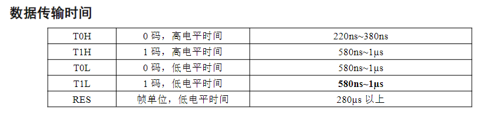
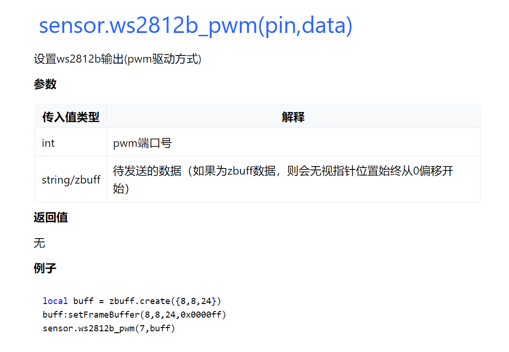
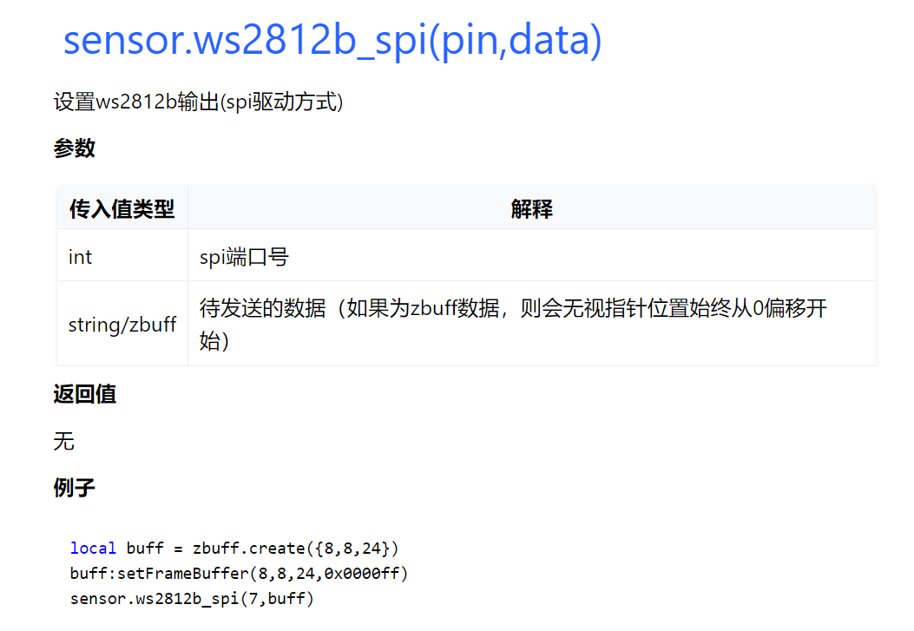

# LuatOS-Soc Driver WS2812 Tutorial

## Foreword

I haven't written anything for a long time. I'll 520 it right away. Cheng Xuyuan and the siege lions, light a lamp for their girlfriends to express their love ~ (No girlfriend? Boyfriends can also do it~）

## Introduction

ws2812 It is a commonly used external control integrated LED light source, which has the advantages of low voltage drive, environmental protection and energy saving, high brightness, large scattering angle, low power and long life. The control is simple and the application field is very wide.

The following conditions are required to drive ws2812:



Obviously, not all mcu can support it, so LuatOS-Soc added PWM and SPI drive methods when gpio direct drive is supported.：

`sensor.ws2812b_pwm(pin,data)`and`sensor.ws2812b_spi(pin,data)`

Let's take a look at the hardware requirements of these two functions.:

`sensor.ws2812b_pwm(pin,data)`：800k PWM output frequency

`sensor.ws2812b_spi(pin,data)`：5Mbps The SPI output rate

Obviously, this requirement is very low. Of the three driving methods, one is always suitable for you.~


Air101/Air103:recommend use spi drive mode

Air105:recommend, pwm drive mode can be used, spi drive mode can also be used, io direct drive can also be used, but it is actually a bit reluctant

## Use

First look at the API description.：





是不是api很简单？配合zbuff更简单，下面我们就显示❤+520

First, convert what we want to display into a GBR color array.：

```lua
local show_520 = {
    {0x0000ff,0x0000ff,0x0000ff,0x0000ff,0x0000ff,0x0000ff,0x0000ff,0x0000ff,0x0000ff,0x0000ff,0x0000ff,0x0000ff,0x0000ff,0x0000ff,0x0000ff,0x0000ff,0x0000ff,0x0000ff,0x0000ff,0x0000ff,0x0000ff,0x0000ff,0x0000ff,0x0000ff},
    {0x0000ff,0x00ff00,0x00ff00,0x0000ff,0x0000ff,0x00ff00,0x00ff00,0x0000ff,0x0000ff,0x0000ff,0x0000ff,0x0000ff,0x0000ff,0x0000ff,0x0000ff,0x0000ff,0x0000ff,0x0000ff,0x0000ff,0x0000ff,0x0000ff,0x0000ff,0x0000ff,0x0000ff},
    {0x00ff00,0x00ff00,0x00ff00,0x00ff00,0x00ff00,0x00ff00,0x00ff00,0x00ff00,0x0000ff,0x00ff00,0x00ff00,0x00ff00,0x0000ff,0x00ff00,0x00ff00,0x00ff00,0x0000ff,0x00ff00,0x00ff00,0x00ff00,0x0000ff,0x0000ff,0x0000ff,0x0000ff},
    {0x00ff00,0x00ff00,0x00ff00,0x00ff00,0x00ff00,0x00ff00,0x00ff00,0x00ff00,0x0000ff,0x00ff00,0x0000ff,0x0000ff,0x0000ff,0x0000ff,0x0000ff,0x00ff00,0x0000ff,0x00ff00,0x0000ff,0x00ff00,0x0000ff,0x0000ff,0x0000ff,0x0000ff},
    {0x00ff00,0x00ff00,0x00ff00,0x00ff00,0x00ff00,0x00ff00,0x00ff00,0x00ff00,0x0000ff,0x00ff00,0x00ff00,0x00ff00,0x0000ff,0x00ff00,0x00ff00,0x00ff00,0x0000ff,0x00ff00,0x0000ff,0x00ff00,0x0000ff,0x0000ff,0x0000ff,0x0000ff},
    {0x0000ff,0x00ff00,0x00ff00,0x00ff00,0x00ff00,0x00ff00,0x00ff00,0x0000ff,0x0000ff,0x0000ff,0x0000ff,0x00ff00,0x0000ff,0x00ff00,0x0000ff,0x0000ff,0x0000ff,0x00ff00,0x0000ff,0x00ff00,0x0000ff,0x0000ff,0x0000ff,0x0000ff},
    {0x0000ff,0x0000ff,0x00ff00,0x00ff00,0x00ff00,0x00ff00,0x0000ff,0x0000ff,0x0000ff,0x00ff00,0x00ff00,0x00ff00,0x0000ff,0x00ff00,0x00ff00,0x00ff00,0x0000ff,0x00ff00,0x00ff00,0x00ff00,0x0000ff,0x0000ff,0x0000ff,0x0000ff},
    {0x0000ff,0x0000ff,0x0000ff,0x00ff00,0x00ff00,0x0000ff,0x0000ff,0x0000ff,0x0000ff,0x0000ff,0x0000ff,0x0000ff,0x0000ff,0x0000ff,0x0000ff,0x0000ff,0x0000ff,0x0000ff,0x0000ff,0x0000ff,0x0000ff,0x0000ff,0x0000ff,0x0000ff},
}
local show_520_w = 24
local show_520_h = 8
```

After that, apply for an 8*8 zbuff space.

```lua
local ws2812_w = 8
local ws2812_h = 8
local buff = zbuff.create({ws2812_w,ws2812_h,24},0x000000)
```

Then do a simple scroll display function on it

```lua
local function ws2812_roll_show(show_data,data_w)
    local m = 0
    while 1 do
        for j=0,ws2812_w-1 do
            if j%2==0 then
                for i=ws2812_w-1,0,-1 do
                    if m+ws2812_w-i>data_w then
                        buff:pixel(i,j,show_data[j+1][m+ws2812_w-i-data_w])
                    else
                        buff:pixel(i,j,show_data[j+1][m+ws2812_w-i])
                    end
                end
            else
                for i=0,ws2812_w-1 do
                    if m+i+1>data_w then
                        buff:pixel(i,j,show_data[j+1][m+i+1-data_w])
                    else
                        buff:pixel(i,j,show_data[j+1][m+i+1])
                    end
                end
            end
        end
        m = m+1
        if m==data_w then m=0 end
        sensor.ws2812b_pwm(5,buff)--The pwm method is used here. Of course, gpio and spi can also be used to view API details.wiki https://wiki.luatos.org/api/sensor.html
        -- sensor.ws2812b_spi(0,buff)
        sys.wait(300)
    end
end
```

Well, our confession program is written.

Look at the effect.：


## Data Connection

[demo](https://gitee.com/openLuat/LuatOS/tree/master/demo/ws2812)
