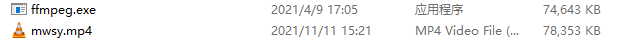
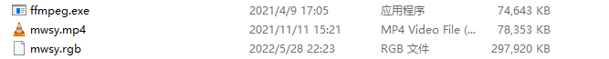

# **Air105 Video playback**

## Foreword

Before, we had [video playback](https://doc.openluat.com/article/3535) on Air101 and made demo:[video_play](https://gitee.com/openLuat/LuatOS/tree/master/demo/video_play). Today, we are using Air105 to play video again.

## Preparations

Before proceeding, let's talk about the principle. The principle is very simple, that is, read out the video byte stream data in the TF card and draw it on the LCD.

Then start preparing the video byte stream data, we need to use it.[ffmpeg](https://www.ffmpeg.org/)

### linux Platform

Direct terminal input `sudo apt install ffmpeg` can be

### windows Platform

We can download [here](https://www.gyan.dev/ffmpeg/builds/) to get the win version of the compressed package, and decompress to get ffmpeg.exe

Take the windows platform as an example.

First of all, let's take a look at the basic ffmpeg parameters.

## Video file production


First of all, prepare a video to be played. For copyright reasons, the video address is not placed here. Prepare the previous ffmpeg.exe as well.



powershell Enter `.\ffmpeg-I mwsy.mp4 -r 20 -vf scale = 160:128 -pix_fmt rgb565be -vcodec rawvideo mwsy.rgb` to convert the video to a 160x 128 resolution byte stream file



Place the generated mwsy.rgb in the sd card

## Play video

Then we'll start writing code.

```lua
sys.taskInit(function()
    --Initialization lcd
    spi_lcd = spi.deviceSetup(5,pin.PC14,0,0,8,48*1000*1000,spi.MSB,1,1)
    log.info("lcd.init",
    lcd.init("st7735",{port = "device",pin_dc = pin.PE08 ,pin_rst = pin.PC12,pin_pwr = pin.PE09,direction = 3,w = 160,h = 128,xoffset = 1,yoffset = 2},spi_lcd))
    --Initialization sd
    local spiId = 2
    local result = spi.setup(
        spiId,--Serial port id
        255, -- Don't use default CS pins
        0,--CPHA
        0,--CPOL
        8,--Data Width
        400*1000  -- Use lower frequency when initializing
    )
    local TF_CS = pin.PB3
    gpio.setup(TF_CS, 1)
    --fatfs.debug(1) -- If the mount fails, you can try to open the debugging information to find the reason.
    fatfs.mount("SD", spiId, TF_CS, 24000000)
    local data, err = fatfs.getfree("SD")
    if data then
        log.info("fatfs", "getfree", json.encode(data))
    else
        log.info("fatfs", "err", err)
    end
    
    local video_w = 160
    local video_h = 128
    local rgb_file = "mwsy.rgb"

    local buff_size = video_w*video_h*2
    local file_size = fs.fsize("/sd/"..rgb_file)
    print("/sd/"..rgb_file.." file_size",file_size)
    
    local file = io.open("/sd/"..rgb_file, "rb")
    if file then
        local file_cnt = 0
        local buff = zbuff.create(buff_size)
        repeat
            if file:fill(buff) then
                file_cnt = file_cnt + buff_size
                lcd.draw(0, 0, video_w-1, video_h-1, buff)
                sys.wait(20)
            end
        until( file_size - file_cnt < buff_size )
        local temp_data = file:fill(buff,0,file_size - file_cnt)
        lcd.draw(0, 0, video_w-1, video_h-1, buff)
        sys.wait(30)
        file:close()
    end

    while 1 do
        sys.wait(1000)
    end
end)
```

You can see that the code is very simple, first initialize LCD, then initialize and mount sd, and then read the video to LCD draw

[demo Connection](https://gitee.com/openLuat/LuatOS/tree/master/demo/video_play/Air105)

## effect display

[Video effect display](https://www.bilibili.com/video/BV1Yg411R7Tc/)

## Related Connections

[LuatOS-SoC Warehouse](https://gitee.com/openLuat/LuatOS)

[LuatOS-SoC WIKI](https://wiki.luatos.org/index.html)

[bsp-Air101](https://gitee.com/openLuat/LuatOS/tree/master/bsp/air101)