# adc

This chapter introduces the adc function of LuatOS, which enables reading external voltages using the development board and printing them in the log.

## Introduction

An analog-to-digital converter, or ADC for short, usually refers to an electronic component that converts an analog signal into a digital signal.

::::{tab-set}

:::{tab-item} Air101
:sync: air101

Air101 There are 2 ADC channels, the development board leads out 2 channels, the channels are 0,1 respectively, and the input voltage range is 0~2.4V (refer to [air101_chip specification _v1.1.pdf](https://cdn.openluat-luatcommunity.openluat.com/attachment/air101_%E8%8A%AF%E7%89%87%E8%A7%84%E6%A0%BC%E4%B9%A6_v1.1.pdf))

Without the use of voltage divider circuit, we can only collect 0~2.4V voltage directly, `external input must not exceed 2.4V, otherwise it will burn the chip.！！`

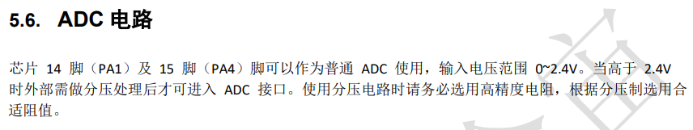

:::

:::{tab-item} Air103
:sync: air103

Air103 There are 4 ADC channels, the development board leads out 4 channels, the channels are 0,1,2 and 3 respectively, and the input voltage range is 0~2.4V (refer to [Air103_MCU Design Manual V1.2.pdf](https://cdn.openluat-luatcommunity.openluat.com/attachment/20211202193606476_Air103_MCU%E8%AE%BE%E8%AE%A1%E6%89%8B%E5%86%8CV1.2.pdf))

Without the use of voltage divider circuit, we can only collect 0~2.4V voltage directly, `external input must not exceed 2.4V, otherwise it will burn the chip.！！`

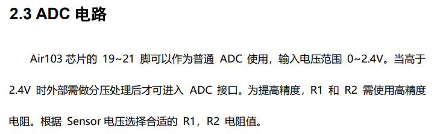

:::

:::{tab-item} Air105
:sync: air105

Air105 There are 7 ADC channels in total, and the development board leads out 4 channels with 1,2,5 and 6 channels respectively (refer to [Air105 core board user manual V1.1.pdf](https://cdn.openluat-luatcommunity.openluat.com/attachment/20220303111656608_Air105%20%E6%A0%B8%E5%BF%83%E6%9D%BF%E4%BD%BF%E7%94%A8%E6%89%8B%E5%86%8CV1.1.pdf)）

Referring to [Air105 chip data sheet_1.1.pdf](https://cdn.openluat-luatcommunity.openluat.com/attachment/20220114193313925_Air105芯片数据手册_1.1.pdf), it can be seen that the reference voltage of ADC is 1.8V, and the acquisition voltage range of ADC channels 1 to 6 can be matched. when the internal partial voltage is enabled, the acquisition voltage range is 0 to 3.6V, when the internal partial voltage is not enabled, the acquisition voltage range is 0 to 1.8V, and the internal partial voltage is not enabled in LuatOS, so we can directly use only the acquisition voltage of 0 to 1.8V, the external input must not exceed 1.8V, otherwise the chip will be burned.！！`

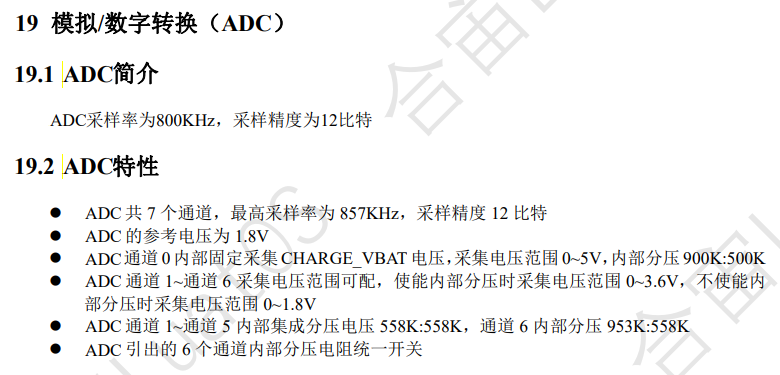

:::

::::

## Hardware preparation

::::{tab-set}
:::{tab-item} Air101
:sync: air101

Air101 One development board and one adjustable power supply. The wiring diagram is as follows

> Note: Turn on the adjustable power supply first, adjust it to below 2.4V, and then connect the power supply to the development board to prevent the chip from being burned if the power-on voltage is too high.

```example
        PA04/ADC1 ----------- +
Air101                         adjustable power supply
        GND      ----------- -
```

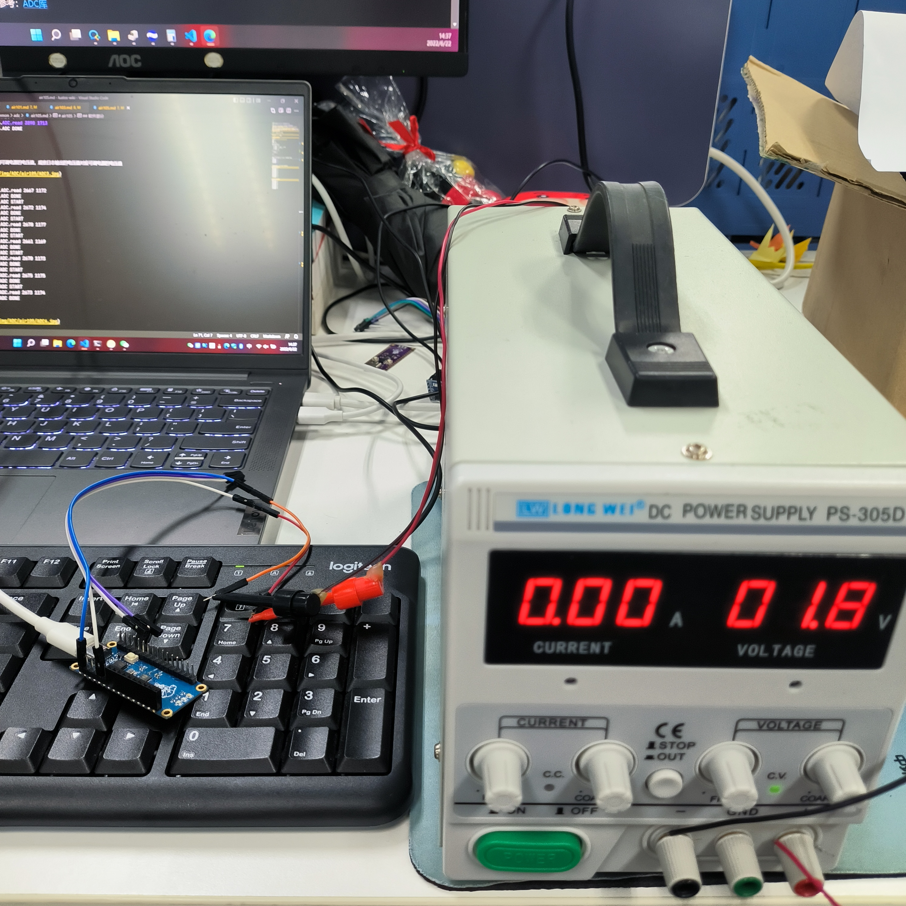

:::

:::{tab-item} Air103
:sync: air103

Air103 One development board and one adjustable power supply. The wiring diagram is as follows

> Note: Turn on the adjustable power supply first, adjust it to below 2.4V, and then connect the power supply to the development board to prevent the chip from being burned if the power-on voltage is too high.

```example
        PA04/ADC1 ----------- +
Air103                         adjustable power supply
        GND      ----------- -
```

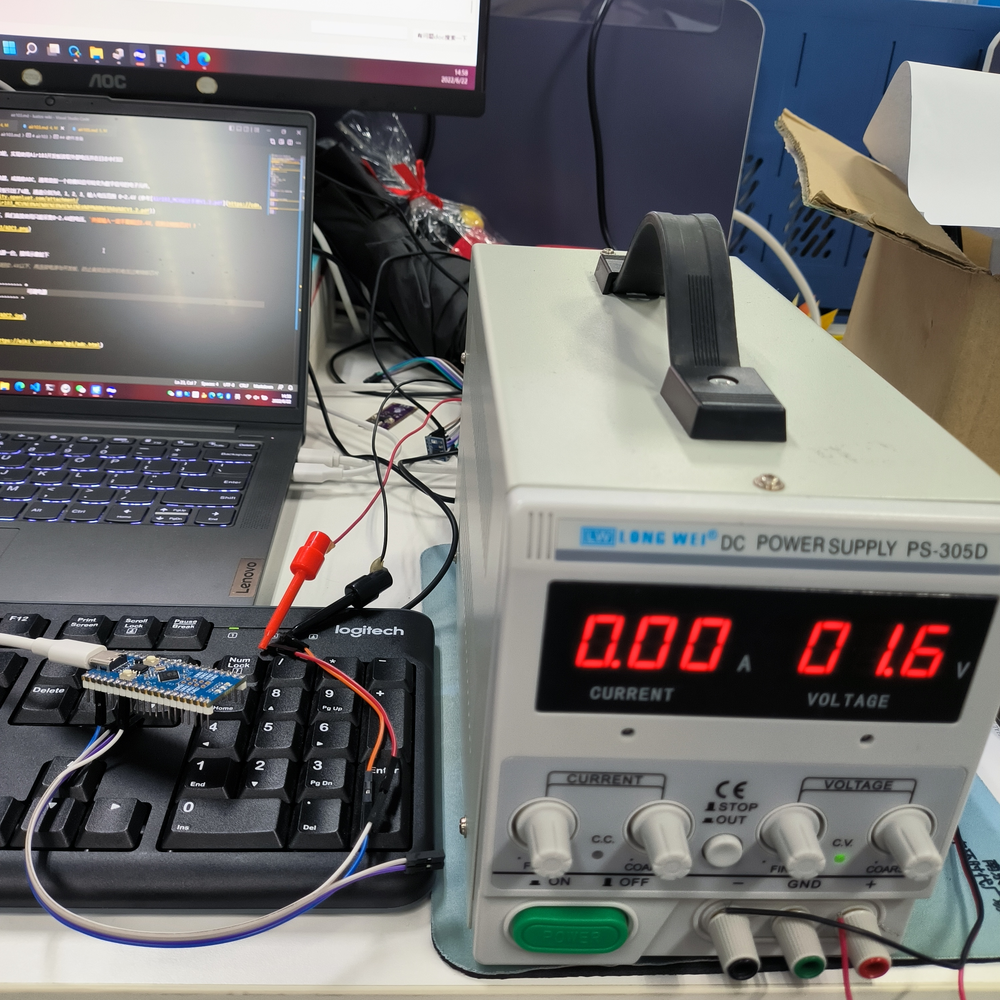

:::

:::{tab-item} Air105
:sync: air105

Air105 One development board and one adjustable power supply. The wiring diagram is as follows

> Note: Turn on the adjustable power supply first, adjust it to below 1.8V, and then connect the power supply to the development board to prevent the chip from being burned if the power-on voltage is too high.

```example
        PC0/ADC1 ----------- +
Air105                         adjustable power supply
        GND      ----------- -
```

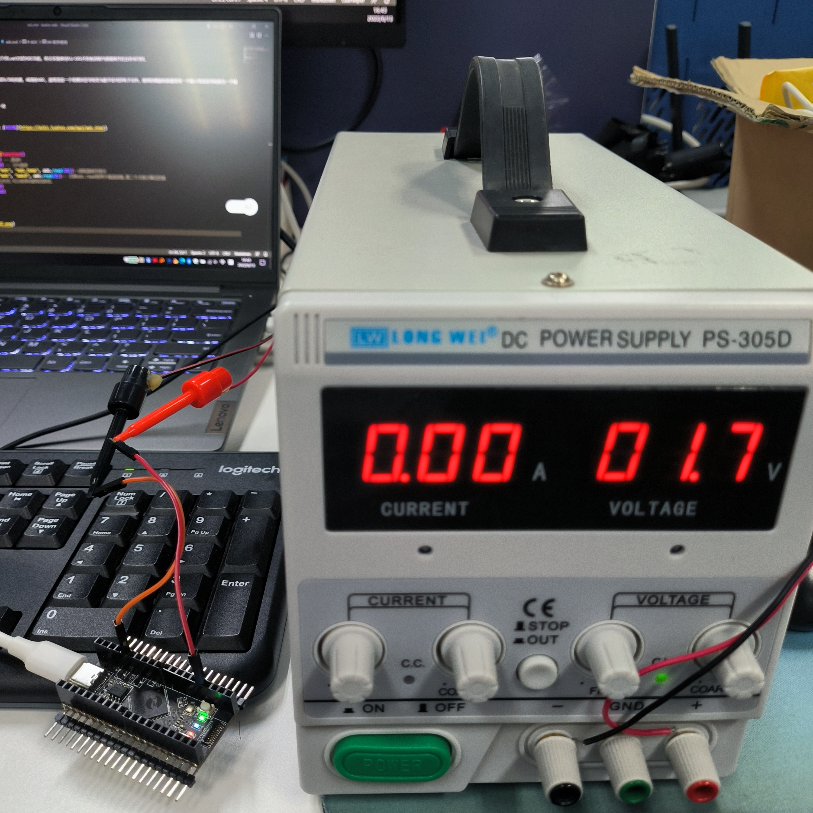

:::
::::

## Software part

Interface documentation can be found at:[ADC Library](https://openluat.github.io/luatos-wiki-en/api/adc.html)

The code is as follows

```lua
PROJECT = "ADC"
VERSION = "1.0.0"

sys = require("sys")

MOD_TYPE = rtos.bsp()
log.info("MOD_TYPE", MOD_TYPE)

function test()
    log.info(PROJECT, "START")
    -- Open ADC Channel 1
    assert(adc.open(1) == true, PROJECT .. ".open ERROR")
    -- Read the value of ADC channel 1
    log.info(PROJECT .. ".read", adc.read(1))
    -- Turn off the ADC channel 1
    adc.close(1)
    log.info(PROJECT, "DONE")
end

-- Create a Ctrip loop to execute the test function
sys.taskInit(function()
    while true do
        test()
        sys.wait(1000)
    end
end)

sys.run()

```

>Note: `adc.read` has two return values, the first value is the original value, the second value is the conversion value, the unit is mV

::::{tab-set}
:::{tab-item} Air101
:sync: air101

After successful download, observe the log output as follows. According to the second value returned by `adc.read`, the measured voltage is about 1712mV

```log
I/user.ADC START
I/user.ADC.read 103336 1776
I/user.ADC DONE
I/user.ADC START
I/user.ADC.read 103348 1777
I/user.ADC DONE
I/user.ADC START
I/user.ADC.read 103372 1777
I/user.ADC DONE
...
...
```

Slowly reduce the voltage value of the adjustable power supply, and observe that the voltage value of the log output corresponds to the voltage value of the adjustable power supply

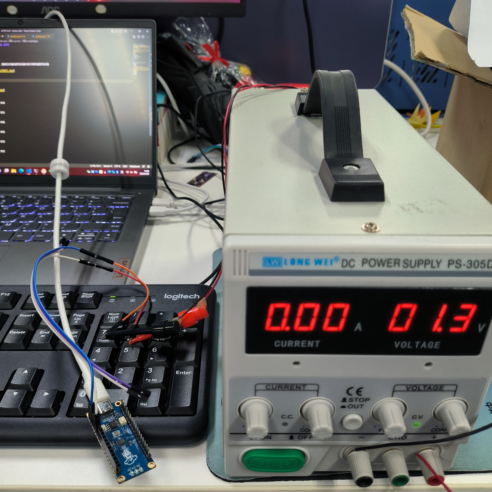

```log
I/user.ADC START
I/user.ADC.read 86784 1262
I/user.ADC DONE
I/user.ADC START
I/user.ADC.read 86844 1264
I/user.ADC DONE
I/user.ADC START
I/user.ADC.read 86852 1264
I/user.ADC DONE
...
...
```

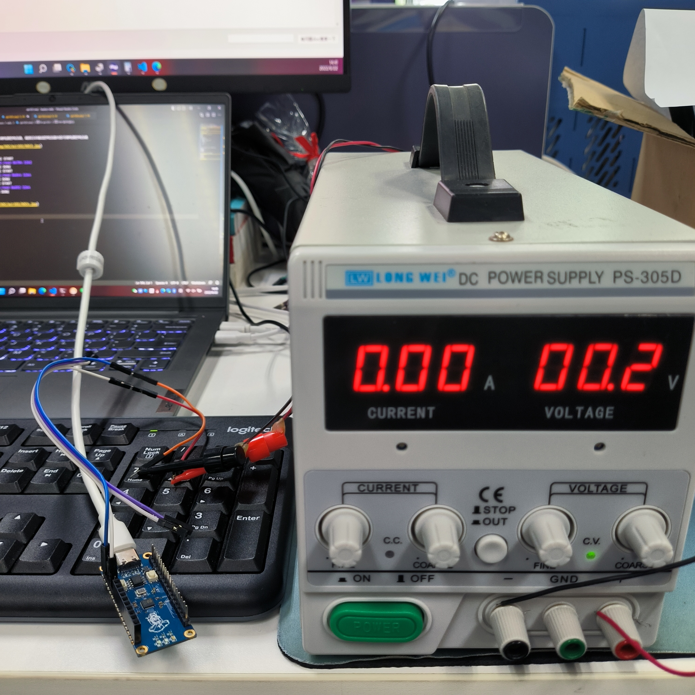

```log
I/user.ADC.read 50736 142
I/user.ADC DONE
I/user.ADC START
I/user.ADC.read 50832 145
I/user.ADC DONE
I/user.ADC START
I/user.ADC.read 50788 144
I/user.ADC DONE
...
...
```

:::

:::{tab-item} Air103
:sync: air103

After successful download, observe the log output as follows. According to the second value returned by `adc.read`, the measured voltage is about 1712mV

```log
I/user.ADC.read 97672 1600
I/user.ADC DONE
I/user.ADC START
I/user.ADC.read 97700 1601
I/user.ADC DONE
I/user.ADC START
I/user.ADC.read 97656 1600
I/user.ADC DONE
...
...
```

Slowly reduce the voltage value of the adjustable power supply, and observe that the voltage value of the log output corresponds to the voltage value of the adjustable power supply

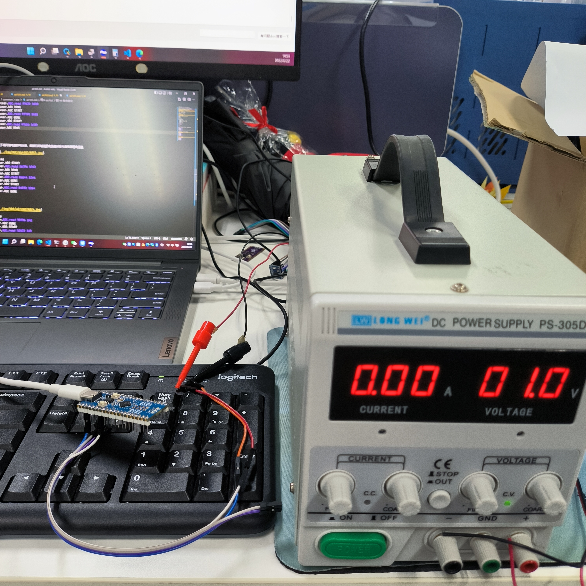

```log
I/user.ADC START
I/user.ADC.read 80300 1061
I/user.ADC DONE
I/user.ADC START
I/user.ADC.read 80364 1063
I/user.ADC DONE
I/user.ADC START
I/user.ADC.read 80300 1061
I/user.ADC DONE
...
...
```

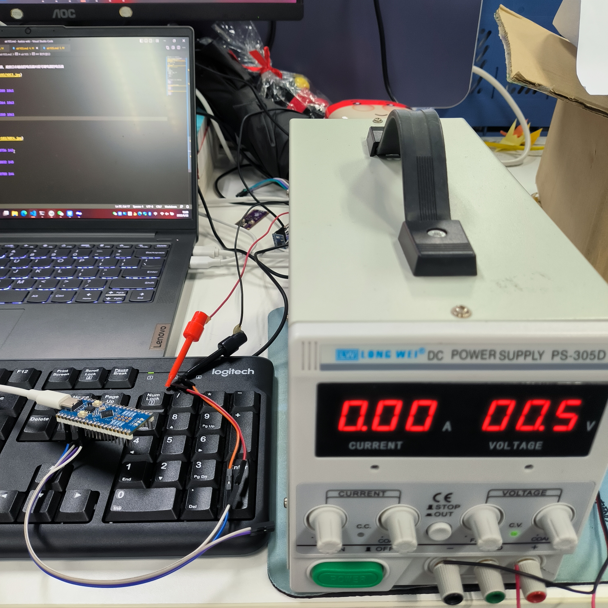

```log
I/user.ADC START
I/user.ADC.read 62060 494
I/user.ADC DONE
I/user.ADC START
I/user.ADC.read 62052 494
I/user.ADC DONE
I/user.ADC START
I/user.ADC.read 61984 492
I/user.ADC DONE
...
...
```

:::

:::{tab-item} Air105
:sync: air105

After successful download, observe the log output as follows. According to the second value returned by `adc.read`, the measured voltage is about 1712mV

```log
I/user.ADC START
I/user.ADC.read 3882 1712
I/user.ADC DONE
I/user.ADC START
I/user.ADC.read 3889 1709
I/user.ADC DONE
I/user.ADC START
I/user.ADC.read 3898 1713
I/user.ADC DONE
...
...

```

Slowly reduce the voltage value of the adjustable power supply, and observe that the voltage value of the log output corresponds to the voltage value of the adjustable power supply

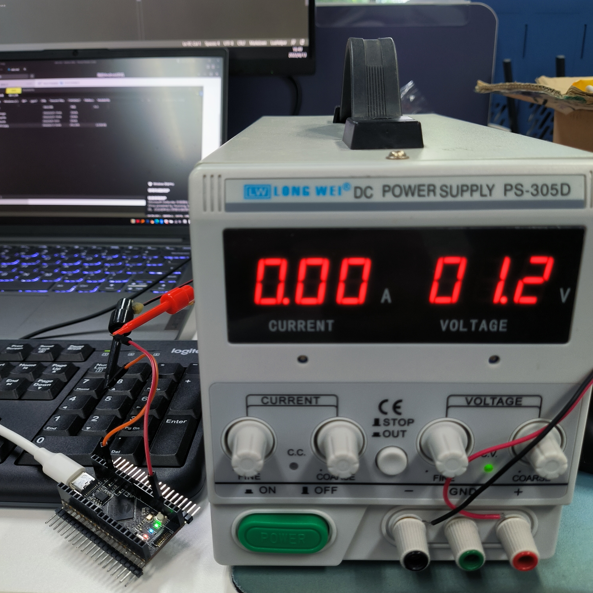

```log
I/user.ADC START
I/user.ADC.read 2670 1173
I/user.ADC DONE
I/user.ADC START
I/user.ADC.read 2675 1175
I/user.ADC DONE
I/user.ADC START
I/user.ADC.read 2673 1174
I/user.ADC DONE
...
...
```

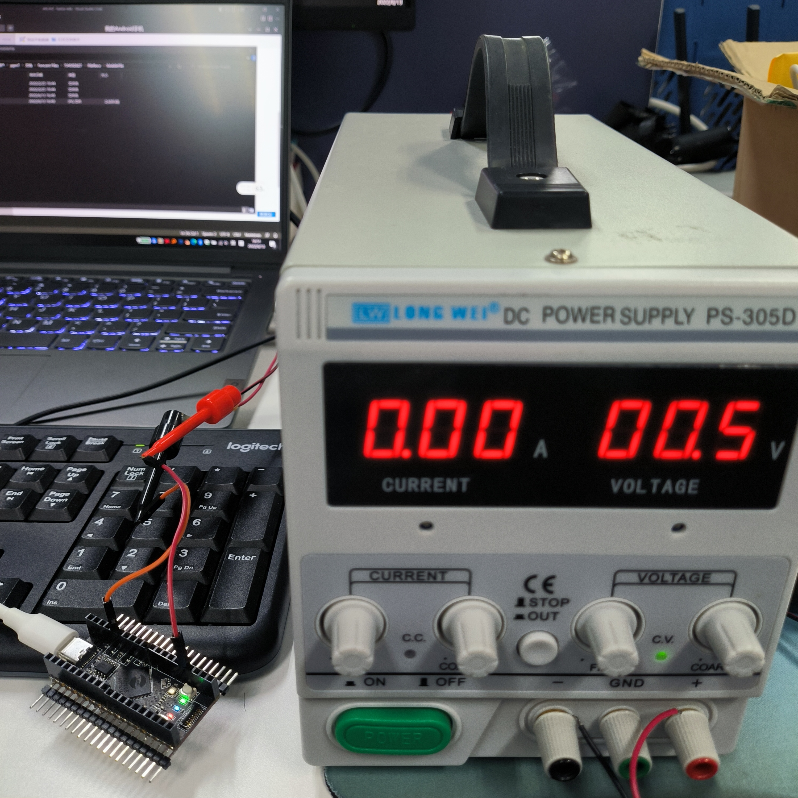

```log
I/user.ADC START
I/user.ADC.read 1354 595
I/user.ADC DONE
I/user.ADC START
I/user.ADC.read 1350 593
I/user.ADC DONE
I/user.ADC START
I/user.ADC.read 1348 592
I/user.ADC DONE
...
...
```

:::
::::
