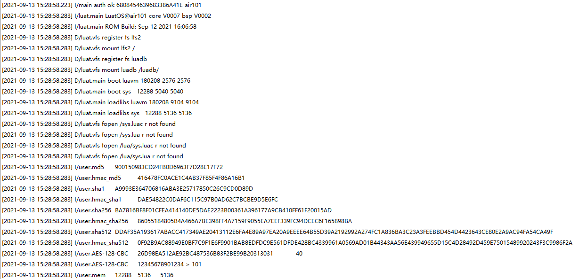

# CRYPTO

This chapter will introduce you to the CRYPTO features of LuatOS. Will be implemented using the Air101 development board for encryption, decryption and printing in the log.

## Introduction

Encryption is to change the original information data by a certain algorithm, so that even if unauthorized users get the encrypted information, they cannot know the real meaning of the information because they do not know the decryption method. In this way, the security of network data transmission is improved. The common encryption algorithms are hash algorithm, HMAC algorithm, signature, symmetric encryption algorithm and asymmetric encryption algorithm. Encryption algorithm is also divided into reversible and irreversible, for example, `md5` is an irreversible hash algorithm. We often use these encryption algorithms in development. The `crypto` module provides encryption and decryption functions.

## Hardware preparation

Air101 A development board

## Software usage

Interface documentation can be referred to:[crypto library](https://openluat.github.io/luatos-wiki-en/api/crypto.html)

```lua
-- MD5,The output result has been hex encoded
log.info("md5", crypto.md5("abc"))
log.info("hmac_md5", crypto.hmac_md5("abc", "1234567890"))

-- SHA1,The output result has been hex encoded
log.info("sha1", crypto.sha1("abc"))
log.info("hmac_sha1", crypto.hmac_sha1("abc", "1234567890"))

-- SHA256,The output result has been hex encoded
log.info("sha256", crypto.sha256("abc"))
log.info("hmac_sha256", crypto.hmac_sha256("abc", "1234567890"))

-- SHA512,The output result has been hex encoded
log.info("sha512", crypto.sha512("abc"))
log.info("hmac_sha512", crypto.hmac_sha512("abc", "1234567890"))

-- AES Encrypted, not Hex encoded
local data2_encrypt = crypto.cipher_encrypt("AES-128-CBC", "PKCS7", "12345678901234 > ".. "101", "1234567890123456", "1234567890666666")
log.info("AES-128-CBC", data2_encrypt:toHex())

-- AES Decrypted, not Hex encoded
local data2_decrypt = crypto.cipher_decrypt("AES-128-CBC", "PKCS7", data2_encrypt, "1234567890123456", "1234567890666666")
log.info("AES-128-CBC", data2_decrypt)
```

View from Print Log


