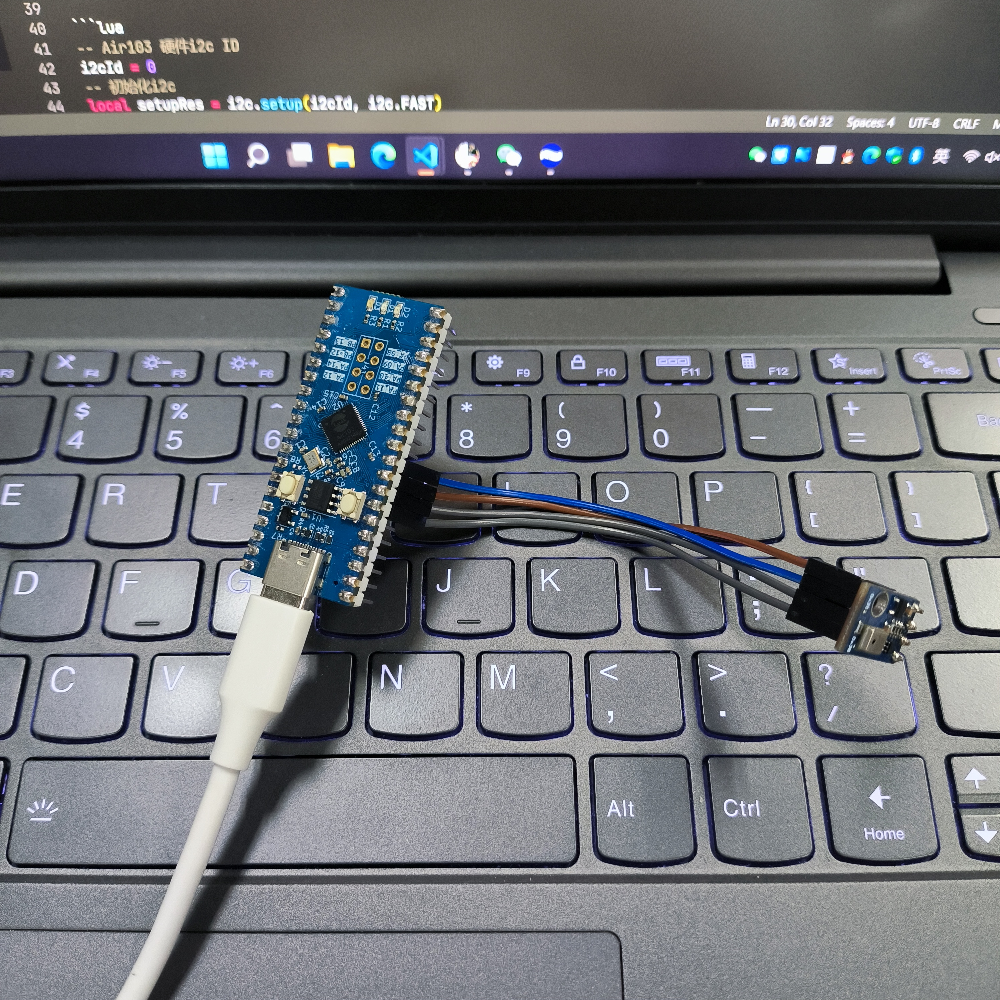
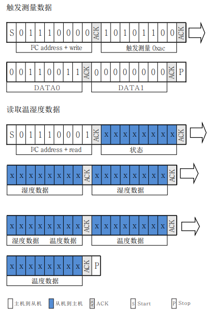
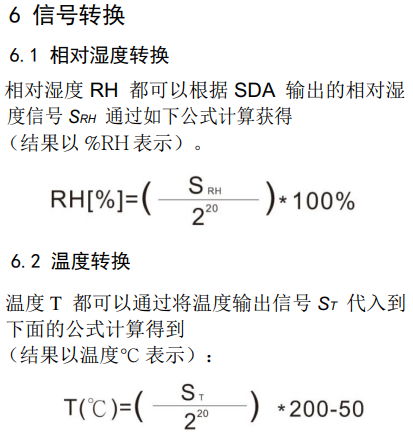

# air103

This chapter describes how to use the i2c library for LuatOS

## Introduction

i2c Library provides communication between LuatOS and peripherals using the i2c protocol

I2C The bus is a simple, bidirectional two-wire synchronous serial bus developed by Philips. It requires only two wires to transfer information between devices connected to the bus.

## Hardware preparation

+ Air103 Development Board

+ AHT10

Air103 There is 1 channel i2c controller

AHT10 Is a temperature and humidity sensor, using I2C communication protocol, 7 i2c device address is`0x38`

Wiring Schematic

```example
         PA4/GPIO4/I2C_SDA  ------     SDA
Air103   PA1/GPIO1/I2C_SCL  ------     SCL   AHT10
         +3.3V              ------     VIN
         GND                ------     GND
```



## Software part

Interface documentation can be referred to:[i2c library](https://openluat.github.io/luatos-wiki-en/api/i2c.html)

### Initialize hardware i2c

The code is as follows

```lua
-- Air103 Hardware i2c ID
i2cId = 0
-- Initialization i2c
local setupRes = i2c.setup(i2cId, i2c.FAST)
log.info(PROJECT .. ".setup", setupRes)
if setupRes ~= i2c.FAST then
    log.error(PROJECT .. ".setup", "ERROR")
    return
end
```

The log is as follows

```log
I/user.i2c.setup 1
```

setup The return value of the function is consistent with the i2c speed at the time of initialization, which means the initialization is successful.

### Send command to AHT10 to trigger measurement and reading

According to section 5.3 in the AHT10 data manual, the trigger measurement command of AHT10 is` 0xac`. when reading temperature and humidity data, the slave machine returns a total of 6 bytes, the first byte is the slave machine status, and the last 5 bytes are temperature and humidity information. the data transmission diagram of the master machine and the slave machine is as follows



Note that AHT10 needs time during acquisition. After the host sends out the measurement instruction `0xAC`, the converted data will be read with a delay of more than 75 milliseconds.

The read data needs to be converted by the following formula



The code is as follows

```lua
-- AHT10 7 bit address
i2cSlaveAddr = 0x38
-- Send measurement command
i2c.send(i2cId, i2cSlaveAddr, string.char(0xac, 0x33, 0x00))
-- Wait for the measurement to complete
sys.wait(500)
-- Read temperature and humidity data
receivedData = i2c.recv(i2cId, i2cSlaveAddr, 6)
-- The separation temperature data includes the 6th bit, the 5th bit and the lower four bits of the 4th bit in the read data.
local tempBit = string.byte(receivedData, 6) + 0x100 * string.byte(receivedData, 5) + 0x10000 *
                    (string.byte(receivedData, 4) & 0x0F)
-- The separated humidity data contains the second bit, the third bit and the high four bits of the fourth bit in the read data.
local humidityBit = (string.byte(receivedData, 4) & 0xF0) + 0x100 * string.byte(receivedData, 3) + 0x10000 *
                        string.byte(receivedData, 2)
humidityBit = humidityBit >> 4
-- Converting Temperature and Humidity Results
local calcTemp = (tempBit / (2 ^ 20)) * 200 - 50
local calcHum = humidityBit / (2 ^ 20)
log.info(PROJECT .. ".Current Temperature", string.format("%.2f℃", calcTemp))
log.info(PROJECT .. ".Current humidity", string.format("%.2f%%", calcHum * 100))
```

The log is as follows

```log
I/user.i2c.Current Temperature 27.78℃
I/user.i2c.Current humidity 63.51%
```

The complete code is as follows

```lua
PROJECT = "i2c"
VERSION = "1.0.0"
sys = require("sys")

-- AHT10 7 bit address
i2cSlaveAddr = 0x38
-- Air103 Hardware i2c ID
i2cId = 0

function getAHT10Data()
    -- Send measurement command
    i2c.send(i2cId, i2cSlaveAddr, string.char(0xac, 0x33, 0x00))
    -- Wait for the measurement to complete
    sys.wait(500)
    -- Read temperature and humidity data
    receivedData = i2c.recv(i2cId, i2cSlaveAddr, 6)
    -- Separation temperature data
    local tempBit = string.byte(receivedData, 6) + 0x100 * string.byte(receivedData, 5) + 0x10000 *
                        (string.byte(receivedData, 4) & 0x0F)
    -- Separate humidity data
    local humidityBit = (string.byte(receivedData, 4) & 0xF0) + 0x100 * string.byte(receivedData, 3) + 0x10000 *
                            string.byte(receivedData, 2)
    humidityBit = humidityBit >> 4
    -- Converting Temperature and Humidity Results
    local calcTemp = (tempBit / (2 ^ 20)) * 200 - 50
    local calcHum = humidityBit / (2 ^ 20)
    log.info(PROJECT .. ".Current Temperature", string.format("%.2f℃", calcTemp))
    log.info(PROJECT .. ".Current humidity", string.format("%.2f%%", calcHum * 100))

end
sys.taskInit(function()
    -- Initialization i2c
    local setupRes = i2c.setup(i2cId, i2c.FAST)
    log.info(PROJECT .. ".setup", setupRes)
    if setupRes ~= i2c.FAST then
        log.error(PROJECT .. ".setup", "ERROR")
        i2c.close(i2cId)
        return
    end
    while true do
        getAHT10Data()
        sys.wait(5000)
    end
end)

sys.run()

```
