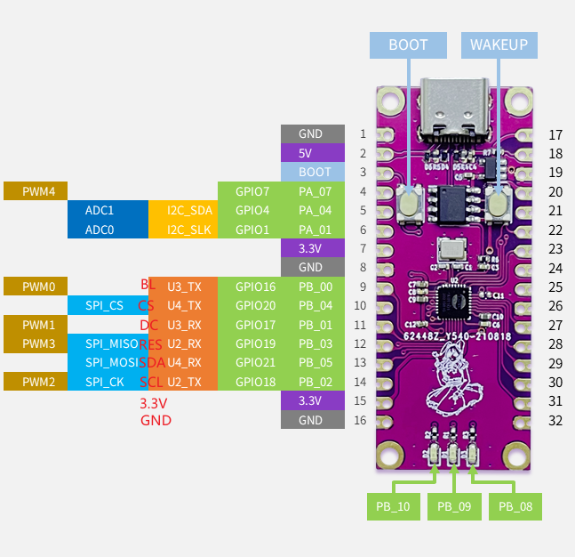
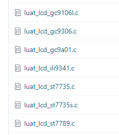

# LCD Drive screen

This chapter will show you how LuatOS drives the screen and displays content on the screen.

## Introduction

Usually driving the screen is a very complicated thing, because the LCD screen has a lot of instructions, display data and make a font. LuatOS encapsulates the LCD and has a variety of commonly used screen drivers built in. If it is not in the list, it can also be driven by Lua script configuration instructions.



## Hardware preparation

Air101 A development board, SPI interface LCD screen, I use here ST7735（128*160）

Hardware connection diagram



## Software usage

Interface documentation can be referred to: [LCD library](https://openluat.github.io/luatos-wiki-en/api/lcd.html)

Modify the LCD example in demo, change the screen driver to st7735. If each pin is configured as we are connected, we can see the dotted line we draw on the screen.

```lua
spi.setup(0, 20, 0, 0, 8, 40 * 1000 * 1000, spi.MSB, 1, 1)
log.info("lcd.init", lcd.init("st7735",{
    port = 0,
    pin_cs = xx--[[Press your board to change your pin number.]],
    pin_dc = xx--[[Press your board to change your pin number.]],
    pin_pwr = xx--[[Press your board to change your pin number.]],
    pin_rst = xx--[[Press your board to change your pin number.]],
    direction = 0,
    w = 128,
    h = 160
}))
log.info("lcd.drawLine", lcd.drawLine(20,30,80,30,0x001F))
log.info("lcd.drawRectangle", lcd.drawRectangle(20,40,80,80,0x001F))
log.info("lcd.drawCircle", lcd.drawCircle(120,120,20,0x001F))
```
