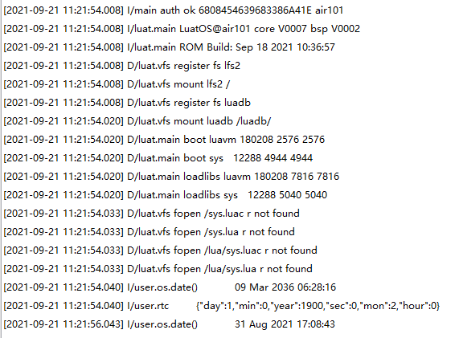

# RTC

This chapter will introduce you to the RTC features of LuatOS. The value of RTC will be read and printed in the log using the Air101 development board.

## Introduction

RTC （Real-Time Clock）Real-time clock can provide accurate real-time time, it can be used to produce years, months, days, hours, minutes, seconds and other information. At present, most real-time clock chips use a crystal oscillator with high precision as the clock source. Some clock chips will add battery power to keep the time information valid in order to work when the main power supply is down.

## Hardware preparation

Air101 A development board

## Software usage

Interface documentation can be referred to:[rtc library](https://openluat.github.io/luatos-wiki-en/api/rtc.html)

Code display

```lua
log.info("os.date()", os.date())--Print Time
local t = rtc.get()--Get RTC Time
log.info("rtc", json.encode(t))--Print RTC Time
sys.wait(2000)--Delay
rtc.set({year=2021,mon=8,day=31,hour=17,min=8,sec=43})--rtc Time Settings
log.info("os.date()", os.date())--Print Time
```

The above code prints the log


