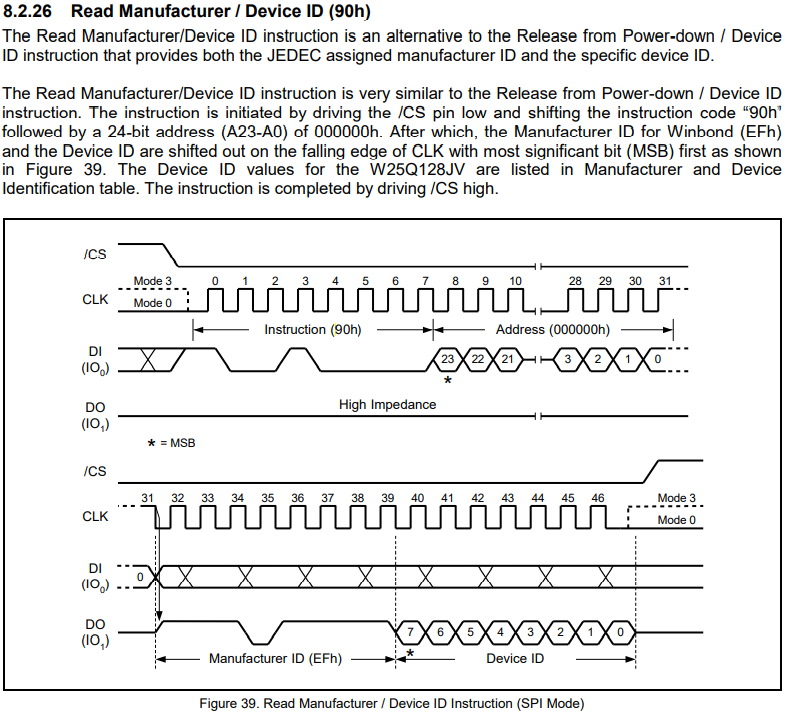

# air105

This chapter describes how to use the spi library for LuatOS

## Introduction

spi library provides communication between LuatOS and peripherals using spi protocol

SPI It is an abbreviation of English (Serial Peripheral interface) and, as the name implies, is a serial peripheral interface. was first defined by `Motorola` on its `MC68HCXX` family of processors

SPI The interface is mainly used in EEPROM,FLASH, real-time clock, AD converter, and digital signal processor and digital signal decoder. SPI is a high-speed, full-duplex, synchronous communication bus, and only takes up four lines on the pins of the chip, saving the pins of the chip, saving space and providing convenience for the layout of the PCB.

Refer to [Air105_MCU Design Manual V1.7.pdf](https://cdn.openluat-luatcommunity.openluat.com/attachment/20220513112445291_Air105_MCU设计手册V1.7.pdf), Air105 has 4 SPI channels 0，1，2，5

## Hardware preparation

+ Air105 Development Board

+ SPI FLASH Here select` W25Q128` [W25Q128 Data Sheet](https://www.winbond.com/resource-files/w25q128jv_dtr%20revc%2003272018%20plus.pdf)

Air105 There are 4 spi controllers, we choose channel 5`HSPI`

W25Q128 Is a 128M-Bit that supports SPI communication protocol FLASH

Wiring Schematic

```example
        HSPI_CSN/GPIO46   -----  CS
        HSPI_MISO/GPIO44  -----  DO
        HSPI_MOSI/GPIO45  -----  DI
Air105  HSPI_CLK/GPIO47   -----  CLK   SPI_FLASH
        +3.3V             -----  VCC
        GND               -----  GND
```

## Software part

Interface documentation can be found at:[spi library](https://wiki.luatos.org/api/spi.html)

SPI There are two ways to operate, one is to directly read and write the SPI channel, and the other is to abstract it into an SPI device and then read and write it.

### Read and write directly to the SPI channel

#### Initialize CS Pin Manual Control

When using Air105, we need to manually control CS to pull down to enable the device

Encapsulate spi.transfer into a new function and surround it with CS operations before and after.

The code is as follows

```lua
function transfer(CS, spiID, data, sendLen, recvLen)
    CS(0)
    local res = spi.transfer(spiID, data, sendLen, recvLen)
    CS(1)
    return res
end
```

#### Initialization SPI

Initialize SPI Channel 5,24MHz CLK, Half Duplex Mode

The code is as follows

```lua
local spiID, CS_GPIO = 5, 46
-- CS The parameter 255 represents manual control of the CS pin, and the last mode parameter 0 represents half-duplex mode
local setupRes = spi.setup(spiID, 255, 0, 0, 8, 24 * 1000 * 1000, spi.MSB, 1, 0)
if setupRes ~= 0 then
    log.error(PROJECT .. ".setup", "ERROR")
    return
end
```

#### Manufacturers and devices that read SPI FLASH ID

Looking up the [W25Q128 Data Sheet](https://www.winbond.com/resource-files/w25q128jv_dtr revc 03272018 plus.pdf), we can see that the instructions for querying manufacturer and device ID are as follows`0x90`

Instructions are described in the following figure



The code is as follows

```lua
log.info(PROJECT .. ".chipID", string.toHex(spi.transfer(spiID, string.char(0x90, 0, 0, 0), 4, 2)))
```

The log is as follows

```log
I/user.spi.chipID EF17 4
```

In the return value `0xEF17`, `EF` is the manufacturer `Winbond Serial Flash`, and `17` is the model`W25Q128JV`

#### Erase specified address sector

Looking up [W25Q128 Data Sheet](https://www.winbond.com/resource-files/w25q128jv_dtr REVVC 03272018 PLUS. pdf), we can see that the instruction to erase the specified address sector is`0x20`

A write enable instruction needs to be executed before an erase instruction can be executed`0x06`

Erase 4K-bytes size sector starting at address `0x01`

The code is as follows

```lua
transfer(CS, spiID, string.char(0x06), 1, 0)
sys.wait(100)
transfer(CS, spiID, string.char(0x20, 0x00, 0x00, 0x01), 4, 0)
-- Erasing takes some time
sys.wait(1000)
```

#### Read and write SPI FLASH

Looking up the [W25Q128 Data Sheet](https://www.winbond.com/resource-files/w25q128jv_dtr revc 03272018 plus.pdf), we can see that the instruction written on the page is` 0x 02 `, the maximum amount of data written at a time is 256 bytes, and the instruction for reading data is`0x03`

A write enable instruction needs to be executed before an erase instruction can be executed`0x06`

The code is as follows

```lua
transfer(CS, spiID, string.char(0x06), 1, 0)
sys.wait(100)
transfer(CS, spiID, string.char(0x02, 0x00, 0x00, 0x01) .. PROJECT, 4 + string.len(PROJECT), 0)
sys.wait(100)
local readRes = transfer(CS, spiID, string.char(0x03, 0x00, 0x00, 0x01), 4, string.len(PROJECT))
log.info(PROJECT .. ".readRes", readRes)
```

The log is as follows

```log
I/user.spi.readRes spi
```

Looking at the log, the data read out is consistent with the data we wrote.

#### Disable write enable and shut down the corresponding SPI channel

Looking up the [W25Q128 Data Sheet](https://www.winbond.com/resource-files/w25q128jv_dtr revc 03272018 plus.pdf), it can be seen that the instruction to disable write enable is`0x04`

The code is as follows

```lua
transfer(CS, spiID, string.char(0x04), 1, 0)
gpio.close(CS_GPIO)
spi.close(spiID)
```

### Abstraction for a SPI device and then read and write

#### Abstract SPi Peripherals

Abstract SPI channel 5 SPI FLASH,24MHz CLK, half duplex mode

The code is as follows

```lua
local spiID, CS_GPIO = 5, 46
-- The last mode parameter, 0, represents half-duplex mode.
local spiFlash = spi.deviceSetup(spiID, CS_GPIO, 0, 0, 8, 24 * 1000 * 1000, spi.MSB, 1, 0)
```

#### Manufacturers and devices that read SPI FLASH ID

Looking up the [W25Q128 Data Sheet](https://www.winbond.com/resource-files/w25q128jv_dtr revc 03272018 plus.pdf), we can see that the instructions for querying manufacturer and device ID are as follows`0x90`

Instructions are described in the following figure


The code is as follows

```lua
log.info(PROJECT .. ".chipID", string.toHex(spiFlash:transfer(string.char(0x90, 0, 0, 0), 4, 2)))
```

The log is as follows

```log
I/user.spi.chipID EF17 4
```

In the return value `0xEF17`, `EF` is the manufacturer `Winbond Serial Flash`, and `17` is the model`W25Q128JV`

#### Erase specified address sector

Looking up [W25Q128 Data Sheet](https://www.winbond.com/resource-files/w25q128jv_dtr REVVC 03272018 PLUS. pdf), we can see that the instruction to erase the specified address sector is`0x20`

A write enable instruction needs to be executed before an erase instruction can be executed`0x06`

Erase 4K-bytes size sector starting at address `0x01`

The code is as follows

```lua
spiFlash:send(string.char(0x06))
sys.wait(100)
spiFlash:send(string.char(0x20, 0x00, 0x00, 0x01))
-- Erasing takes some time
sys.wait(1000)
```

#### Read and write SPI FLASH

Looking up the [W25Q128 Data Sheet](https://www.winbond.com/resource-files/w25q128jv_dtr revc 03272018 plus.pdf), we can see that the instruction written on the page is` 0x 02 `, the maximum amount of data written at a time is 256 bytes, and the instruction for reading data is`0x03`

A write enable instruction needs to be executed before an erase instruction can be executed`0x06`

The code is as follows

```lua
spiFlash:send(string.char(0x06))
sys.wait(100)
spiFlash:send(string.char(0x02, 0x00, 0x00, 0x01) .. PROJECT)
sys.wait(100)
local readRes = spiFlash:transfer(string.char(0x03, 0x00, 0x00, 0x01), 4, string.len(PROJECT))
log.info(PROJECT .. ".readRes", readRes)
```

The log is as follows

```log
I/user.spi.readRes spi
```

Looking at the log, the data read out is consistent with the data we wrote.

#### Disable write enable and shut down the corresponding SPI channel

Looking up the [W25Q128 Data Sheet](https://www.winbond.com/resource-files/w25q128jv_dtr revc 03272018 plus.pdf), it can be seen that the instruction to disable write enable is`0x04`

The code is as follows

```lua
spiFlash:send(string.char(0x04))
log.info(PROJECT .. ".device_close", spiFlash:close())
```

The log is as follows

```log
I/user.spi.device_close true
```

## Full Code

```lua
PROJECT = "spi"
VERSION = "1.0.0"
sys = require("sys")

function transfer(CS, spiID, data, sendLen, recvLen)
    CS(0)
    local res = spi.transfer(spiID, data, sendLen, recvLen)
    CS(1)
    return res
end

local function test()
    local spiID, CS_GPIO = 5, 46
    local setupRes = spi.setup(spiID, 255, 0, 0, 8, 10 * 1000 * 1000, spi.MSB, 1, 0)
    if setupRes ~= 0 then
        log.error(PROJECT .. ".setup", "ERROR")
        return
    end
    local CS = gpio.setup(CS_GPIO, 0)
    log.info(PROJECT .. ".chipID", string.toHex(transfer(CS, spiID, string.char(0x90, 0, 0, 0), 4, 2)))
    transfer(CS, spiID, string.char(0x06), 1, 0)
    sys.wait(100)
    transfer(CS, spiID, string.char(0x20, 0x00, 0x00, 0x01), 4, 0)
    sys.wait(1000)
    transfer(CS, spiID, string.char(0x06), 1, 0)
    sys.wait(100)
    transfer(CS, spiID, string.char(0x02, 0x00, 0x00, 0x01) .. PROJECT, 4 + string.len(PROJECT), 0)
    sys.wait(100)
    local readRes = transfer(CS, spiID, string.char(0x03, 0x00, 0x00, 0x01), 4, string.len(PROJECT))
    log.info(PROJECT .. ".readRes", readRes)
    transfer(CS, spiID, string.char(0x04), 1, 0)
    gpio.close(CS_GPIO)
    spi.close(spiID)
    local spiFlash = spi.deviceSetup(spiID, CS_GPIO, 0, 0, 8, 10 * 1000 * 1000, spi.MSB, 1, 0)
    log.info(PROJECT .. ".chipID", string.toHex(spiFlash:transfer(string.char(0x90, 0, 0, 0), 4, 2)))
    spiFlash:send(string.char(0x06))
    sys.wait(100)
    spiFlash:send(string.char(0x20, 0x00, 0x00, 0x01))
    sys.wait(1000)
    spiFlash:send(string.char(0x06))
    sys.wait(100)
    spiFlash:send(string.char(0x02, 0x00, 0x00, 0x01) .. PROJECT)
    sys.wait(100)
    local readRes = spiFlash:transfer(string.char(0x03, 0x00, 0x00, 0x01), 4, string.len(PROJECT))
    log.info(PROJECT .. ".readRes", readRes)
    spiFlash:send(string.char(0x04))
    log.info(PROJECT .. ".device_close", spiFlash:close())
end

sys.taskInit(test)

sys.run()

```
