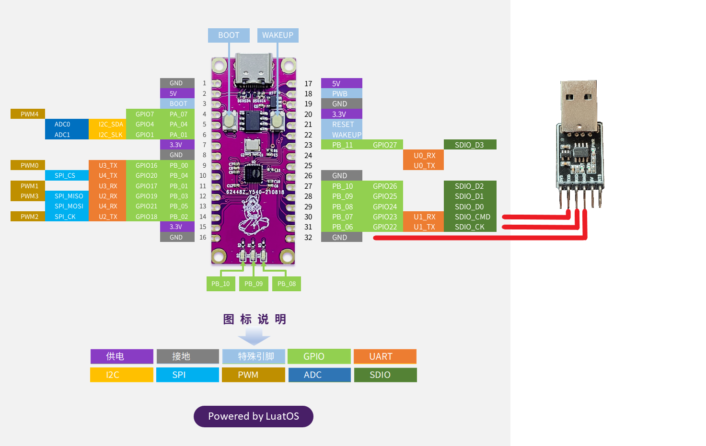

# UART

This chapter will introduce you to the UART features of LuatOS. The Air101 development board will be used to send data to UART1 and print the data received by UART1 in the log.

## Introduction

UART（Universal Asynchronous Receiver/Transmitter）Universal asynchronous transceiver, UART as a kind of asynchronous serial communication protocol, the working principle is to transmit each character of the data one by one. Is the most frequently used data bus in the application development process.

UART The characteristic of the serial port is to transmit data bit by bit in sequence. Two-way communication can be realized as long as two transmission lines. One line sends data while receiving data with another line. There are several important parameters for UART serial communication, namely baud rate, start bit, data bit, stop bit and parity bit. For two ports using UART serial communication, these parameters must match, otherwise the communication will not be completed normally.

## Hardware preparation

Air101 A development board, USB to TTL module

Hardware connection diagram



As shown in the figure, connect TTL TX, RX and GND to Air101 respectively U1_RX、U1_TX、GND。

Note that the TTL level is 3.3V, which cannot be directly connected to RS232/RS485, and an additional conversion chip must be used.

## Software usage

Interface documentation can be found in:[uart library](https://openluat.github.io/luatos-wiki-en/api/uart.html)

Code Introduction

```lua

local uartid = 1--Serial port id
--Initialization
local result = uart.setup(
    uartid,--Serial port id
    115200,--Baud rate
    8,--data bit
    1--Stop bit
)
--Cycle data
sys.timerLoopStart(uart.write,1000,uartid,"test")--Timer loops to send data to serial port 1
uart.on(uartid, "receive", function(id, len)
    log.info("uart", "receive", id, len, uart.read(uartid, len))
    -- If you print invisible characters, or "binary data", you can convert the data to HEX value display.
    -- log.info("uart", "receive", id, len, uart.read(uartid, len):toHex())
end)--Register Serial Port 1 Receive Event Callback
uart.on(uartid, "sent", function(id)
    log.info("uart", "sent", id)
end)--Register Serial Port 1 Send Event Callback
```
