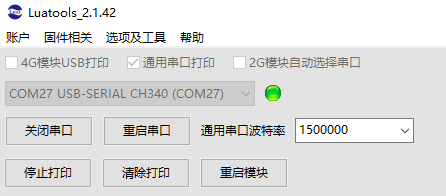
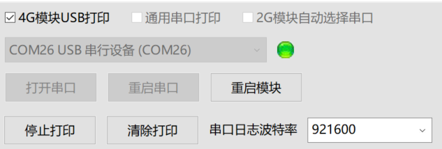
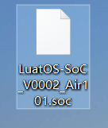
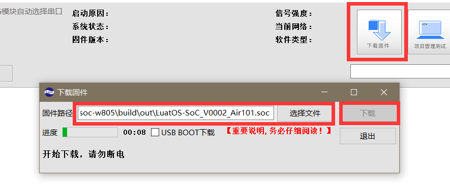
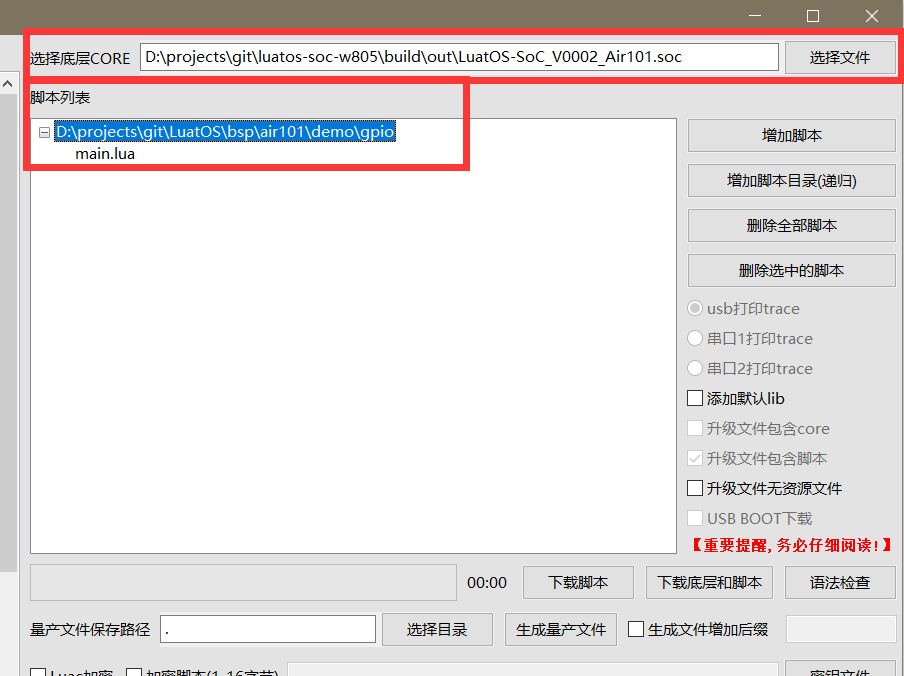
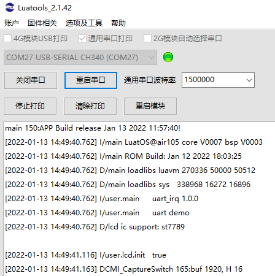

# Burn Tutorial

> See here for video tutorials: [[LuatOS] ① Burning Tutorial](https://www.bilibili.com/video/BV1Mq4y1e7Eb)

## Serial Burn

Preparations：

A USB cable for a typec port

A window system computer (recommend win10 or above）

### Tool Configuration

First download the latest version of the Luatools:[click me to download](https://luatos.com/luatools/download/last)

It is recommended to create a new Luatools folder, put the exe file into it, and then open the exe file.

::::{tab-set}

:::{tab-item} Air101/Air103
:sync: air101

Please check `Universal Serial Print`


Modify the universal serial port baud rate and set the baud rate to 921600, which is the log baud rate. The baud rate is automatically set by the tool..

Connect the device to the computer through the usb cable, you can see a new COM port, select this COM port in the tool and open it

:::

:::{tab-item} Air105
:sync: air105

Please check `Universal Serial Print`



Modify the universal serial port baud rate and set the baud rate to 1500000, which is the log baud rate. The baud rate is automatically set by the tool..

Connect the device to the computer through the usb cable, you can see a new COM port, select this COM port in the tool and open it

:::

:::{tab-item} ESP32C3 Simplified version
:sync: c3usb

Please check `Universal Serial Print`


No need to modify the serial port baud rate, keep the current value can be

Connect the device to the computer through the usb cable, you can see a new COM port, select this COM port in the tool and open it

:::

:::{tab-item} ESP32C3 Classic Edition
:sync: c3uart

Please check `Universal Serial Print`


Modify the universal serial port baud rate and set the baud rate to 921600, which is the log baud rate. The baud rate is automatically set by the tool..

Connect the device to the computer through the usb cable, you can see a new COM port, select this COM port in the tool and open it

:::

:::{tab-item} Air780
:sync: air780

Please check` 4G module USB print`, this series is compatible with EC618 schemes such as Air780E/Air780EG/Air600E/Air700E



No need to modify the serial port baud rate, keep the current value can be

Connect the device to the computer via a usb cable, there are several situations:
1. Three new COM ports appear, and the tool will automatically open the ports to prove that the current `AT firmware`
2. Three new COM ports appear, and the tool will automatically open the port to prove that it is current` CSDK or LuatOS firmware`
3. There is no response. Press and hold the PWR key of the board for more than 2 seconds, and the board will be turned on. There are 3 buttons on the development board. If there is no logo, try both on the outside.

Reminder: does not support Win7 brush machine!!

:::

:::{tab-item} ESP32S3
:sync: s3uart

Please check `Universal Serial Print`


Modify the universal serial port baud rate and set the baud rate to 921600, which is the log baud rate. The baud rate is automatically set by the tool..

Connect the device to the computer through the usb cable, you can see a new COM port, select this COM port in the tool and open it

:::

::::

### Burn Firmware

Need to get firmware before burning

::::::{tab-set}

:::::{tab-item} The tool automatically downloads the firmware

::::{tab-set}

:::{tab-item} Air101/Air103
:sync: air101

Find the folder where the Luatools is located. The official firmware downloaded automatically in the folder`s `Luatools/resource/101_lua_lod` or` Luatools/resource/103_lua_lod`

:::

:::{tab-item} Air105
:sync: air105

Find the folder where the Luatools is located, and the official firmware downloaded automatically is in the folder`s `Luatools/resource/105_lua_lod`

:::

:::{tab-item} ESP32C3 Simplified version
:sync: c3usb

Find the folder where the Luatools is located. The "Luatools/resource/esp32c3_lua_lod/Version Number" in the folder is the official version firmware downloaded automatically.

:::

:::{tab-item} ESP32C3 Classic Edition
:sync: c3uart

Find the folder where the Luatools is located. The folder`s `Luatools/resource/esp32c3_lua_lod/Version Number` * * without the words **`USB` is the official version firmware downloaded automatically.

```{important}
The driver of CH343 must be installed to download the firmware normally. The default CDC driver prints the log without any problem, but the download fails if the speed is too slow. [Drive portal](http://www.wch.cn/downloads/CH343SER_EXE.html)
```

:::

:::{tab-item} Air780
:sync: air780

Find the folder where the Luatools is located, and the official version firmware downloaded automatically is in the` Luatools/resource/618_lua_lod/version number` of the folder

```{important}
Common brushing process (startup anti-shake off state):
1. Operation during burning: first press and hold the BOOT key, then press the reset key, and finally release the BOOT key
2. You can enter the BOOT mode and wait for burning, and it will automatically exit the BOOT mode in about 30~45 seconds.

"The process of starting the anti-shake function "on state, which is usually the result of AT firmware running.:
1. Plug and unplug USB first, so that the device is turned off
2. Press and hold the BOOT button (the outer one), then press PWR (the outer one) for 2 seconds, and release the BOOT button
3. After entering BOOT mode, about 30~45 seconds will exit BOOT mode
4. After the machine is brushed, if it is not turned on automatically, it needs to be turned on manually.

How to turn off the "boot anti-shake function"? Choose one
1. Brush script` Luatools/resource/618_lua_lod/version number/demo/gpio/gpio/main.lua`
2. In the main interface, click Firmware Download and brush the flashing light` Luatools/resource/618_lua_lod/Version Number/Functional Test Firmware/Flash Test _xxx.soc`
3. At the beginning of your own main.lua, add `pm.power(pm.PWK_MODE, false)`
```

:::

:::{tab-item} ESP32S3
:sync: s3uart

Find the folder where the Luatools is located. The "Luatools/resource/esp32s3_lua_lod/Version Number" in the folder is the official version firmware downloaded automatically.

```{important}
The driver of CH343 must be installed to download the firmware normally. The default CDC driver prints the log without any problem, but the download fails if the speed is too slow. [Drive portal](http://www.wch.cn/downloads/CH343SER_EXE.html)
```

:::

::::

:::::

:::::{tab-item} Go to the official warehouse to download the firmware

You can also go to the official LuatOS warehouse to download the latest firmware.

The official version can be downloaded from the release page.：

[https://gitee.com/openLuat/LuatOS/releases](https://gitee.com/openLuat/LuatOS/releases)

:::::

:::::{tab-item} Use cloud compilation

You can also use the official **cloud compilation** function to customize the modules included in the firmware.

[Cloud Compilation Tutorial Point I View](https://openluat.github.io/luatos-wiki-en/develop/compile/Cloud_compilation.html)

After downloading the firmware, decompress it to obtain the corresponding firmware.

:::::

::::::

Firmware is a file called "soc`. Here, Air101 firmware is used as an example. It looks like this：



Then return to the Luatools, click the` Download Firmware` button, select the soc file just downloaded, and download it directly：



### Burn Script

Click the `Project Management Test` button and click `Create Project` in the bottom left corner to create a new project

Select the firmware used by the chip and select the script to download it.

demo Class script, can go to [LuatOS official repository](https://gitee.com/openLuat/LuatOS), can be found in the` demo` folder

Luatools The tool also automatically downloaded some example scripts of the official version, which can be seen in the` resource \certain model \certain version \demo` folder, and can be directly selected for burning test



If the firmware version currently burned by the chip is the same as the firmware selected here, you can click "Download Script" to download only the script. On the contrary, it is recommended to click "Download Bottom Layer and Script" to perform full brushing.

### View Log

If the serial port is not opened, click "Open Serial Port" to view the log

If there is no response, check whether universal serial port printing is checked, reselect serial port to open, or try clicking` restart serial port`


