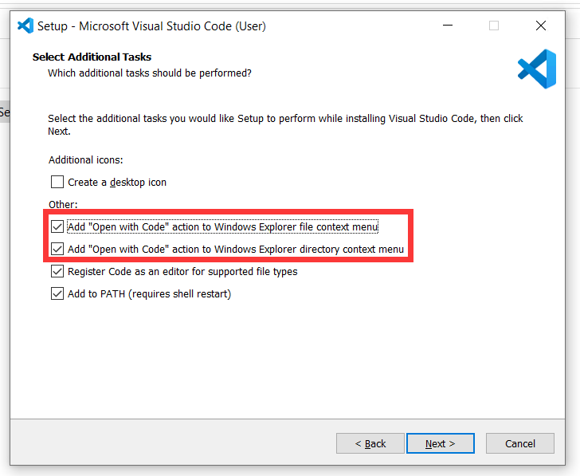
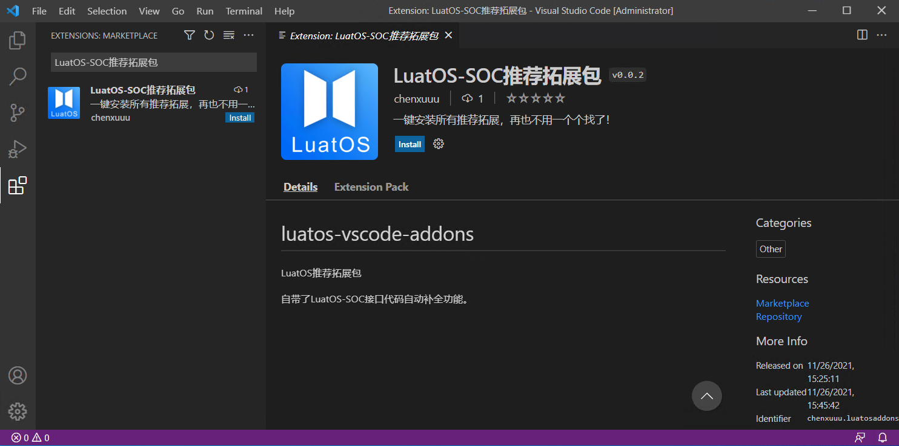
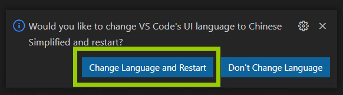
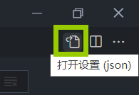
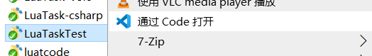
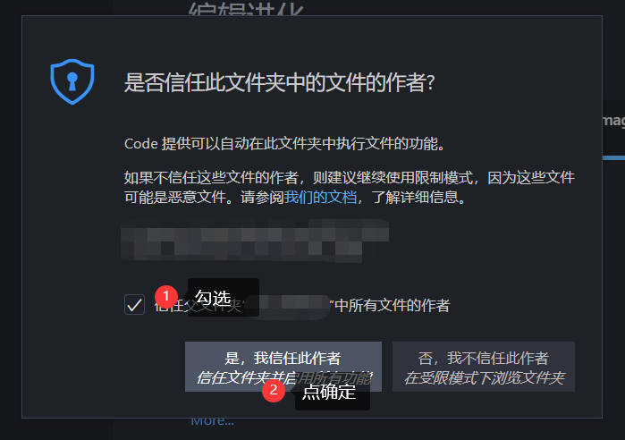

# Construction of development environment

> For video tutorials, see here: [[LuatOS] ② Development environment to build hello world project](https://www.bilibili.com/video/BV1ru411v7nC)

Since LuatOS is used for development, there must be a good editor environment？

Yes, there is. Here recommend use Microsoft's Visual Studio Code (vscode) code editor to write code

## Install vscode

Open vscode official website：[https://code.visualstudio.com/](https://code.visualstudio.com/)

Click on the big * * Download for xxxxxx * * to download the software

 > Of course, some classmates may find that the download speed is very slow. What should we do? Of course, there is a way. We can copy the file currently being downloaded * * download link * *, replace the domain name (`https://` and the middle of the next`/`) with` vscode.cdn.azure.cn` and download it again, which will be faster.

After opening the installation package, you need to pay attention to checking two of the options (the picture is in English, too）：

- Add the Open via Code action to the Windows Explorer file context menu
- Add the Open via Code action to the Windows Explorer catalog context menu



Just open it after loading. You may find that the software is all in English. It doesn't matter. The next step to install a plug-in is Chinese.

## Expansion of installation recommend

Click the expansion button on the left, search` LuatOS-SOC recommend expansion Package`, identify the author, and click `Install` to install



After loading, click "Change Language and Restart" in the lower right corner to become Chinese



## Change the default configuration

On the normal page, press the shortcut key `Ctrl ,(comma) `to open the settings page

Click on the `Open Settings (json)`icon in the upper right corner



Replace the contents of the file with the following data and save it (if you already have something, please add the missing item yourself）

```json
{
    "editor.fontFamily": "Consolas, 'Microsoft Yahei UI Light','Courier New', monospace",
    "editor.renderLineHighlight": "all",
    "editor.emptySelectionClipboard": false,
    "files.autoGuessEncoding": true,
    "files.insertFinalNewline": true,
    "files.trimTrailingWhitespace": true,
    "editor.bracketPairColorization.enabled": true,
    "editor.guides.bracketPairs":"active",
    "luahelper.base.showOnline": false
}
```

## New/Edit Existing Item

When writing code recommend, each project creates a new folder.

When opening the project, you recommend right-click and select` Open by Using Code` so that the plug-in can run perfectly.



Special reminder: if you encounter the following tips, please follow the picture description to operate, otherwise the installation of the expansion will not run


