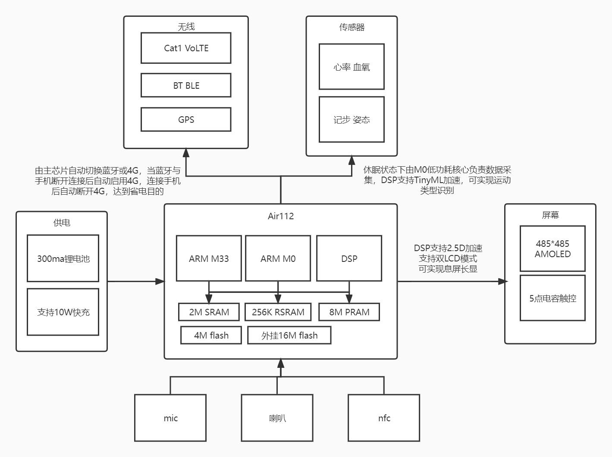

# Air Watch

## Overview

Air Watch It is a fully open source smart watch. The main control uses Air112 chip 4GModem GPS and is equipped with a 1.4-inch high-definition large screen. It supports multi-function NFC, heart rate tracking, sleep monitoring, motion pattern recognition and other functions. It can receive and make calls independently from the mobile phone.

## Master Control

Air112 It is a three-core heterogeneous chip, including a high-performance ARM M33 core with a maximum frequency of 240M, which can handle responsible applications. An ARM M0 low-power small core with a maximum of 48M and an energy efficiency ratio of 11.8uA/MHz @ 3.3V is responsible for data processing in the dormant state of the device and realizes longer endurance. A dedicated DSP supports 2.5D acceleration and TinyML acceleration, image acceleration capability can achieve 60fps rendering speed at 480*480 resolution, TinyML can realize motion gesture recognition, lower power consumption and more accurate recognition. The chip has a built-in 2Msram, shared by three cores; 256K low-power non-power-down ram, which can maintain data in standby mode; 8 Mpram, which provides large memory support for complex applications. Built-in 4Mflash, support xip mode. The onboard 16Mflash uses QSPI connection to store resource files and device data.

## Wireless

Air112 Built-in Bluetooth, support for Bluetooth 5.2, used to directly transmit data between mobile phones. The plug-in 4GModem chip supports VoLTE high-definition calls, can work independently, does not miss messages when the running fitness mobile phone is not around, and supports automatic switching between Bluetooth and 4G. When the mobile phone is connected, 4G can be automatically disconnected to save electricity. After disconnecting Bluetooth, 4G network can be connected within 10 seconds, thus not missing an important message. The plug-in dual-frequency GNSS chip supports GPS, Beidou, Galileo, Glonass multi-system positioning, and accurately records the outdoor movement path.

## Power

Use 300mah battery, standby for more than 15 days, equipped with 10W fast charging, 10 minutes can be fully charged, no longer face power anxiety.

## Software

All functions are developed by LuatOS, and the interface provides low-level rendering for lvgl. Users can quickly embed their own application logic through scripts. All communication protocols are open source and provide data interface, which can freely process the obtained data.