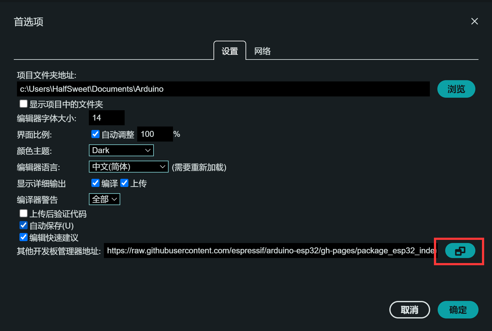
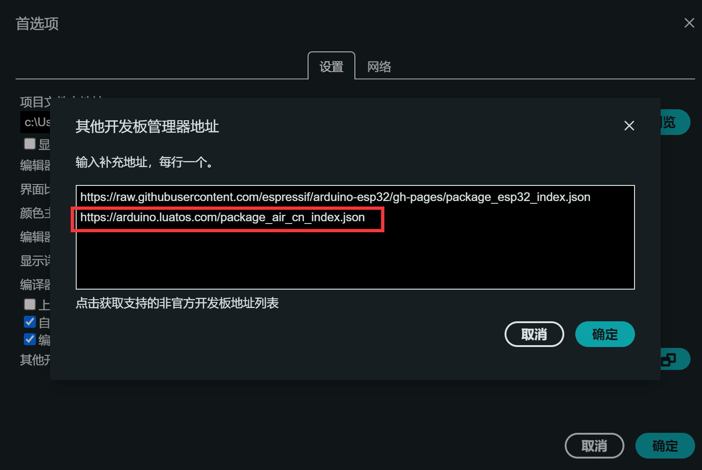

# Air001 Arduino-based user manual

```{note}
[Air001 The Arduino information station](https://arduino.luatos.com/) is open! Will update the full hands-on tutorial with various examples, welcome favorites.
```

## Developing with the Arduino IDE
### Preparations

Install [Arduino IDE](https://www.arduino.cc/en/software), it is recommended to install Arduino IDE 2.x

### Add Development Board Address
Click Arduino File-Preferences in the top left corner of the IDE

Enter the address of your AirMCU in `Other Board Manager Address`   `https://arduino.luatos.com/package_air_cn_index.json`
（Use by overseas users`https://github.com/Air-duino/Arduino-pack-json-ci/releases/download/Nightly/package_air_index.json`）



### Installing the Development Board
Search in `Development Board Manager``Air MCU`

Just install the latest version

```{note}
The installation process requires the installation of multiple tool chains, which may be slightly slower, please wait patiently
```

### Choose a development board

```{note}
If it is a purchased whiteboard and a DAPLink debugger, it can be directly connected to the mother through the pin row, and the direction is shown in the figure.

```

The development board selects the AirMCU-Air001 Board, and the port selects the connected serial port.

### Add code
Add some test code in the main function

```cpp
void setup() {
  // put your setup code here, to run once:
  pinMode(PB_0, OUTPUT);
  Serial.begin(115200);
  Serial.printf("Hello, Air001. \n");
}

void loop() {
  // put your main code here, to run repeatedly:
  static int count = 0;
  if (count % 2 == 0) {
    digitalWrite(PB_0, HIGH);
  } else {
    digitalWrite(PB_0, LOW);
  }
  Serial.printf("This is NO.%d print. \n", count);
  count++;
  delay(1000);
}
```

### Compile Download

Refer to <https://wiki.luatos.org/chips/air001/mcu.html#id4>'s tutorial for wiring.

Click the Upload button and wait for the test code to be compiled and uploaded


### View Serial Port Output
If the code compilation and upload are normal, then open the serial port monitor and you can see the output related logs.

It can be observed that the LED flashes at an interval of 1 second.

<script>
if (navigator.language.indexOf("CN") < 0 && confirm ("arduino Please go to the dedicated site for information, whether to jump？")) {
    window.location.href = "https://arduino.luatos.com/";
}
</script>
