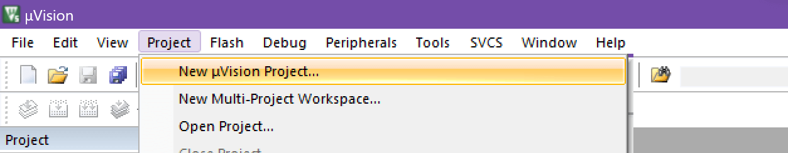
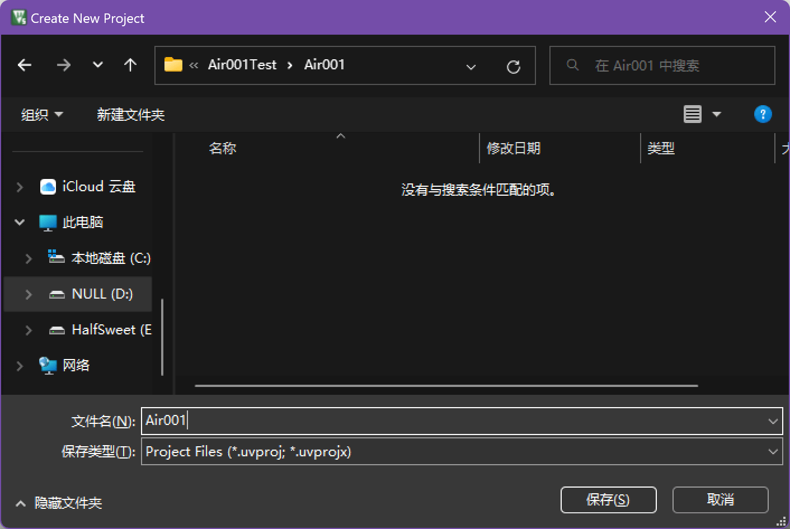
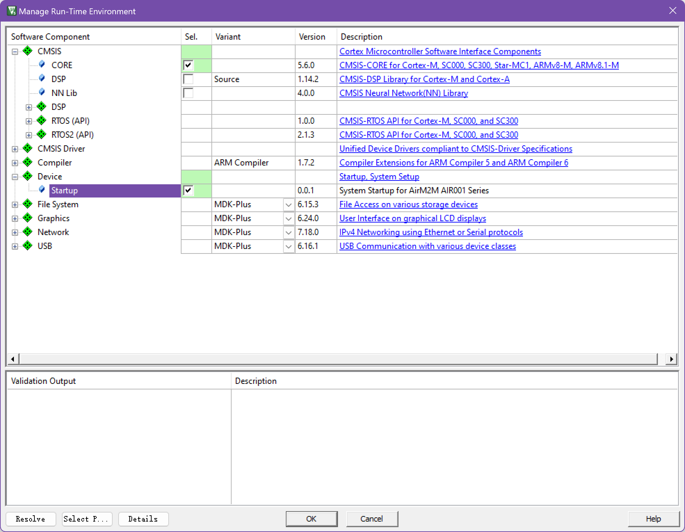
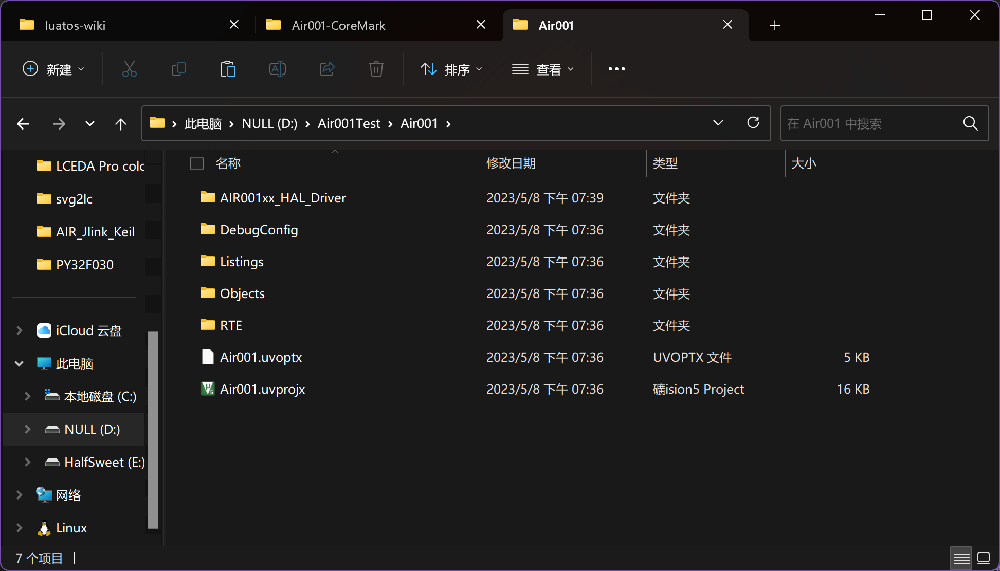
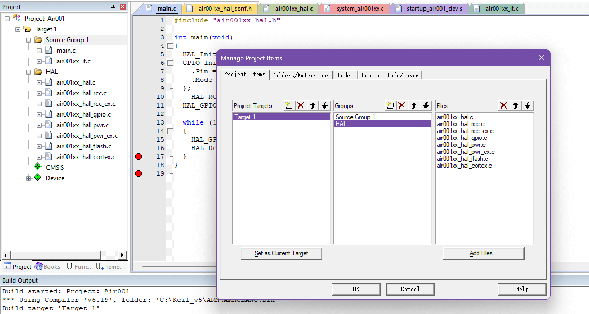
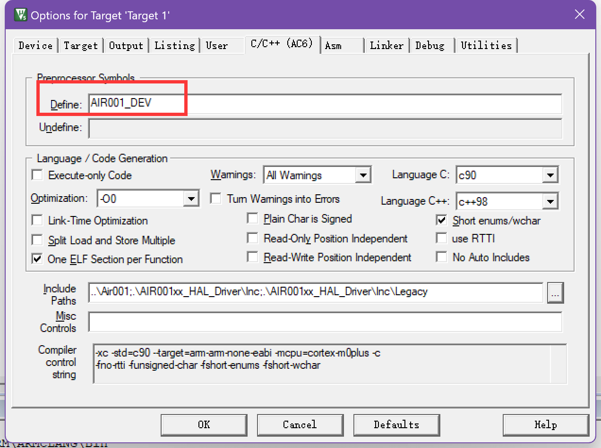
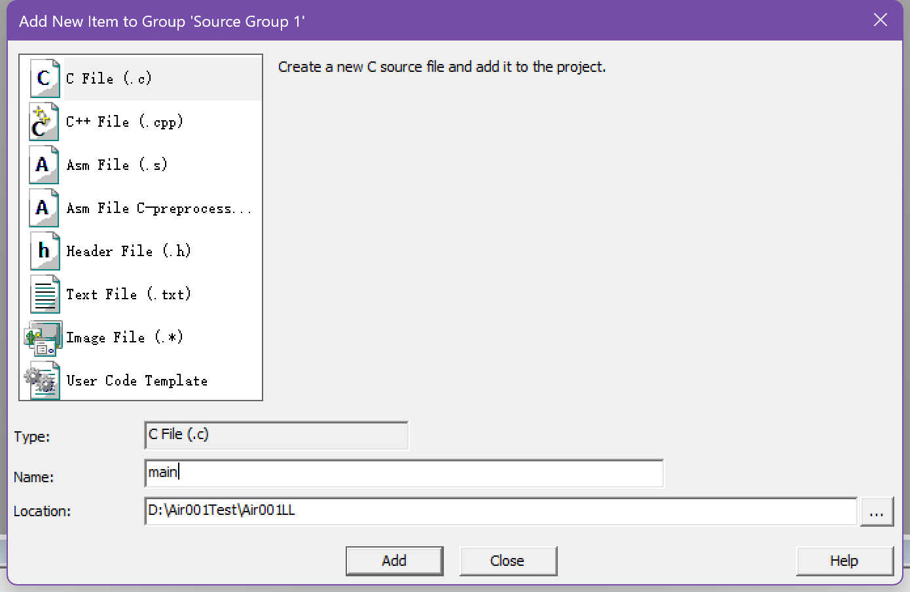
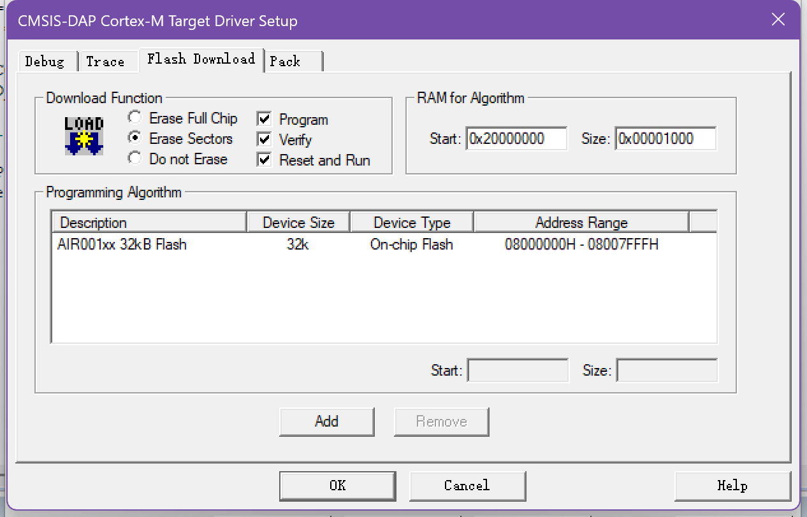
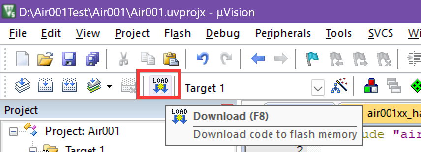

# Air001 Keil MDK-based user manual

```{note}
You can [get the HAL_LL Library Instruction Manual here](https://cdn.openluat-luatcommunity.openluat.com/attachment/20230721175456214_HAL_LL函数库说明手册%20v1.0.0.pdf)

SWD Max Clock needs to be manually set to 100KHz or lower when burning.
```

## 1. background

- Background: This document mainly solves the problems related to the construction of Keil MDK integrated development environment for Air001 chip, and demonstrates by creating a new project to light up LED.

- Technical positioning: junior/intermediate/advanced

- Target group: Users developing with Keil MDK

## 2. the HAL library environment to build (and the following LL library environment to build either）

### Preparations

1. Install MDK5, the specific method please Baidu, after installation need to activate to compile large files
2. Download and install the Air001 chip SDK：<https://gitee.com/openLuat/luatos-soc-air001>

### Install Support Package

Find the latest version of the pack file in the PACK folder and double-click to install it. After installation, you can see the Air001 device under the Generic of keil device list.


### New construction

#### 0x00 New construction
Click on the menu bar Project->New μVision Project



Create a folder and project name, and select the path according to your actual choice.



#### 0x01 Select device
Select AIR001 in the AIR001 Series under AirM2M in the device list AIR001Dev


#### 0x02 Adding CMSIS CORE and Startup Files
Check the CORE under CMSIS and the Startup under Device to automatically configure the startup file.



#### 0x03 Add HAL Library
Here, we use the HAL library as an example. We need to copy the AIR001xx_HAL_Driver folder under the Libraries directory in the SDK folder to the project directory. The added project directory is like this



#### 0x04 Adding HAL Library Peripheral Source Files
Add the source files of the peripherals used in Keil. A minimum project based on HAL library needs to add at least`air001xx_hal_rcc.c`、`air001xx_hal_rcc_ex.c`、`air001xx_hal_pwr.c`、`air001xx_hal_pwr_ex.c`、`air001xx_hal_cortex.c`、`air001xx_hal_flash.c`、`air001xx_hal.c`

Add `main.c` file


After completely added as shown in the figure



#### 0x05 Add the hal conf header file
To use the HAL library, you need to define a` air001xx_hal_conf.h `file for configuration. Here we create one


A typical example is

```c
#ifndef __AIR001xx_HAL_CONF_DEFAULT_H
#define __AIR001xx_HAL_CONF_DEFAULT_H

#ifdef __cplusplus
extern "C" {
#endif

#define HAL_MODULE_ENABLED
#define HAL_GPIO_MODULE_ENABLED
#define HAL_RCC_MODULE_ENABLED
#define HAL_FLASH_MODULE_ENABLED
#define HAL_PWR_MODULE_ENABLED
#define HAL_CORTEX_MODULE_ENABLED

#define HSE_VALUE            8000000U  
#define HSE_STARTUP_TIMEOUT  100U      
#define HSI_VALUE            24000000U 
#define HSI_STARTUP_TIMEOUT  5000U     
#define LSI_VALUE            32000U
#define LSE_VALUE            32768U    /*!< Value of the External Low Speed oscillator in Hz */
#define LSE_STARTUP_TIMEOUT  5000U     /*!< Time out for LSE start up, in ms */
#define  TICK_INT_PRIORITY            0x00U /*!< tick interrupt priority */


#include "air001xx_hal_rcc.h"
#include "air001xx_hal_gpio.h"
#include "air001xx_hal_flash.h"
#include "air001xx_hal_pwr.h"
#include "air001xx_hal_cortex.h"

#define assert_param(expr) ((void)0U)

#ifdef __cplusplus
}
#endif

#endif
```

#### 0x06 Add necessary break file
A minimum project requires at least some interrupt functions, we need to manually add
1. Create a new `air001xx_it.h `header file, a typical example is as follows

```c
#ifndef __AIR001XX_IT_H
#define __AIR001XX_IT_H

#ifdef __cplusplus
 extern "C" {
#endif 
void NMI_Handler(void);
void HardFault_Handler(void);
void SVC_Handler(void);
void PendSV_Handler(void);
void SysTick_Handler(void);

#ifdef __cplusplus
}
#endif
#endif
```
2. Create a new `air001xx_it.c `source file, a typical example is as follows：

```c
#include "air001xx_it.h"
void NMI_Handler(void)
{
}

void HardFault_Handler(void)
{
  while (1)
  {
  }
}

void SVC_Handler(void)
{
}

void PendSV_Handler(void)
{
}

void SysTick_Handler(void)
{
  HAL_IncTick();
}

```

#### 0x07 Add a header file reference
1. Click the magic wand button in the toolbar to open the Options for Target window


2. Enter the C/C page and click the three dots after `Include path`


3. Here we add two directories, one is the `air001xx_hal_conf.h `file directory, and the other is the header file directory required by the HAL library, as shown in the following figure


#### 0x08 Add Macro Definition
1. Click the magic wand button in the toolbar to open the Options for Target window


2. Enter the C/C page and add the AIR001_DEV macro, as shown in the following figure




#### 0x09 Modifying the `main.c` File
A typical example is as follows

```c
#include "air001xx_hal.h"

int main(void)
{
	HAL_Init();
	GPIO_InitTypeDef GPIO_LED = {
		.Pin = GPIO_PIN_0,
		.Mode = GPIO_MODE_OUTPUT_PP,
	};
	__HAL_RCC_GPIOB_CLK_ENABLE();
	HAL_GPIO_Init(GPIOB, &GPIO_LED);

	while (1)
	{
		HAL_GPIO_TogglePin(GPIOB, GPIO_PIN_0);
		HAL_Delay(500);
	}
}

```
Click the Compile button to test whether the compilation is successful.


The open source link for this sample project is<https://gitee.com/openLuat/luatos-soc-air001/tree/master/ModuleDemo/Templates/Example_HAL>

### FAQ
#### An error such as `Error: L6985E: Unable to automatically place AT section system_air001xx.o(.ARM._at_0x20000000) with required base address 0x20000000. Please manually place in the scatter file using the -- no_autoat option.`

In this case, generally speaking, there is no corresponding interrupt function/no macro required for HAL. You can manually check whether there are any errors.

## 2. LL library environment construction (choose one from the previous HAL library environment construction）
### Preparations

1. Install MDK5, the specific method please Baidu, after installation need to activate to compile large files
2. Download and install the Air001 chip SDK：<https://gitee.com/openLuat/luatos-soc-air001>

### Install Support Package

Find the latest version of the pack file in the PACK folder and double-click to install it. After installation, you can see the Air001 device under the Generic of keil device list.


### New construction

#### 0x00 New construction


Create a folder and project name, and select the path according to your actual choice.


#### 0x01 Select device
Select AIR001 in the AIR001 Series under AirM2M in the device list AIR001Dev


#### 0x02 Adding CMSIS CORE and Startup Files
Check the CORE under CMSIS and the Startup under Device to automatically configure the startup file.


#### 0x03 Add LL Library
Here we use LL library as an example, we need to copy the AIR001xx_HAL_Driver folder under the Libraries directory in the SDK folder to the project directory, and the added project directory is probably like this


#### 0x04 Add LL library peripheral source files
Add the source files of the peripherals used in Keil. A minimum LL library-based project needs to add at least`air001xx_ll_utils.c`


Add `main.c` file



This is similar after all additions are completed.

#### 0x05 Add Interrupt Function Related Files
LL The library relies on some interrupt functions that we need to rewrite.
1. Add `air001_assert.h `and `air001xx_it.h` and `main.h` files, each with roughly the following contents

`air001_assert.h`
```c
#ifndef __AIR001_ASSERT_H
#define __AIR001_ASSERT_H

#ifdef __cplusplus
extern "C"
{
#endif

#ifdef USE_FULL_ASSERT
#include "stdint.h"
#define assert_param(expr) ((expr) ? (void)0U : assert_failed((uint8_t *)__FILE__, __LINE__))
  void assert_failed(uint8_t *file, uint32_t line);
#else
#define assert_param(expr) ((void)0U)
#endif

#ifdef __cplusplus
}
#endif

#endif

```

`air001xx_it.h`
```c
#ifndef __AIR001F0XX_IT_H
#define __AIR001F0XX_IT_H

#ifdef __cplusplus
extern "C" {
#endif

void NMI_Handler(void);
void HardFault_Handler(void);
void SVC_Handler(void);
void PendSV_Handler(void);
void SysTick_Handler(void);

#ifdef __cplusplus
}
#endif

#endif
```

`main.h`
```c
#ifndef __MAIN_H
#define __MAIN_H

#ifdef __cplusplus
extern "C" {
#endif

#include "air001xx_ll_rcc.h"
#include "air001xx_ll_bus.h"
#include "air001xx_ll_system.h"
#include "air001xx_ll_cortex.h"
#include "air001xx_ll_utils.h"
#include "air001xx_ll_pwr.h"
#include "air001xx_ll_dma.h"
#include "air001xx_ll_gpio.h"

#if defined(USE_FULL_ASSERT)
#include "air001_assert.h"
#endif
void Error_Handler(void);

#ifdef __cplusplus
}
#endif

#endif
```

2. Add `air001xx_it.c `file

```c
#include "main.h"
#include "air001xx_it.h"

void NMI_Handler(void)
{
}


void HardFault_Handler(void)
{
  while (1)
  {
  }
}

void SVC_Handler(void)
{
}

void PendSV_Handler(void)
{
}

void SysTick_Handler(void)
{
}
```

#### 0x06 Add a reference to the header file
1. Click the magic wand button in the toolbar to open the Options for Target window


2. Enter the C/C page and click the three dots after `Include path`


3. Here we add two directories, one is the directory under `main.c` and the other is the header file directory required by LL library, as shown in the following figure


#### 0x07 Add chip macro definition
1. Click the magic wand button in the toolbar to open the Options for Target window


2. Enter the C/C page and add the AIR001_DEV macro, as shown in the following figure


#### 0x08 Modifying the `main.c` File
A typical example is as follows
```c
#include "main.h"

static void SystemClock_Config(void);

int main(void)
{
  /* ON SYSCFG AND PWR CLOCKS */
  LL_APB1_GRP2_EnableClock(LL_APB1_GRP2_PERIPH_SYSCFG);
  LL_APB1_GRP1_EnableClock(LL_APB1_GRP1_PERIPH_PWR);

  // Configure Clock
  SystemClock_Config();

  LL_IOP_GRP1_EnableClock(LL_IOP_GRP1_PERIPH_GPIOB); // enable GPIOB clock
  // Configure the PB0 pin as an output
  LL_GPIO_SetPinMode(GPIOB, LL_GPIO_PIN_0, LL_GPIO_MODE_OUTPUT);

  while (1)
  {
    LL_GPIO_TogglePin(GPIOB, LL_GPIO_PIN_0);
    LL_mDelay(1000);
  }
}

static void SystemClock_Config(void)
{
  // enable HSI
  LL_RCC_HSI_Enable();
  while (LL_RCC_HSI_IsReady() != 1)
  {
  }

  // Turn on the AHB clock
  LL_RCC_SetAHBPrescaler(LL_RCC_SYSCLK_DIV_1);

  // Use the HSI as the system clock
  LL_RCC_SetSysClkSource(LL_RCC_SYS_CLKSOURCE_HSISYS);
  while (LL_RCC_GetSysClkSource() != LL_RCC_SYS_CLKSOURCE_STATUS_HSISYS)
  {
  }

  // Set the APB1 clock
  LL_RCC_SetAPB1Prescaler(LL_RCC_APB1_DIV_1);
  LL_Init1msTick(8000000);

  // Set the system clock
  LL_SetSystemCoreClock(8000000);
}

void Error_Handler(void)
{
  while (1)
  {
  }
}

#ifdef USE_FULL_ASSERT

void assert_failed(uint8_t *file, uint32_t line)
{

  while (1)
  {
  }
}
#endif

```

Click the Compile button to test whether the compilation is successful.


The open source link for this sample project is<https://gitee.com/openLuat/luatos-soc-air001/tree/master/ModuleDemo/Templates/Example_LL>

```{note}
It should be noted that LL library is` Header-Only`, which means that if we need to introduce a new peripheral, we only need to add the corresponding header file in` main.h` instead of manually adding peripheral source files like HAL library
```

## 3. Download Burn
1. Use a debugger that supports SWD to connect SWCLK(PA14) and SWDIO(PA13) of Air001 chip respectively. It is recommended to use a combined DAP-Link debugger connection.

```{note}
If it is a purchased whiteboard and a DAPLink debugger, it can be directly connected to the mother through the pin row, and the direction is shown in the figure.

```

2. Click the magic wand button in the toolbar to open the Options for Target window

3. Enter the Debug page and select the emulator.CMSIS-DAP Debugger


4. Enter the setting interface, Port is set to SW,Max Clock defaults to 10MHz with high probability, and the rate needs to be manually reduced to 100KHz or lower.


5. Enter the` Flash Download` page, select the corresponding algorithm according to the model of the target chip, and tick the` Reset and Run`



6. Click the` Download` button to see the compiled code downloaded automatically and run it.


