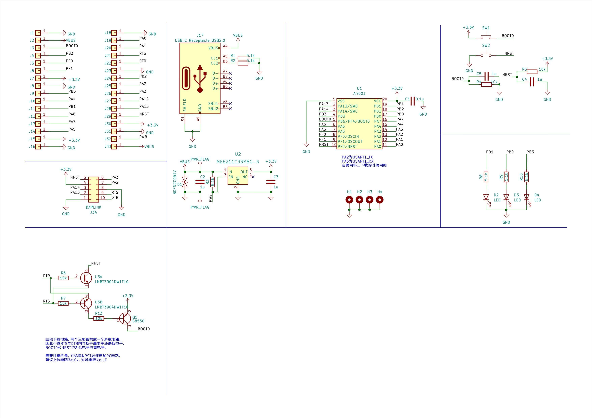

# Hardware Data

## INFORMATION DOCUMENTS

[AIR001 Chip Databook.pdf](https://cdn.openluat-luatcommunity.openluat.com/attachment/20230721175506039_AIR001芯片数据手册 1.0.4.pdf)

## Development Board Information

[PCB Layout](https://openluat.github.io/luatos-wiki-en/_static/bom/Air001.html)
