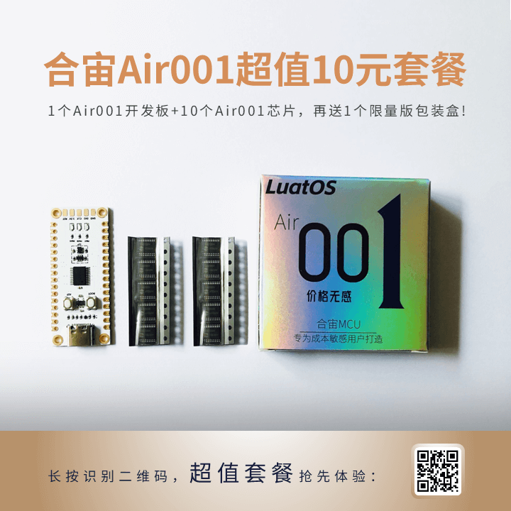
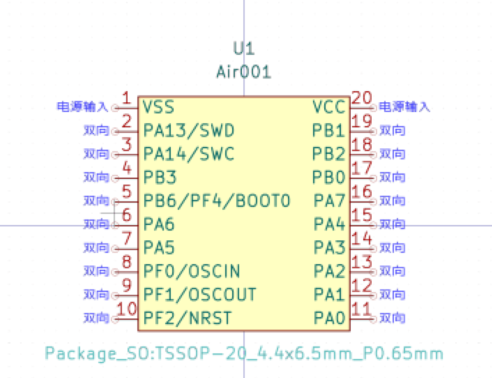

# Air001 Chip

## Air001 What is it??

合宙Air001是一款TSSOP20封装的MCU，采用高性能的32位ARM®Cortex®-M0+Kernel, built-in 32Kbytes of Flash and 4Kbytes of RAM. Chip Set
Multi-channel USART, IIC, SPI and other communication peripherals, 5 16bit timers, 1 12bit ADC and 2 comparators. For details, see the data sheet,[AIR001 chip data book.pdf](https://cdn.openluat-luatcommunity.openluat.com/attachment/20230721175506039_AIR001芯片数据手册1.0.4.pdf) and the register manual [Air001 register manual](https://cdn.openluat-luatcommunity.openluat.com/attachment/20230721175429182_AIR001用户手册%20v1.0.pdf)。

LuatOS Large QQ group: 1061642968

## Environment Construction Tutorial

[Air001 Keil MDK-based user manual](https://openluat.github.io/luatos-wiki-en/chips/air001/Air001-MDK.html)

[Air001 Arduino-based user manual](https://openluat.github.io/luatos-wiki-en/chips/air001/Air001-Arduino.html)

## Brush machine burning tutorial

### Use serial port to download

```{note}
In Arduino, we recommend use AirISP to download via serial port  
AirISP The tool can also be used alone, using the documentation:[AirISP Tool Documentation](https://arduino.luatos.com/airisp/)
```

The connection of serial port download is` RX` of serial port module to `TXD`(` PA2`) of Air001, and` TX` of serial port module to `RXD`(` PA3`) of Air001. If you want to be able to download automatically, you should connect `DTR` and` RTS` to the corresponding pins on the serial port module, and connect` GND` of chip or development board to `GND` GND` of serial port module.

If you do not download automatically, you need to manually enter before each download. bootloader：

- Press the BOOT button first (I. e. pull up the `BOOT0` pin）
- Press the RST button
- Release the BOOT button
- After the download is complete, you may need to manually press the RST button to reset normal operation

```{note}
If you use the Arduino can not be automatically downloaded (currently more common in AMD processor computers). You can manually enter the bootloader to download.
```

### Debug using SWD/Download

The wiring for debugging/downloading using SWD is the debugger` SWDIO` of the debugger` SWDIO`(`PA13`) of Air001, the debugger` SWCLK` of the debugger` SWCLK`(`PA14`) of Air001, and the `GND` of the chip or development board is connected to the `GND` of the debugger.

```{warning}
SWD Max Clock needs to be manually 100KHz or lower when burning, otherwise the chip cannot be identified.
```

## Chip Purchase

* [Hizhou Mall](https://appc6kjfor22343.h5.xiaoeknow.com)

* [Taobao shop](https://luat.taobao.com)

  

## Chip PinOut


