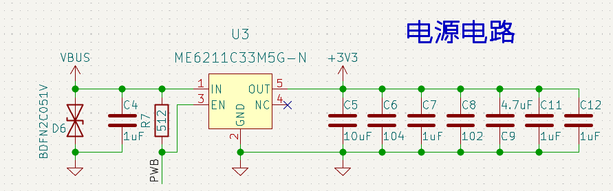
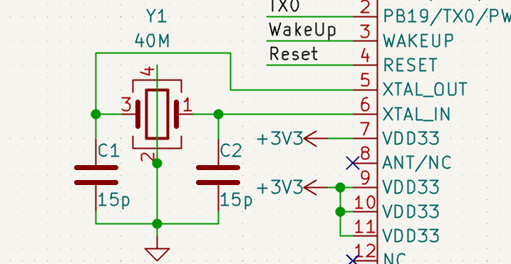
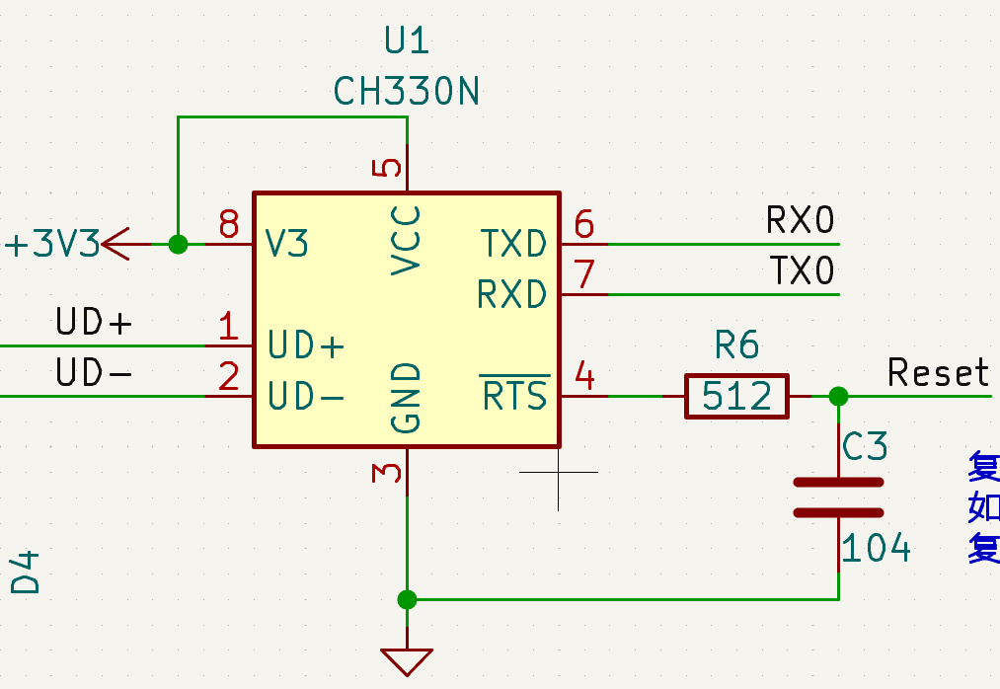
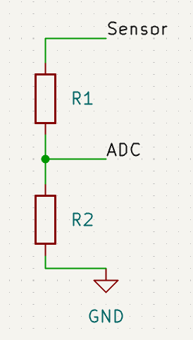

# Air101 Hardware Design Tutorial

## Resource preparation

First you need to master at least one EDA tool, such as AD,PADS,KICAD, etc. recommend use KICAD, open source and free, and the hardware design of the MCU series products is used.KICAD。

Air101 Relevant hardware data can be downloaded from wiki [Air101 hardware data](https://wiki.luatos.org/chips/air101/hardware.html)

## Minimum system

The hardware minimum system contains the minimum circuit for the chip to work. For Air101, the minimum system only needs power supply and crystal oscillator.

### Power

The power supply range of the chip is **3.0V-3.6V**. Do not exceed this range. **More than 3.6V may cause permanent damage to the chip**. Below 3.0V may degrade overall performance.

See the following requirements for different pin placement capacitors：

Chip 7 pin to place 1uf filter capacitor.

Chip 9 pin to place 1nf filter capacitor.

A 47uf filter capacitor is placed near the 10 feet of the chip.

A 47uf filter capacitor is placed near the 11 feet of the chip.

The customer is recommend to place a 330uf electrolytic capacitor at the power entrance of the module.

1uf filter capacitor is placed near the pins of chips 17,24 and 31.

**Chip** **25** **Foot** **CAP** **Must be externally connected** **4.7uf** **Filter Capacitor。**

In order to prevent ESD from causing damage to the chip, a TVS tube needs to be added at the entrance of the total power supply of the module to improve the anti-static ability. The chip power input pin should be placed with the corresponding filter capacitor to improve product performance. LDO is recommended for external power supply to the entire chip, and the total current is recommended to be 500mA and above. The line width of the total power supply shall not be less than 30mil. You can refer to the power supply of the Air101 development board for design.

There will be a large current when the chip is powered on, so it is necessary to choose a power chip with high dynamic response speed, or increase the capacitance of the power inlet to ensure no voltage drop.

### crystal oscillator

The crystal is placed as close to the chip as possible, the trace is as short as possible away from the interference source, and the clock is isolated by many holes. The layers below the clock prohibit other traces from passing through to prevent interference with the clock source. The crystal frequency is 40M. Customers choose crystals with different temperature levels, stability and load capacitance values according to actual product requirements. The load capacitance connected to both ends of the crystal needs to be adjusted according to the crystal of different manufacturers and the frequency offset.

### Troubleshooting

Under normal circumstances, the minimum system is designed according to the reference circuit, and the chip can work normally. However, I can't design it myself. How can I check the problem at this time?？

First check whether the hardware has problems such as virtual welding, ensure good contact, and measure whether there is a short circuit.

Then use an oscilloscope to measure whether the power supply voltage meets the requirements, whether the ripple is too large, and whether the voltage will drop significantly. You must use an oscilloscope to see it. The multimeter is an average value and cannot observe the voltage mutation.

Then use the oscilloscope to measure whether the crystal oscillator starts to vibrate. Under normal circumstances, it should be a 40MHz sine wave.

If there is no problem with the above, the minimum system can definitely work normally.

## Download and Debug

### Reset

The reset circuit is recommended to be designed as an RC circuit, power-on automatic reset, and Air101 low-level reset. If the external control RESET pin is used, the chip is in the reset state when the level value is lower than 2.0v. The low level needs to last more than 100us when resetting.

### Download Circuit

The chip defaults to UART0 as the download port. When the chip has no initial firmware download, it is directly connected to the UART0 interface, and firmware download can be realized through related download software. When there is firmware in the chip, the download mode is entered again, and the download mode can be entered by pulling down PA0 and then powering on. After the download is completed, remove the PA0 pull-down operation and need to restart before the firmware can run.

Pull PA0 low before power-on, the chip will enter download mode, and the UART0_TX will always send ccccc at 115200 baud rate waiting for download instructions. When the chip leaves the factory without burning the program, it will always be in download mode and send ccccc at 115200 baud rate, which can be used to judge whether the chip can work.

Burning Tutorial Link [Burning Tutorial-LuatOS Documentation](https://wiki.luatos.org/boardGuide/flash.html)

### Debugging

After the chip is powered on, pins 1 and 2 default to UART0 port, which provides download and instruction ports and log output ports. Customers should be careful not to use this port as GPIO at will to prevent it from being occupied and unable to download and debug. After the system is up, the port can be reused for other ports. If it is really necessary to reuse, keep the boot pin to ensure firmware burning.

The automatic download circuit can be designed with reference to the schematic diagram of Air101, and the automatic download can be realized with the luatools. During mass production, test points for RX0,TX0 and Reaet pins can be set aside for automatic download using fixtures.

## ADC

The 14-pin (PA1) and 15-pin (PA4) pins of the chip can be used as ordinary ADC, and the input voltage range is 0~2.4V. When it is higher than 2.4V, the ADC interface can only be entered after external voltage division processing. When using the voltage divider circuit, be sure to use high-precision resistors, and select the appropriate resistance value according to the voltage divider. The voltage dividing circuit is referred to as follows.

## GPIO And wake up.

If a pull-up resistor is configured for all GPIOs, the typical pull-up resistance value is 40K. If a pull-down resistor is configured for all GPIOs, the typical pull-down resistance value is 40K.  49K。

Wakeup The foot is an external wake-up foot. When the chip enters a sleep state, the Wakeup foot gives a high level, and the chip wakes up. Normal working state, the port is low.

## About Brush Machine

One thing to emphasize: there are 2 brush programs on the chip of air101/air103, but the combination of reset boot button can always be used to brush the machine. there is no "brush death" unless the hardware is damaged..

all the logs are in uart0, and the following descriptions refer uart0.

Brush machine is divided into several situations:

* White chip-the factory chip does not brush any program by default, commonly known as white chip. after power-on, it will continuously output CCC with` 115200 8N1` and remain in brush mode. at this time, the machine can be brushed without resetting.
* Brushed but incomplete-this is rare, only brush interruption will occur, after power-on, characters such as M/L/P will be output with` 115200 8N1`, and then CCC will be continuously output. at this time, the machine can be brushed without resetting.
* Brushed and the program is running normally-this is the norm during the development period and needs to be reset.
* Brushed but lua program runs incorrectly-it is also the normal state during the development period. the chip will restart within 15 seconds. if it encounters a brush synchronization signal during the restart, it will also enter the brush mode. But usually reset brush machine is the fastest to solve the problem
