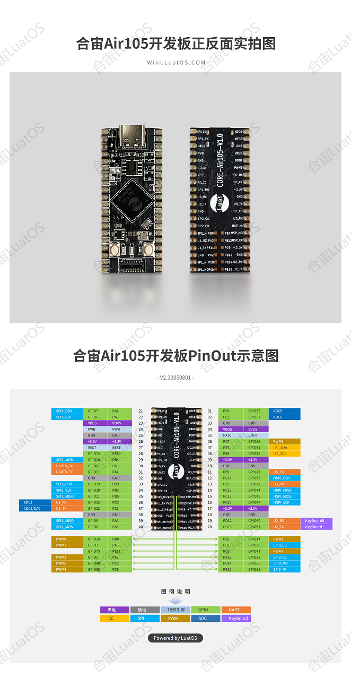

# Air105 Development Board

## Core-Air105

Development board instructions document

[Air105 Development board instructions](https://cdn.openluat-luatcommunity.openluat.com/attachment/Air105%20%E6%A0%B8%E5%BF%83%E6%9D%BF%E4%BD%BF%E7%94%A8%E6%89%8B%E5%86%8CV1.1.pdf)

Development Board Schematic: [CORE-Air105-V1.1.pdf](https://cdn.openluat-luatcommunity.openluat.com/attachment/20220110133139675_CORE-Air105-V1.1.pdf)

## Brush machine burning tutorial

[Serial Burn Tutorial](https://openluat.github.io/luatos-wiki-en/boardGuide/flash.html)

[Firmware Download](https://gitee.com/openLuat/LuatOS/releases)

**Note: Please set the baud rate to 1500000 * * before burning, and check "Universal Serial Port Printing", otherwise the log will be garbled after flashing..

## Development Board PinOut

3 LEDs are respectively PD14/PD15/PC3

Development board pin size:
1. Distance between pins, 10mil, 2.54mm
2. Distance between two rows of pins, 700mil, 17.78mm

**Note: SPI5 for HSPI programming, ADC part, LuatOS does not enable internal voltage division, channel 1~6 acquisition voltage range 0~1.8V**
