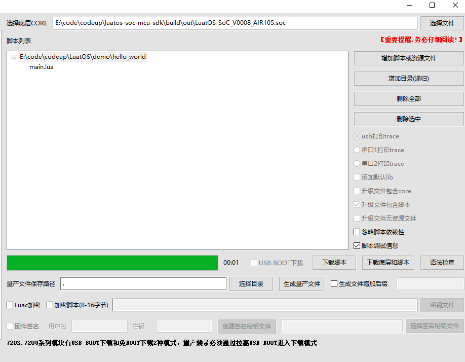
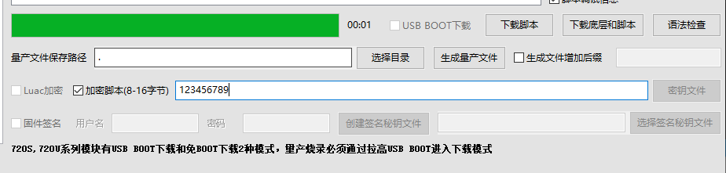
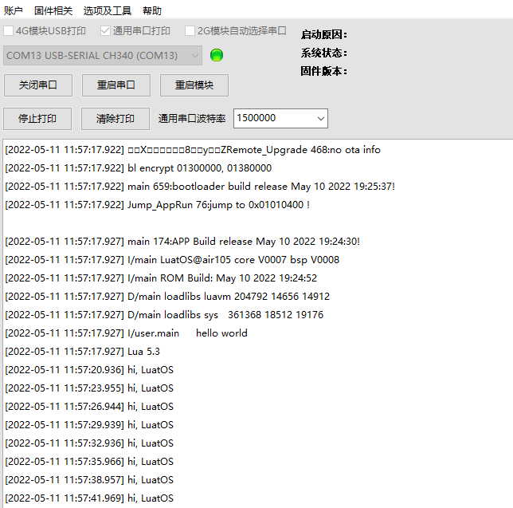
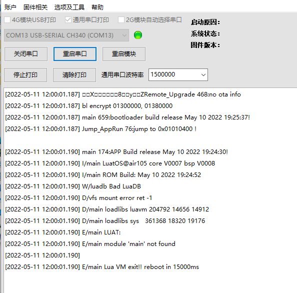

# Air105 Script Encryption

Can our program be encrypted?？

Of course, let's demonstrate script encryption using Luatools.

**Note: If you use Air105 firmware after 2.1.53 and Luatools and 20220511**

**Before previewing this article, please make sure that you will use Luatools to brush the machine. If not, please refer to [Burning Tutorial](https://openluat.github.io/luatos-wiki-en/boardGuide/flash.html)**

Open our program download interface, that is, Luatools-project management test：

Check the encryption script and enter the password

Then click to download the bottom layer and script and wait for the download to succeed.

We can see that the program is running normally, and our script is encrypted at this time.

How to verify it? Let's remove the check for script encryption and download the script again.

You can see that the script cannot run, and the script encryption takes effect.

**Note: If you use Air105 firmware after 2.1.53 and Luatools and 20220511**