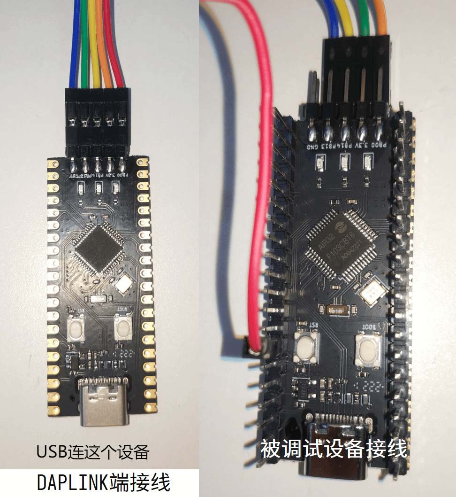

# Air32F103 Manual

## 1. background

- Background: This document mainly solves the problems related to the construction of KEIL development environment for Air32F103 series chips.

- Technical positioning: junior/intermediate/advanced

- Target group: Users who use KEIL for development

## 2. environment construction

### Preparations

1. Install MDK5, the specific method please Baidu, after installation need to activate to compile large files
2. Download the installation AIR32F103 SDK：[https://gitee.com/openLuat/luatos-soc-air32f103/](https://gitee.com/openLuat/luatos-soc-air32f103/)

### Install Support Package

Find the latest version of the pack file in the AIR_Jlink_Keil folder and double-click to install it. After installation, you can see AIR32 devices under the Generic of keil device list.


### New construction

Click on the menu bar Project->New μVision Project


Create a folder and project name, and select the path according to your actual choice.


Select under Generic in the device list AIR32F103CBT6


Add a startup file and check the Startup under CORE and Device under CMSIS to automatically configure the startup file.


Add peripheral library support, for example, add GPIO library. after checking GPIO components, you can see that the following will prompt the lack of other components. check according to the prompt, or check all of them.


According to the prompt, check the missing dependencies and then eliminate the prompt. Click OK to set up the project.


Add a library function definition


### Test code

Click to create a new file in the upper left corner, right-click to save it as main.c, and add a main function

```c
int main(void)
{
	while(1);
}
```

Click the Compile button to test whether the compilation is successful.

## 3. Download Burn

Air32F103 The factory default development board is DAPLINK firmware (BluePill development board has no firmware by default), so it can be directly used as a debugger to debug and burn another device. Here is how to use the DAPLINK, similar to other debuggers.

```{note}
recommend upgrade to the new version of [DAPLink V2 firmware](https://gitee.com/openLuat/luatos-soc-air32f103/tree/master/AIR_Jlink_Keil), the burning speed can be doubled ([check the upgrade method](https://gitee.com/openLuat/luatos-soc-air32f103/blob/master/AIR_Jlink_Keil/air32_daplink_readme.txt)）
```

```{note}
Since **win7** system does not have a` winusb` driver, and Microsoft has stopped supporting the system as early as 2020, if you need to use DAPLINK function, please upgrade to **win8 or above system**, or manually install the driver yourself:[Zadig driver installer](https://zadig.akeo.ie/)
```

AIR32F103 DAPLINK firmware of the development board, PB13 connection **SWDCLK of the debugged device**,PB14 connection **SWDIO of the debugged device**,PB0 connection reset：

|Pin | Function|
|:-:|:-:|
|PB13|SWD_CLK（External control）|
|PB14|SWD_DIO（External control）|
|PB0|RST Reset (External Control）|
|PA2|virtual serial port TX|
|PA3|virtual serial port RX|

The overall connection diagram is shown in the following figure：



Click the project configuration magic wand, find the Debug tab, select the CMSIS-DAP Debugger in the drop-down list, and click Settings


Check whether the device is connected normally. If the connection is normal, you can see the device in the SW Device list, and you can adjust the clock speed to improve efficiency.


Click on the Flash Download tab, you can see that our support package has added a download algorithm for us by default. We can check the Reset and Run tab, and every time we download the automatic reset running code, we don't need to manually press the reset button.


After the configuration is completed, you can directly click the burn button to download the burn code to the device.

```{note}
Since the default daplink firmware of the first batch of development boards (batches in the first half of 22 years) blocked the SWD debugging interface (this problem does not need to be paid attention to for subsequent shipments), please press and hold the BOOT button of the debugged board first, then press the reset button, finally release the BOOT button, and then click the download button in keil. After the first download is completed, the next download will not need to do this (or press and hold the reset button of the debugged board before downloading, release the button immediately after clicking keil's download button/or directly erase the chip with ISP tool）
```
