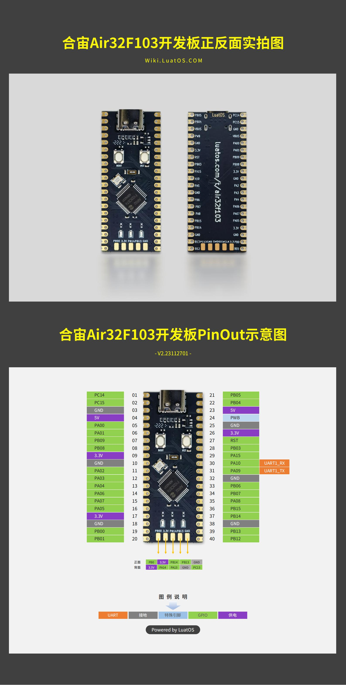
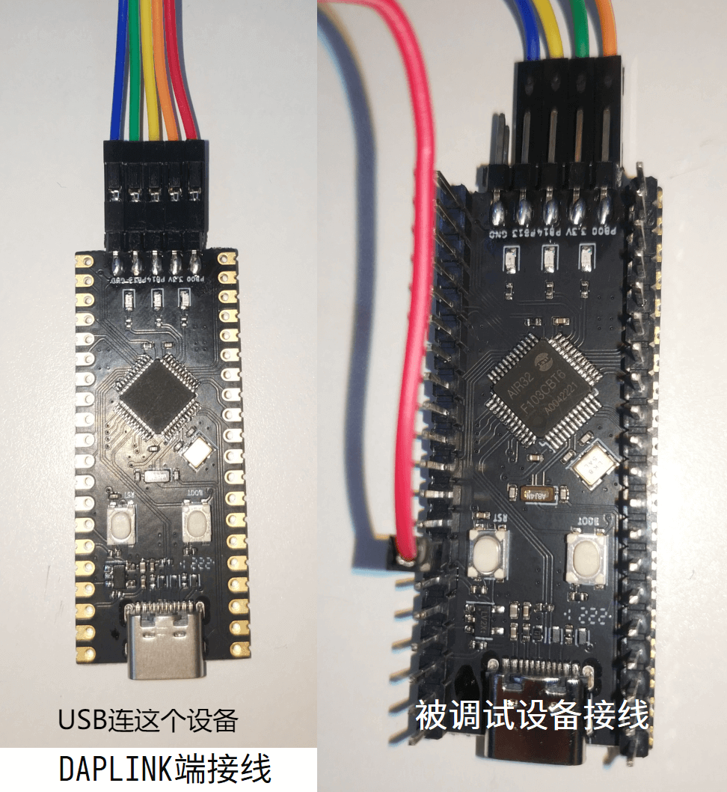

# Development Board

Chip Data Sheet [AIR32F103 Chip Data Sheet 1.0.0.pdf](https://cdn.openluat-luatcommunity.openluat.com/attachment/20220605164850945_AIR32F103芯片数据手册 1.0.0.pdf)

Development Board Schematic[AIR32CBT6.pdf](https://cdn.openluat-luatcommunity.openluat.com/attachment/20220605164915340_AIR32CBT6.pdf)

BluePill Development Board Schematic[BluePill.pdf]([Air32F103CXT6-BluePill (openluat.com)](https://cdn.openluat-luatcommunity.openluat.com/attachment/20230325182654448_bluepill.pdf))

Development Board Engineering [portal](https://gitee.com/openLuat/luatos-broads/tree/master/broads/Air32F103-Board)

## Development Board PinOut



## Instructions for use

The factory default of the development board is daplink firmware (BluePill the development board has no firmware by default). The firmware supports **external control** debugging and downloading function, and supports USB flash drive mode burning and virtual serial port

```{note}
recommend upgrade to the new version of [DAPLink V2 firmware](https://gitee.com/openLuat/luatos-soc-air32f103/tree/master/AIR_Jlink_Keil), the burning speed can be doubled ([check the upgrade method](https://gitee.com/openLuat/luatos-soc-air32f103/blob/master/AIR_Jlink_Keil/air32_daplink_readme.txt)）
```

Pin correspondence is as follows：

|Pin | Function|
|:-:|:-:|
|PB13|SWD_CLK（daplink Firmware **External Control**）|
|PB14|SWD_DIO（daplink Firmware **External Control**）|
|PB0|RST Reset (daplink Firmware **External Control**）|
|PA2|virtual serial port TX|
|PA3|virtual serial port RX|

PB13 Connect **SWDCLK of the debuggee**,PB14 Connect **SWDIO of the debuggee**,PB0 Connect **Reset of the debuggee**：

The overall connection diagram is shown in the following figure：



The green light in the middle indicates communication with the connected device. Plug in the computer will display a U disk called daplink, a COM port, and a portable device daplink. Select the debugger as CMSIS DAP in keil or other development software. Currently supported development environments are as follows：

- KEIL MDK
- IAR
- PyOCD
- Other software that supports CMSIS-DAP protocols
