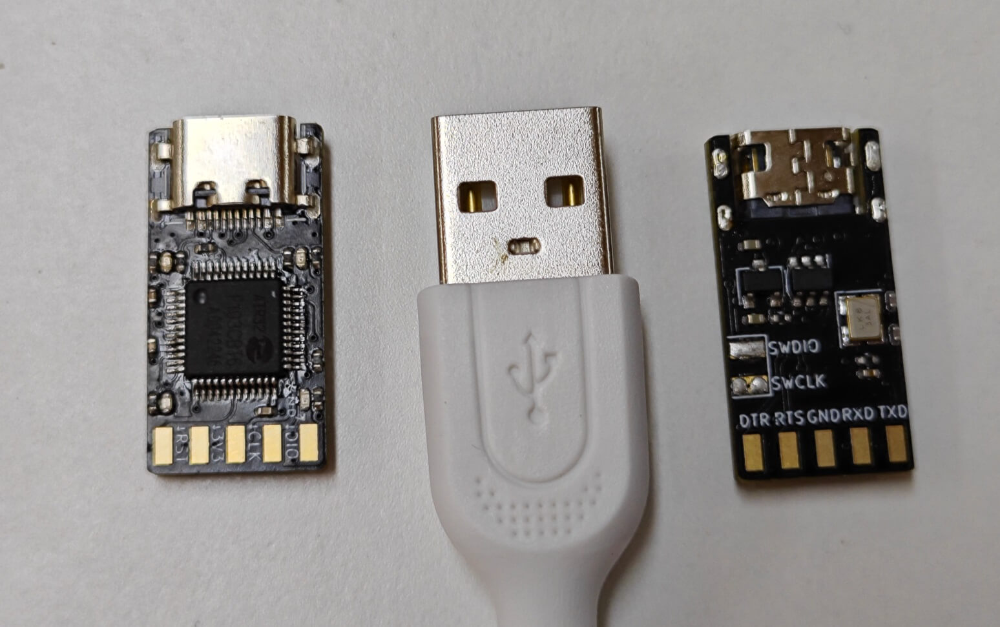
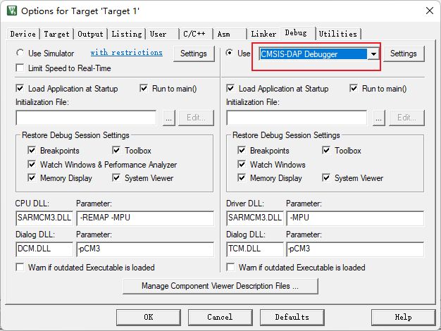
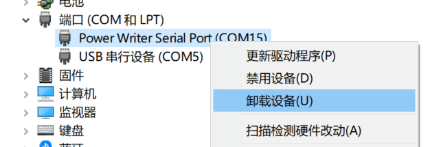

# DAPLink Manual

> [Go to Taobao to buy](https://item.taobao.com/item.htm?id=722898279573)

```{warning}
⚠Special instructions: please pay attention to users who deliver goods before June 17, 2023：

:::{dropdown} Expand View
Due to the wrong resistance attached to the first batch of boards, high-speed download cannot be used.
If it meets the requirement of` delivery before June 17, 2023 `, the government will reissue the revised DAPLink free of charge (the received boards do not need to be returned）
The plan will avoid issuing single coupons and notify you by unified text message. If you have any questions, please go to the purchasing platform to consult customer service.

The solution for using this batch of burners is as follows：

1. Change the low speed to use, the speed needs to be as low as possible
2. Throw it away. Use a new replacement
3. Self-replacement resistance is 100 Ω, which is equivalent to Bai Piao's debugger, as shown in the following figure：


:::
```

## **Overview**

DAPLink It is an official open source debugger scheme of ARM, with the official address of [ARMmbed/DAPLink (github.com)](https://github.com/ARMmbed/DAPLink). It can be used to debug almost all single chip computers of arm cortex kernel. The latest M33 and M85 kernels also support debugging.

Based on ARM's official code, Zeus was transplanted to Air32F103CBT6 and adapted the resources of * * 216M dominant frequency * * and * * 96K large RAM * *, supporting faster download speed ([firmware open source](https://gitee.com/openLuat/daplink)), and designed an ultra-small DAPLink hardware


## Main functions

- **The whole series of **Arm-cortex core chip debugging and burning, ARM official maintenance, follow-up new kernel will still support
- A **full-featured USB to serial port**(CDC) with hardware DTR and RTS for automatic download
- With * * U disk drag and drop burn * * function, you can directly drag hex or binfile to U disk to burn (only support burn CBT6）
- Adapt to **DAPLink V2** WINUSB version, the speed is 3 to 10 times higher than HID version, greatly saving download time
- Support **WEBUSB** function, can burn firmware on web pages, support insertion of pop-up windows, no need to worry about not using it
- Support Keil,IAR,PyOCD and other debugging environment


## Hardware

- The size is only 2.5*1.3cm, which is smaller than USBA mouth.
- Use **4-layer gold** PCB design
- Selection of * * sink TYPEC mouth * * more solid and stable
- USB The port uses **TI's ESD chip** protection
- **High-current LDO **can provide power supply for external equipment while stably supplying power to air32



Four LED functions are：

- dap Running indicator light, always on
- Serial port CDC indication, flashing when serial port has data
- DEBUG Illuminates when indicating, burning or debugging
- MSC U The disk burning function indicator flashes when there is data.

## Open Source Tutorial

It's so easy to use. I want to learn to make one myself, of course. All the information of the DAPLink of open source, all the software and hardware are open source.：

- [software open source](https://gitee.com/openLuat/daplink)
- [Hardware open source](https://gitee.com/openLuat/luatos-broads/tree/master/broads/DAPLink-V2)

In order to enable Xiao Bai to learn, the great god of porridge also kindly recorded a complete tutorial on PCB design for everyone. using the all-open source KICAD design software, from drawing symbols, drawing schematic diagrams, drawing PCB, routing, making production documents, to how to place an order for proofing for the whole process teaching, follow the tutorial and easily learn the design of 4-layer boards.

Tutorial Address: [Collection KiCad7.0 Tutorial-Production DAPLink](https://space.bilibili.com/393224264/channel/collectiondetail?sid=1241842)

## Using the Tutorial

DAPLink The pin functions are assigned as follows


```{note}
Since the design is only suitable for 3.3V level, if 5V equipment is connected for debugging, the risk of burning shall be borne by oneself.
```

### KEIL Configuration

Click the project configuration magic wand, find the Debug tab, select the CMSIS-DAP Debugger in the drop-down list, and click Settings



Check whether the device is connected normally. If the connection is normal, you can see the device in the SW Device list, and you can adjust the clock speed to improve efficiency.

```{note}
Since this DAPLink uses the actual setting speed, if the device list is empty, it may be because the debugged chip cannot support higher frequencies, and can be used after lowering the frequency.
```


### Update Firmware

If the BUG is fixed later, the DAPLink firmware will be updated. At this time, we need to perform the following operations.

```{note}
Some computer systems are still using Win7 and cannot use DAPLink V2 version firmware. At this time, it is necessary to downgrade to V1 firmware.
```

1. Get the firmware you need from [Air32 SDK Warehouse](https://gitee.com/openLuat/luatos-soc-air32f103/tree/master/AIR_Jlink_Keil), please select the firmware at the end of` iap.hex`
2. Short DAPLink board `RST` `GND`
3. Plug in the USB, a USB memory called `MAINTENANCE` will appear on the computer
4. Disconnect the short connection between `RST` and `GND`
5. Copy the firmware file at the end of `iap.hex` into this USB memory
6. After copying for a few seconds, the DAPLink will be upgraded, and after a few seconds, it will automatically reconnect and the upgrade will be completed.

## FAQ

### There is no driver on the plug-in computer

- If it is a WIN7 device, you recommend brush it into v1 firmware according to the above tutorial, or study how to install the driver yourself.
- If connected, the serial device name is `mdeb Serial Port`, and the WINUSB driver cannot be automatically recognized. If the drive is contaminated, the solution is as follows：
  - Device Manager-`Serial Ports (COM and LPT)`-`mdeb Serial Port(COMxx)`-`Right-click`-`Uninstall device`, check` Delete driver software for this device`, and click OK
  - Device Manager-`Universal Serial Bus Controller`-a device at the beginning of `mdeb`-`Right-click`-`Uninstall device`, check`Delete the driver software for this device`, click OK
  - Click the `Scan for Hardware Changes` button above Device Manager

### Device Manager has a device, but KEIL does not recognize it

Please upgrade to the version after 2021 KEIL

Or just like in the previous question, using a fake driver

### The device manager has devices, and KEIL is the latest version, but it still doesn't recognize it.

It may be a windows driver identification problem, which can be operated as follows：

1. Open `Device Manager``
1. Expand `Universal Serial Bus Controllers`
1. You may see one or more.`USB Composite Device`
1. Double-click one by one to open them, cut to the "Details" tab, and change the "Properties" to the "Device Instance Path"`
1. If the display contains `USB\VID_0D28 & PlD_0204\`content, the device is DAPLINK
1. On the device-`Right-click`-`Uninstall device`, click OK
1. Click the` Scan for Hardware Changes` button at the top of the device manager, and you can identify it in KEIL after re-identification.

### Device Manager has a device, but the openocd does not recognize it

Please upgrade to the latest version after 2023 openocd

### The burner is connected, but the debugged board is not displayed in the KEIL device list.

- The chip being debugged cannot support higher frequencies and can be used after lowering the frequency.
- SWD function is turned off on the board being debugged

### keil Download Times RDDI-DAP Error Solution

DAPLink and MDK, the solution can try the following methods：


1. SWD Debug Line Problem：
   - Many people will say that I have no problem with other DAPLINK, because DAPLINK V1 version is very slow and has no requirements for lines.
   - **The DuPont wires of SWD and SCK are separated and scattered (one by one),* * or SWD VCC SCK GND or VCC SWD GND SCK are connected side by side in this way, and the data lines are as short as possible.
2. connect the reset line of MCU
3. MDK Software Configuration Issues：
   - Set as shown below：
     
   - Adjust the speed of Max Clock, some MCUs only support 100K
4. MDK Version issues
   - Update MDK to 5.36 or later version
   - Open the pack installer in keil; Select the corresponding device and update the pack, including cmsis, to the latest.

### Virtual USB flash drive not recognized

```{warning}
⚠Special Warning: After installing the driver of "Innovation Workshop" (PWLINK), it will cause all devices based on ARM`s official DAPLINK firmware to function abnormally, including but not limited to: the virtual U disk disappears and cannot be burned.

:::{dropdown} Please refer here to uninstall the relevant driver
Connect the DAPLink to the computer, open the device manager, find the following device, `right-click`-`uninstall the device`



Check "Delete the driver software of this device" and click OK to uninstall it.


Do not install the driver again to prevent the device from being unusable
We are getting in touch with the manufacturer, so as not to affect other home DAPLink equipment
:::
```
