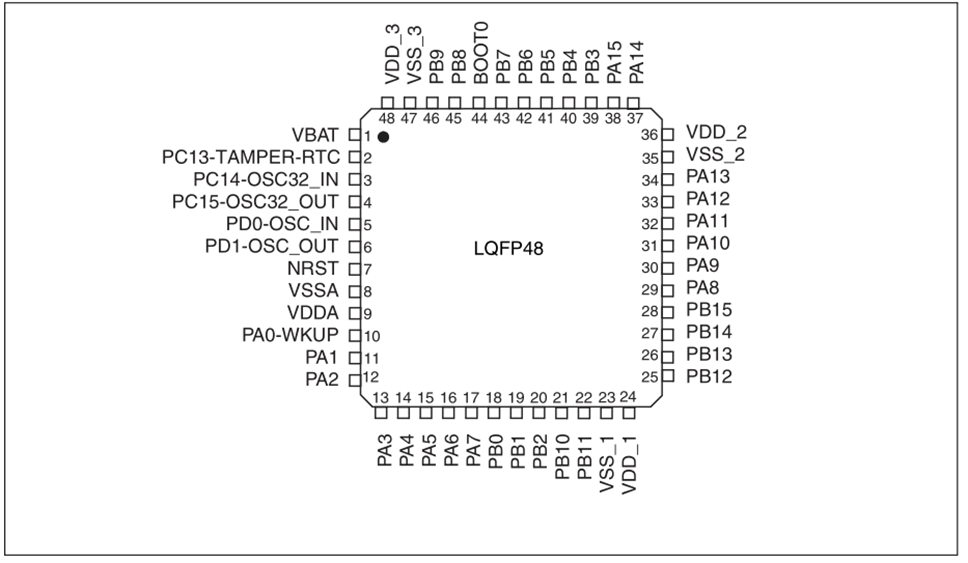

# AIR32F103 Chip

## AIR32F103 What is it??

Air32F103 For a series of chips, its peripherals and hardware design are compatible with some mainstream F103 models in the market, with a dominant frequency of up to 256M,96K RAM 256K Flash, and each IO can be set with independent internal pull-up resistors. For details see the data sheet,[Air32F103 Chip Manual](https://cdn.openluat-luatcommunity.openluat.com/attachment/20230326193134901_AIR32F103xxxx%E8%8A%AF%E7%89%87%E6%95%B0%E6%8D%AE%E6%89%8B%E5%86%8C.pdf)

Register Manual [a](https://cdn.openluat-luatcommunity.openluat.com/attachment/20230907152950811_Air32F103xx_User_Manual_CN-带目录书签.pdf)

Chip contrast

| Difference   | STM32F103C6T6      | STM32F103C8T6 | AIR32F103CBT6 | AIR32F103CCT6 |
| ------ | ------------------ | ------------- | ------------- | ------------- |
| Flash  | 32K                | 64K           | 128K          | 256K          |
| RAM    | 10K                | 20K           | 96K           | 96K           |
| main frequency   | 72M                | 72M           | 256M          | 256M          |
| Timers | 3 (No Timer 4) | 4 | 10 | 10          |
| ADC    | 2（10 channels) | 2(10 channels) | 3(16 channels) | 3(16 channels)）   |
| DAC    | None | None | 2(2 channels) | 2(2 channels)）    |

## Environment Construction Tutorial

[Air32F103 Manual](https://openluat.github.io/luatos-wiki-en/chips/air32f103/Air32f103.html)

[AIR32F103 SDK demo](https://gitee.com/openLuat/luatos-soc-air32f103)

## Replace other chip instructions

**If you cannot work after replacement or have problems with CubeMX HAL library development, you must read the following manual first.**

Instructions for replacing other F103 chips with Air32F103 [porting from SXX32F103 AIR32F103](https://openluat.github.io/luatos-wiki-en/chips/air32f103/switchFromSxx.html)

## Enhancements

The specific usage method can be seen [description of enhanced function](https://openluat.github.io/luatos-wiki-en/chips/air32f103/enhancement.html)

**Enhanced GPIO design：**

Support independent pull-down control (40K), when IO is a multiplexing function, it can replace external circuit resistance.

**For example：**

When using SDIO module, D0-D3 and CMD can use internal pull-up resistor；

When using IIC, when the IIC rate is less than or equal to 100K, an internal pull-up resistor can be used.

**USB Internal optional 1.5K pull-up resistor：**

USB Internal DP optional 1.5K pull-up resistor, can replace the external circuit pull-up resistor; And can realize software re-enumeration (no need to add triode control outside PCB）。

**Supports multiple CRC modes：**

You can select whether the input Byte size end is flipped, whether the high and low bits of the calculation result are flipped, and the calculation result is 0xFFFFFFFF XOR, CRC16/32, CRC16 polynomial.

**MCO Output PLL 2-16 Divided Output Support：**

More flexible clock output configuration, in addition to the original output source, the other supports the output PLL 2-16 frequency output.

**Support SM1/SM3/SM4/SM7 national secret algorithm；**

## Precautions

```{note}
Since **win7** system does not have a` winusb` driver, and Microsoft has stopped supporting the system as early as 2020, if you need to use DAPLINK function, please upgrade to **win8 or above system**, or manually install the driver yourself:[Zadig driver installer](https://zadig.akeo.ie/)
```

## Module Purchase

* [Hizhou Mall](https://appc6kjfor22343.h5.xiaoeknow.com)
* [Taobao shop](https://luat.taobao.com)

## Chip PinOut


