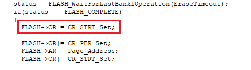

# Transplant from SXX32F103

## Foreword

This migration guide is designed to help you analyze the steps required to migrate from an existing SXX32F103 device to a AIR32F103 device. This document collects the most important information and lists the important things to be aware.

To migrate applications from SXX32F103 series to AIR32F103 series, users need to analyze hardware migration, peripheral migration, and firmware migration.

> AIR32F103 Series microcontrollers are basically compatible with SXX32F103 series, while enhancing many functions, some of which are different from SXX32F103, as detailed in this document.

## Fast replacement SXX32F103 chip

1. Compare peripheral specifications, Flash capacity, SRAM capacity, etc., unsoldered SXX32F103, and replace them with AIR32F103 corresponding models.
2. Using ISP or KEIL, download SXX32F103 HEX file or BIN file.
3. If necessary, download SXX32F103 other than HEX or BIN files or perform system calibration.
4. Check to see if the program works properly.
5. For quick troubleshooting of other problems, please refer to the chapter on differences in peripheral usage.
6. If the procedure does not work properly after the above steps, please refer to other sections of this document or contact support for assistance.

## AIR32F103 Hardware usage differences

## TIM2 Module reuse differences

AIR32F103 The Channel1-Channel4 output of the chip TIM2 can be reused pins and SXX32F103 are different, the detailed differences are as follows：

<style>
.x21
 {
 mso-style-parent:style0;
 mso-number-format:General;
 text-align:center;
 vertical-align:middle;
 white-space:nowrap;
 mso-pattern:auto;
 border-top:1px solid windowtext;
 border-right:1px solid windowtext;
 border-bottom:1px solid windowtext;
 border-left:1px solid windowtext;
 mso-diagonal-down:none;
 mso-diagonal-up:none;
 mso-protection:locked visible;
 }
.x22
 {
 mso-style-parent:style0;
 mso-number-format:General;
 text-align:center;
 vertical-align:middle;
 white-space:nowrap;
 mso-pattern:auto;
 border-top:1px solid windowtext;
 border-right:1px solid windowtext;
 border-bottom:1px solid windowtext;
 border-left:1px solid windowtext;
 mso-diagonal-down:none;
 mso-diagonal-up:none;
 mso-protection:locked visible;
 }
.x23
 {
 mso-style-parent:style0;
 mso-number-format:General;
 text-align:center;
 vertical-align:middle;
 white-space:nowrap;
 mso-pattern:auto;
 border-top:1px solid windowtext;
 border-right:1px solid windowtext;
 border-bottom:1px solid windowtext;
 border-left:1px solid windowtext;
 mso-diagonal-down:none;
 mso-diagonal-up:none;
 mso-protection:locked visible;
 }
.x24
 {
 mso-style-parent:style0;
 mso-number-format:General;
 text-align:center;
 vertical-align:middle;
 white-space:nowrap;
 mso-pattern:auto;
 border-top:1px solid windowtext;
 border-right:1px solid windowtext;
 border-bottom:1px solid windowtext;
 border-left:1px solid windowtext;
 mso-diagonal-down:none;
 mso-diagonal-up:none;
 mso-protection:locked visible;
 }
.x25
 {
 mso-style-parent:style0;
 mso-number-format:General;
 text-align:center;
 vertical-align:middle;
 white-space:nowrap;
 mso-pattern:auto;
 border-top:1px solid windowtext;
 border-right:none;
 border-bottom:1px solid windowtext;
 border-left:1px solid windowtext;
 mso-diagonal-down:none;
 mso-diagonal-up:none;
 mso-protection:locked visible;
 }
.x26
 {
 mso-style-parent:style0;
 mso-number-format:General;
 text-align:center;
 vertical-align:middle;
 white-space:nowrap;
 mso-pattern:auto;
 border-top:none;
 border-right:1px solid windowtext;
 border-bottom:1px solid windowtext;
 border-left:1px solid windowtext;
 mso-diagonal-down:none;
 mso-diagonal-up:none;
 mso-protection:locked visible;
 }
.x27
 {
 mso-style-parent:style0;
 mso-number-format:General;
 text-align:center;
 vertical-align:middle;
 white-space:nowrap;
 mso-pattern:auto;
 border-top:1px solid windowtext;
 border-right:none;
 border-bottom:none;
 border-left:1px solid windowtext;
 mso-diagonal-down:none;
 mso-diagonal-up:none;
 mso-protection:locked visible;
 }
.x28
 {
 mso-style-parent:style0;
 mso-number-format:General;
 text-align:center;
 vertical-align:middle;
 white-space:nowrap;
 mso-pattern:auto;
 border-top:1px solid windowtext;
 border-right:1px solid windowtext;
 border-bottom:none;
 border-left:none;
 mso-diagonal-down:none;
 mso-diagonal-up:none;
 mso-protection:locked visible;
 }
.x29
 {
 mso-style-parent:style0;
 mso-number-format:General;
 text-align:center;
 vertical-align:middle;
 white-space:nowrap;
 mso-pattern:auto;
 border-top:none;
 border-right:none;
 border-bottom:1px solid windowtext;
 border-left:1px solid windowtext;
 mso-diagonal-down:none;
 mso-diagonal-up:none;
 mso-protection:locked visible;
 }
.x30
 {
 mso-style-parent:style0;
 mso-number-format:General;
 text-align:center;
 vertical-align:middle;
 white-space:nowrap;
 mso-pattern:auto;
 border-top:none;
 border-right:1px solid windowtext;
 border-bottom:1px solid windowtext;
 border-left:none;
 mso-diagonal-down:none;
 mso-diagonal-up:none;
 mso-protection:locked visible;
 }
.x31
 {
 mso-style-parent:style0;
 mso-number-format:General;
 text-align:center;
 vertical-align:middle;
 white-space:nowrap;
 mso-pattern:auto;
 border-top:1px solid windowtext;
 border-right:none;
 border-bottom:none;
 border-left:none;
 mso-diagonal-down:none;
 mso-diagonal-up:none;
 mso-protection:locked visible;
 }
.x32
 {
 mso-style-parent:style0;
 mso-number-format:General;
 text-align:center;
 vertical-align:middle;
 white-space:nowrap;
 mso-pattern:auto;
 border-top:none;
 border-right:none;
 border-bottom:1px solid windowtext;
 border-left:none;
 mso-diagonal-down:none;
 mso-diagonal-up:none;
 mso-protection:locked visible;
 }
</style>
<table border='0' cellpadding='0' cellspacing='0' width='792' style='border-collapse: 
 collapse;table-layout:fixed;width:594pt'>
 <col width='111' style='mso-width-source:userset;width:83.25pt'>
 <col width='87' style='mso-width-source:userset;width:65.25pt'>
 <col width='85' style='mso-width-source:userset;width:63.75pt'>
 <col width='84' span='3' style='mso-width-source:userset;width:63pt'>
 <col width='85' span='2' style='mso-width-source:userset;width:63.75pt'>
 <col width='87' style='mso-width-source:userset;width:65.25pt'>
 <tr height='18' style='mso-height-source:userset;height:14pt' id='r0'>
<td rowspan='3' height='54' class='x25' width='111' style='border-right:1px solid windowtext;border-bottom:1px solid windowtext;height:40.5pt;width:83.25pt;'>multiplexing function</td>
<td colspan='2' class='x27' width='172'>TIM2_REMAP[1:0] = 00</td>
<td colspan='2' class='x27' width='168' style='border-right:1px solid windowtext;'>TIM2_REMAP[1:0] = 01</td>
<td colspan='2' class='x27' width='169' style='border-right:1px solid windowtext;'>TIM2_REMAP[1:0] = 10</td>
<td colspan='2' class='x27' width='172' style='border-right:1px solid windowtext;'>TIM2_REMAP[1:0] = 11</td>
 </tr>
 <tr height='18' style='mso-height-source:userset;height:14pt' id='r1'>
<td colspan='2' class='x29' style='border-bottom:1px solid windowtext;'>(No reimaging)</td>
<td colspan='2' class='x29' style='border-right:1px solid windowtext;border-bottom:1px solid windowtext;'>(partial reimage)</td>
<td colspan='2' class='x29' style='border-right:1px solid windowtext;border-bottom:1px solid windowtext;'>(partial reimage)</td>
<td colspan='2' class='x29' style='border-right:1px solid windowtext;border-bottom:1px solid windowtext;'>(Full reimage)</td>
 </tr>
 <tr height='18' style='mso-height-source:userset;height:14pt' id='r2'>
<td class='x26'>SXX32F103</td>
<td class='x26'>AIR32F103</td>
<td class='x26'>SXX32F103</td>
<td class='x26'>AIR32F103</td>
<td class='x26'>SXX32F103</td>
<td class='x26'>AIR32F103</td>
<td class='x26'>SXX32F103</td>
<td class='x26'>AIR32F103</td>
 </tr>
 <tr height='18' style='mso-height-source:userset;height:14pt' id='r3'>
<td height='16' class='x22' style='height:12.5pt;'>TIM2_CH1_ETR</td>
<td colspan='2' class='x21' style='border-right:1px solid windowtext;border-bottom:1px solid windowtext;'>PA0</td>
<td class='x22'>PA15</td>
<td class='x24'>Not supported</td>
<td class='x22'>PA0</td>
<td class='x24'>Not supported</td>
<td colspan='2' class='x21' style='border-right:1px solid windowtext;border-bottom:1px solid windowtext;'>PA15</td>
 </tr>
 <tr height='18' style='mso-height-source:userset;height:14pt' id='r4'>
<td height='16' class='x22' style='height:12.5pt;'>TIM2_CH2</td>
<td colspan='2' class='x21' style='border-right:1px solid windowtext;border-bottom:1px solid windowtext;'>PA1</td>
<td colspan='2' class='x21' style='border-right:1px solid windowtext;border-bottom:1px solid windowtext;'>PB3</td>
<td class='x22'>PA1</td>
<td class='x24'>Not supported</td>
<td class='x22'>PB3</td>
<td class='x24'>Not supported</td>
 </tr>
 <tr height='18' style='mso-height-source:userset;height:14pt' id='r5'>
<td height='16' class='x22' style='height:12.5pt;'>TIM2_CH3</td>
<td class='x22'>PA2</td>
<td class='x23'>Not supported</td>
<td class='x22'>PA2</td>
<td class='x24'>Not supported</td>
<td class='x22'>PB10</td>
<td class='x24'>Not supported</td>
<td class='x22'>PB10</td>
<td class='x24'>Not supported</td>
 </tr>
 <tr height='18' style='mso-height-source:userset;height:14pt' id='r6'>
<td height='16' class='x22' style='height:12.5pt;'>TIM2_CH4</td>
<td colspan='4' class='x21' style='border-right:1px solid windowtext;border-bottom:1px solid windowtext;'>PA3</td>
<td colspan='4' class='x21' style='border-right:1px solid windowtext;border-bottom:1px solid windowtext;'>PB11</td>
 </tr>
<![if supportMisalignedColumns]>
 <tr height='0' style='display:none'>
  <td width='111' style='width:83.25pt'></td>
  <td width='87' style='width:65.25pt'></td>
  <td width='85' style='width:63.75pt'></td>
  <td width='84' style='width:63pt'></td>
  <td width='84' style='width:63pt'></td>
  <td width='84' style='width:63pt'></td>
  <td width='85' style='width:63.75pt'></td>
  <td width='85' style='width:63.75pt'></td>
  <td width='87' style='width:65.25pt'></td>
 </tr>
 <![endif]>
</table>

## GPIO Description of pin withstand voltage

AIR32F103 The upper limit of the withstand voltage of the PA11 and PA12 pins is 3.6V. Pay attention to the voltage range when designing the hardware circuit.

- PA11 Pin-selectable multiplexing function CAN_RX、USART1_CTS、USBDM、TIM1_CH4
- PA12 Pin-selectable multiplexing function CAN_TX、USART1_RTS、USBDP、TIM1_ETR

## bootstrap mode select pin

BOOT0 When the pin is suspended, it is in a floating state, and there is a probability that the execution program will be started from the non-Flash area after the chip is reset and started. If you need to start from the user Flash, please avoid BOOT0 hanging situation

**recommend the BOOT0 pin is externally connected with a 10K pull-down resistor or directly grounded **, it can be stably started from the user Flash.

|BOOT1|BOOT0|bootstrap mode | alias use|
|:-:|:-:|:-:|:-:|
|X|0|User Flash | Select User Flash as the bootstrap space|
|0|1|System Memory | Select System Memory as the bootstrap space|
|1|1|Embedded SRAM | Choosing Embedded SRAM as a bootstrap space|

## AIR32F103 Software Use Differences

## System function

### Configure DEBUG state, enable SW, turn off JTAG difference

Configure DEBUG state, enable SW and turn off JTAG, as shown in the following figure

```c
GPIO_PinRemapConfig(GPIO_Remap_SWJJTAGDISABLE, ENABLE);
```

SXX32F103：JTAG Off, normal use SW DEBUG

AIR32F103：Program Reset. Air32 only supports two settings: **Turn off SWD and JTAG functions completely**and**Turn on SWD and JTAG functions at the same time**

Some problems will be caused, for example, when cubemx is configured as SW debugging, the device cannot be connected after downloading the firmware once. the solution is to add it to the "HAL_MspInit" function of the "sxx32f1xx_hal_msp.c" file.`__HAL_AFIO_REMAP_SWJ_ENABLE();`

```c
/* USER CODE END 0 */
/**
  * Initializes the Global MSP.
  */
void HAL_MspInit (void)
{
    /* USER CODE BEGIN MspInit 0 */

    /* USER CODE END MspInit 0 */

    __HAL_RCC_AFIO_CLK_ENABLE();
    __HAL_RCC_PWR_CLK_ENABLE();

    /* System interrupt init */

    /** NOJTAG:. JTAG-DP Disabled and SW-DP Enabled
    */
    __HAL_AFIO_REMAP_SWJ_NOJTAG();

    /* USER CODE BEGIN MspInit 1 */
    __HAL_AFIO_REMAP_SWJ_ENABLE();
    /* USER CODE END MspInit 0 */
}
/* USER CODE BEGIN 1 */
```

### Turning off JTAG or releasing JTRST in the emulated state will result in a reset

In the emulation state, turning off JTAG or releasing JTRST will cause the chip to reset immediately and cannot execute subsequent codes.

Solution：

- Do not execute JTAG shutdown or JTRST release code in the emulated state
- In the non-emulated state, the JTAG shutdown and JTRST release functions are normal and do not affect the program operation.

### Configuration option for bootstrap mode not reloaded on soft reset

Example of Exceptions (Read/Write Protection is enabled via ISP）：

- BOOT0 Connect high, BOOT1 connect low, external Reset, connect successfully using ISP
- Change BOOT0 to low and turn on read/write protection through ISP
- After the read/write protection is successfully turned on, it is found that the program in Flash is not executed.

Cause of the problem：

After the read/write protection is turned on by ISP, the chip will automatically initiate a system reset. Since the configuration pin in bootstrap mode will not be reloaded during soft reset, and the configuration state of the last BOOT pin will be maintained, the system memory is entered again to execute the program, resulting in the program not being executed in Flash.

Solution：

After the bootstrap mode is modified, the chip is reset by an external RESET or by re-powering on and off.

### Some SXX32F103-specific burner downloads are not supported.

AIR32F103 Different from SXX32F103 ARM M3 Core version, SW, JTAG IDCODE

|Chip|SXX32F103|AIR32F103|
|:-:|:-:|:-:|
|Core ID|0x411FC231|0x412FC230|
|SW IDCODE|0x1BA01477|0x2BA01477|
|JTAG IDCODE|0x3BA00477|0x4BA00477|

When using some SXX32F103-specific burners, information such as Core ID, SW IDCODE and JTAG IDCODE will be judged, so some SXX32F103-specific burners are not supported.

Solution：

Use a burner that does not judge Core ID, SW IDCODE and JTAG IDCODE

### Some third-party burners failed to download.

SW/JTAG interaction is not supported for some burners when RESET is pulled low. Because AIR32F103 when RESET is pulled low, SW and JTAG cannot be used (e.g. WizPro200ST8 programmer）

Solution：

1. Configure the burner to pull RESET high during burning.
2. The NRST pin of the floating chip is not connected to the burner.

### When accessing APB bus with non-32bit alignment, the phenomenon is different

When accessing the APB bus, it must be aligned with 32 bits, otherwise it cannot be accessed, such：

ADC When configured in left alignment mode, the converted high 8bit data is obtained from the 0x4001244E address, and the obtained value is fixed. 0

Solution：

When accessing the registers of the APB bus, 32bit alignment is required. If a field in the 32bit register is required, the 32bit alignment is read out before processing.

### Interrupt Controller Differences

SXX32F103：

1. Supports up to 60 maskable interrupt channels
2. 16 Programmable priority levels (4-bit interrupt priority is used.)

AIR32F103：

1. Supports up to 71 maskable interrupt channels
2. 8 Programmable priority levels (3-bit interrupt priority is used.)

problems that can cause：

cubemx Or the setting of "configPRIO_BITS" for other freertos projects is 4, which needs to be changed to 3, otherwise it will cause exceptions. Note that if cubemx is used, it will cause it to be reset after each code generation, so this sentence in "FreeRTOSConfig. h" can be directly commented out.

```c
/* USER CODE BEGIN 1 */
// #define configASSERT( x ) if ((x) == 0) {taskDISABLE_INTERRUPTS(); for( ;; );}
/* USER CODE END 1 */
```

You can check ARM's manual, with 3-bit interrupt priority and 4-bit compatibility. There will be no problem. The configASSERT configuration in cubemx actually affects the operation efficiency. It is recommended to close it in freertos manual. Therefore, there will be no bugs in the modification according to this plan, and there is no need to worry.


### The method of distinguishing between the Air32 chip and the SXX32F103 chip.

Read base address 0 x1FFFF7E8, obtain 32bit mark to distinguish.

|Model | Model ID|
|:-:|:-:|
|AIR32F103CBT6|0x1A5A5BBX|
|AIR32F103CCT6|0x1A5A5CCX|
|AIR32F103RPT6|0x1A6A5CDX|
|AIR32F103VET6|0x1A8A6DDX|
|AIR32F103VGT6|0x1A8A6EDX|
|AIR32F103ZET6|0x1A9A6DDX|

### Software delay difference

Some software delays implemented using other platforms need to be adjusted, such as the simple software delay function shown in the figure below.

```c
void delay()
{
    uint8_t i = 100;
    while(i--);
}
```

- SXX32F103 The delay time for executing this function is 10us
- AIR32F103 The delay time for executing this function is 7.2us

If the software delay time requirements are strict in the application, please adjust the delay parameters implemented by the software.

### RTC Clock, algorithm difference when pre-divider load value exceeds 0xffff

Air32 internal RTC =(PRLH 1)*(PRLL 1), unlike SXX32

For example, 16M crystal oscillator, configure RTC clock HSE 128 frequency division, time unit is 1 second：

- SXX32F103 Use`RTC_SetPrescaler(124999);`
- AIR32F103 use `RTC_SetPrescaler(227857);` (or`RTC_SetPrescaler(128035);`）

16000000 / 128 = 125000；A total of 20bit, if the upper four bits are 3, the lower 16 bits are 125000/(31)-1=31249, combined 227857

### TRACESWO Instructions for use as a Printf function

Using TRACESWO pin (PB3) as Log output, no Log normal output found

Cause of the problem：

AIR32F103 PB3 The JTDO function has a higher priority than the TRACESWO function.

Solution：

To use the TRACESWO pin (PB3) as the Log output, JTAG multiplexing needs to be configured. as follows：

```c
RCC_APB2PeriphClockCmd(RCC_APB2Periph_AFIO,ENABLE);
GPIO_PinRemapConfig(GPIO_Remap_SWJ_JTAGDisable,ENABLE);
```

### Description of the size of the write-protected area automatically turned on after the read protection is turned on

After the read protection is turned on, the size of the write protection area is automatically turned on as follows：

|     Model | Write-protected area size |
| :-----------: | :------------: |
| AIR32F103CBT6 |       8K       |
| AIR32F103CCT6 |       4K       |
| AIR32F103RPT6 |       4K       |
| AIR32F103VET6 |       4K       |
| AIR32F103VGT6 |       4K       |
| AIR32F103ZET6 |       4K       |
| AIR32F103ZGT6 |       4K       |


## ADC

### After configuring the ADC for continuous sampling and enabling the ADC, only turning off the ADC enable cannot stop the conversion

The steps to reproduce the problem are as follows：

- Configure the ADC to continuous sampling mode (continuous trigger mode) and enable DMA transfer. After the software triggers, ADC completes every conversion, DMA transfers once, and DMA completes interruption once.
- Configuring ADC enable off in DMA completion interrupt
- AIR32F103 After the ADC enable is turned off, the ADC will continue to convert and continue to DMA to complete the interrupt.

Solution：

Configure the ADC for a single conversion and wait ADC_CLK for the last sample period before turning off the ADC enable

For example, the ADC clock configured in the example is 9M and the sampling period is 239.5, so the waiting time is (239.5 12.5)* 1/9000 ≈ 27.922us, so the following code is sufficient to wait 30us

```c
void DMA1_Channel1_IRQHandler(void)
{
    if(DMA_GetITStatus(DMA1_IT_TC1) != RESET)
    {
        DMA_ClearITPendingBit(DMA1_IT_TC1);
        DMA_ClearFlag(DMA1_IT_TC1);

        //Processing current data

        ADC1->CR2 &= ~BIT(1); // configure adc for single conversion
        Delay_Us(30);   //Wait 30us
        ADC_Cmd(ADC1, DISABLE); //Turn off ADC enable
    }
}
```

### ADC Software trigger considerations for enabling ADON twice in a row and then performing external events

```c
ADC_Cmd(ADC1, ENABLE);
ADC_Cmd(ADC1, ENABLE);
ADC_SoftwareStartConvCmd(ADC1, ENABLE);
```

The above operation AIR32F103 cause the phenomenon that EOC cannot be cleared to 0 after it is set, and ADC conversion value is abnormal.

Solution：

After enabling the ADC, enable the ADC again, wait for the EOC to be set, and read the quantized value, as follows

```c
ADC_Cmd(ADC1, ENABLE);
ADC_Cmd(ADC1, ENABLE);
while(ADC_GETFlagStatus(ADC1,ADC_Flag_EOC) == RESET);
ADC_GetConversionValue(ADC1);
ADC_SoftwareStartConvCmd(ADC1, ENABLE);
```

Attention：

When the ADC is enabled and the ADC is enabled again, both the SXX32F103 and the AIR32F103 will trigger an ADC conversion.

### ADC Software trigger considerations for enabling external events twice in a row

```c
ADC_SoftwareStartConvCmd(ADC1, ENABLE);
ADC_SoftwareStartConvCmd(ADC1, ENABLE);
```

The above operation AIR32F103 cause the phenomenon that EOC cannot be cleared to 0 after it is set, and ADC conversion value is abnormal.

Solution：

Software triggering of external events, waiting for EOC to be set, reading quantized values

```c
ADC_SoftwareStartConvCmd(ADC1, ENABLE);
while(ADC_GETFlagStatus(ADC1, ADC_FLAG_EOC) == RESET);
ADCGetConversionValue(ADC1);
ADC_SoftwareStartConvCmd(ADC1, ENABLE);
while(ADC_GETFlagStatus(ADC1, ADC_FLAG_EOC) == RESET);
ADCGetConversionValue(ADC1);
```

### Dual ADC Different Mode Differences

Synchronous injection, alternating trigger mode：

- SXX32F103：After the injection group channel/rule group channel is triggered, the conversion is normal.
- AIR32F103：After the injection group channel is triggered, normal conversion; after the rule group channel is triggered, no conversion is performed.

Synchronous rules, fast crossover, slow crossover mode：

- SXX32F103：After the injection group channel/rule group channel is triggered, the conversion is normal.
- AIR32F103：After the rule group channel is triggered, normal conversion; after the injection group channel is triggered, no conversion is performed.

### ADC and DMA configuration usage considerations

Problem Description：

When configuring the ADC to continuously sample multiple channels and use DMA to transfer data, the ADC quantization value is wrong (misaligned).  
For example, convert 5 channels, configure as a rule group, continuous scan conversion  
Expected value is  {0V,1V,1.5V,2V,2.5V, 0V,1V,1.5V,2V,2.5V, 0V,1V,1.5V,2V,2.5V …}
The value obtained by the actual software is  {1.5V,2V,2,5V,0V,1V, 1.5V,2V,2,5V,0V,1V, 1.5V,2V,2,5V,0V,1V …}

Solution：

Configure DMA first and then enable ADC, ADC quantization value error (misalignment) problem will not occur

### ADC Automatic injection of conversion differences using ADC

SXX32F103：ADC Automatic injection transformation directly using

AIR32F103：ADC The automatic injection transformation gets to a value 0

Workaround: AIR32F103 to use automatic injection conversion ADC_ScanConvMode need to be configured to be on

```c
ADC_InitStructure.ADC_ScanConvMode = ENABLE;
```

## TIM

### The Channel3 of the general-purpose timer TIM2-TIM5 does not support the comparison output function

AIR32F103 The Channel3 of the general-purpose timer TIM2-TIM5 does not support the comparison output function, and only supports the capture input function

Solution：

Select another channel of the TIM2-TIM5, or select a channel of another TIM for output use

### BIF cannot be cleared when the time interval between two consecutive braking is less than one TIM clock cycle

When the time interval between two consecutive braking is less than one TIM clock cycle, the BIF (brake interrupt flag) cannot be cleared after it is set to 1.

Solution (Choose one of two）：

1. The software configures the brake signal to be a common input IO interrupt without using BIF and brake interrupt
2. Built-in 1 in BIF, soft reset TIM

### TIM does not reconfigure CNT to count after software modifies CNT value

In some cases TIM did not reconfigure the CNT count after the software modified the CNT value

Case 1：

1．TIM Configure single pulse mode and turn on update interrupt

```c
TIM_SelectOnePulseMode(TIMx, TIM_OPMode_Single); //Configured for Single Pulse Mode
TIM_ITConfig(TIMx, TIM_IT_Update, ENABLE);
TIM_Cmd (TIMx, ENABLE);
```

2．Configure CNT in update interrupt, enable CEN

```c
if (TIM_GetITStatus(TIMx, TIM_IT_Update) != RESET)
{
    TIM_ClearITPendingBit(TIMx, TIM_IT_Update);
    TIM_SetCounter(TIMx, NewCnt); //Software Configuration CNT Value
    TIM_Cmd(TIMx, ENABLE);  //Try energy TIM
}
```

Attention：
In single pulse mode, the SXX32F103 and AIR32F103 TIM counters automatically stop when the next update event UEV is generated

Case 2：

- TIM Single pulse mode is not equipped
- In the interrupt, the software closes the TIM, modifies the CNT value, and enables the software again. TIM

```c
void TIM3_IRQHandler(void)
{
    if(TIM_GetITStatus(TIMx,TIM_IT_Update) != RESET)
    {
        TIM_Cmd(TIMx, DISABLE);
        TIM_ClearITPendingBit(TIMx, TIM_IT_Update);
        TIM_SetCounter(TIMx, 1999);
        TIM_Cmd(TIMx, ENABLE);
    }
}
```

Cause of the problem：

Software modification CNT takes effect only when CEN is enabled

Solution：

- If you need to manually modify the CNT value after the update event is generated when the configuration is in single pulse mode, you should enable the TIM first and then modify it.
- If the single pulse mode is not set, do not turn the TIM off when manually modifying the CNT value

## CAN

### Configuration Filter Considerations in Sleep Mode

Problem Description：

CAN The module initializes the filter first, and then initializes the controller, resulting in the phenomenon that data can be sent but cannot be received

Cause of the problem：

AIR32F103 When configuring the CAN filter, you need to ensure that the CAN is in non-sleep mode

Solution：

Initialize the CAN controller first, then configure the filter to solve

### CAN When the timestamp is sent, the timestamp fills the position difference of the message.

CAN Configure time-triggered communication mode when the last 2 data bytes are sent with a timestamp  
Due to different designs, CAN is AIR32F103 used to send timestamps, CAN_TDTxR the TIME[15:0] field in the register is filled with different message positions and SXX32F103.

SXX32F103：TIME[7:0] As the 7th byte, TIME[15:8] is the 8th byte, which replaces the data written to CAN_TDHxR[31:16] (DATA6[7:0] and DATA7[7:0])

AIR32F103：TIME[7:0] As the 8th byte, TIME[15:8] is the 7th byte, and they replace the data written to CAN_TDHxR[31:16] (DATA6[7:0] and DATA7[7:0])

Solution：

When other CAN nodes use the received timestamp, the software rolls over

### TXFP FIFO priority difference at 1

Due to different designs, the AIR32F103 configuration TXFP is 1. When there are multiple messages waiting to be sent, the priority and SXX32F103 of message sending are different

SXX32F103：TXFP When 1, when multiple messages are waiting to be sent, the order of message sending is determined by the order of requests

AIR32F103：TXFP When it is 1, when multiple messages are waiting to be sent, the order of message sending is determined by the order of the priority of the mailbox number.  
Mailbox number priority: Mailbox number 0> Mailbox number 1> Mailbox number 2

## FLASH

### FLASH Write protect the first block after erasing other Page for the first time, phenomenon difference

SXX32F103：After writing to protect the first block, erase other Page, which can be erased normally.

AIR32F103：After the first block is write-protected, the other Page is erased for the first time, the erase fails, and the WRPRTERR write protection error is reported.

Solution：

Before configuring Page erase, configure Strt once, as shown in the following figure



### probability when calling FLASH_EraseOptionBytes() interface to erase option bytes Fault

When the FLASH_EraseOptionBytes() interface is used in the program to erase the option byte area, there is a probability of HardFault_Handler abnormal interruption.

Solution：

AIR32F103 The FLASH_EraseOptionBytes() interface will be modified to replace the following instructions with the `SetStrt()`interface：

```c
//These comments out
// FLASH->CR |= CR_OPTER_Set;
// FLASH->CR |= CR_STRT_Set;
// FLASH_WaitForLastOperation(EraseTimeout);
SetStrt();//Replace with this interface
```

## USART

### No clock output in smart card mode

SXX32F103：USART Smart card mode clock output, no need to configure USART TE (transmit enable)/RE (receive enable))

AIR32F103：USART Smart card mode clock output, need to configure USART TE (send enable)/RE (receive enable), otherwise no clock output

Cause of the problem：

AIR32F103 The clock output conditions and SXX32F103 of the USART smart card mode are different, and are also controlled by the send enable TE.

Solution：

When USART is initialized, USART TE (transmit enable)/RE (receive enable) is enabled  
After configuring the clock frequency division and enabling the smart card mode, set the sending enable TE to 1, which can solve the problem.

### Use DMA to send data, and judge whether all data is sent through USART TC flag bit

When DMA is used to send more than 2Byte data, it is confirmed whether the data is sent by judging the USART TC flag bit.  
TE should be turned off before DMA is configured. After DMA is configured, TE is turned on for data transmission.

## SPI/IIS

### IIS I2SE phenomenon difference off in main receive mode and in PCM standard mode

SXX32F103：The host output clock can be stopped by configuring the I2SE

AIR32F103：It is not possible to stop the host output clock by configuring I2SE

Solution：

1. Stop the host output clock by configuring I2SMOD
2. Stop host output clock by means of soft reset module

### As a Master, considerations for sending and receiving data in full duplex mode

When using SPI as the master for communication, the received data is abnormal, such：

SPI Configure Master two-wire full-duplex mode, and send and receive data according to the following figure

```c
//Send Data0 , Datal; Receive without operation DR
SPI_I2S_SendData(SPIx,Data0);
while (SPI_12s_GetFlagstatus (SPIx，SPI_12S_FLAG_TXE)==RESET);
while (SPr_I2s_cetFlagStatus(SPIx,SPI_12S_FLAG_BSY) == RESET);
SPI_I2S_SendData(SPIx,Datal);
while (SPI_I2s_GetFlagStatus(SPIx,SPI_12S_FLAG_TXE) == RESET);
while (SPr_I2s_cetFlagStatus(SPIx,SPI_12S_FLAG_BSY) == RESET);
//Read 1 DR, clear previously received data
while (SPI_12s_GetFlagStatus (SPIx,SPI_I2S_FLAG_RXNE)== RESET);
SPI_I2S_ReceiveData(SPIx);
//Send data Data2; and read DR to obtain the received data receive
SPI_I2S_SendData(SPIx,Data2);
while (SPI_12s_GetFlagStatus (SPIx,SPI_I2S_FLAG_TXE) ==RESET);
while (SPI_12s_GetFlagStatus (SPIx,SPI_I2s_FLAG_BSY) == RESET);
while (SPI_I2s_GetFlagStatus(SPIx，SPI_I2S_FLAG_RXNE) == RESET);
receive = SPI_I2s_ReceiveData (SPIx);
```

AIR32F103 The data received by the transmission Data2 is receive abnormal data.

Cause of the problem：

AIR32F103 SPI It has a 16Byte receive FIFO. The data received by the above-mentioned sending Data0 and Data1 is cached in the receiving FIFO, and the operation of reading DR once does not clear all the useless data in the FIFO, resulting in that the data received by the subsequent sending Data2 is not the expected data.

Solution：

Each time the data is sent as a Master, the DR is read to ensure that no residual data in the FIFO can be resolved.

```c
//Send Data0 , Datal; read once every time data is sent DR
SPI_I2S_SendData(SPIx,Data0);
while (SPI_12s_GetFlagStatus (SPIx,SPI_I2S_FLAG_TXE) ==RESET);
while (SPI_12s_GetFlagStatus (SPIx,SPI_I2s_FLAG_BSY) == RESET);
while (SPI_I2s_GetFlagStatus(SPIx，SPI_I2S_FLAG_RXNE) == RESET);
SPI_I2S_ReceiveData(SPIx);

SPI_I2S_SendData(SPIx,Data0);
while (SPI_12s_GetFlagStatus (SPIx,SPI_I2S_FLAG_TXE) ==RESET);
while (SPI_12s_GetFlagStatus (SPIx,SPI_I2s_FLAG_BSY) == RESET);
while (SPI_I2s_GetFlagStatus(SPIx，SPI_I2S_FLAG_RXNE) == RESET);
SPI_I2S_ReceiveData(SPIx);

//Send data Data2; and read DR to obtain the received data receive
SPI_I2S_SendData(SPIx,Data0);
while (SPI_12s_GetFlagStatus (SPIx,SPI_I2S_FLAG_TXE) ==RESET);
while (SPI_12s_GetFlagStatus (SPIx,SPI_I2s_FLAG_BSY) == RESET);
while (SPI_I2s_GetFlagStatus(SPIx，SPI_I2S_FLAG_RXNE) == RESET);
SPI_I2S_ReceiveData(SPIx);
```

### When SPE is closed in BUSY state, there is a probability that data cannot be sent and received.

When operating SPI, if the software does not judge the non-BUSY state when turning off SPE, there is a probability that the subsequent data cannot be sent and received normally. The following operations can normally send 0xAA, but cannot be sent 0x55：

```c
SPI_I2S_SendData(SPIx,0xAA);
while (SPI_12s_GetFlagStatus (SPIx,SPI_I2s_FLAG_BSY) == RESET);
SPI_Cmd(SPI1,DISABLE);
SPI_Cmd(SPI1,ENABLE);

while (SPI_12s_GetFlagStatus (SPIx,SPI_I2s_FLAG_TXE) == RESET);
SPI_I2S_SendData(SPIx,0x55);
```

Cause of the problem：

AIR32F103 SPI In the BUSY state, if the SPE is turned off and on, the SPE is turned off when the data is sent (in the non-BUSY state), and the SPE on action is ignored and does not take effect.

Solution：

Before turning off SPE, it is necessary to judge whether it is in BUSY state. Only when SPE is in non-BUSY state can it be turned off SPE

### SPI Transferring data using DMA

When SPI uses DMA to transfer data, it is recommended that `Peripheral DAM Enable` and `DMA Channel Enable` be both `ENABLE` and `DISABLE `. Otherwise, you may encounter incorrect data received.

```c
DMA_Cmd(FLASH_SPI_RX_DMA_CHANNEL, ENABLE);
DMA_Cmd(FLASH_SPI_TX_DMA_CHANNEL, ENABLE);
SPI_I2S_DMACmd (FLASH_SPI_MASTER, SPI_I2S_DMAReq_Tx, ENABLE);
SPI_I2S_DMACmd (FLASH_SPI_MASTER, SPI_I25_DMAReq_Rx, ENABLE);
```

```c
SPI_I2S_DMACmd (FLASH_SPI_MASTER, SPI_I2S_DMAReq_Tx, DISABLE);
SPI_I2S_DMACmd (FLASH_SPI_MASTER, SPI_I25_DMAReq_Rx, DISABLE);
DMA_Cmd(FLASH_SPI_TX_DMA_CHANNEL, DISABLE);
DMA_Cmd(FLASH_SPI_RX_DMA_CHANNEL, DISABLE);
```

### SPI RXE set, data in the DR remains after the DR is read

SXX32F103：When RXE is set, the read operation will return the data in the receive buffer and will clear the DR.0

AIR32F103：When RXE is set, the read operation will return the data in the receive buffer and will not clear the DR.0

Solution：

does not affect normal sending and receiving data

## USB Module

USB If it is configured in Slave mode, the Host terminal continuously sends requests from different endpoints or requests from the same endpoint in different directions within a short period of time, and there is a probability of crash.

Cause of the problem：

AIR32F103 USB The USB_ISTR (interrupt status register) in the EP_ID and DIR update mechanism and SXX32F103 are different.

Solution：

Modify the CTR_LP() interface, as shown below, can be solved; SXX32F103

```c
void CTR_LP(void)
{
////start///////////////////////////////////////////
  uint32_t i = 0;
  uint16_t nstr = 0;
////end///////////////////////////////////////////
  uint32_t wEPVal = 0;
  /* stay in loop while pending ints */
  while (((wIstr = _GetISTR()) & ISTR_CTR) != 0)
  {
////start///////////////////////////////////////////
    for(i=0;i<8;i++)
    {
      nstr = _GetENDPOINT(i);
      if(nstr & (EP_CTR_RX|EP_CTR_TX))
      {
        EPindex = i;
        if(nstr & EP_CTR_RX)
        {
          wIstr |= ISTR_DIR;
        }
        if(nstr & EP_CTR_TX)
        {
          wIstr &= ISTR_DIR;
        }
        break;
      }
    }
    /* extract highest priority endpoint number */
    //EPindex = (uint8_t)(wIstr & ISTR_EP_ID);
////end///////////////////////////////////////////
    if (EPindex == 0)
    {
      /* Decode and service control endpoint interrupt */
      /* calling related service routine */
      /* (Setup0_Process, In0_Process, Out0_Process) */
.......
```

## DMA Module

When the DMA module has Channel transferring data, modifying the CNT value (data transfer quantity) of other Channel may not take effect.

Cause of the problem：
AIR32F103 DMA Channel The conditions and SXX32F103 for effecting the modification of the CNT (data transmission quantity) are different.

Solution：

The software avoids modifying the CNT value of other Channel (the number of data transfers when the DMA Channel is moving data.)

## ISP、Considerations for the use of emulators and offline burners

### ISP Tools

AIR32F103 Supports commonly used ISP tools in the market, including STMFlashLoader, FlyMcu, and STM32CubeProgrammer  
**Not supported mcuisp V0.993**

### Emulator

AIR32F103 Supported emulators include ST-LINKV2, JLINK, ARM Emulator, etc.  
**Not supported ST-LINKV3**

### Precautions for using pack SXX32F1xx above Keil. DFP.2.3.0

When using ULINK2 or CMSIS-DAP emulator and using Keil.SXX32F1xx_DFP.2.3.0 or higher (including 2.3.0) pack package, the program cannot be downloaded. Prompt information when downloading`Not a genuine ST Device! Abort connection`

Solution：

Replace the project chip type from SXX32 to AIR32 PACK package

or replace the debugger ST-LINKV2

### Downloader

The currently unsupported burner is：SmartPRO T9000-PLUS、XELTEK SUPERPRO 6100N

#### Burning exception when the chip is in read-write protection state

Problem Description：

When using off-line burners such as punctive atomic MINI and punctive atomic P100 to burn chips that have been configured with read-write protection, the phenomenon of burning failure occurs.

Solution：

After the failure, power on and off the MCU again/reset the external Reset; Burning again can be successful.  
Note: If the chip is empty, using the above burner will not cause burning failure.

#### Burn failed with WizPro200ST8 programmer

Burn failure occurs when using the WizPro200ST8 programmer.

Solution：

Disconnect the Reset pin of the WizPro200ST8 programmer from the chip. Only connect VDD, SWCLK and SWDIO to burn normally.
