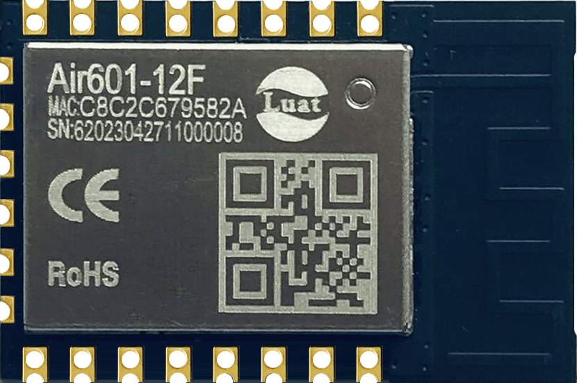
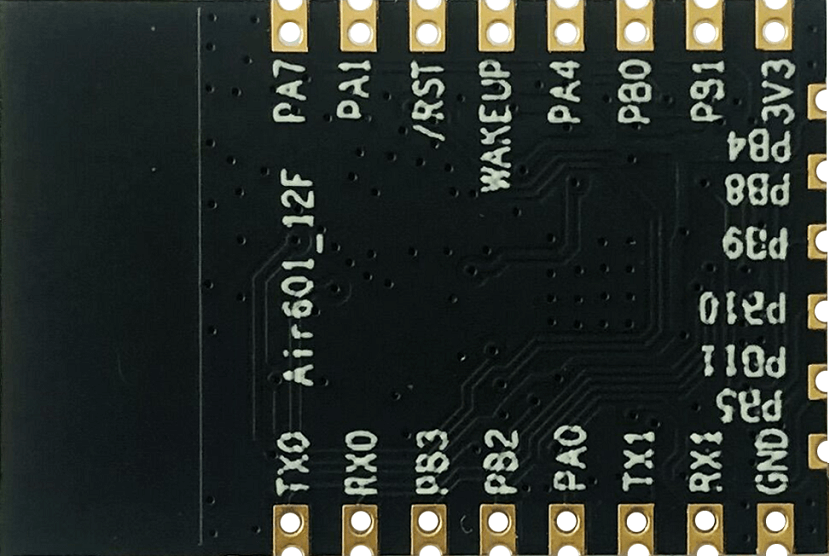

# Air601 Hardware Data

## Module Hardware Data

|    Profile | Related Links                           |
| :-------------: | :----------------------------------------------------------: |
|     Specification | [Air601-12F_Module Product Specification_V1.2.pdf](https://cdn.openluat-luatcommunity.openluat.com/attachment/20230726105503590_Air601-12F_模块产品规格书 _V1.2.pdf) |
|  Hardware Design Manual | [Air601-12F_WIFI Module Hardware Design Manual_V1.0.1.pdf](https://cdn.openluat-luatcommunity.openluat.com/attachment/20230619165631229_Air601-12F_WIFI模块硬件设计手册 _V1.0.1.pdf) |
| Schematic and PCB Package | [Air601-12F-PADS.7z](https://cdn.openluat-luatcommunity.openluat.com/attachment/20230519111345019_Air601-12F-PADS.7z) |
| Information on Development Board | [Instructions for Use of Development Board EVB_Air601-12F V1.0.0.pdf](https://cdn.openluat-luatcommunity.openluat.com/attachment/20230626161923628_开发板EVB_Air601-12F使用说明 V1.0.0.pdf) [EVB-Air601-12F.zip](https://cdn.openluat-luatcommunity.openluat.com/attachment/20230524173150039_EVB-Air601-12F.zip) |

## Module profile

|                 positive | negative                  |
| :-----------------------------------: | :------------------------------------: |
|  |  |

## Pin Mapping Table

| GPIO Numbering | Naming | Default Features and Extended Features     |
| -------- | ---- | ---------------------- |
| 0        | PA0  | BOOT                   |
| 1        | PA1  | I2C_SCL/ADC0           |
| 4        | PA4  | I2C_SDA/ADC1           |
| 7        | PA7  | GPIO/PWM4              |
| 16       | PB0  | GPIO/PWM0/UART3_TX     |
| 17       | PB1  | GPIO/PWM1/UART3_RX     |
| 18       | PB2  | SPI_SCK/PWM2/UART2_TX  |
| 19       | PB3  | SPI_MISO/PWM3/UART2_RX |
| 20       | PB4  | SPI_CS/UART4_TX        |
| 21       | PB5  | SPI_MOSI/UART4_RX      |
| 22       | PB6  | UART1_TX               |
| 23       | PB7  | UART1_RX               |
| 24       | PB8  | GPIO                   |
| 25       | PB9  | GPIO                   |
| 26       | PB10 | GPIO                   |
| 27       | PB11 | GPIO                   |
| 35       | PB19 | UART0_TX               |
| 36       | PB20 | UART0_RX               |

Only 'BOOT' and' UART0_TX/RX' are configured when starting up, other digital pins are GPIO pins, and the status is input high resistance.

| ADC Number (LuatOS) | Features         |
| ----------------- | ------------ |
| 0                 | Module ADC0-PA1 |
| 1                 | Module ADC1-PA4 |
| adc.CH_CPU        | CPU Temperature      |
| adc.CH_VBAT       | Internal voltage     |

## RF pin

As a hidden function, the RF pin of Air601 is: 8

When designing a PCB, this pin must be ESD protected.!!!

Functionally supports BLE 4.2 and wifi 2.4G communication, not supported wifi 5G
