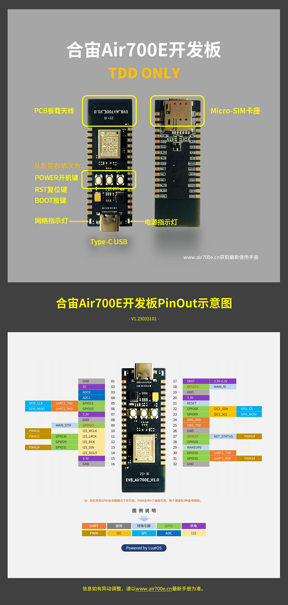

# Air700E Additional instructions

## Characteristic Description

1. Only supports TDD, does not support FDD, so only supports mobile networks
2. MAIN_RI GPIO with Air780E/Air780EG is different GPIO21
3. The development board does not have codec and does not support soft DAC audio output.
4. No I2C0, only I2C1

## About Packaging and Software

1. External package, Air700E is the ultimate small package
2. AT Firmware must be V1120 or above, LuatOS firmware must be V1106 or above

## Development Board pinout

Development board pin size:
1. Distance between pins, 10mil, 2.54mm
2. Distance between two rows of pins, 700mil, 17.78mm

The keys on the development board are BOOT(GPIO0), RESET (reset), PWR (power-on button) LED lights(GPIO27)

