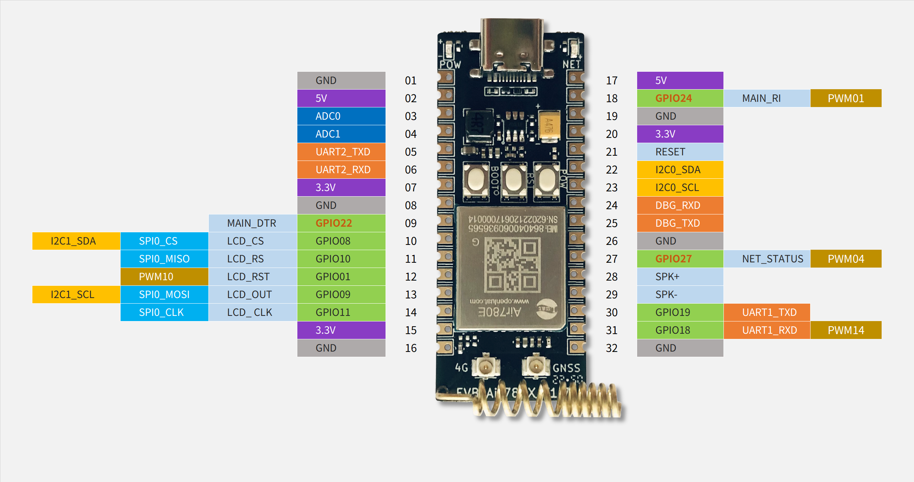

# Air780EG Additional instructions

Air780EG It is Air780E + GNSS chip 6228, so 95% of the characteristics are the same as Air780E. Here are different places to say.

GPS/GNSS Belonging to a bunch of things, the following, unless otherwise specified, refers to "satellite positioning system.""

## Internal wiring

UART Part:
1. Air780EG The GPS chip is connected to` UART2/AUX_UART `, so this port is occupied
2. Because of the characteristics of UART, although it leads to UART2_RX, it is not possible to directly send instructions to GPS chip by external data line, and it is necessary to send the code from inside 780e.
3. The default baud rate is 115200
4. The instructions used are the same as the Air510U, [Air510U Materials Website](https://air510u.cn)

Power supply part:
1. Air780EG The GPS power supply is` GPIO13/PAD12`, note is` PAD12/padaddr 12 `, not `PAD28`
2. The power supply of the chip and the power supply of the active antenna are controlled together, using only one GPIO and one API control.
3. Because normal GPIO is used, `SLEEP1/LIGHT/SLEEP2/DEEP/HIB mode` will power down
4. In lua code, the control power supply API is` pm.power(pm.GPS, true)`. although there is pm.GPS_ANT, it is invalid for Air780EG
5. Flight mode is RF-related control and does not affect GPIO power supply, so it does not affect GPS power supply

## Positioning characteristics

For a detailed description, please refer to the Air780EG hardware design manual, here to pick the focus, but also add some details

1. No backup power supply, no RTC hold, only `power on/power` two states, no low power tracking mode
2. It is a "read-only version" of GPS chip, which means that all configuration items cannot be saved, and ephemeris/time/reference coordinates cannot be saved.
3. With the blessing of the active antenna, the first positioning time without AGPS is less 30s
4. When the three elements are complete (`ephemeral`/`reference coordinate `/`UTC time`), if the signal is good, the first positioning success can be less than 2 seconds.

## Auxiliary Positioning Correlation

The built-in GPS chip loses all data after power failure, so auxiliary positioning depends on Cat in the Air780EG. 1 Capability of the chip

1. ephemeris, download from a co-server via http `http://download.openluat.com/9501-xingli/HXXT_GPS_BDS_AGNSS_DATA.dat`
2. Reference coordinates, three methods, base station positioning base` lbsLoc`, the last successful positioning coordinates storage file system, using the coordinates of China`s National Geographic Center(3432.70,N,10885.25,E)
3. UTC Time, China Mobile/China Telecom, the base station will issue the time (system event` NTP_UPDATE `) after networking, China Unicom, NTP. For example, the API in lua is`socket.sntp()`

## About Ephemeris

1. The ephemeris provided by the Zhou is GPS Beidou, both constellations have, about 5kb in size, updated about once an hour.
2. GPS The valid time of the ephemeris is `4 hours`
3. The effective time of the Big Dipper ephemeris is `1 hour`
4. Measurements indicate that the Big Dipper ephemeris is helpful, but the main force is GPS ephemeris.
5. Again, the GPS chip itself cannot save the ephemeris, even if it generates its own ephemeris after long-term operation, it will be lost even if it loses power.`!!

## About Power Consumption

1. There is only one positioning mode, continuous positioning, the power consumption before and after successful positioning does not change much, but after a period of stable positioning, some power consumption will be reduced
2. No low-power commands, no low-power modes

## About Packaging and Software

1. External package, Air780E and Air780EG are the same, the difference is that UART2 cannot connect other equipment
2. AT Firmware to V1112 or above, LuatOS firmware to V1103 or above, to have Air780EG full support, brush

## Development Board pinout

Please note the difference with the Air780E development board:
1. UART2 No more multiplexing of GPIO10/11
2. UART2_RX Do not connect external input

Development board pin size:
1. Distance between pins, 10mil, 2.54mm
2. Distance between two rows of pins, 700mil, 17.78mm

The keys on the development board are BOOT(GPIO0), RESET (reset), PWR (power-on button) LED lights(GPIO27)

