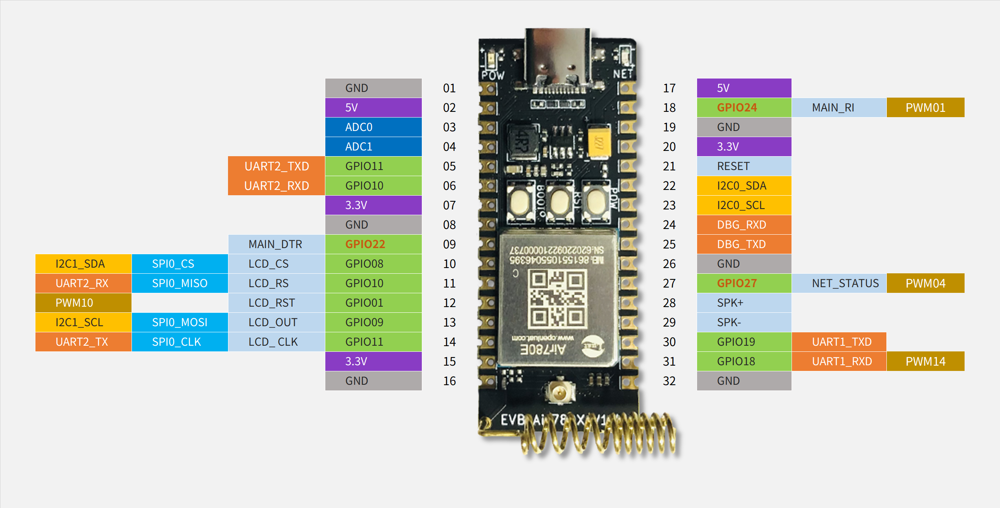

# Development Board

[ Air780E Development board instructions V1.0.3.pdf](https://cdn.openluat-luatcommunity.openluat.com/attachment/20221214113943532_%E5%BC%80%E5%8F%91%E6%9D%BFCore_Air780E%E4%BD%BF%E7%94%A8%E8%AF%B4%E6%98%8EV1.0.3.pdf)

[Air780E Development Board Schematic V1.5(pdf version ).pdf](https://cdn.openluat-luatcommunity.openluat.com/attachment/20221028114557272_Air780E开发板原理图V1.5(pdf version).pdf)

[Air780E Development board schematic diagram and PCB (Li Chuang EDA)](https://oshwhub.com/luat/evb_air780x_v1-6)

[Air780E Development board schematic and PCB(AD format).zip](https://cdn.openluat-luatcommunity.openluat.com/attachment/20221104135203881_780X开发板原理图和PCB(AD format).zip)

## Development Board pinout

This figure is LuatOS's perspective. csdk supports adjusting pin multiplexing

The keys on the development board are BOOT(GPIO0), RESET (reset), PWR (power-on button) LED lights(GPIO27)

Development board pin size:
1. Distance between pins, 10mil, 2.54mm
2. Distance between two rows of pins, 700mil, 17.78mm

Reminder:
1. The one marked in red is AON_GPIO, which can also be used in sleep mode. It is normal in non-sleep mode.GPIO
2. UART2 Multiplexing GPIO11/GPIO10 with SPI0, no error
3. DBG UART0 is the underlying log output port. It is strongly recommended not to try to reuse it.
4. UART1 It is the main serial port and also supports downloading serial ports. It is strongly recommended not to reuse GPIO
5. AON_GPIO The driving ability is very weak!!
6. GPIO Both do not support "two-way trigger", only one-way trigger is supported.
7. PWM The highest frequency is 13M
8. The LCD SPI in the figure is only a convention sort, in fact, it is a common SPI, not "dedicated""SPI
9. The IO level of the development board is 3.3v, and the module itself is configurable 1.8v/3.3v
10. SPK Is the speaker output, need external power amplifier, otherwise the sound is very small
11. PWM There are 4 available channels, 0/1/2/4 respectively, but they are mapped by 2 types respectively. There is a section after that.

## Development Board Expansion Board Related Information

[Air780E Development board speaker expansion board schematic diagram and PCB(KICAD format).zip](https://cdn.openluat-luatcommunity.openluat.com/attachment/20221110145812309_Air780E开发板喇叭扩展板V1.0(KICAD format).zip)

[Air780E development board speaker expansion board manual. pdf](https://cdn.openluat-luatcommunity.openluat.com/attachment/20221124161022658_Air780E开发板喇叭扩展板使用说明.pdf)

