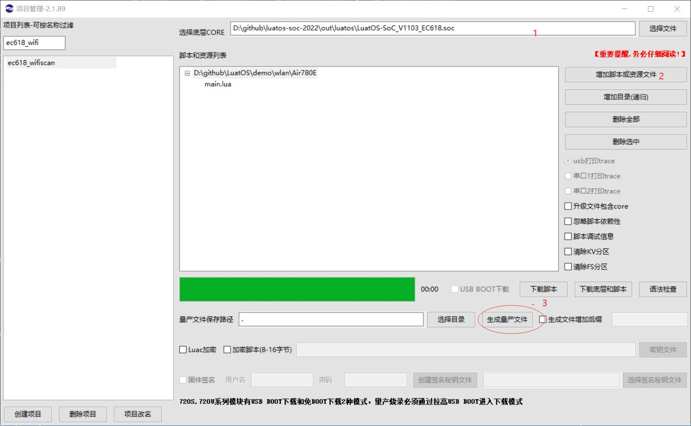

# Description of mass production brush machine

This document is used to download LuatOS firmware and scripts to target modules in batch production. It is applicable to all EC618 modules, including but not limited

1. Air780E
2. Air600E
3. Air780EG

## Preparations

2. LuaTools 2.1.91 or above version
3. Firmware version V1103 and above, libfota.lua
4. main.lua The version number filled in must conform to the form of `x.y.z`, where `x`/`y`/`z` are numeric values, not limited to single digits.
5. if fota uses the iot platform, the "y" in the version number will be ignored. recommend, write 0. be sure to pay attention to it.

## Preparing Production Documents

Open the LuaTools, add firmware and scripts in the project management interface, click "generate mass production file", and obtain the file with binpkg suffix after synthesis..

Note that this binpkg can be directly brushed with Luatools/FlashTool/MulDownloader, but it is only recommend to use binpkg brushed in `mass production`.

**This binpkg cannot be used to generate differential packets.!!**

