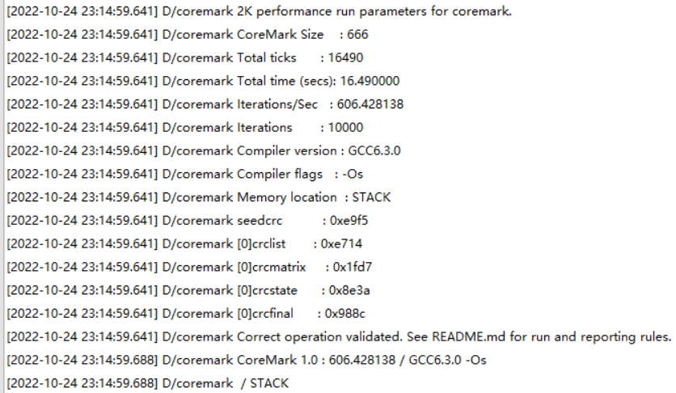
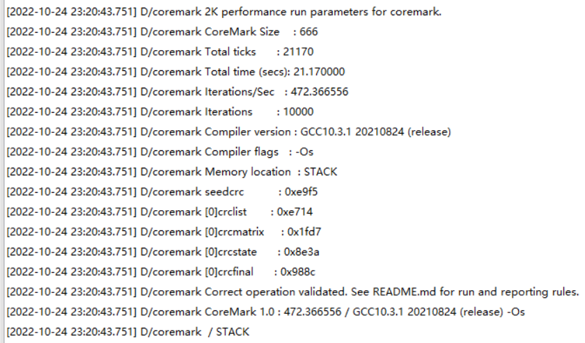
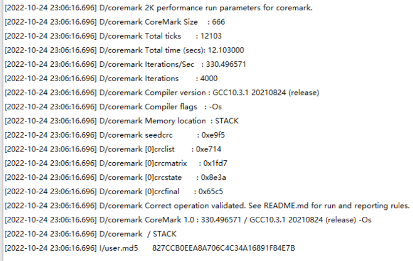
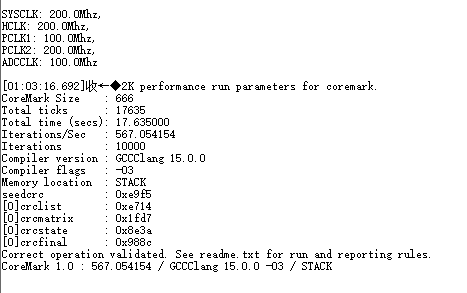
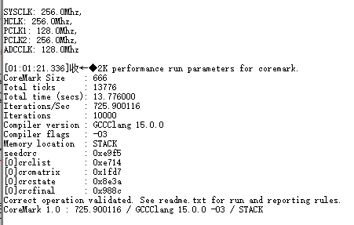

# Performance testing (based on coremark)

* The compilation parameters are all adjusted O3
* The compilation parameters in the screenshot/log are displayed as fixed values, not actual compilation parameters.

## Data Summary

|Module | Frequency | Architecture | Score|
|----|----|---|----|
|air103|240|xt804|606|
|air105|192|m4f|472|
|air780e|200|m3|330|

## Screenshot of raw data log

### Air103

### Air105

### Air780E(Based on EC618)

### Air32f103cbt6(200m Test at main frequency)

### Air32f103cbt6(256m Test at main frequency)

