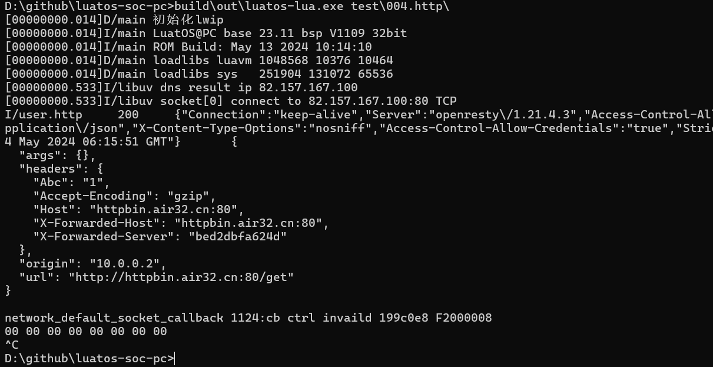
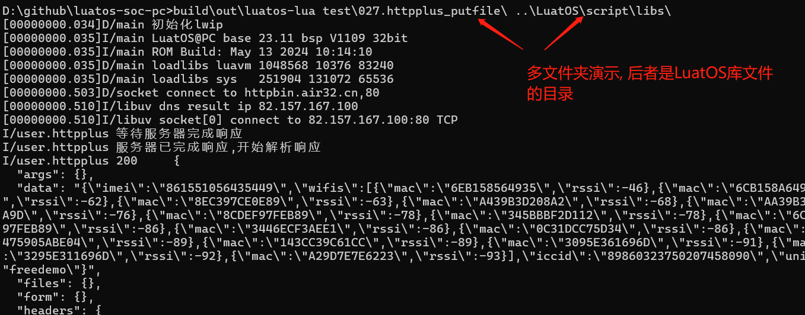
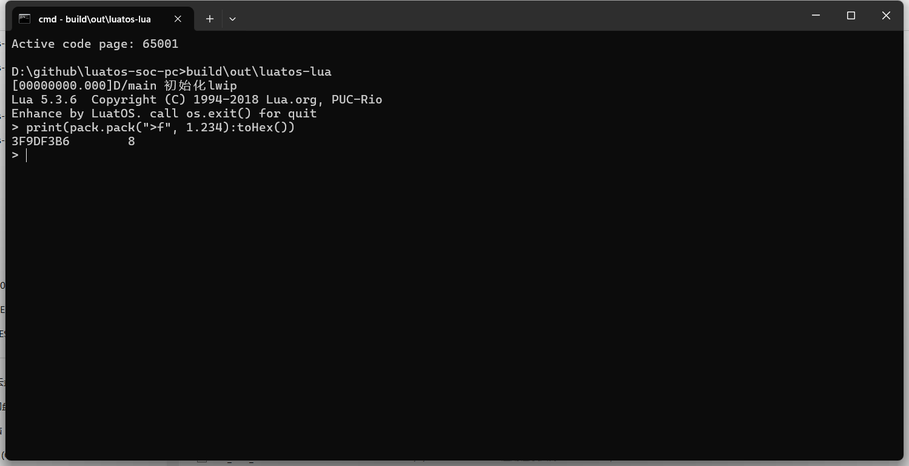

# Method of use

## Acquisition method

1. Through [co-disk](https://pan.air32.cn/s/DJTr?path=/LuatOS模拟器(win32)), select' PC simulator' to download
2. Self-compiled, [source code address](https://gitee.com/openLuat/luatos-soc-pc) need to be compiled with LuatOS main library

## Operation mode

### Script Run

This way is to execute a lua file, or a batch of lua files

This method executes "single script" and "multi-directory execution" in two ways, which need to be operated under the command line.

Take the windows platform as an example, first enter the console and switch to the current directory.

Single script run:

```cmd
chcp 65001
luatos-pc.exe main.lua
luatos-pc.exe test\001.helloworld\main.lua
```

Multi-Directory Run:

Note that the folder needs to end with '\', otherwise it will be regarded as a file.

```cmd
chcp 65001
luatos-pc.exe test\001.helloworld\  ..\LuatOS\scrips\libs\
```

Wherein 'chcp 65001' means to switch the console code to UCS-2, otherwise Chinese will appear garbled

The operation effect is as follows:






### Interactive

This method is to enter lua statements and execute them line by line.

* windows Platform, directly double-click 'luatos-pc.exe' to run
* linux platform, run directly `./luatos-pc`


