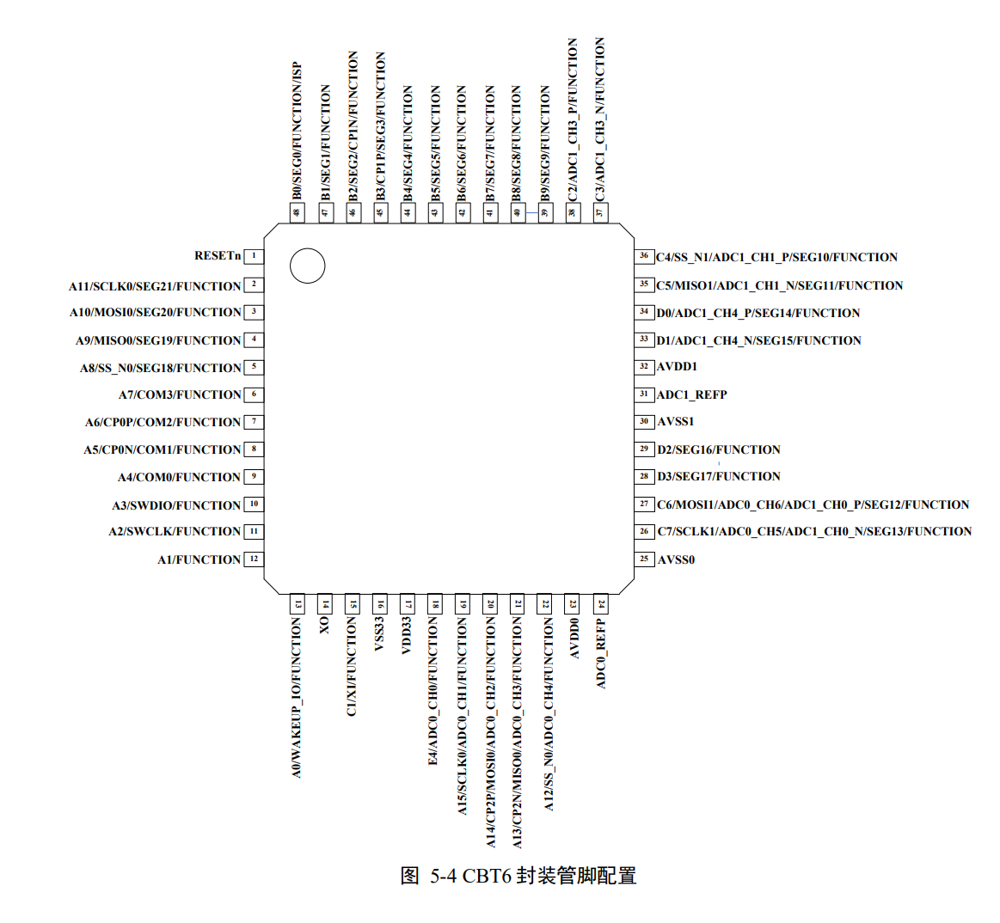

# SWM181CBT6 Chip

## SWM181CBT6 What is it??

SWM181CBT6采用32 位 ARM® Cortex™-M0 Core, with 24-bit system timer, operating frequency up to 48MHz, hardware single-cycle multiplication, integrated nested vector interrupt controller (NVIC), providing up to 32 interrupts with 4 configurable priorities, burning through SWD interface, built-in LDO, and power supply voltage ranging from 2.3V(2.7V) 3.6V 。

**SRAM Memory** ： 16KB

**FLASH Memory **:64KB/120KB/248KB, support user customization ISP (in-system programming) update user program, support custom BOOT program.

**Serial interface **,UART * 4, with independent 8-byte FIFO, maximum support for master clock divide by 16

SPI*2，With 8 bytes independent FIFO, support SPI, SSI protocol, support master/slave mode

I2C*2，Support 8-bit, 10-bit address mode, support master/slave mode

CAN*1，Supports protocol 2.0A(11bit identifier) and 2.0B(29bit identifier）

**PORTCON Control module * *, support UART/I2C/COUNTER/PWM/CAN function pin definition set arbitrary IO。

**PWM Control module **,8-channel 16-bit PWM generator, can set high level end or cycle start two conditions to trigger interrupt, with common, complementary, central symmetry and other output modes, dead zone control, hardware to complete the interaction with ADC.

**Timer module **,4-way 32-bit general-purpose timer, can be used as a counter, 1-way support HALL interface.

**32 Bit watchdog timer **, after overflow can be configured to trigger interrupt or reset the chip.

**Built-in low-power timer module **, uses internal 32KB clock, sleepcounts and self-wakeup 。

**DMA Module **, supports data handling between SAR ADC/SIGMA-DELTA ADC/CAN module and SRAM 。

**Divider module, supports 32-bit integer division, integer remainder, integer or decimal square operation, division to achieve about 30 clock cycles, integer open about 16 clock cycles, decimal open about 30 clock cycles.

**The rotation coordinate calculation module **calculates the sin/cos/arctan value at a known angle, and the result is 14bit, which can guarantee an effective value of 11bit.

**LCD Driver module * *, working voltage range: 2.4V ~ 3.6V, quiescent current:<1uA, maximum support 4*32 LCD panel, support 1/4duty 1/3bias or 1/3duty 1/2bias optional.

**GPIO**，Up to 56 GPIO, can be configured with 4 IO modes, pull-up input, pull-down input, push-pull output, open-drain output.

**Flexible interrupt configuration **, trigger type setting (edge detection, level detection) trigger level setting (high level, low level, dual level）

**12 Bit 8-channel high-precision SAR ADC **, sampling rate up to 1MSPS, support single/scan two modes, independent result register, provide independent FIFO, can be triggered by software/PWM/TIMER, support DMA,** 16-bit 6-channel high-precision SIGMA-DELTA ADC **, sampling rate 16KSPS, single channel fast mode up to 50KSPS, support single/scan two modes, independent result register, provide independent FIFO, can be triggered by software or TIMER

**3 Road analog comparator * *, can flexibly select on-chip and off-chip reference voltages, comparison results can trigger interrupt notification MCU for processing, undervoltage detection, support 2.7V undervoltage detection, support undervoltage interrupt and reset selection

**Clock source * *, on-chip clock source with 24MHz and 48MHz accuracy up to 1%, 32KHZ on-chip clock source, off-chip 2~32Mhz off-chip crystal oscillator，

**Other **, custom BOOT program

**Low power consumption **, normal mode: 30mA @ 48MHZ, light sleep: 70uA, deep sleep：5uA

For details, please refer to the data sheet, [huaxin micro SWM181 data sheet V2.07.pdf](https://cdn.openluat-luatcommunity.openluat.com/attachment/20220721163511464_华芯微特SWM181数据手册 V2.07.pdf)

## Environment Construction Tutorial

SDK Compressed package[SWM181_Lib-211013.rar](https://cdn.openluat-luatcommunity.openluat.com/attachment/20220721163704765_SWM181_Lib-211013.rar)

[SWM81 Manual](https://openluat.github.io/luatos-wiki-en/chips/swm181/swm181.html)

## Module Purchase

* [Hizhou Mall](https://appc6kjfor22343.h5.xiaoeknow.com)
* [Taobao shop](https://luat.taobao.com)

## Chip PinOut

