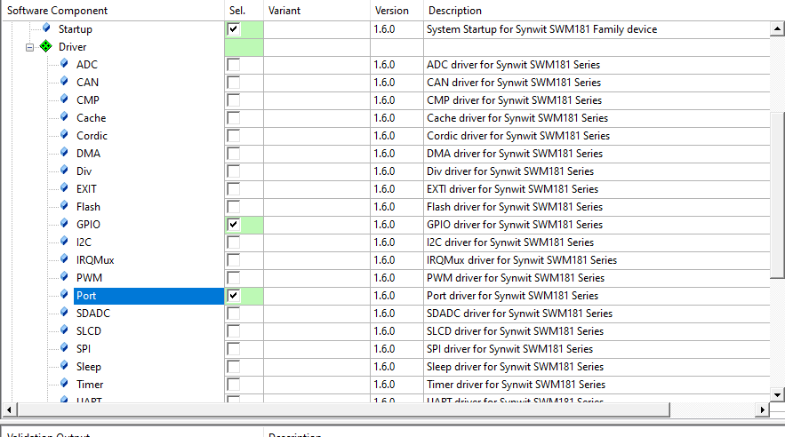

# SWM181 Manual

## 1. background

- Background: This document mainly solves the problems related to the construction of KEIL development environment for SWM181 series chips.

- Technical positioning: junior/intermediate/advanced

- Target group: Users who use KEIL for development

## 2. environment construction

### Preparations

1. Install MDK5, the specific method please Baidu, after installation need to activate to compile large files
2. Download the keil support package for installing SWM181 [pack file](https://cdn.openluat-luatcommunity.openluat.com/attachment/20220721163533324_Synwit.SWM32_DFP.1.20.3.pack)

### Install Support Package

Double-click the pack package to install by default. After installation, you can see the SWM181 device in the Synwit directory of the keil device list.


### New construction

Click on the menu bar Project->New μVision Project


Create a folder and project name, and select the path according to your actual choice.


Select the Synwit directory in the device list SWM181xB


Add a startup file and check the Startup under CORE and Device under CMSIS to automatically configure the startup file.


Add peripheral library support, for example, add GPIO library, we check GPIO and Port library, others can be checked according to their own needs, or all can be checked.



### Test code

Add a file, right-click the folder in the project file list, and select Add File


Add a C file called main.c


Simply write a lighting code

```c
#include "SWM181.h"
int main(void)
{	
	SystemInit();	
	GPIO_Init(GPIOD, PIN0, 1, 0, 0, 0);			//output, connected LED
	SysTick_Config(SystemCoreClock/4);			//Trigger an interrupt every 0.25 seconds
	while(1==1)
	{
	}
}
void SysTick_Handler(void)
{	
	GPIO_InvBit(GPIOD, PIN0);	//Reverse LED on/off state
}
```

Set Waring's level AC5 like Warings


Compile it, no problem


## 3. Download Burn

Air32F103 The development board factory defaults to DAPLINK firmware, so it can be directly used as a debugger to debug and burn to another device. Here is how to use the DAPLINK, similar to other debuggers.

> Note that since **win7** system does not have a` winusb` driver, and Microsoft has stopped supporting the system as early as 2020, if you need to use DAPLINK function, please upgrade to **win8 or above system**, or manually install the driver yourself:[Zadig driver installer](https://zadig.akeo.ie/)

AIR32F103 The DAPLINK firmware of the development board, PB13 is connected to the SWDCLK of the debugged device, PB14 is connected to the SWDIO of the debugged device, and PB0 is connected to reset：

| Pin | Function     |
| :--: | :----------: |
| PB13 |   SWD_CLK    |
| PB14 |   SWD_DIO    |
| PB0  |   RST Reset    |
| PA2  | virtual serial port TX |
| PA3  | virtual serial port RX |

The overall connection diagram is shown in the following figure：


Click the project configuration magic wand, find the Debug tab, select the CMSIS-DAP Debugger in the drop-down list, and click Settings


Check whether the device is connected normally. If the connection is normal, you can see the device in the SW Device list, and you can adjust the clock speed to improve efficiency.


Click on the Flash Download tab, you can see that our support package has added a download algorithm for us by default. We can check the Reset and Run tab, and every time we download the automatic reset running code, we don't need to manually press the reset button.


After the configuration is completed, you can directly click the burn button to download the burn code to the device.


After the download is completed, the device will restart automatically, and you can see the blue light on the board flashing.