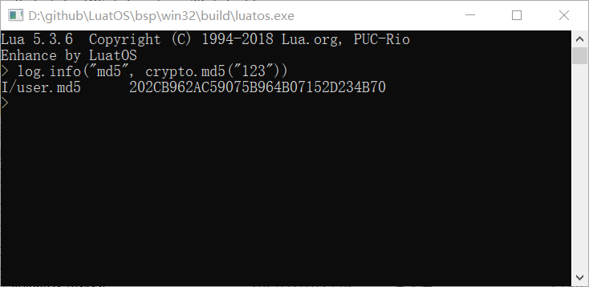

# 🖥️ PC End version

* compile environment msys, tools cmake/make/gcc
* file system, win32 native file system, based on the working directory
* The default luavm and rtos memory allocations are 1MByte
* Support most of the tool library, peripheral library support simulation

Download [Precompiled luatos.exe](https://nightly.link/openLuat/LuatOS/workflows/win32/master)

## Simple Usage

### Interaction mode

Directly double-click luatos.exe to start, consistent with the native lua.exe



### Execution Mode

* Create a new directory and copy the` luatos.exe `into it (optional, you can use the full path when executing)
* Create a new main.lua in the directory and write the following content

```lua
local sys = require "sys"

log.info("sys", "from win32")

sys.taskInit(function ()
    while true do
        log.info("hi", os.date())
        log.info("sys", rtos.meminfo("sys"))
        log.info("lua", rtos.meminfo("lua"))
        sys.wait(1000)
    end
end)

sys.run()
```

* Enter the command line, cd to the directory where luatos.exe is located, and execute `luatos.exe main.lua`

## Self-Compilation Instructions

* Download the msys environment and install gcc and make
* Download the latest version of independent cmake from the official website of cmake
* Enter the msys environment, cd to the bsp directory, and execute `./build_cmake.sh`

After the compilation is completed, it will be generated in the build directory. `luatos.exe`

Tip: Use `mingw32.exe `/`mingw64.exe` to start the compilation environment, and you can compile exe files that do not rely on` msys-2.0.dll

https://www.thinbug.com/q/37524839

If you still don't understand it, you can refer to the CI automatic compilation process for operation.：

[.github/workflows/win32.yml](https://gitee.com/openLuat/LuatOS/blob/master/.github/workflows/win32.yml#L19)
