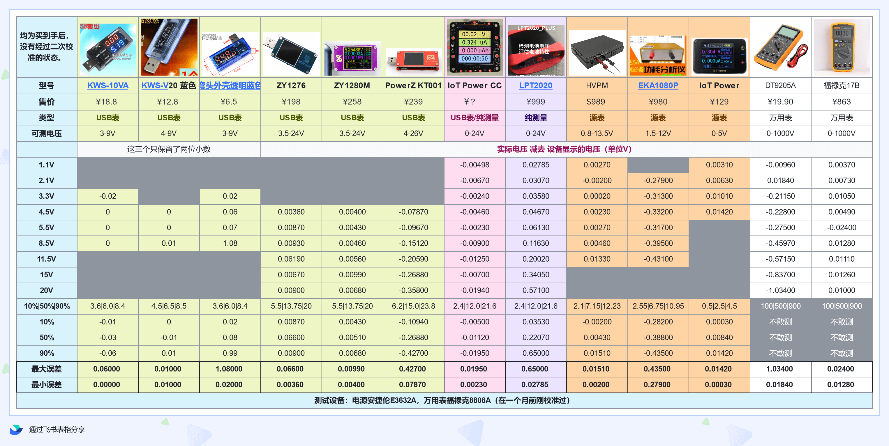
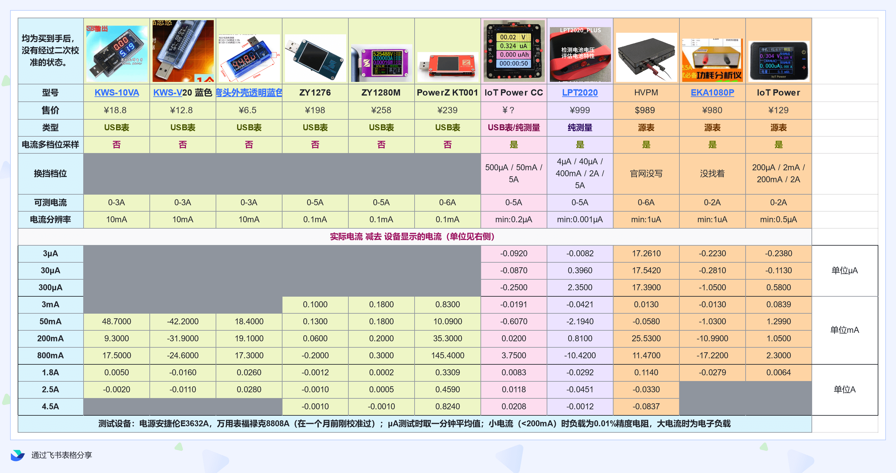
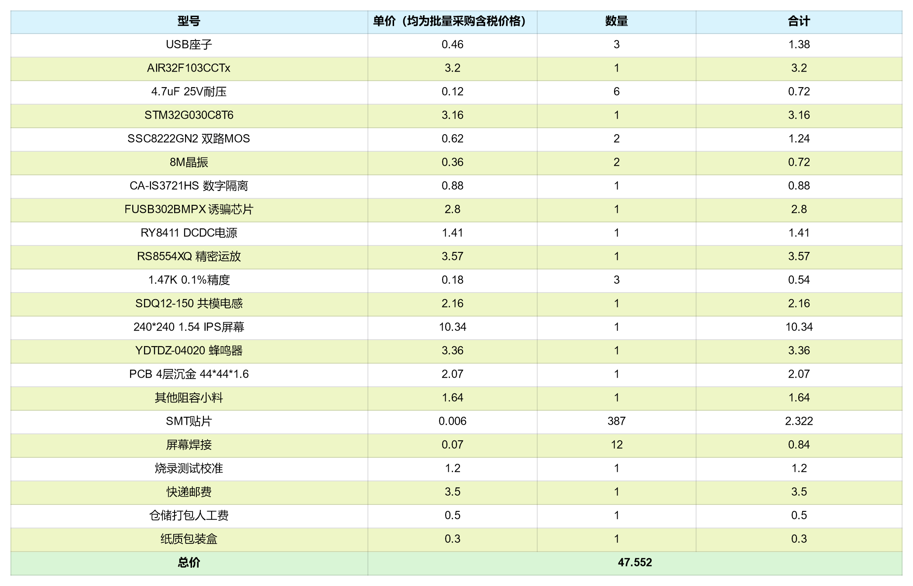

# ⚡ IoT Power - CC

> [Go to Taobao to buy](https://item.taobao.com/item.htm?id=718378448520)
> [WeChat Mall Purchase](https://appc6kjfor22343.h5.xiaoeknow.com/v1/goods/goods_detail/SPU_ENT_1678672270GckvYWaVoUuX4)

IOT Power CC Is a fully functional, stable and reliable small handheld high-precision power meter, it can：

- Measure voltage and current of low-power devices via USB C power supply
- Different from other USB meters, the voltage and current at the output terminal are measured to reflect the actual power consumption of the device.
- Connect **PD fast charge** charger (support PPS), decoy the specified voltage and current output
- Maximum voltage 24V, maximum current 5A
- Current **Multi-channel synchronous sampling**, no shift delay, highest resolution 0.15μA
- High precision, small error, details can be found in [technical indicators](https://openluat.github.io/luatos-wiki-en/iotpower/cc/tech.html), welcome to verify
- Up to **10KHz sampling rate** to meet the power consumption test requirements of cellular modules, Bluetooth, WIFI, etc.
- You can **connect a PC client** to view and analyze the current waveform, or use the command line version to capture serial port data (such as strawberry pie) on any device (win/linux/mac) and use the pc client to import and view
- **BOM Cost disclosure * * (pull down to have), conscientious and sincere work, sincerely recruit suppliers with more favorable prices
- Shell data is open, [open source shell address](https://cdn.openluat-luatcommunity.openluat.com/attachment/20230515082541036_%E5%A4%96%E5%A3%B3%E8%B5%84%E6%96%99%E6%9B%B4%E6%96%B0.zip)

IOT Power CC Is the majority of users carry the ideal test tool.

::::{grid} 1 2 2 3
:gutter: 1 1 1 2

:::{grid-item-card} {octicon}`repo-forked;1.5em;sd-mr-1` Connection and assembly
:link: parts
:link-type: doc
:img-top: img/font_small.jpg

Show the connection mode of CC and the tested equipment and the shell assembly instructions.

+++
[Learn more »](parts)
:::

:::{grid-item-card} {octicon}`stopwatch;1.5em;sd-mr-1` Operating Instructions
:link: usage
:link-type: doc
:img-top: img/usage_small.png

Describe the usage of each function of the device in detail

+++
[Learn more »](usage)
:::

:::{grid-item-card} {octicon}`law;1.5em;sd-mr-1` Technical indicators
:link: tech
:link-type: doc
:img-top: img/comp.png

List the parameters and performance indicators of the equipment

+++
[Learn more »](tech)
:::

::::

---

## Accuracy comparison





## BOM cost disclosure

```{note}
Prices here are batch prices including tax. If you have a lower supply price and provide products of consistent quality, please contact us.！
```



```{rubric} More information
```

CC Egg mode open source control terminal：[IoT-Power-Tools](https://github.com/chenxuuu/IoT-Power-Tools)

Please select the specific page on the left to view the information.

```{toctree}
tech
parts
usage
question
```
