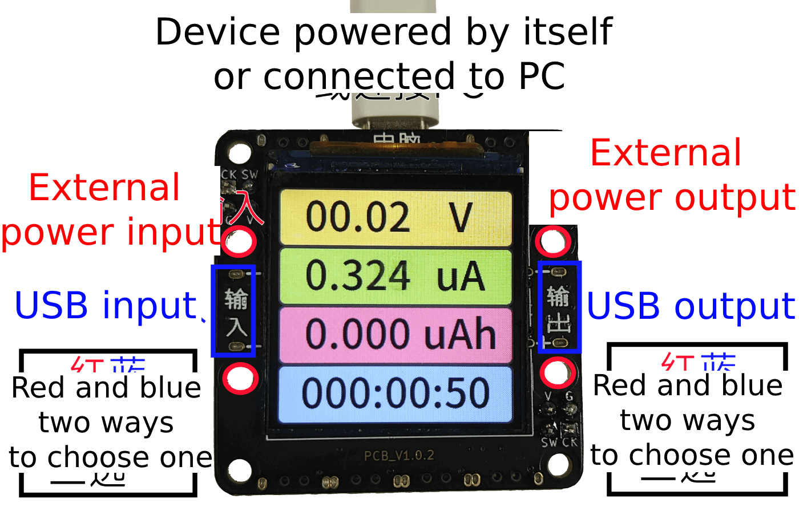
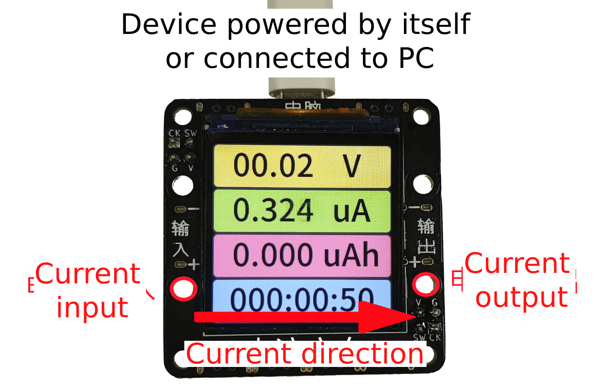

# Connection and assembly

## Layout and Function

The basic appearance of the device is as follows


|Serial Number|Function|Key Serial Number|Key Function|
|:-:|:-:|:-:|:-:|
|**①**|Device own power supply/PC client communication|**⑧**|OK key `O`|
|**②**|USB TYPE-C power input|**⑨**|Left shift key `<`|
|**③**|USB TYPE-C Power Out|**⑩**|Right Shift Key `>`|
|**④**|External Power Supply Positive+ (corresponds to ②)|**11**|Cancel key `X`|
|**⑤**|external power supply negative- (corresponds to ②)|**(12)**|page-turn key/forcing into upgrade mode|
|**Small Dial**|Switch the power supply source of CC||
|**⑥**|External Output Positive+ (corresponds to ③)||
|**⑦**|External output Negative- (corresponds to ③)||

:::{dropdown} to make the need to use banana holders, you can refer to here
④⑤⑥⑦ on the board for the banana seat jack, if necessary can: 1:

1. buy banana seat welding on their own, such as [this store sells](https://item.taobao.com/item.htm?id=680807959486)`￠2*￠4*8+￠3*1.6（20 One）` can be matched on these holes
2. the seat can be welded on
:::

```{warning}
⚠Risk Note: Some brands of fast charging heads (such as Huawei, Xiaomi and other private protocol fast charging heads) may misidentify the fast charging protocol, resulting in providing a high voltage of more than 5.8V to the device resulting in instantaneous device burnout.  
It is recommended not to use the fast charging head to connect to the device's ① device's own power supply port
```

## Power supply method

IOT Power CC supports two ways to get power

- When the upper-left corner of the device is dialed to the right, the device will be powered through ①, which is the best precision and the smallest voltage drop.
- When the upper left corner of the device is toggled to ← left, the device will draw power from ② or ④ ⑤ power supply port, which will result in voltage drop of ③ or ⑥ ⑦ output voltage, but it is more convenient to use.

```{warning}
When dialing code to the ← left, if the charging head is USB C port, you need to turn on the ``Automatic power on PD'' option in the settings page in advance, otherwise it will not be able to power on  
If your output is connected to a mobile phone/rechargeable battery/computer that supports fast charging, please don't turn on ``Automatic PD on Power On``, otherwise the two devices together will induce interference
```

```{note}
Since the voltage measured by IOT Power CC is the voltage at the output (③ or ⑥⑦)  
So although there will be a certain voltage drop at the output compared to the input, the actual power supply voltage of the device under test is still the real value and the test results will not be distorted
```

## Connection mode

IOT Power CC supports two connection methods: four-wire mode and two-wire mode

### Four-wire mode

This mode allows you to measure the voltage at the output of the power supply while measuring the current. The connection diagram is as follows:



User can freely decide how to connect the input and output, the input supports PD charging head

### Two-wire mode

This mode can directly connect the device in series into the circuit of the existing circuit, the disadvantage of this mode is that **must** power supply to the device through ①, and can not measure the voltage (at this time, the voltage display value has no reference). The connection diagram is as follows:



You can also use two `USB C-port to alligator clip` cables, both with red positive clips, to measure the current direction as shown above.

---

You can continue to see the `Operating Instructions` on the next page
