# Connection and assembly

## Layout and Function

The basic appearance of the equipment is as follows

{w=300px align=center}

|     Serial | Function | Bottom Key | Key Function  |     |     |
| :----------: | :--------------------------------------------------------------------------------: | :------: | :--------: | --- | --- |
|   **PC Port **| Power supply of equipment itself/PC client communication |** O key **| OK key `O` |     |     |
| **Power Input **| USB TYPE-C Power Input |** <Key **| Left Shift Key `<` |     |     |
| **Power Out **| USB TYPE-C Power Out |**> Key **| Shift Right `>` |     |     |
|  **Page Flip Key **| Page Flip Key/Force Upgrade Mode |** X Key **| Cancel Key `X` |     |     |
|  **Small dial code **| Switch the power supply source of CC ([see this for usage](https://wiki.luatos.org/iotpower/cc/parts.html#id3)） |          |            |     |     |

:::{dropdown} If you need to use a banana seat, please refer to here.
④ ⑤ ⑥ ⑦ on the board is the banana socket, if necessary：

1. Buy banana seats for self-welding, for example, [sold by this store](https://item.taobao.com/item.htm?id=680807959486)`￠ 2 * ￠ 4*8 ￠ 3*1.6(20)` can match these holes.
2. Weld the seat
:::

```{warning}
⚠Risk Warning: Some brands of fast charging heads (such as Huawei, Xiaomi and other private protocol fast charging heads) may misrecognize the fast charging protocol, resulting in providing high voltage exceeding 5.8V to the device, resulting in instantaneous burning of the device.  
It is recommended not to use this type of charging head to connect the **PC port of the device as much as possible.  **
**PC Mouth * *, it is strictly prohibited to reverse or voltage greater than 6V, reverse or greater than 6V will burn！
```

## Internal connection topology diagram

The following figure shows some information about the electrical connections inside the CC, which is convenient for users to understand.

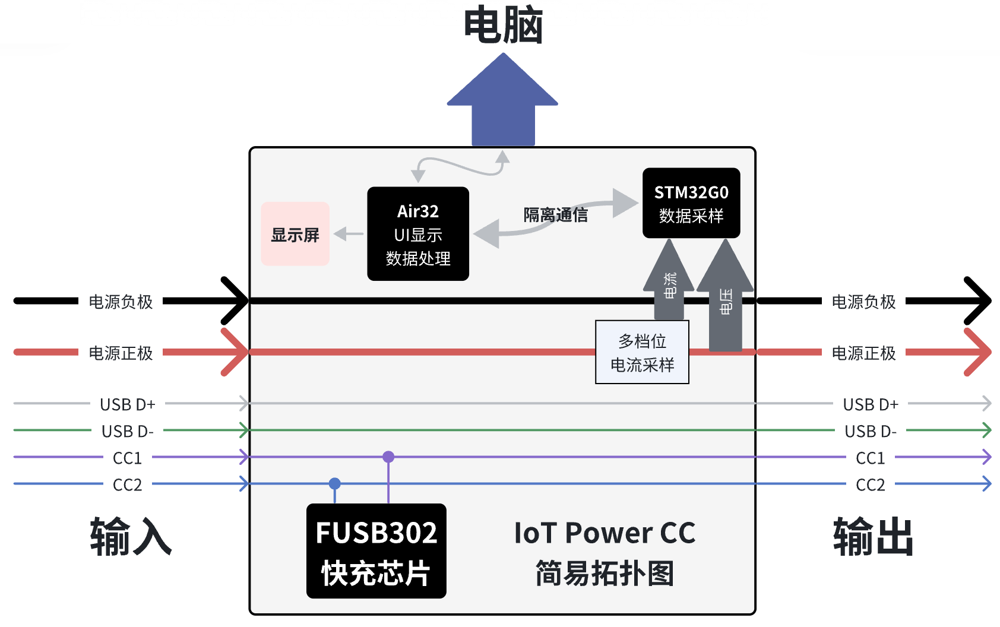

## Power supply mode

IoT Power CC Support two ways to get electricity

- When the dial code in the upper left corner of the device is dialed to the right, power needs to be supplied to the device itself through the **PC port**. At this time, the accuracy is the best and the voltage drop is the smallest.
- When the dial code in the upper left corner of the device is dialed to the left, the device will take power from the **power input** port, which will cause a voltage drop in the output voltage of the **power output** port, but it is more convenient to use.

```{warning}
When the dial code is dialed to the left, if the charging head is USB C port, you need to turn on` PD` option on the setting page in advance, otherwise you cannot take power and start up.  
If your output is connected to a mobile phone/charging treasure/computer that supports fast charging, please do not turn on` start up and automatically enable PD`, otherwise the two devices will cheat together and cause interference.  
If you still don't understand, you can watch [video tutorial](https://www.bilibili.com/video/BV19X4y127k2/)
```

```{note}
Since the voltage measured by IoT Power CC is the output terminal voltage (* * power output * * port  ）
Therefore, although there will be a certain voltage drop at the output end compared with the input end, the actual power supply voltage of the device under test is still the real value, and the test result will not be distorted.
```

## Connection mode

IoT Power CC Support two connection modes: four-wire mode and two-wire mode

```{warning}
⚠Risk Warning: Reverse connection of positive and negative poles of measuring port is strictly prohibited, and reverse connection equipment must be burned.  ！
If you need to use a voltage of more than 20V, you need to set the power supply equipment to a low voltage of less than 10V, connect it to the input terminal, and then adjust the power supply equipment to the specified voltage, otherwise there is a probability that the PD will break down the chip due to surge.
```

### Four-wire mode

In this manner, the voltage at the output end of the power supply can be measured while the current is measured. The connection diagram is as follows：

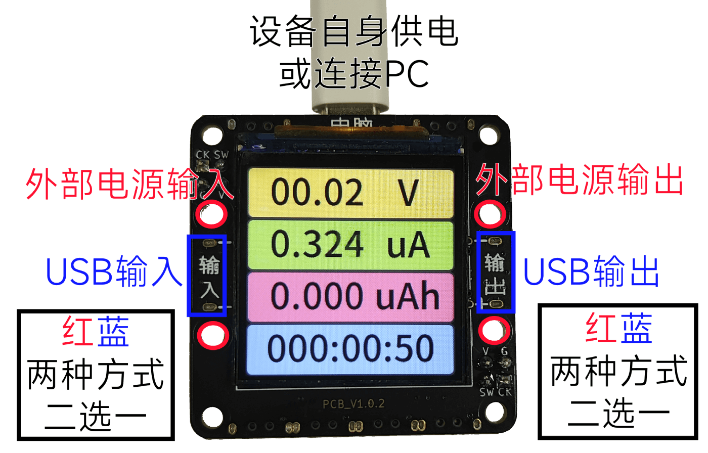

The user can freely determine the connection between the input and the output, and the input supports PD charging head

### Two-wire mode

This method can directly connect the equipment in series into the loop of the existing circuit. The disadvantage of this mode is that the equipment must be powered through the **PC port** and the voltage cannot be measured (the voltage display value has no reference at this time). The connection diagram is as follows：

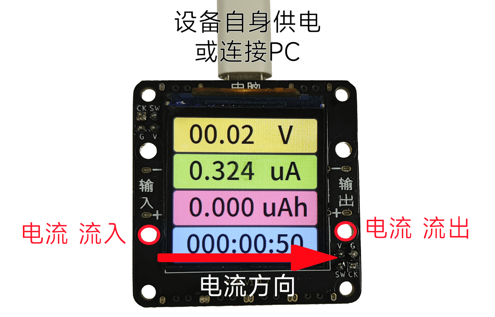

You can also use two `USB C port to alligator clip` cables, both using red positive clips, and measure according to the current direction shown in the figure above.

## Shell assembly steps

### At-hand parts list

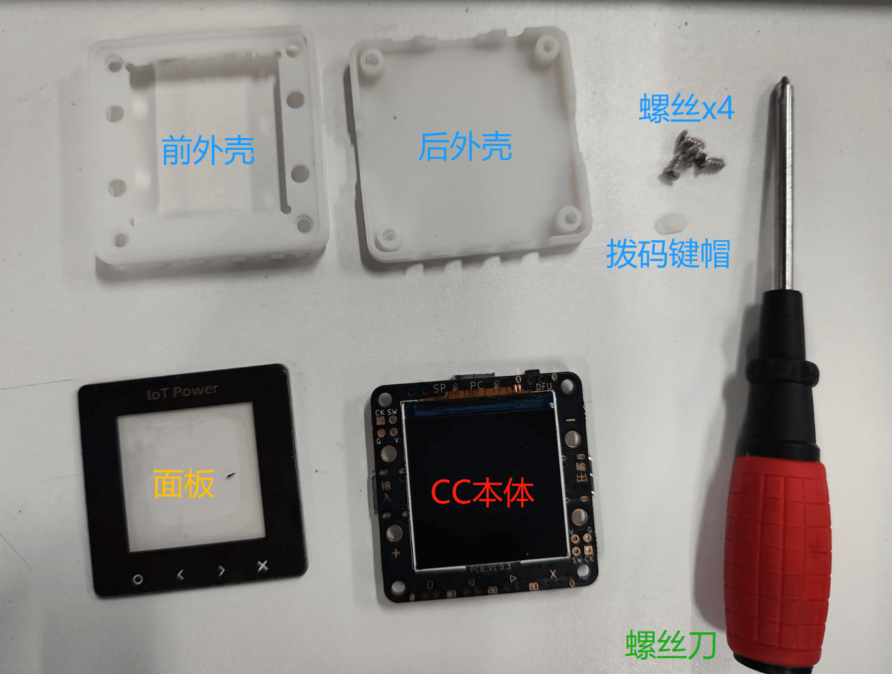

### Assembling housing

First, install the key cap. Note that the distance between the holes in the key cap is asymmetrical. The holes need to be placed downward, as shown in the figure.

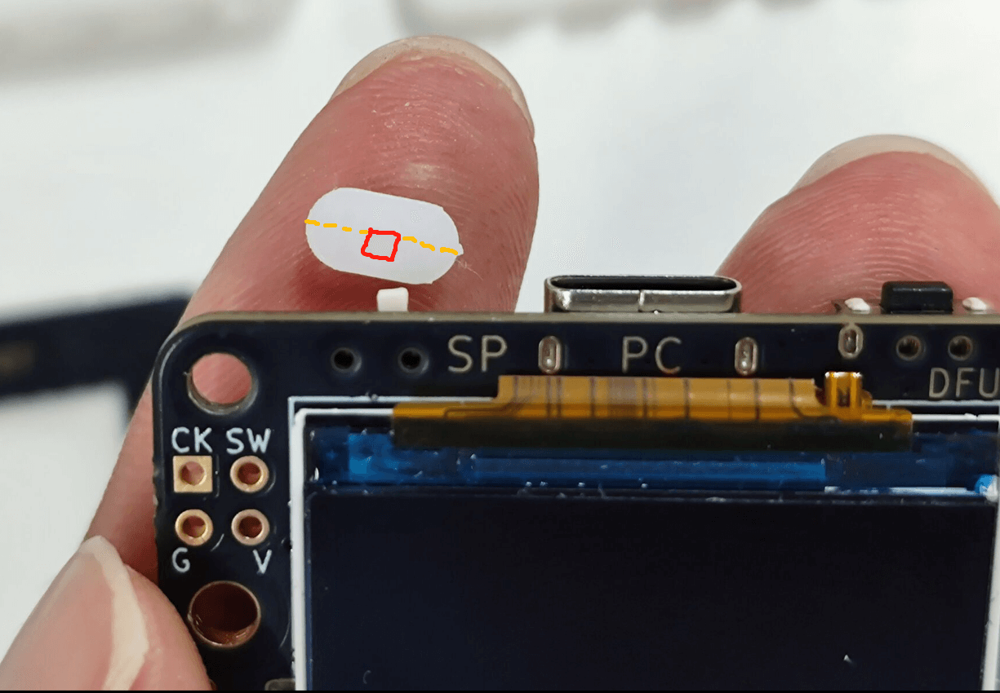

Then place the board on the bottom plate of the shell, clamp the key cap not to fall, and then tear off the film on the screen.

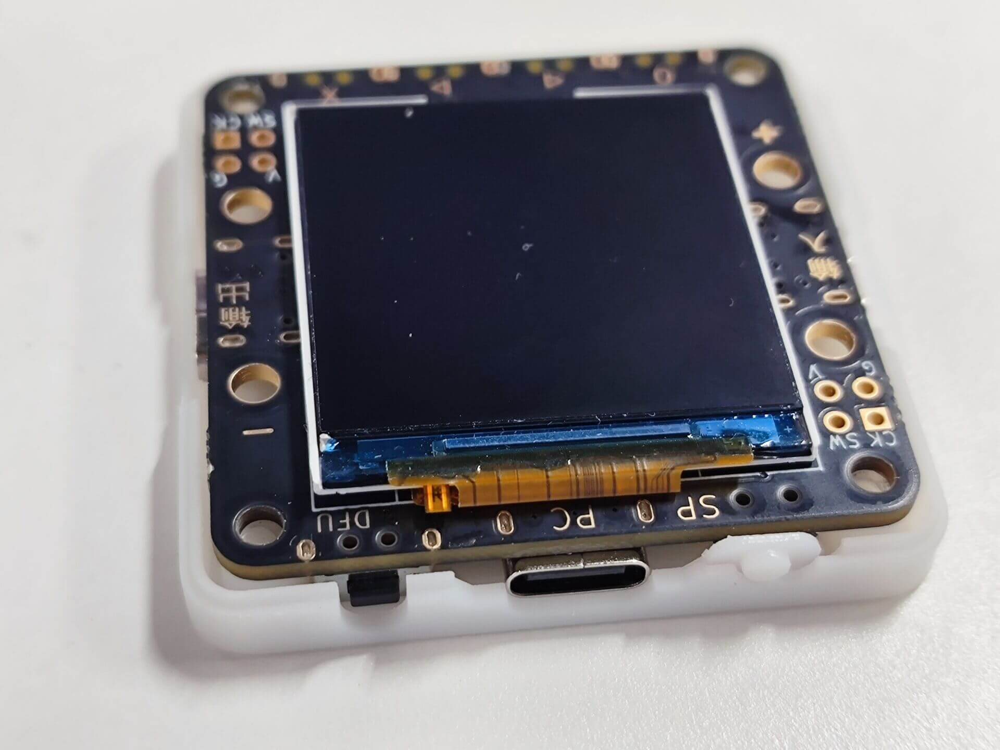

Put the upper part of the shell up, pay attention to the key cap to align

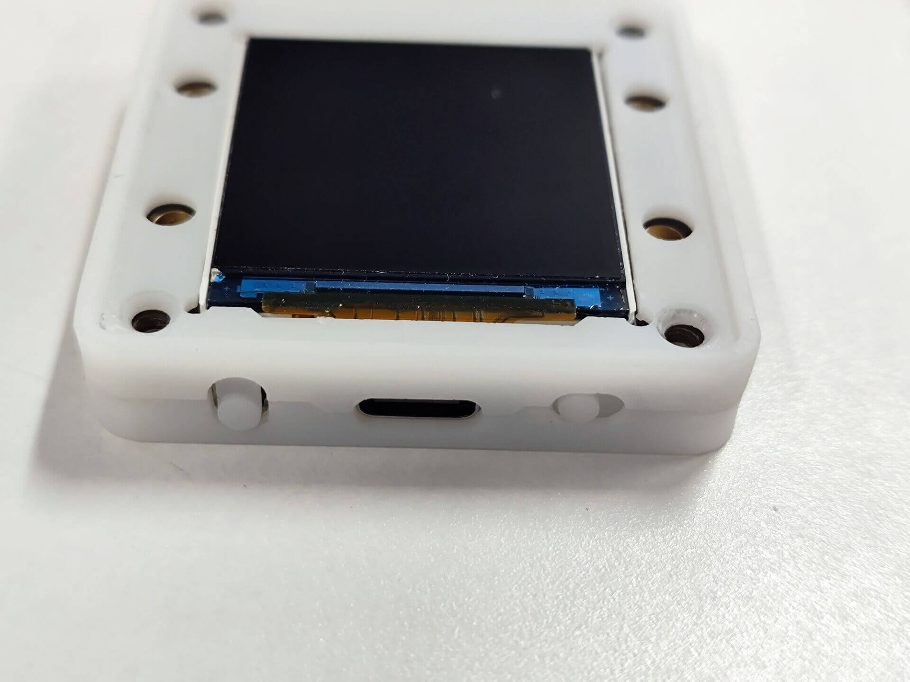

```{warning}
⚠Important reminder: be sure to remember to tear off the film on the screen！
```

Screw on four screws and fix them well. You don't need to tighten them too tightly to avoid slipping.

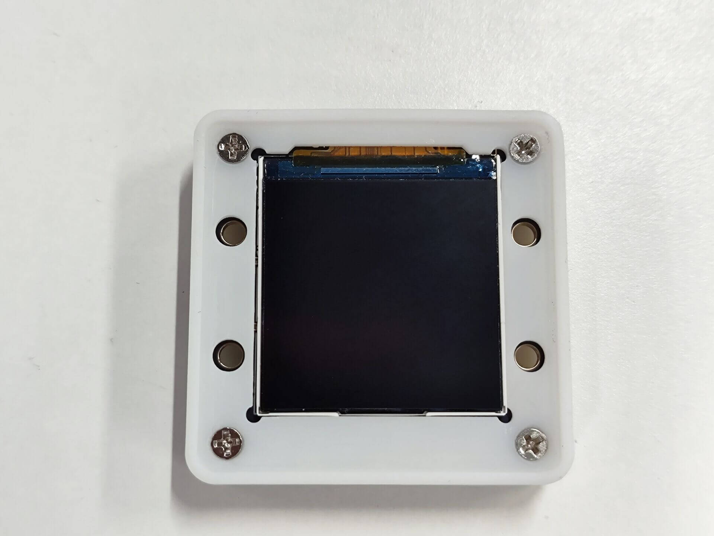

### Mounting the panel

Remove the protective film and 3M adhesive sticker at the bottom of the panel

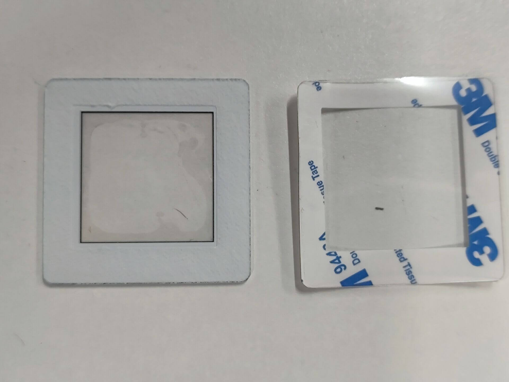

Paste the panel on one side of the shell screen, and it is recommended to stick it against the lower side as much as possible, otherwise the screen will be easily covered.

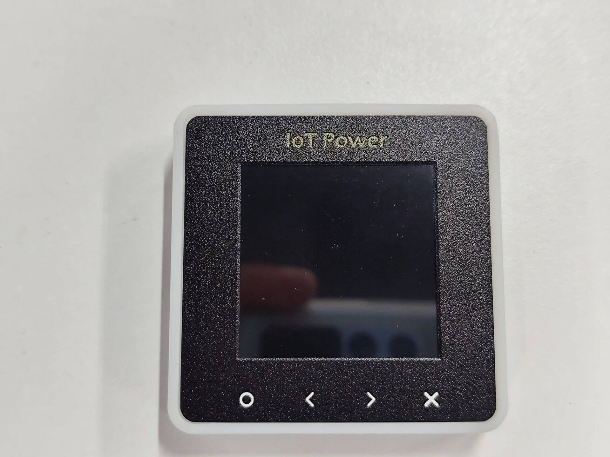

### Shell assembly completed

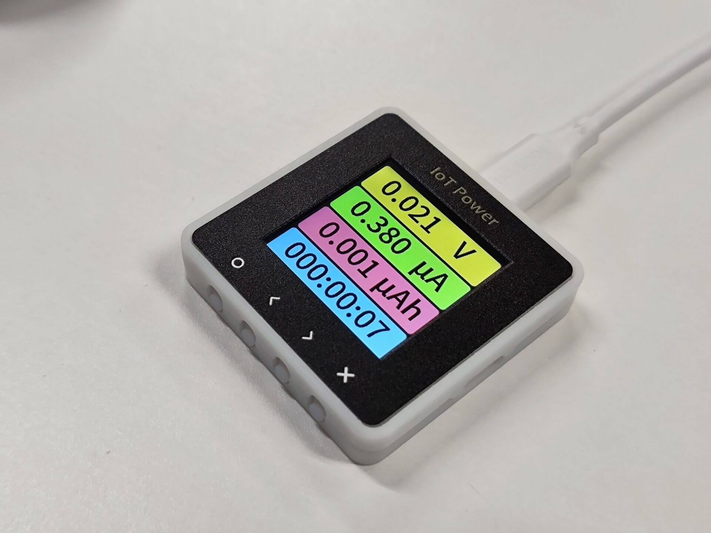

---

You can continue to view the `Operating Instructions on the next page`
