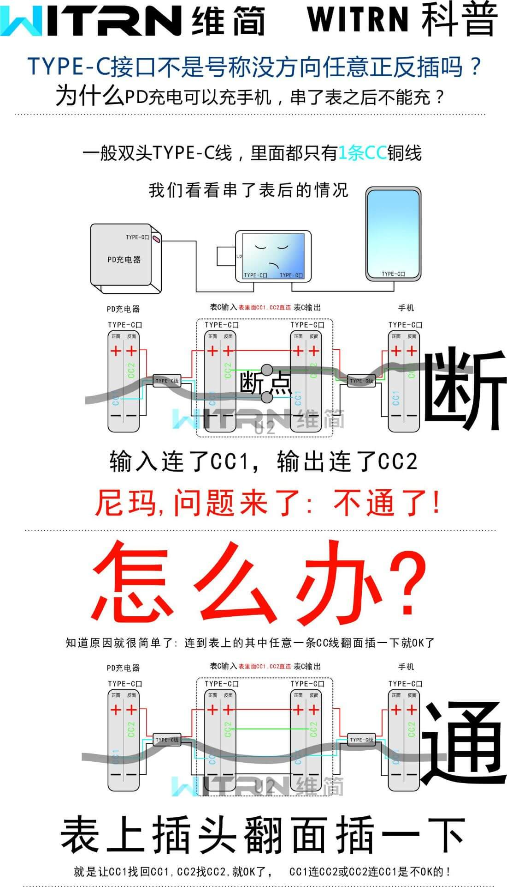
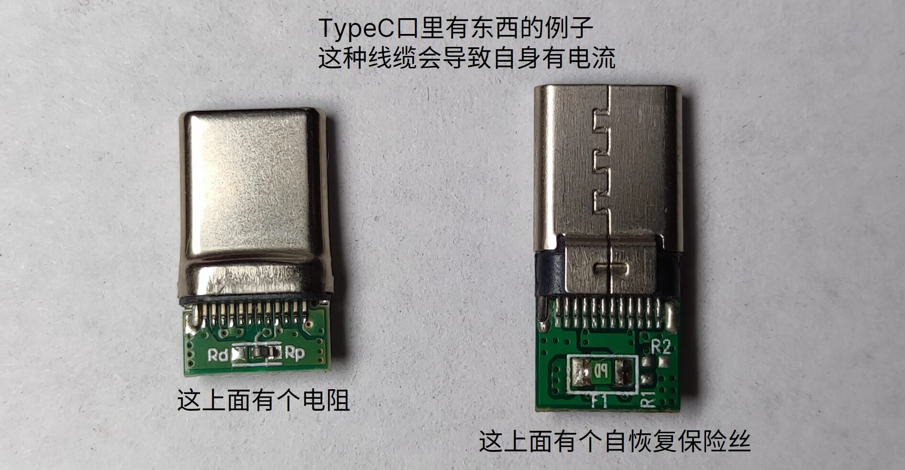
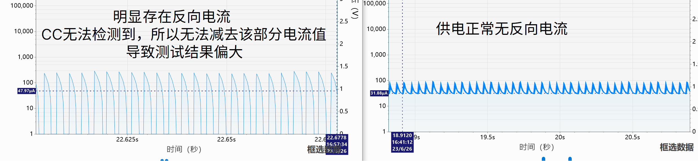

# FAQ

## Why I plug in the usb does not light up？

Please read the chapter [Power Supply Method](https://openluat.github.io/luatos-wiki-en/iotpower/cc/parts.html#id3) carefully.  
If it is the first time to power on, please refer to the steps in [this video](https://www.bilibili.com/video/BV15m4y1h7CG).

## Why can't I upgrade the firmware

1. If you are win7, please install the driver provided by the client download page first, and you need to manually install the driver (including the driver in upgrade mode）
2. You need to open the client first and click the` Connect` button on the first page to connect to the device.
3. If the device cannot be recognized, please check whether the device manager has a device, if not, please change the line

## Why have I been circling around since I turned on PD？

First of all, please look at the instructions, * * don't * * lure the air, [like these * * wrong demonstration**](wrong.md)

If the operation is correct, you can try  ：
In the settings, turn on` power-on and self-start PD`, and only supply power from * * input * * terminal (dial code is changed to input power supply mode), and connect PD charger, there will be only a few phenomena：

- If the CC is not lit, then：
  - Charging head or charging line, there must be one that does not support PD
- If it is bright, then it is possible：
  1. PD Tricking success (go to PD page to check）
  1. Fake PD head (because PD does not trick will not give electricity）
  1. Non-standard charging head (as above, standard PD protocol detection equipment is not used）
  1. There are no cc1 and cc2 lines, only usb four lines
  1. The PD decoy chip on the board is broken
  1. You're lying

## Why can't my charging head recognize PD/PPS? Clearly the mobile phone can be charged quickly

Even if the mobile phone can be used to trigger fast charging, it cannot prove that PD is supported. For specific information, please refer to the chapter "Precautions on PD Function" in [Operating Instructions](usage.md)

## Can it trigger the fast charging of the mobile phone? I don't want to use my own decoy function.

Yes, if you need to test, please * * turn off the pd decoy function of the device itself (take effect after restarting and powering on) * *, otherwise it will interfere. In addition, some mobile phone charging heads distinguish between front and back, please arrange and combine the test directions by yourself.

```{note}
Some equipment fast charging protocols are non-standard, and fast charging may not be triggered when using input port power supply. At this time, the PC-side power supply test is required to isolate the power supply of the device from the fast charging phase.
```

## Why does the voltage turn on and off for a while when my output terminal is connected to a mobile phone/charging treasure/computer?

If your output is connected to a mobile phone/charging treasure/computer that supports fast charging, please * * do not turn on * * `start up and automatically enable PD` (it will take effect after restarting and powering up), otherwise the two devices will cheat together and cause interference.

## Why do I supply power from the input port, CC will always restart/plug in the mobile phone and turn off the screen？

Ibid.

## Why can't my mobile phone trigger fast charge/dead power output after passing through CC

:::{dropdown} Refer to the popular science map made next door.



:::

## Why does my charging head support 20V, but not on the device

The device will enter PPS mode by default, and the PPS support range of some chargers is less than the PD fixed gear range. You can go to the setting to turn off the PPS function and only use the fixed gear function.

## Why can't the computer set the PD value, and the device displays the support PD fixed gear

PC Only supports setting PPS value, please confirm that your charger supports

## Do you support non-standard PPS (MIPPS, etc.）

Not supported, only standard PPS/PD is supported. If you find a bug that cannot trigger the standard PPS, please grab the PD protocol package and feed it back to the group owner for repair.

```{note}
This device is a low-power tester, not a USB fast charging test meter, and will not add protocol detection related functions.
```

## Why is there a current of several μA when the output terminal is connected to the TypeC line?

Some cables will have resistors or chips in them, which will cause a small current to appear.

```{note}
There is no such phenomenon in the` TypeC to alligator clips` line officially sold by the United States, and it can be used with confidence.  
However, among the "ten yuan and ten" wires sold by the United States, TypeC turns to TypeC wire. The black end has resistance inside, and the four-wire core (no CC wire) cannot trigger PD fast charging.
```

The connectors of these cables are as follows：



## Why is the voltage directly changed after the output terminal is connected to the TypeC line 5V

You may have a CC pull-down resistor in your wire head (refer to the above figure), or the device under test has pulled down the CC pin.

## Why is nothing even, voltage and current are not 0

Small knowledge：1A = 1 000 000μA

## Why is there several differences between current and multimeter?μA？

（On the premise that the table is not damaged) it is possible that the μA result is incorrect due to the existence of reverse current (CC cannot detect reverse current）

As shown in the following figure, the same equipment uses different power supply methods. In the left figure, reverse current occurs due to unstable power supply, which will cause the detection result to be too large.



## I use **Iot Power V1/V2** to supply power and connect it in series**Iot Power CC**

### Why are the current numbers inconsistent？

During the test, the two devices cannot be on the same ground. Please use different power supplies respectively to supply power. Otherwise, the current measured by power is the load current cc sampling shunt current.

### I have already supplied power separately and have no common ground. Why is the current number still inconsistent?？

If the four-wire mode is used, the CC sampling resistor will consume part of the current. If the current is exactly the same, please use the two-wire mode.

## My device can't start, can I brush the firmware again?？

Please refer to [Operating Instructions](usage.md)-Chapter `Manually Entering Upgrade Mode` to force the machine
