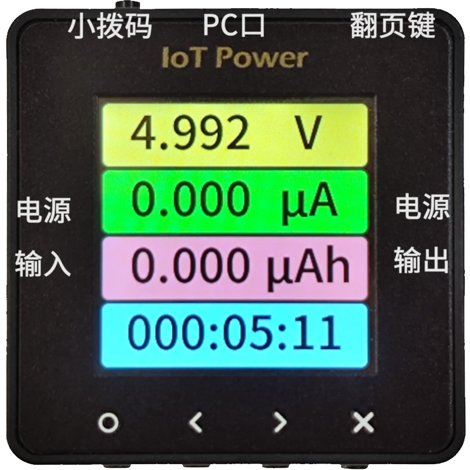
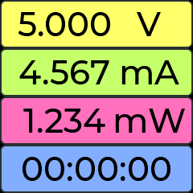
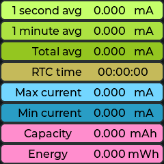
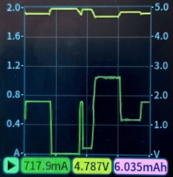
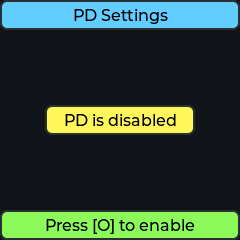
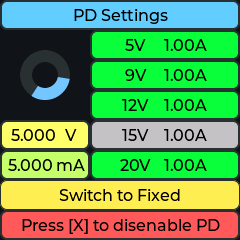
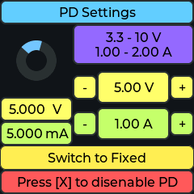
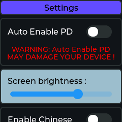

# Operating Instructions

This part of the content will explain the specific meaning of each part of the function of the equipment and the key operation mode

The device supports bilingual switching between Chinese and English. The screenshot below only provides screenshots of the English interface, which does not affect actual understanding.

```{warning}
⚠Risk Alert  ：
**PC Mouth * *, it is strictly prohibited to reverse or voltage greater than 6V, reverse or greater than 6V will burn  ！
The positive and negative poles of the measuring port are strictly prohibited from being connected in reverse, and the equipment connected in reverse must be burned.  ！
If you don't listen, burn the equipment and only complain in the group.！
```

## Product appearance and key function

The basic appearance of the equipment is as follows



|     Serial | Function | Bottom Key | Key Function  |     |     |
| :----------: | :--------------------------------------------------------------------------------: | :------: | :--------: | --- | --- |
|   **PC Port **| Power supply of equipment itself/PC client communication |** O key **| OK key `O` |     |     |
| **Power Input **| USB TYPE-C Power Input |** <Key **| Left Shift Key `<` |     |     |
| **Power Out **| USB TYPE-C Power Out |**> Key **| Shift Right `>` |     |     |
|  **Page Flip Key **| Page Flip Key/Force Upgrade Mode |** X Key **| Cancel Key `X` |     |     |
|  **Small dial code **| Switch the power supply source of CC ([see this for usage](https://wiki.luatos.org/iotpower/cc/parts.html#id3)） |          |            |     |     |

:::{dropdown} If you need to use a banana seat, please refer to here.
④ ⑤ ⑥ ⑦ on the board is the banana socket, if necessary：

1. Buy banana seats for self-welding, for example, [sold by this store](https://item.taobao.com/item.htm?id=680807959486) `￠ 2 * ￠ 4*8 ￠ 3*1.6(20)` can match these holes.
2. Weld the seat
   :::

```{warning}
⚠Risk Warning: Some brands of fast charging heads (such as Huawei, Xiaomi and other private protocol fast charging heads) may misrecognize the fast charging protocol, resulting in providing high voltage exceeding 5.8V to the device, resulting in instantaneous burning of the device.
It is recommended not to use the fast charging head to connect the **PC port of the device as much as possible.**
```

## Data Overview Page



The values displayed from top to bottom on this page are：

- Voltage instantaneous value
- Current instantaneous value
- Current power consumption or current power
- Equipment statistical time
- Press the `O` key to rotate the screen
- Press the `<` key to toggle the display of `Wh`, `Ah` and `W`
- Press the `>` key to switch the display style
- Press the` X` key to clear the accumulated data (time, electricity, etc.) and re-count from the beginning.
- Press the `page turning/DFU` key for more than 5 seconds and then release it to clear the bottom current and return to zero.

## Detailed Data Page



This page shows the average current, peak-to-valley current and more detailed electricity statistics (ampere-hour and watt-hour.）

- Press the `X` key to clear all data and re-count from the beginning.
- Press the `page turning/DFU` key for more than 5 seconds and then release it to clear the bottom current and return to zero.

## Waveform Preview Page



Page to preview the current current waveform data

- Press the `O` key to restart or pause the current waveform refresh
- Press the `<` key to toggle the display of `Wh`, `Ah` and `W`
- Press the `>` key to change the current waveform ordinate range, fixed or adaptive
- Press the `X` key to clear the current data and capture it again.

## PD Voltage and Current Switching Page



This page sets the target voltage and current values for PD decoy

- Press the `O` key to open the PD function, please press the pop-up description to continue the operation




When entering PD/PPS page, voltage and current can be switched

- Press `O` key to perform the operation of the currently selected item
- Press the `<` and `>` keys to switch the value buttons to be selected in sequence
- Press the `X` key to turn off the PD decoy function

### Notes on PD functionality

1. Only the decoy of PD and PPS fast charging protocols is supported, and other fast charging protocols are not supported.
2. PD Using CC pin for communication, the standard connection line is` USB-C mouth`-`USB-C mouth`, and the line of port a is generally not available.
3. Even if you can use your mobile phone to trigger fast charging, you cannot prove support.PD
4. The charging head attached by most mobile phone manufacturers supports non-standard PD, which may not work well. It is recommended to buy a third-party head.
5. Part of the "USB-C port"-"USB-C port" cable, only four cores, this can not be used. A wire with six cores with CC pins must be used
6. After triggering PD and changing the voltage, the voltage may jump to 5V, so it is recommended to disconnect the output before changing the voltage
7. When the `Enable PPS Function` option is turned on on the setup page, the PPS mode will be automatically entered on the charging head that supports the PPS function. Since the PD and PPS support ranges of some charging heads are different, if you need to use the pure PD fixed gear mode, please go to the setting to turn off this function.

## Settings Page



This page sets the parameters in the device

- Press the `O` key to turn on the function or adjust the value to the left
- Press `<` and `>` keys to switch items up and down
- Press the `X` key to turn off the function or adjust the value to the right

## Enter upgrade mode manually

If the user makes an error on the way to upgrade the device and the device cannot be used normally, you can manually enter the upgrade mode (DFU) to manually upgrade

You can disconnect the power supply of the device first, hold down the` page turning key/force to enter upgrade mode`, and then insert USB power supply. at this time, you can see **the information of DFU mode displayed on the device screen**, or you can find the` IotPower DFU` device in the` universal serial bus device` of the` device manager` of the computer.

Finally, open the client-`device and software settings`-`force firmware upgrade` and upgrade it.
