# 🖥 PC Client

## Download

- Microsoft Store Download: [Microsoft Store Page](https://www.microsoft.com/store/apps/9N8S8M8226SH)
- Independent exe version:[IOT Power.exe](https://arduino.luatos.com/iotpower/latest.html)(note Microsoft/360 kill soft false alarm, tinder no problem）
- **Full platform * * command line data logger, dll/so dynamic runtime please go to [gitee warehouse](https://gitee.com/openLuat/iot-power) to view

:::{dropdown} win7 Users may need
（win10 The above drive-free, no need to manually install the driver）

IoT Power V1 CP2102 Drive：[CP210x_Windows_Drivers](https://www.silabs.com/documents/public/software/CP210x_Windows_Drivers.zip)

IoT Power Pro Drive：[IoTPowerPro-Driver.7z](https://arduino.luatos.com/iotpower/IoTPowerPro-Driver.7z)

IoT Power CC Drive：[IoTPower_CC_usb_driver.7z](https://arduino.luatos.com/iotpower/IoTPower_CC_usb_driver.7z)

.net framework 4.6.2：[Installation Package](https://dotnet.microsoft.com/zh-cn/download/dotnet-framework/thank-you/net462-offline-installer)
:::

## Introduction to the client

The following features are available on the client and may continue to increase：

- View Current Waveform
- Record historical data
- Analyze data for a specified time period
  - Average current
  - average voltage
  - average power
  - Peak, minimum current
  - Peak, minimum voltage
- Import and export captured data. You can export data independently.exe
- Upgrading Firmware for Devices
- Run the lua script to control the output and simulate the discharge curve of the battery and other equipment.

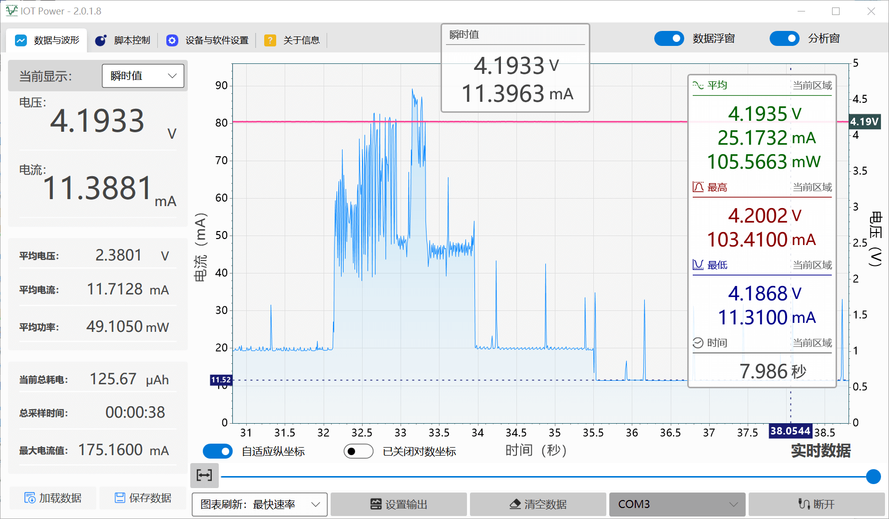

```{note}
This tutorial was written in version 2.0.7.11. If there are any new or changed functions not mentioned, please leave a message at the bottom of the page to remind you to update, thank you.
```

## Software Interface

The layout of the software homepage is shown in the following figure

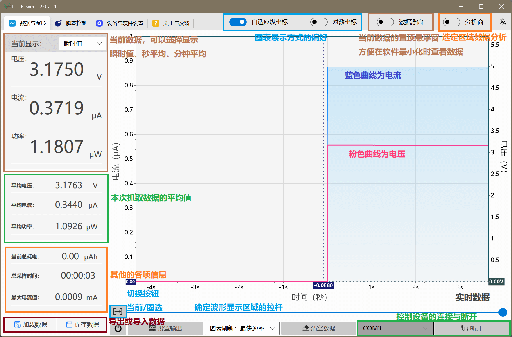

### Current Display

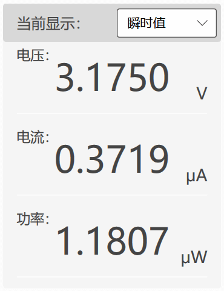
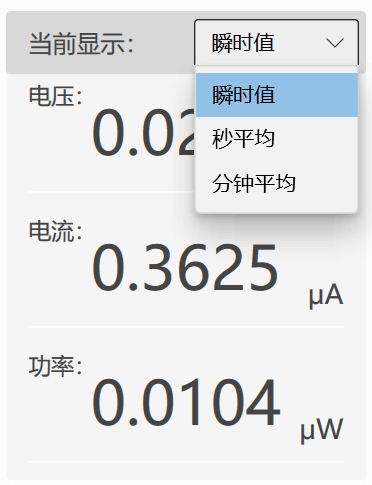

The value of this area is the current data after the device is connected, which can be switched to the moving average or instantaneous value.

The * * data floating window * * switch on the top of the software can open the floating window, and the displayed data is exactly the same as the data here. it is always displayed on the top, which is convenient to view real-time data after minimizing the software.

> If it is in the instantaneous value gear, it may be inconsistent with the display at the device end. This is a normal phenomenon, because the refresh time point cannot be completely consistent.

### Average data

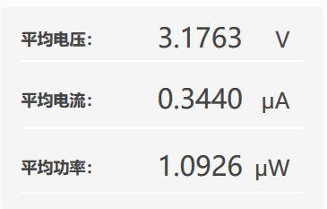

The data here is the average value of **all data since this device connection**. Clear and reset

### Other data

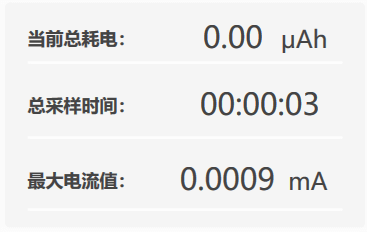

The data here is the relevant cumulative data of **all data since the current device connection**, cleared and reset

## Chart Area

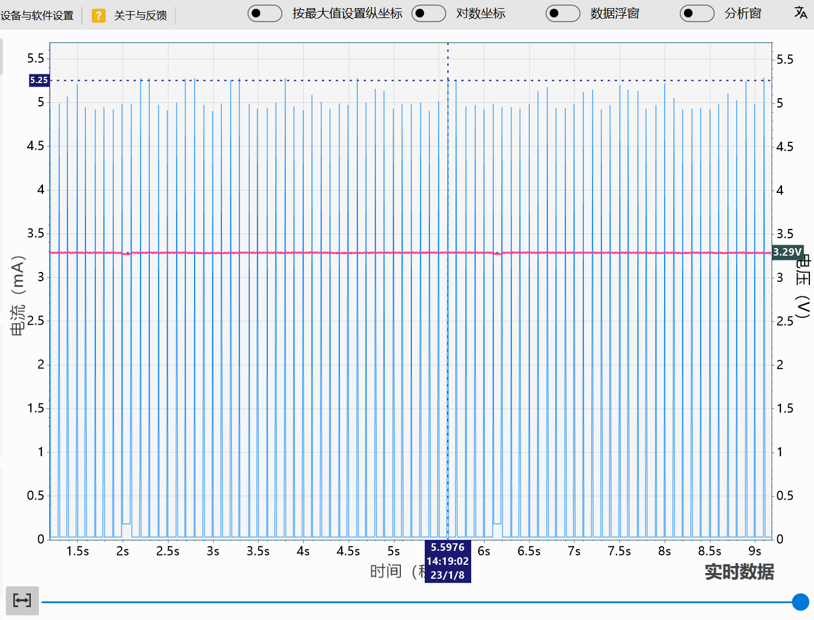

This area is the chart display area where you can preview the waveform

### Adjust the display mode

- Adaptive coordinates: dynamically determine the vertical coordinate range according to the maximum value of the current display area
- Set vertical coordinate by maximum value: set the vertical coordinate range by the maximum value of the captured data.
- Logarithmic coordinate: When the absolute value of current data is greatly different, this function can be enabled, and the value of the ordinate will be displayed in multiples of 10

### Switch data display mode


Press this button to switch between **Real-time data/historical data** and **Select an area**. The two modes are described below.

### Real-time data/historical data (no scaling）

When the mouse is in the chart or on the drag axis, you can use the **mouse wheel** to adjust the time position of the waveform


You can also drag the lower joystick to control the time position of the currently displayed waveform

```{notice}
When viewing historical data, the refresh of the waveform graph will be suspended so that changes will not be pushed by new data.
Therefore, when in this mode and the "display waveform time position is at the far right" (the latest time), the current captured data will be refreshed in real time.  `。
```

### Select an Area (Enables Zoom）

Use the left mouse button to drag **, you can select to view the data of a region, and enter the `select regional data` mode

When in `Pick Area Data` mode, you can use the **mouse wheel** to adjust the time position of the waveform

You can also **hold down the CTRL key and scroll the mouse wheel** to zoom in or out of the currently displayed area

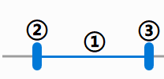

The lever here can also be used to control the range of the selection display.

- Mouse drag ①: can adjust the time position of the waveform
- Mouse drag ② or ③: can adjust the waveform display start or end time point
- Double-click ①: You can directly switch to viewing global data.

### Analyze data

When in any mode, you can **right-click and drag** to select a time period to analyze the data in it.

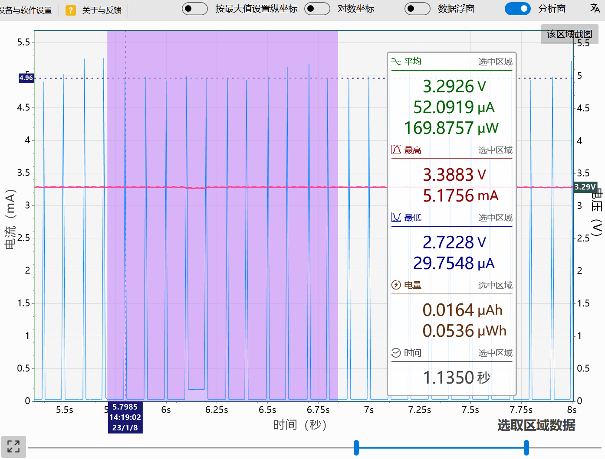

When an area is selected, the `Analysis Window` will pop up to display the results of the analysis

## Control device output

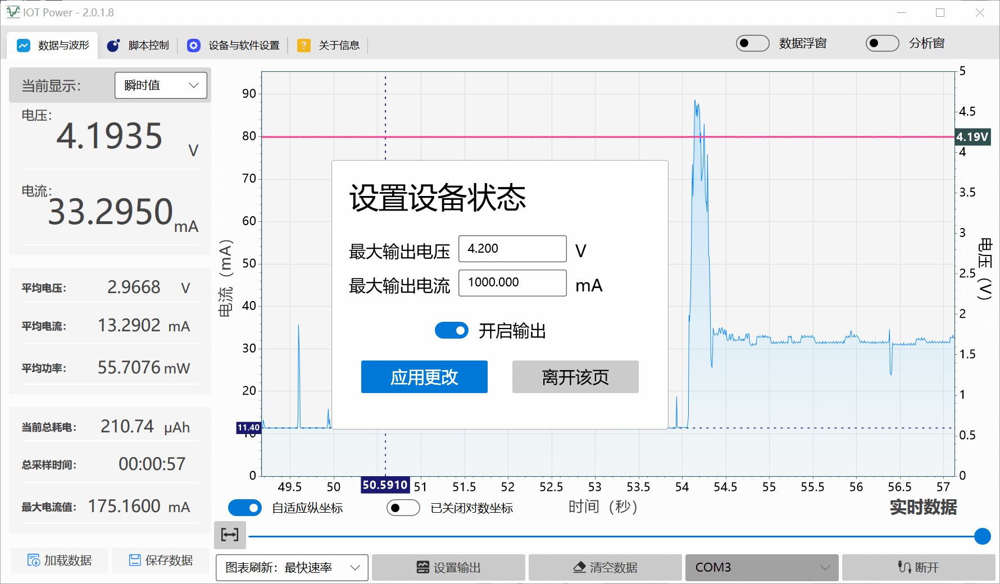

- Control the output and off state of the device through the `power symbol` button
- Set the output voltage and current of the device via the `device output` button

```{note}
This function is only applicable to `Power Products` and products with `PPS decoy` function
```

## Importing and Exporting Data

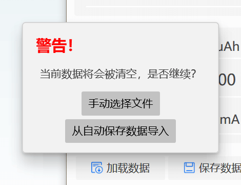
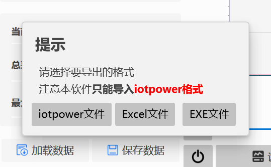

### Import Data

- Manually select files to import `.iotpl` files for IoT Power
- Import automatically saved file indicates to import from automatically saved file. Autosave function usually appears when closing and re-grabbing

### Export data

Data can be freely exported as `.iotpl` file,`.csv `table file,`.exe `self-executing file  
The difference is that the `. csv` table file is used by the user to analyze the original data and cannot be re-imported.  
The `.iotpl` file can be imported into the software again, and the`.exe `self-executing file can also be exported as a`.iotpl` file for import.

## Script function

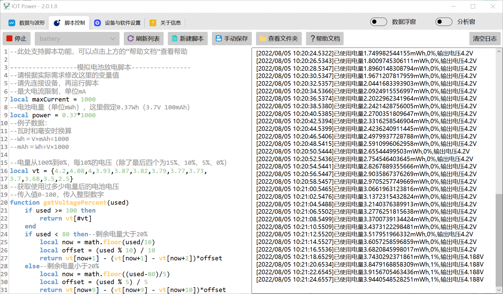

This function enables automatic control of output voltage and current  
The script uses the` Lua language` and adapts to` LuaTask` framework ([tutorial  ](https://openluat.github.io/luatos-wiki-en/luaGuide/luatask.html)）
For specific interface documents, please refer to [the data of this warehouse.](https://gitee.com/openLuat/iot-power)

## Force firmware upgrade


Typically, the device firmware will automatically prompt for an upgrade. However, sometimes when the device is interrupted during the upgrade or the firmware is damaged due to other reasons, the firmware can be brushed manually.

- Click the `Force Firmware Upgrade` button to force the firmware of the client. Note: If the equipment has upgrade mode, please enter the upgrade mode before brushing.
- Right-click the "Force Firmware Upgrade" button to force the firmware file manually selected by the user to test the function and verify the BUG repair.

## Data caching method

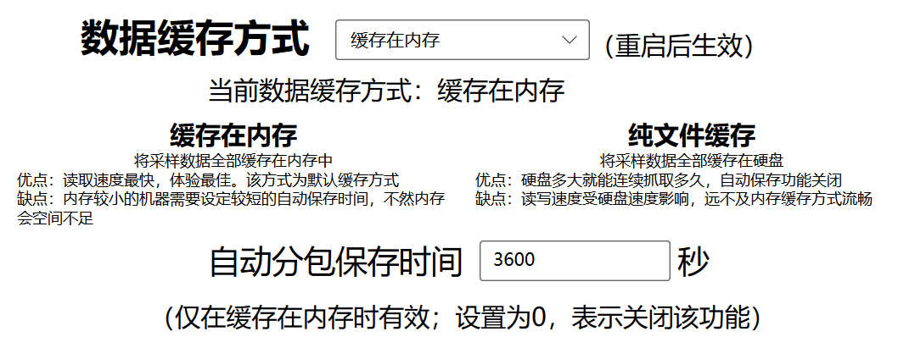

Because the device sampling rate is very high, so the amount of data is very large, stored in the memory may lead to insufficient computer memory  
Therefore, the software provides an automatic save function. When the time is reached, the data is automatically saved to a file to prevent excessive memory usage.

Of course, in order to store some users abnormal level of massive data (such as continuous capture more than ten hours), the software also provides the use of hard disk cache data function  
In this mode, the fluency of the part is sacrificed in exchange for a greatly reduced memory footprint, and automatic saving is not triggered to ensure data continuity  

<script>
if (navigator.language.indexOf("CN") < 0 && confirm ("Are you want to switch to English version of this page?")) {
    window.location.href = "pc-en.html";
}
if(navigator.userAgent.indexOf("Windows NT 6") >= 0) {
  alert("Win7 User notice, please read and then close! \nWin7 must manually install the driver to run! \n to install two drivers! Run and upgrade modes are installed separately. \n. net framework 4.6.2 is required to run the client! \n 32-bit computers with x86 architecture are not supported！");
}
</script>
