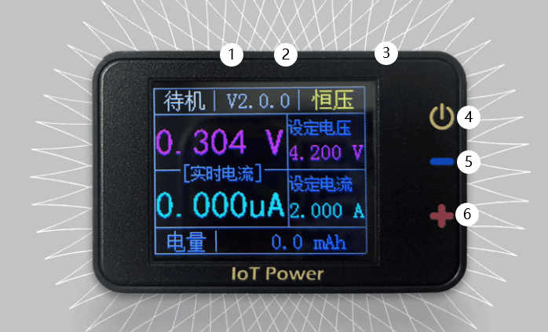

# 🔋 IoT Power - V1

> [Go to Taobao to buy](https://item.taobao.com/item.htm?id=679899121798)

## Overview

IOT Power Is a fully functional, stable and reliable small hand-held power meter. It can be powered by USB C, the output voltage and maximum current can be adjusted freely, and the independent output is up to 5V2A. It is an ideal test tool for users to carry with them.

## Technical characteristics

- Maximum output range: maximum voltage 5V, maximum current 2A (power supply required to meet requirements）
- Uses 0.4% accuracy reference chip, 0.1% accuracy precision resistor, 12-bit ADC design, 1% nominal accuracy, typical accuracy 0.51
- Automatic measurement range: current echo gears are 200 μA, 2mA, 200mA and 2A respectively, and are automatically switched according to the current output current (except 200μA gear needs to be entered manually), with 12 positions ADC
- Gear switching speed: automatic gear switching speed≥40us
- Current measurement accuracy: resolution of 0.5 μA in 200μA gear and 1 μA in 2mA gear (table below)
- 10KHz Sampling rate, USB high-speed data transfer
- Can cooperate with PC client to view and analyze current waveform, can also use command line version to capture serial port data (such as strawberry pie) on any device (win/linux/mac), use pc client to import and view

## Technical indicators

|   Type | Range | Resolution | Nominal Accuracy | Actual Accuracy |
| :------: | :---: | :----: | :------: | :------: |
| Voltage setting | 0V-5V |  1mV  |    1%    |  <0.5%  |
| Voltage Readback | 0V-5V |  1mV  |    1%    |  <0.5%  |
| Current setting | 0-2mA |  1μA  |    1%    |  <0.5%  |
| Current setting | 0-2A |  1mA  |    1%    |    1%    |

| Current Range | Range | Resolution | Nominal Accuracy | Actual Accuracy | Type   |
| :------: | :--------: | :----: | :------: | :------: | :------: |
|  200μA  |  0-200μA  | 0.5μA |    1%    |  <0.5%  | Manual gear |
|   2mA   | 200μA-2mA |  1μA  |    1%    |  <0.5%  | Automatic gear |
|  200mA  | 2mA-200mA |  1mA  |    1%    |   <1%   | Automatic gear |
|    2A    |  200mA-2A  |  10mA  |    1%    |   <1%   | Automatic gear |

## Precautions

- IoT Power The output maximum voltage and current of is limited by the voltage and current of the USB input terminal. If the input terminal voltage and current are less than 5.5V/2A, the output maximum voltage and current will drop (do not provide high voltage exceeding 5.8V to the USB port）
- Limited by volume, IOT Power generates a large calorific value when the input and output pressure difference is large and the current is large at the same time, so it is recommended not to use it for a long time exceeding 1.2A current.
- IOT Power It is mainly used to measure the occasion of power supply for battery equipment. Do not connect the output terminal to power supply equipment above 4.2V battery voltage to avoid unnecessary losses.

```{warning}
⚠Warning: A short circuit at the output, a surge at the input or output, may damage the equipment. Do not short-circuit and other risky operations

⚠Risk Warning: Some brands of fast charging heads (such as Huawei, Xiaomi and other private protocol fast charging heads) may misrecognize the fast charging protocol, resulting in providing high voltage exceeding 5.8V to the device, resulting in instantaneous burning of the device. It is recommended not to use fast charging head as much as possible.
```

## Equipment structure



|     Serial Number | Short Press | Long Press | Scroll        |
| :----------: | :----------------: | :--------------: | :----------------: |
| **①** |      Cursor Move Left | Clear Bottom Current    |                    |
| **②** |      Move the cursor to the right | Switch gears manually   |                    |
| **③** |    Switch adjustment position | switch A/mA | adjust value or switch mode |
| **④** | Turn on or off the power output | Turn on the charging output mode | Press and hold power to switch the language  |

**⑤** ：Power Output Negative
**⑥** ：Power output positive

## Instructions for use

### Change voltage

Short press ③ several times to keep the cursor at the **set voltage** position, use ① and ② to move the cursor to the position to be modified, and scroll ③ to adjust the value. When there is no load, the display is not allowed because the circuit is not closed. Please connect the load for use. The value displayed when the load is not connected is unreliable.

### Change the maximum current

Short press ③ several times to keep the cursor at the position of **set current**, long press ③ to switch **mA** and **A** units, use ① and ② to move the cursor to the position to be modified, and scroll ③ to adjust the value

### Turn the output on or off

When **standby** is displayed in the upper left corner, it means that it is not output. Short press ④ to switch to **normal** mode, indicating that it is outputting. Short press ④ again to return to **standby** mode. In **standby** mode, long press ④ to turn on the charging output mode.

### Zeroing

On the premise of ensuring that no external equipment is connected, short press ④ to switch to * * normal * * mode and turn on the output; Long press ① to set the current bottom current, and then zero

### Switching between electric quantity and power display

Short press ③ several times, let the cursor stay at **power** or **power** position, scroll ③ change mode

### Manual gear switching (after 2.0.8 firmware）

Long press ② to switch the gear manually. x200uA,x2mA,x200mA,x2A four gear cycle switching. Turn off the power and return to the automatic gear switching mode.

### Firmware Upgrade

Click Upgrade in the client. If you need to force upgrade, you can go to the Settings tab to force upgrade.
**Special reminder: each machine has its own calibration parameters, please do not erase, otherwise the consequences will be at your own risk.。**

## FAQ

### What is constant voltage mode (maximum voltage) and constant current mode (maximum current）

As the name implies, constant voltage is a regulated output (short circuit is prohibited), and constant current is a regulated output (open circuit is invalid). This power supply in order to facilitate constant voltage mode and constant current mode is automatic competition mechanism. Close to the preset constant current value when the competition, to reach the preset constant current value constant current, other time constant voltage output. Usually constant voltage output, in order to prevent the load short circuit accident, will preset constant current value, recommended is 2 times the normal load peak current.

### The current value in constant voltage mode is smaller than the measured value.

Please check whether the constant current value of the preset value is small. When the preset constant current value is close to the current value, the constant current mode and the constant voltage mode are in a competitive state, resulting in the actual measured current value being small.

### When no consumer is connected, the current voltage displayed by the device is higher than the set voltage

IotPower The static output is high impedance and does not actively discharge the power at the load end, which helps improve the accuracy of the measurement. After connecting any power consuming device normally, it can drop to the target voltage (it will also drop when touched by hand.）

### If you connect the voice amplifier chip, the sound will burp.

This is similar to the previous question. The voice is a sine wave, and the peak current is more than 4 times the average current, so the preset constant current value is recommended to be more than 4 times.

### Set 5V output, the actual output is unstable, and the current is also unstable

Because USB is 5V output, most computers or adapters output 5V 5% voltage, input 5V is not constant voltage 5V output. The solution is to use a 5V adapter with line loss compensation or reduce the output voltage to 4.8V.

### I want to connect USB output. Is there a plan?

We provide the project of transferring the output terminal to usb base adapter board, which can be viewed and shared by the group.

### When the load switches from high current to uA current, the output voltage increases

Normal phenomenon, the real circuit has parasitic inductance, the current mutation will produce induced voltage superimposed on the parasitic inductance to the output. In order to accurately measure the μA current, the iotpower does not use power resistors and large capacitors as false loads like ordinary regulated power supplies, so it shows the real situation of the circuit. IotPower the static output is high impedance, it will not actively discharge the power after the load terminal is dormant or shut down, which can simulate the battery power supply environment more realistically.

## Common fault maintenance

### Dial does not scroll smoothly or does not pop up when pressed

Three or four screws on the back plate can be slightly loosened.

### The voltage output is always 5V

Usually this phenomenon occurs after the output terminal of the equipment is short-circuited, the MOS tube at Q2 can be disassembled and replaced, and the replacement device can be purchased at Lichuang: [Lichuang Mall](https://item.szlcsc.com/905902.html)

```{warning}
Pay attention when disassembling the machine！

Please remove the four screws first

Carefully remove the back plate (with thermal adhesive connected to the pcb）

Remove the pcb base plate, **be careful not to damage the dial wheel**

Finally, remove the screen (if not necessary, do not remove the screen.）
```

### No voltage output

Usually this phenomenon occurs after the output of the device is burned by a reverse large current, such as an external device such as a battery with a voltage higher than 5v. You can manually try to replace the op amp (the one in sop package), the model is RS8554。

### Black screen, no output, burning smell

Usually this phenomenon occurs after the device is burned by a large current at the usb power supply end. For example, a fast charging head is connected, and the charging head mistakenly outputs a fast charging voltage, resulting in a power supply higher than the 5.8V withstand voltage of the device. This situation is difficult to repair. It may burn CP2102, DCDC voltage regulation and LDO parts. It is suggested not to have too much hope for repair. It is not expensive to replace it with a new one anyway.

<script>
if (navigator.language.indexOf("CN") < 0 && confirm ("Are you want to switch to English version of this page?")) {
    window.location.href = "english.html";
}
</script>
