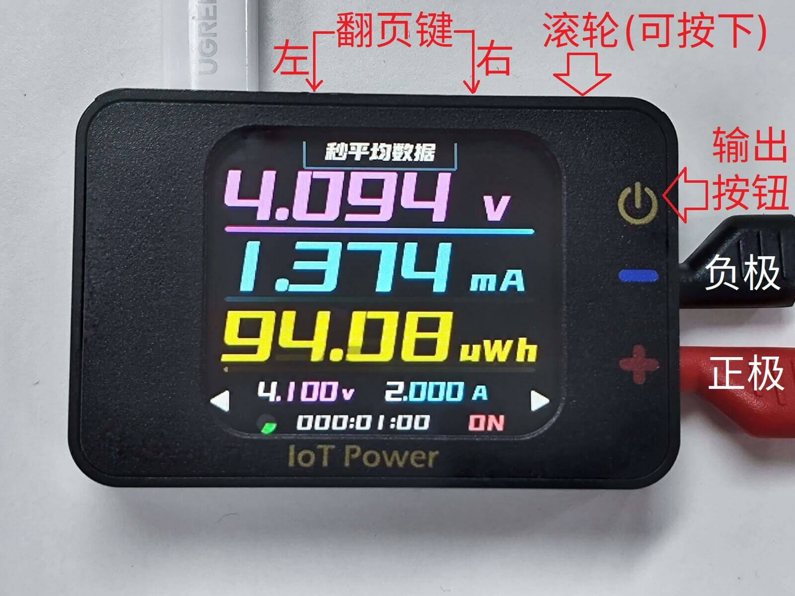

# Connection and Appearance

## Layout and Function

The basic appearance of the equipment is as follows



|   Operation | Normal Mode | Edit Mode        |
| :------: | :------------------: | :--------------------: |
| Left page key | Switch to the left page | Switch to the left digit |
| Right page key | Switch to the right page | Switch to the right digit |
| Scroll wheel | Toggle the selected control in the page | Adjust the value of the selected number   |
| Press the scroll wheel | to enter or toggle the selected control | to exit edit mode      |
| Output button | Turn the power output on or off | Same as left          |

The output end is connected with the complimentary banana head to alligator clip cable.

```{warning}
⚠Risk Alert  
Some brands of fast charging heads (such as Huawei, Xiaomi and other private protocol fast charging heads) may misrecognize the fast charging protocol, resulting in providing high voltage exceeding 5.8V to the device, resulting in instantaneous burning of the device.  
It is recommended not to use this type of charging head to connect the PC communication power interface of the device.  
PC Communication interface, it is strictly prohibited to connect positive and negative or voltage greater than 6V, reverse connection or greater than 6V will burn！
```

```{warning}
⚠Warning  
Power output interface, it is strictly prohibited to reverse other power supply/battery, or connect other power supply/battery with voltage above 5V, so as not to burn the equipment.
```

## Power supply mode

IoT Power Pro Support power supply through TypeC port

## Output mode

After setting the voltage and current (refer to the next page), press the output button to turn on the output.
