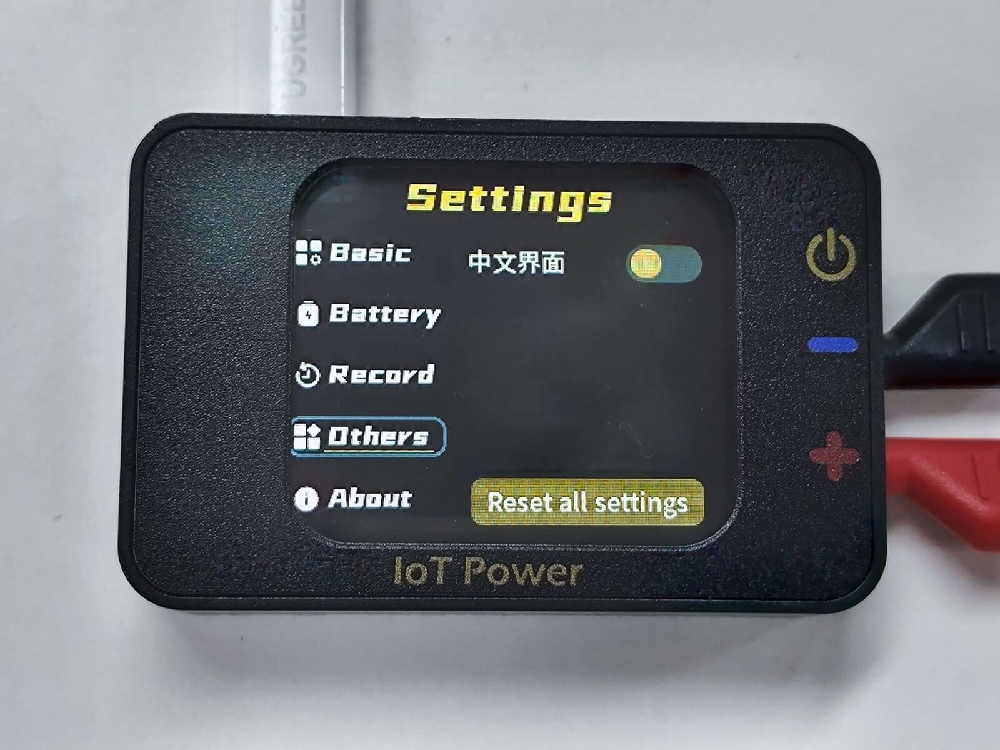
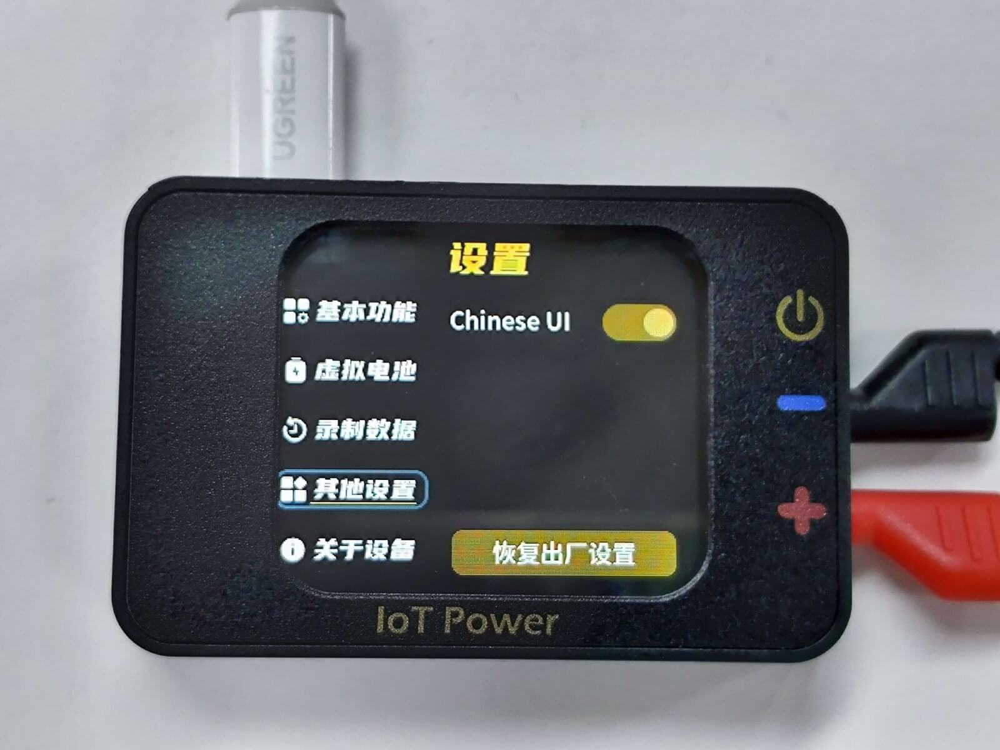
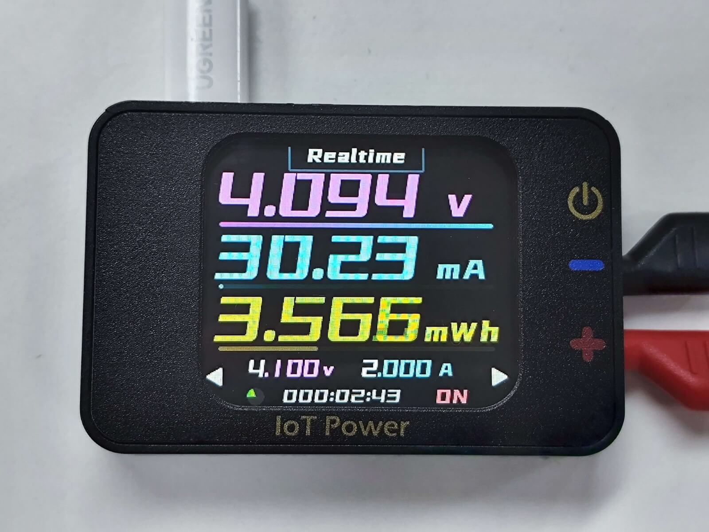
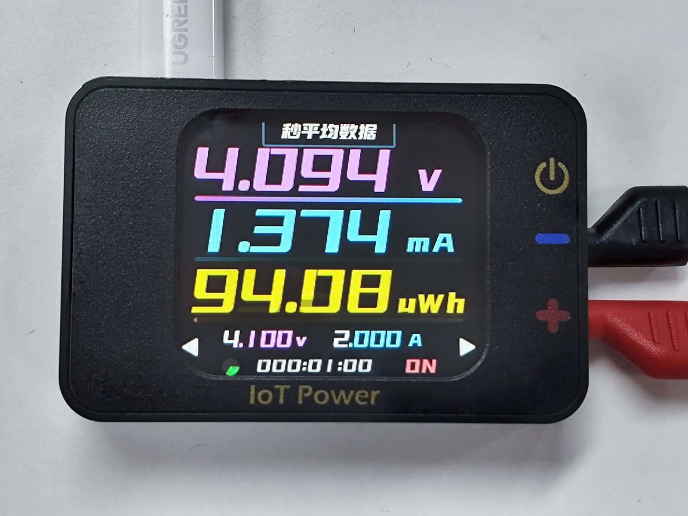
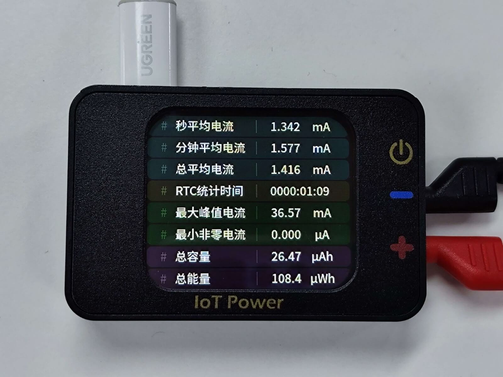
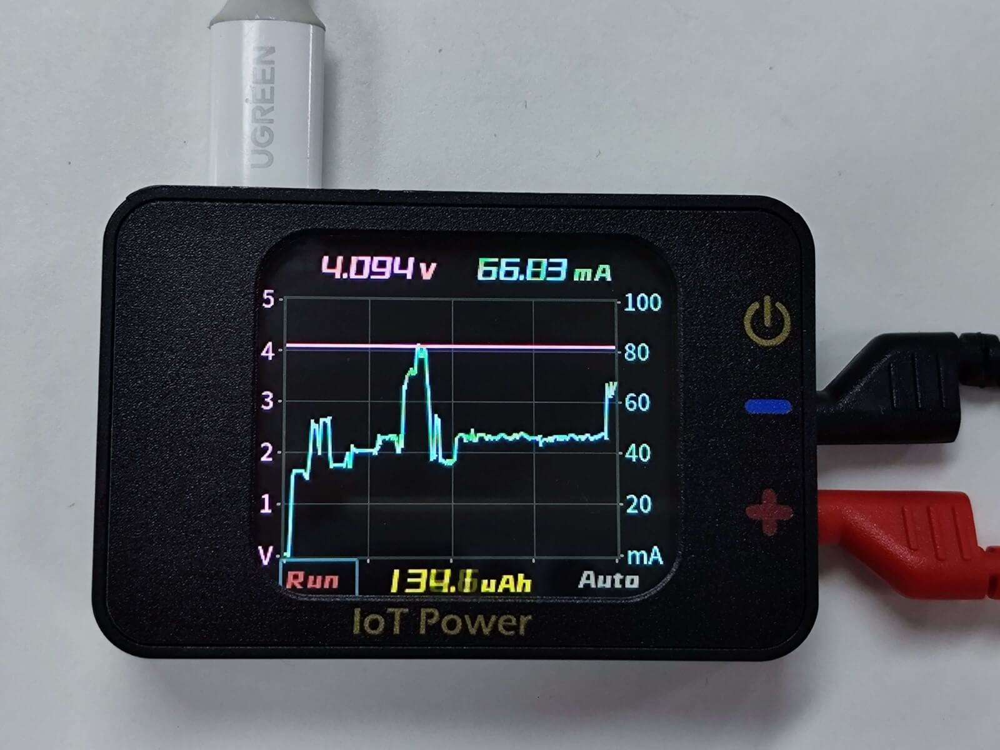
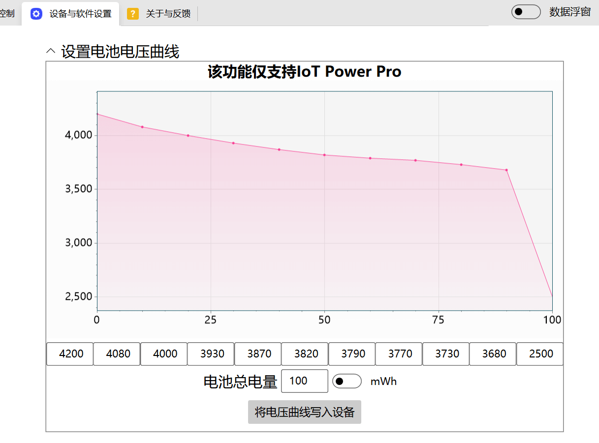
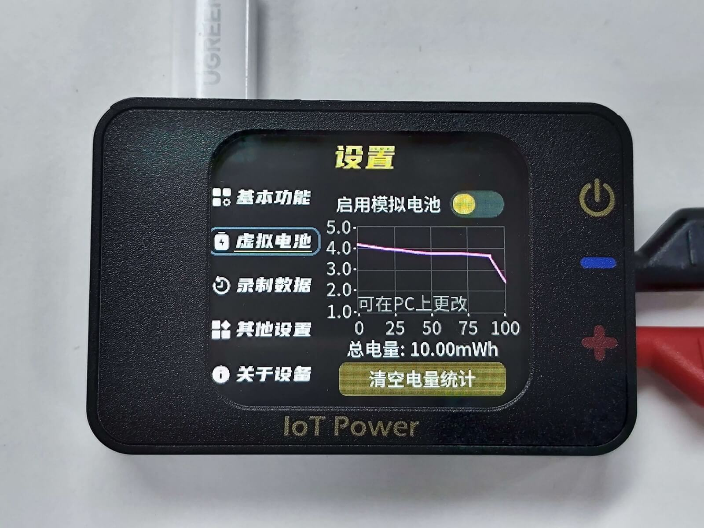
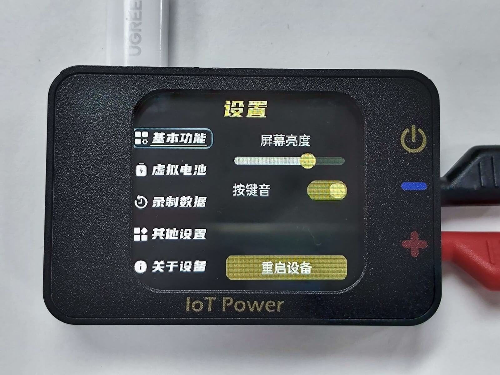

# Operating Instructions

This part of the content will explain the specific meaning of each part of the function of the equipment and the key operation mode

The device supports bilingual switching between Chinese and English. You can change the language by referring to the settings below.

:::{dropdown} Switch language
（Device default Chinese, can change the language）

Switch to Settings page-Other settings, change language




Switch pages after modification to take effect immediately


:::

```{warning}
⚠Risk Alert  
Some brands of fast charging heads (such as Huawei, Xiaomi and other private protocol fast charging heads) may misrecognize the fast charging protocol, resulting in providing high voltage exceeding 5.8V to the device, resulting in instantaneous burning of the device.  
It is recommended not to use this type of charging head to connect the PC communication power interface of the device.  
PC Communication interface, it is strictly prohibited to connect positive and negative or voltage greater than 6V, reverse connection or greater than 6V will burn！
```

```{warning}
⚠Warning  
Power output interface, it is strictly prohibited to reverse other power supply/battery, or connect other power supply/battery with voltage above 5V, so as not to burn the equipment.
```

## Basic operation

### Page turning

Press the **page key** to turn pages forward and backward

### Select controls and actions

Scroll **wheel** key to switch the selected control, press to operate the selected control

Some controls will enter the control after being pressed. At this time, the **wheel** key can change the value of the control, and exit the modification after being pressed again.

## Output power supply



```{note}
The progress bar below the voltage value indicates the ratio of the current voltage value to the set voltage value.  
The progress bar below the current value indicates the ratio of the current current value to the set current value.  
The progress bar below the power/power value indicates the current power consumption as a percentage of the set simulated battery power.
```

### Modify voltage

On this page, use **scroll wheel**, select the voltage value `4.100 v` below, and press **scroll wheel** to enter editing mode  ；
**The page key **can change the selected number, and the**scroll wheel**key can change the value of this number  ；
Press the **wheel** button again to exit the change

### Modify Current

On this page, use the **scroll wheel**, select the current value `2.000A` below, and press the **scroll wheel** to enter the editing mode.  ；
**The page key **can change the selected number, and the**scroll wheel**key can change the value of this number  ；
Press the **wheel** button again to exit the change

Select `A` or `mA` on the side of the current value, and press **roller** to switch the unit of `A` or `mA`

### Turn the output on and off

Press the **output button** to turn the power output on or off

### Viewing Average Data in Seconds

Use the **scroll wheel**, select the `real-time data` at the top, and press the **scroll wheel** to switch to the second average display.

### Switch W、Wh、Ah

Use the **scroll wheel** to select the unit after the yellow data in the third row, and press the **scroll wheel** to switch the display of W, Wh, and Ah.

## View detailed data



Detailed data can be viewed on this page

## View Waveform



Voltage and current waveforms can be viewed on this page

### Pause Waveform Refresh

Use **scroll wheel**, select `Run` below, press **scroll wheel** to pause waveform printing, at this time the text becomes  `Stop`；
Press the **scroll wheel** again to turn waveform refresh on again

### Switching current coordinate range

Use **scroll wheel**, select `Auto` below, and press **scroll wheel** to switch the current coordinate range. At this time, the text changes  `Fixed`；
You can press the **wheel** several times to switch between different fixed coordinates, and the automatic coordinate range function can be restored after switching several times.

### Switch the data below W、Wh、Ah

Use the **scroll wheel** to select the unit after the yellow data in the middle below, and press the **scroll wheel** to switch the display of W, Wh, and Ah.

## Analog Battery

The device can simulate the battery, can simulate the voltage drop waveform and capacity, the output will automatically change the output voltage according to the power consumption, and shut down the output when the power is exhausted.

### Modify battery voltage curve and charge

Connect the device to the PC via USB, open the IoT Power client, connect the device, switch to the` Settings Page`, modify the corresponding parameters of the simulated battery and update it to the device：



### Turn on the analog battery function



You can view the current battery settings on the settings page  
Use the **scroll wheel**, select `Enable analog battery`, and press the **scroll wheel** to switch the analog battery function on and off.  
After this function is turned on, the voltage setting function of the first screen will be disabled, and the voltage setting position will be displayed`BATT`

## Setup



This page can be set, can be modified as needed
