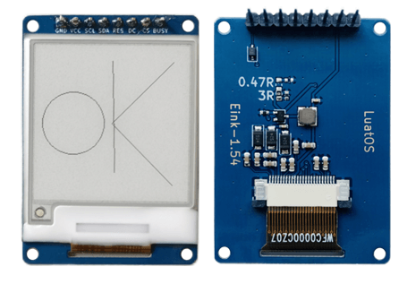
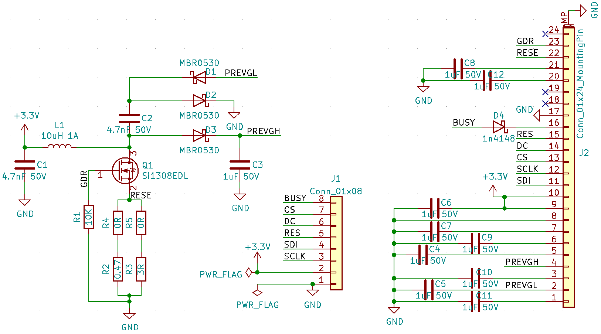

# Hardware Data

## Schematic diagram

## Hardware Engineering

[Online interactive BOM and PCB viewer](https://openluat.github.io/luatos-wiki-en/_static/bom/eink1.54.html)

[KICAD Hardware Engineering](https://gitee.com/openLuat/luatos-broads/tree/master/broads/Eink1.54)
