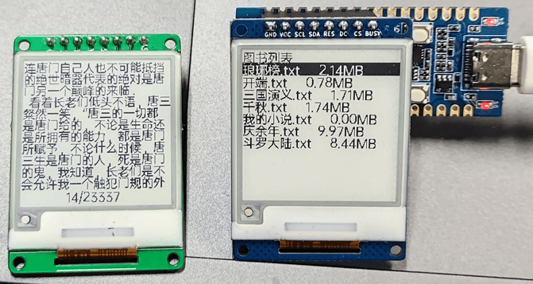
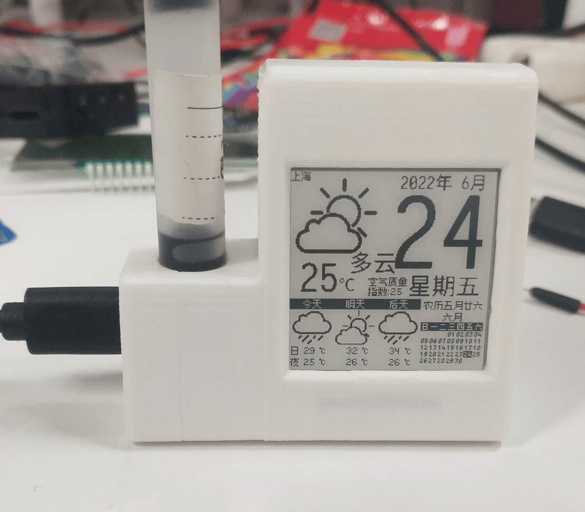

# Use Example

## demo Examples

Refer to [Eink demo](https://gitee.com/openLuat/LuatOS/tree/master/demo/eink/Air101) of LuatOS main repository, and note that the driver of this screen should use`eink.MODEL_1in54`。

> Note: Since the` BUSY` pin of the ink screen corresponds to the` GPIO11` of the ESP32C3-CORE development board, if the` GPIO11` of the ESP32C3-CORE development board is used, * * [unlock operation](https://gitee.com/openLuat/luatos-soc-idf5/blob/master/doc/VDD_SPI_AS_GPIO.md) is required before the screen can be used normally.**。

## Project Examples

### electronic paper book

Project Address：[https://gitee.com/HashJeremy/EinkBook-LuatOS](https://gitee.com/HashJeremy/EinkBook-LuatOS)

### Ink Screen Calendar

Project Address: [Ink Screen Interface Description](https://api.luatos.org/#eink)

Shell model:[3d file](https://cdn.openluat-luatcommunity.openluat.com/attachment/20220710142131642_外壳.7z), designed by Group Friends Star
